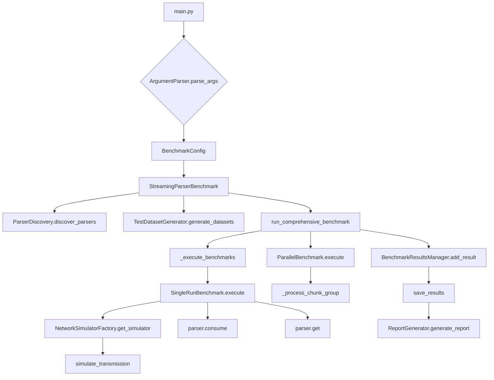

# Project Architecture


This document explains how the repository organises code for discovering the best serialization algorithm via pseudo‑benchmarking with adversarial conditions.

## Approach

The project implements multiple streaming JSON parsers under `src/serializers`. Each parser follows a common interface so that the benchmark runner can load them dynamically. The benchmark harness generates datasets of increasing size, transmits those chunks through simulated network layers and records detailed metrics. Results are ranked to determine which algorithm performs best.

### Pseudo‑Benchmarking

1. **Dataset generation** – `DataGenerator` in `simulation/data_gen.py` produces dictionaries containing only strings or nested objects. `create_streaming_chunks` splits the JSON bytes so that parsers must handle partial input.
2. **Network simulation** – `simulation/net_sim.py` mimics HTTP, TCP and Telnet by wrapping chunks with protocol overhead and introducing latency. This adversarial environment highlights performance differences when data is fragmented or delayed.
3. **Benchmark execution** – `simulation/benchmark_runner.py` and `main.py` orchestrate runs for every parser, dataset size and protocol. CPU usage, memory, throughput and timing data are collected via `MetricsCollector` and `Timer` utilities.
4. **Parallel runs** – `ParallelBenchmarkRunner` measures theoretical speedup using multiple processes and applies Amdahl’s law to determine efficiency.
5. **Reporting** – `simulation/report_generator.py` loads the raw CSV/JSON results, ranks algorithms by several categories and outputs summaries showing the top performer for each metric.

### Metrics and KPIs

Key metrics stored in `BenchmarkMetrics` include:

- `serialize_time_ms` and `deserialize_time_ms`
- `throughput_mbps`
- `cpu_time_seconds`
- `memory_peak_bytes`
- `network_latency_ms`
- Speedup and efficiency numbers

These are the KPIs used to rank algorithms. Lower times and memory usage are better, while higher throughput indicates faster processing.

### Simulation Steps

1. **Discover parsers** via `ParserDiscovery` or the helper `parser_loader`.
2. **Generate datasets** with `TestDatasetGenerator`.
3. **Simulate protocol** transmission through `NetworkSimulatorFactory`.
4. **Run benchmarks** sequentially then in parallel for each parser and dataset.
5. **Store metrics** in `BenchmarkResultsManager` and save as CSV and JSON.
6. **Analyze results** using `ReportGenerator` which finds the best algorithms per category.

The winner for each metric is simply the top‑ranked parser when sorted according to the relevant KPI. The detailed report summarises these champions.

## File Overview

```
main.py                  – CLI entry point and high level benchmark workflow
parser_loader.py         – Discovers parser classes automatically
src/
  serializers/           – Implementations of serialization algorithms
    anyio/               – Async‑friendly versions
    raw/                 – Baseline reference implementations
    solid/               – Optimised variants
  simulation/            – Benchmarking framework
    benchmark_runner.py  – Executes benchmarks and collects metrics
    data_gen.py          – Synthetic dataset generator
    net_sim.py           – HTTP/TCP/Telnet network simulators
    algo_metadata.py     – Complexity metadata for algorithms
    utils.py             – Helper utilities and statistics
    report_generator.py  – Generates analysis reports
tests/                   – Unit and integration tests
```

## Repository Tree (simplified)

```
DeepJudgeStreamingJsonBenchmark/
├── main.py
├── parser_loader.py
├── src/
│   ├── serializers/
│   │   ├── anyio/
│   │   ├── raw/
│   │   └── solid/
│   └── simulation/
│       ├── benchmark_runner.py
│       ├── data_gen.py
│       ├── net_sim.py
│       ├── algo_metadata.py
│       └── report_generator.py
└── tests/
    ├── serializers/
    └── simulation/
```

## Mermaid Flow Diagram



