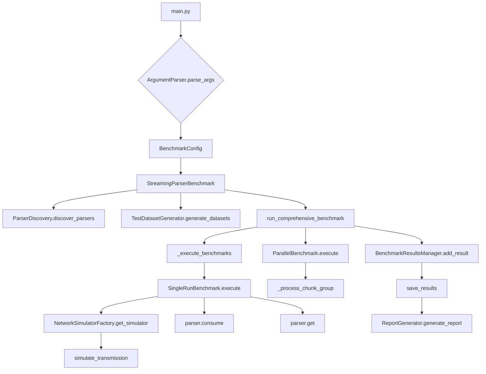

# Project Architecture


This document outlines how the project organises its code to benchmark a variety of JSON serialization algorithms. The benchmarks are deliberately adversarial: data is streamed in small chunks over simulated network protocols to expose weaknesses in each implementation.

## Approach

The repository contains multiple parsers under `src/serializers`. Each parser shares a common interface so that the benchmark runner can load them dynamically. `main.py` orchestrates the entire benchmark process:

1. Parsers are discovered via `parser_loader.py`.
2. Synthetic datasets of increasing complexity are produced by `src/simulation/data_gen.py`.
3. Each dataset is sent through `src/simulation/net_sim.py` which mimics HTTP, TCP and Telnet traffic with artificial delays.
4. `src/simulation/benchmark_runner.py` measures throughput, CPU time and memory usage for each parser and dataset size. Both sequential and parallel runs are supported.
5. Results are collected, ranked and written to disk. `src/simulation/report_generator.py` summarises the winners for every metric.

## Metrics and KPIs

The benchmark collects the following metrics (stored in `BenchmarkMetrics`):

- `serialize_time_ms` and `deserialize_time_ms` – time spent encoding or decoding
- `throughput_mbps` – how many megabytes per second the parser processes
- `cpu_time_seconds` – CPU time consumed during the run
- `memory_peak_bytes` – maximum resident set size
- `network_latency_ms` – simulated latency added by the network layer
- Parallel speedup and efficiency when multiple processes are used

Lower time and memory values indicate better performance. Higher throughput means the parser can process data faster.

## Simulation Steps

1. **Discover parsers** with `ParserDiscovery` or the helper `parser_loader`.
2. **Generate datasets** using `TestDatasetGenerator`.
3. **Simulate network conditions** via `NetworkSimulatorFactory` and `simulate_transmission`.
4. **Execute benchmarks** sequentially and then in parallel.
5. **Save metrics** to CSV/JSON with `BenchmarkResultsManager`.
6. **Analyze results** using `ReportGenerator`. The top ranked parser for each KPI is considered the winner.

## File Overview

```
main.py                  – CLI entry point and benchmark workflow
parser_loader.py         – Discovers parser classes automatically
src/
  serializers/           – Implementations of serialization algorithms
    anyio/               – Async‑friendly versions
    raw/                 – Baseline implementations
    solid/               – Optimised variants
  simulation/            – Benchmark framework
    benchmark_runner.py  – Executes benchmarks and collects metrics
    data_gen.py          – Generates synthetic JSON datasets
    net_sim.py           – Simulates TCP/HTTP/Telnet networks
    algo_metadata.py     – Complexity metadata for algorithms
    report_generator.py  – Generates comparative reports
    utils.py             – Helper utilities and statistics
tests/                   – Unit and integration tests
```

## Repository Tree (simplified)

```
DeepJudgeStreamingJsonBenchmark/
├── main.py
├── parser_loader.py
├── src/
│   ├── serializers/
│   │   ├── anyio/
│   │   ├── raw/
│   │   └── solid/
│   └── simulation/
│       ├── benchmark_runner.py
│       ├── data_gen.py
│       ├── net_sim.py
│       ├── algo_metadata.py
│       └── report_generator.py
└── tests/
    ├── serializers/
    └── simulation/
```

## Mermaid Flow Diagram


