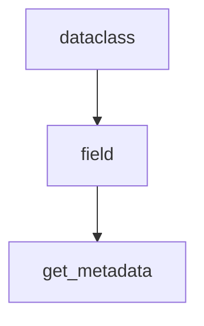

# Documentation for `bson_parser.py`

## Metadata
- **Name:** anyio BSON Parser
- **Time Complexity:** O(n)
- **Space Complexity:** O(n)
- **Overall Complexity:** O(n) time, O(n) space
- **Description:** BSON-style streaming parser with anyio for async operations.
- **Strengths:** ['Asynchronous', 'Handles binary data efficiently']
- **Weaknesses:** ['Complex implementation', 'Dependency on anyio']
- **Best Use Case:** High-performance async applications requiring BSON support.

## Class Diagram

```mermaid
classDiagram
  class Any
  Any : __new__()
  class AsyncBsonProcessor
  AsyncBsonProcessor : __init__()
  AsyncBsonProcessor : _extract_documents_async()
  AsyncBsonProcessor : _extract_documents_sync()
  AsyncBsonProcessor : _process_document()
  AsyncBsonProcessor : process_buffer()
  class AsyncDocumentParser
  AsyncDocumentParser : __init__()
  AsyncDocumentParser : _balance_braces_async()
  AsyncDocumentParser : _extract_partial_fields_async()
  AsyncDocumentParser : _extract_partial_fields_sync()
  AsyncDocumentParser : _find_matching_brace()
  AsyncDocumentParser : _try_direct_parse_async()
  AsyncDocumentParser : _try_partial_parse_async()
  AsyncDocumentParser : parse_document()
  class AsyncDocumentValidator
  AsyncDocumentValidator : _validate_item()
  AsyncDocumentValidator : is_valid_key()
  AsyncDocumentValidator : is_valid_value()
  class AsyncPairExtractor
  AsyncPairExtractor : _process_pair()
  AsyncPairExtractor : extract_complete_pairs()
  class AsyncParserState
  AsyncParserState : __eq__()
  AsyncParserState : __init__()
  AsyncParserState : __repr__()
  class StreamingJsonParser
  StreamingJsonParser : __init__()
  StreamingJsonParser : _consume_async()
  StreamingJsonParser : _get_async()
  StreamingJsonParser : consume()
  StreamingJsonParser : get()
  class ThreadPoolExecutor
  ThreadPoolExecutor : __enter__()
  ThreadPoolExecutor : __exit__()
  ThreadPoolExecutor : __init__()
  ThreadPoolExecutor : _adjust_thread_count()
  ThreadPoolExecutor : _initializer_failed()
  ThreadPoolExecutor : map()
  ThreadPoolExecutor : shutdown()
  ThreadPoolExecutor : submit()

```

## Flowchart

