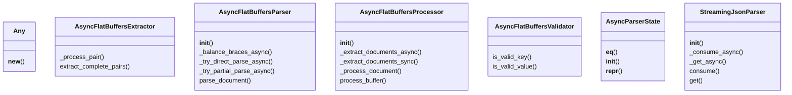

# Documentation for `flatbuffers_parser.py`

## Metadata
- **Name:** anyio FlatBuffers Parser
- **Time Complexity:** O(n)
- **Space Complexity:** O(n)
- **Overall Complexity:** O(n) time, O(n) space
- **Description:** FlatBuffers-style streaming parser with anyio for async operations.
- **Strengths:** ['Asynchronous', 'Zero-copy potential']
- **Weaknesses:** ['Complex implementation', 'Dependency on anyio']
- **Best Use Case:** High-performance async applications requiring FlatBuffers support.

## Class Diagram

## Flowchart

