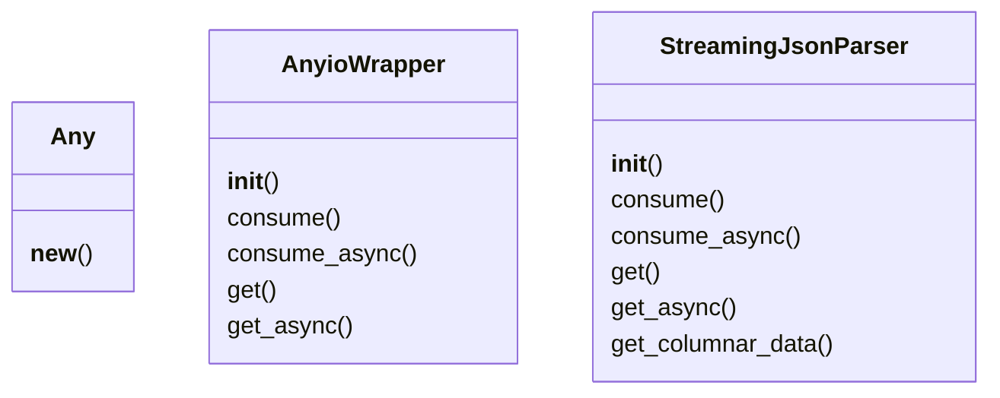

# Documentation for `parquet_parser.py`

## Metadata
- **Name:** anyio Parquet Parser
- **Time Complexity:** O(n log n)
- **Space Complexity:** O(n)
- **Overall Complexity:** O(n log n) time, O(n) space
- **Description:** Parquet-style streaming parser with anyio for async operations.
- **Strengths:** ['Asynchronous', 'Columnar storage efficiency']
- **Weaknesses:** ['Complex implementation', 'Dependency on anyio']
- **Best Use Case:** High-performance async applications requiring Parquet support.

## Class Diagram


## Flowchart
```mermaid
flowchart TD

```

