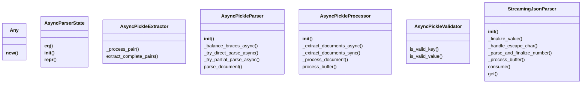
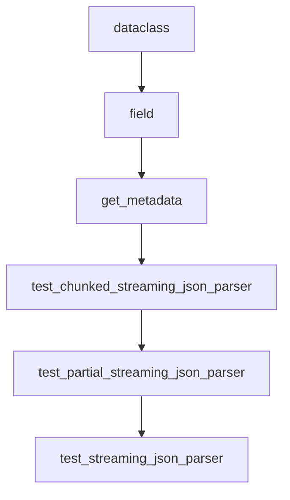

# Documentation for `pickle_parser.py`

## Metadata
- **Name:** anyio Pickle Parser
- **Time Complexity:** O(n)
- **Space Complexity:** O(n)
- **Overall Complexity:** O(n) time, O(n) space
- **Description:** Pickle-style streaming parser with anyio for async operations.
- **Strengths:** ['Asynchronous', 'Native Python object serialization']
- **Weaknesses:** ['Python-specific', 'Security concerns']
- **Best Use Case:** High-performance async applications requiring Pickle support.

## Class Diagram

## Flowchart

