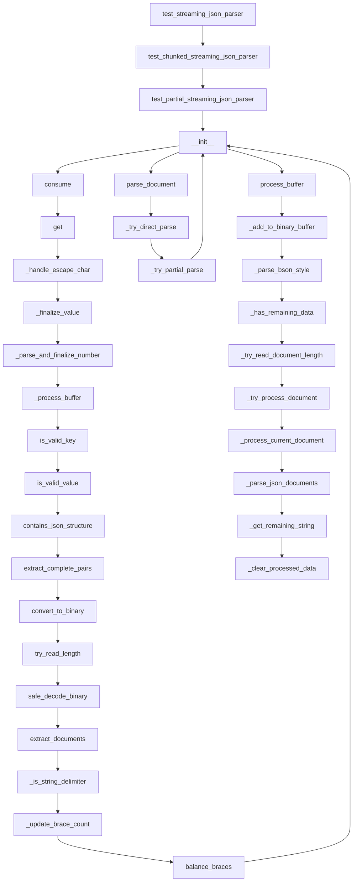

# Documentation for `bson_parser.py`

## Class Diagram

```mermaid
classDiagram
  class StreamingJsonParser
  StreamingJsonParser : __init__()
  StreamingJsonParser : consume()
  StreamingJsonParser : get()
  StreamingJsonParser : _handle_escape_char()
  StreamingJsonParser : _finalize_value()
  StreamingJsonParser : _parse_and_finalize_number()
  StreamingJsonParser : _process_buffer()
  class ParserState
  class DocumentValidator
  DocumentValidator : is_valid_key()
  DocumentValidator : is_valid_value()
  DocumentValidator : contains_json_structure()
  class PairExtractor
  PairExtractor : extract_complete_pairs()
  class BinaryProcessor
  BinaryProcessor : convert_to_binary()
  BinaryProcessor : try_read_length()
  BinaryProcessor : safe_decode_binary()
  class DocumentExtractor
  DocumentExtractor : extract_documents()
  DocumentExtractor : _is_string_delimiter()
  DocumentExtractor : _update_brace_count()
  class DocumentFormatter
  DocumentFormatter : balance_braces()
  class DocumentParser
  DocumentParser : __init__()
  DocumentParser : parse_document()
  DocumentParser : _try_direct_parse()
  DocumentParser : _try_partial_parse()
  class BsonStyleProcessor
  BsonStyleProcessor : __init__()
  BsonStyleProcessor : process_buffer()
  BsonStyleProcessor : _add_to_binary_buffer()
  BsonStyleProcessor : _parse_bson_style()
  BsonStyleProcessor : _has_remaining_data()
  BsonStyleProcessor : _try_read_document_length()
  BsonStyleProcessor : _try_process_document()
  BsonStyleProcessor : _process_current_document()
  BsonStyleProcessor : _parse_json_documents()
  BsonStyleProcessor : _get_remaining_string()
  BsonStyleProcessor : _clear_processed_data()
```

## Flowchart

## Live Execution
[▶ Visualize in Python Tutor](https://pythontutor.com/visualize.html#code=%22%22%22%0ABSON%20streaming%20parser%20implementation%20with%20SOLID%20principles.%0A%0AThis%20module%20%2Apreviously%2A%20implemented%20a%20streaming%20JSON%20parser%20inspired%20by%20BSON%20binary%20format.%0AThe%20StreamingJsonParser%20class%20below%20has%20been%20refactored%20to%20be%20a%20direct%2C%20byte-based%0Astreaming%20JSON%20parser%20adhering%20to%20the%20project-wide%20specification.%0AThe%20original%20BSON-inspired%20helper%20classes%20remain%20but%20are%20no%20longer%20used%20by%20StreamingJsonParser.%0A%22%22%22%0A%0Aimport%20json%0Aimport%20struct%0Afrom%20dataclasses%20import%20dataclass%2C%20field%0Afrom%20typing%20import%20Any%2C%20Dict%2C%20Optional%0A%0A%23%20---%20Start%20of%20Refactored%20StreamingJsonParser%20and%20its%20dependencies%20---%0A%23%20%28Identical%20to%20the%20implementation%20in%20raw/ultrajson_parser.py%20for%20consistency%20and%20compliance%29%0A%0A%23%20State%20constants%20for%20the%20parser%0A_ST_EXPECT_OBJ_START%20%3D%200%0A_ST_EXPECT_KEY_START%20%3D%201%20%20%23%20After%20%27%7B%27%20or%20%27%2C%27%0A_ST_IN_KEY%20%3D%202%0A_ST_IN_KEY_ESCAPE%20%3D%203%0A_ST_EXPECT_COLON%20%3D%204%0A_ST_EXPECT_VALUE_START%20%3D%205%0A_ST_IN_STRING_VALUE%20%3D%206%0A_ST_IN_STRING_VALUE_ESCAPE%20%3D%207%0A_ST_IN_NUMBER%20%3D%208%0A_ST_IN_TRUE%20%3D%209%0A_ST_IN_FALSE%20%3D%2010%0A_ST_IN_NULL%20%3D%2011%0A_ST_EXPECT_COMMA_OR_OBJ_END%20%3D%2012%0A_ST_OBJ_END%20%3D%2013%0A_ST_ERROR%20%3D%2099%0A%0A_WHITESPACE%20%3D%20b%22%20%5Ct%5Cn%5Cr%22%0A_DIGITS%20%3D%20b%220123456789%22%0A_NUMBER_CHARS%20%3D%20_DIGITS%20%2B%20b%22-.eE%2B%22%0A%0Aclass%20StreamingJsonParser%3A%0A%20%20%20%20%22%22%22%0A%20%20%20%20A%20streaming%20JSON%20parser%20that%20processes%20byte-based%20input%20incrementally.%0A%20%20%20%20It%20can%20handle%20partial%20JSON%20objects%20and%20incomplete%20string%20values%2C%0A%20%20%20%20returning%20the%20currently%20parsed%20data%20structure%20at%20any%20point.%0A%20%20%20%20This%20version%20replaces%20the%20original%20BSON-style%20parser%20in%20this%20module.%0A%20%20%20%20%22%22%22%0A%0A%20%20%20%20def%20__init__%28self%29%3A%0A%20%20%20%20%20%20%20%20%22%22%22Initializes%20the%20streaming%20JSON%20parser.%22%22%22%0A%20%20%20%20%20%20%20%20self._buffer%20%3D%20bytearray%28%29%0A%20%20%20%20%20%20%20%20self._result%3A%20Dict%5Bstr%2C%20Any%5D%20%3D%20%7B%7D%0A%20%20%20%20%20%20%20%20self._state%20%3D%20_ST_EXPECT_OBJ_START%0A%0A%20%20%20%20%20%20%20%20self._current_key_bytes%20%3D%20bytearray%28%29%0A%20%20%20%20%20%20%20%20self._current_value_bytes%20%3D%20bytearray%28%29%0A%20%20%20%20%20%20%20%20%0A%20%20%20%20%20%20%20%20self._active_key%3A%20Optional%5Bstr%5D%20%3D%20None%20%23%20Stores%20the%20decoded%20string%20of%20the%20last%20fully%20parsed%20key%0A%20%20%20%20%20%20%20%20self._idx%20%3D%200%20%23%20Current%20parsing%20index%20within%20self._buffer%0A%0A%20%20%20%20def%20consume%28self%2C%20buffer%3A%20str%29%20-%3E%20None%3A%0A%20%20%20%20%20%20%20%20%22%22%22%0A%20%20%20%20%20%20%20%20Consumes%20a%20chunk%20of%20JSON%20data.%0A%0A%20%20%20%20%20%20%20%20Args%3A%0A%20%20%20%20%20%20%20%20%20%20%20%20buffer%3A%20A%20string%20containing%20a%20part%20of%20the%20JSON%20document.%0A%20%20%20%20%20%20%20%20%22%22%22%0A%20%20%20%20%20%20%20%20if%20not%20isinstance%28buffer%2C%20str%29%3A%0A%20%20%20%20%20%20%20%20%20%20%20%20return%20%23%20Ignore%20invalid%20chunk%20types%20gracefully%0A%20%20%20%20%20%20%20%20%23%20Convert%20string%20to%20bytes%20for%20internal%20processing%0A%20%20%20%20%20%20%20%20chunk%20%3D%20buffer.encode%28%27utf-8%27%29%0A%20%20%20%20%20%20%20%20self._buffer.extend%28chunk%29%0A%20%20%20%20%20%20%20%20self._process_buffer%28%29%0A%0A%20%20%20%20def%20get%28self%29%20-%3E%20Dict%5Bstr%2C%20Any%5D%3A%0A%20%20%20%20%20%20%20%20%22%22%22%0A%20%20%20%20%20%20%20%20Returns%20the%20current%20state%20of%20the%20parsed%20JSON%20object.%0A%20%20%20%20%20%20%20%20This%20includes%20any%20fully%20parsed%20key-value%20pairs%20and%20partially%0A%20%20%20%20%20%20%20%20completed%20string%20values%20if%20a%20key%20has%20been%20fully%20parsed.%0A%20%20%20%20%20%20%20%20Incomplete%20keys%20are%20not%20included.%0A%0A%20%20%20%20%20%20%20%20Returns%3A%0A%20%20%20%20%20%20%20%20%20%20%20%20A%20dictionary%20representing%20the%20currently%20parsed%20JSON%20object.%0A%20%20%20%20%20%20%20%20%22%22%22%0A%20%20%20%20%20%20%20%20output_dict%20%3D%20self._result.copy%28%29%0A%0A%20%20%20%20%20%20%20%20if%20self._active_key%20is%20not%20None%20and%20self._state%20%3D%3D%20_ST_IN_STRING_VALUE%3A%0A%20%20%20%20%20%20%20%20%20%20%20%20if%20self._current_value_bytes%3A%0A%20%20%20%20%20%20%20%20%20%20%20%20%20%20%20%20try%3A%0A%20%20%20%20%20%20%20%20%20%20%20%20%20%20%20%20%20%20%20%20partial_value_str%20%3D%20self._current_value_bytes.decode%28%27utf-8%27%2C%20errors%3D%27replace%27%29%0A%20%20%20%20%20%20%20%20%20%20%20%20%20%20%20%20%20%20%20%20output_dict%5Bself._active_key%5D%20%3D%20partial_value_str%0A%20%20%20%20%20%20%20%20%20%20%20%20%20%20%20%20except%20Exception%3A%0A%20%20%20%20%20%20%20%20%20%20%20%20%20%20%20%20%20%20%20%20pass%20%0A%20%20%20%20%20%20%20%20return%20output_dict%0A%0A%20%20%20%20def%20_handle_escape_char%28self%2C%20byte_val%3A%20int%29%20-%3E%20int%3A%0A%20%20%20%20%20%20%20%20%22%22%22Handles%20JSON%20escape%20sequences.%22%22%22%0A%20%20%20%20%20%20%20%20if%20byte_val%20%3D%3D%20b%27%22%27%5B0%5D%3A%20return%20b%27%22%27%5B0%5D%0A%20%20%20%20%20%20%20%20if%20byte_val%20%3D%3D%20b%27%5C%5C%27%5B0%5D%3A%20return%20b%27%5C%5C%27%5B0%5D%0A%20%20%20%20%20%20%20%20if%20byte_val%20%3D%3D%20b%27/%27%5B0%5D%3A%20return%20b%27/%27%5B0%5D%0A%20%20%20%20%20%20%20%20if%20byte_val%20%3D%3D%20b%27b%27%5B0%5D%3A%20return%20b%27%5Cb%27%5B0%5D%0A%20%20%20%20%20%20%20%20if%20byte_val%20%3D%3D%20b%27f%27%5B0%5D%3A%20return%20b%27%5Cf%27%5B0%5D%0A%20%20%20%20%20%20%20%20if%20byte_val%20%3D%3D%20b%27n%27%5B0%5D%3A%20return%20b%27%5Cn%27%5B0%5D%0A%20%20%20%20%20%20%20%20if%20byte_val%20%3D%3D%20b%27r%27%5B0%5D%3A%20return%20b%27%5Cr%27%5B0%5D%0A%20%20%20%20%20%20%20%20if%20byte_val%20%3D%3D%20b%27t%27%5B0%5D%3A%20return%20b%27%5Ct%27%5B0%5D%0A%20%20%20%20%20%20%20%20return%20byte_val%0A%0A%20%20%20%20def%20_finalize_value%28self%2C%20value%3A%20Any%29%3A%0A%20%20%20%20%20%20%20%20%22%22%22Helper%20to%20assign%20a%20parsed%20value%20to%20the%20active%20key%20and%20reset.%22%22%22%0A%20%20%20%20%20%20%20%20if%20self._active_key%20is%20not%20None%3A%0A%20%20%20%20%20%20%20%20%20%20%20%20self._result%5Bself._active_key%5D%20%3D%20value%0A%20%20%20%20%20%20%20%20self._active_key%20%3D%20None%0A%20%20%20%20%20%20%20%20self._current_value_bytes.clear%28%29%0A%20%20%20%20%20%20%20%20self._state%20%3D%20_ST_EXPECT_COMMA_OR_OBJ_END%0A%20%20%20%20%20%20%20%20%0A%20%20%20%20def%20_parse_and_finalize_number%28self%29%3A%0A%20%20%20%20%20%20%20%20%22%22%22Parses%20the%20number%20in%20_current_value_bytes%20and%20finalizes%20it.%22%22%22%0A%20%20%20%20%20%20%20%20if%20not%20self._current_value_bytes%3A%0A%20%20%20%20%20%20%20%20%20%20%20%20self._state%20%3D%20_ST_ERROR%3B%20return%20False%0A%0A%20%20%20%20%20%20%20%20num_str%20%3D%20self._current_value_bytes.decode%28%27utf-8%27%29%20%0A%0A%20%20%20%20%20%20%20%20if%20num_str%20%3D%3D%20%22-%22%20or%20num_str%20%3D%3D%20%22%2B%22%20or%20num_str.endswith%28%28%27.%27%2C%20%27e%27%2C%20%27E%27%2C%20%27%2B%27%2C%20%27-%27%29%29%3A%0A%20%20%20%20%20%20%20%20%20%20%20%20self._state%20%3D%20_ST_ERROR%3B%20return%20False%0A%0A%20%20%20%20%20%20%20%20try%3A%0A%20%20%20%20%20%20%20%20%20%20%20%20if%20any%28c%20in%20num_str%20for%20c%20in%20%28%27.%27%2C%20%27e%27%2C%20%27E%27%29%29%3A%0A%20%20%20%20%20%20%20%20%20%20%20%20%20%20%20%20parsed_num%20%3D%20float%28num_str%29%0A%20%20%20%20%20%20%20%20%20%20%20%20else%3A%0A%20%20%20%20%20%20%20%20%20%20%20%20%20%20%20%20parsed_num%20%3D%20int%28num_str%29%0A%20%20%20%20%20%20%20%20%20%20%20%20self._finalize_value%28parsed_num%29%0A%20%20%20%20%20%20%20%20%20%20%20%20return%20True%0A%20%20%20%20%20%20%20%20except%20ValueError%3A%20%0A%20%20%20%20%20%20%20%20%20%20%20%20self._state%20%3D%20_ST_ERROR%3B%20return%20False%0A%0A%20%20%20%20def%20_process_buffer%28self%29%3A%0A%20%20%20%20%20%20%20%20%22%22%22Processes%20the%20internal%20buffer%20to%20parse%20JSON%20content%20using%20a%20state%20machine.%22%22%22%0A%20%20%20%20%20%20%20%20buffer_len%20%3D%20len%28self._buffer%29%0A%20%20%20%20%20%20%20%20while%20self._idx%20%3C%20buffer_len%3A%0A%20%20%20%20%20%20%20%20%20%20%20%20byte%20%3D%20self._buffer%5Bself._idx%5D%0A%0A%20%20%20%20%20%20%20%20%20%20%20%20if%20self._state%20%3D%3D%20_ST_EXPECT_OBJ_START%3A%0A%20%20%20%20%20%20%20%20%20%20%20%20%20%20%20%20if%20byte%20in%20_WHITESPACE%3A%20self._idx%20%2B%3D%201%3B%20continue%0A%20%20%20%20%20%20%20%20%20%20%20%20%20%20%20%20if%20byte%20%3D%3D%20b%27%7B%27%5B0%5D%3A%20self._state%20%3D%20_ST_EXPECT_KEY_START%3B%20self._idx%20%2B%3D%201%0A%20%20%20%20%20%20%20%20%20%20%20%20%20%20%20%20else%3A%20self._state%20%3D%20_ST_ERROR%3B%20return%20%0A%20%20%20%20%20%20%20%20%20%20%20%20%0A%20%20%20%20%20%20%20%20%20%20%20%20elif%20self._state%20%3D%3D%20_ST_EXPECT_KEY_START%3A%0A%20%20%20%20%20%20%20%20%20%20%20%20%20%20%20%20if%20byte%20in%20_WHITESPACE%3A%20self._idx%20%2B%3D%201%3B%20continue%0A%20%20%20%20%20%20%20%20%20%20%20%20%20%20%20%20if%20byte%20%3D%3D%20b%27%22%27%5B0%5D%3A%0A%20%20%20%20%20%20%20%20%20%20%20%20%20%20%20%20%20%20%20%20self._state%20%3D%20_ST_IN_KEY%0A%20%20%20%20%20%20%20%20%20%20%20%20%20%20%20%20%20%20%20%20self._current_key_bytes.clear%28%29%0A%20%20%20%20%20%20%20%20%20%20%20%20%20%20%20%20%20%20%20%20self._active_key%20%3D%20None%20%0A%20%20%20%20%20%20%20%20%20%20%20%20%20%20%20%20%20%20%20%20self._idx%20%2B%3D%201%0A%20%20%20%20%20%20%20%20%20%20%20%20%20%20%20%20elif%20byte%20%3D%3D%20b%27%7D%27%5B0%5D%3A%20self._state%20%3D%20_ST_OBJ_END%3B%20self._idx%20%2B%3D%201%0A%20%20%20%20%20%20%20%20%20%20%20%20%20%20%20%20else%3A%20self._state%20%3D%20_ST_ERROR%3B%20return%20%0A%0A%20%20%20%20%20%20%20%20%20%20%20%20elif%20self._state%20%3D%3D%20_ST_IN_KEY%3A%0A%20%20%20%20%20%20%20%20%20%20%20%20%20%20%20%20if%20byte%20%3D%3D%20b%27%5C%5C%27%5B0%5D%3A%20self._state%20%3D%20_ST_IN_KEY_ESCAPE%3B%20self._idx%20%2B%3D%201%0A%20%20%20%20%20%20%20%20%20%20%20%20%20%20%20%20elif%20byte%20%3D%3D%20b%27%22%27%5B0%5D%3A%0A%20%20%20%20%20%20%20%20%20%20%20%20%20%20%20%20%20%20%20%20try%3A%0A%20%20%20%20%20%20%20%20%20%20%20%20%20%20%20%20%20%20%20%20%20%20%20%20self._active_key%20%3D%20self._current_key_bytes.decode%28%27utf-8%27%29%0A%20%20%20%20%20%20%20%20%20%20%20%20%20%20%20%20%20%20%20%20%20%20%20%20self._state%20%3D%20_ST_EXPECT_COLON%0A%20%20%20%20%20%20%20%20%20%20%20%20%20%20%20%20%20%20%20%20except%20UnicodeDecodeError%3A%0A%20%20%20%20%20%20%20%20%20%20%20%20%20%20%20%20%20%20%20%20%20%20%20%20self._active_key%20%3D%20None%3B%20self._state%20%3D%20_ST_ERROR%3B%20return%20%0A%20%20%20%20%20%20%20%20%20%20%20%20%20%20%20%20%20%20%20%20self._idx%20%2B%3D%201%0A%20%20%20%20%20%20%20%20%20%20%20%20%20%20%20%20else%3A%20self._current_key_bytes.append%28byte%29%3B%20self._idx%20%2B%3D%201%0A%20%20%20%20%20%20%20%20%20%20%20%20%0A%20%20%20%20%20%20%20%20%20%20%20%20elif%20self._state%20%3D%3D%20_ST_IN_KEY_ESCAPE%3A%0A%20%20%20%20%20%20%20%20%20%20%20%20%20%20%20%20self._current_key_bytes.append%28self._handle_escape_char%28byte%29%29%0A%20%20%20%20%20%20%20%20%20%20%20%20%20%20%20%20self._state%20%3D%20_ST_IN_KEY%3B%20self._idx%20%2B%3D%201%0A%0A%20%20%20%20%20%20%20%20%20%20%20%20elif%20self._state%20%3D%3D%20_ST_EXPECT_COLON%3A%0A%20%20%20%20%20%20%20%20%20%20%20%20%20%20%20%20if%20byte%20in%20_WHITESPACE%3A%20self._idx%20%2B%3D%201%3B%20continue%0A%20%20%20%20%20%20%20%20%20%20%20%20%20%20%20%20if%20byte%20%3D%3D%20b%27%3A%27%5B0%5D%3A%20self._state%20%3D%20_ST_EXPECT_VALUE_START%3B%20self._idx%20%2B%3D%201%0A%20%20%20%20%20%20%20%20%20%20%20%20%20%20%20%20else%3A%20self._state%20%3D%20_ST_ERROR%3B%20return%20%0A%0A%20%20%20%20%20%20%20%20%20%20%20%20elif%20self._state%20%3D%3D%20_ST_EXPECT_VALUE_START%3A%0A%20%20%20%20%20%20%20%20%20%20%20%20%20%20%20%20if%20byte%20in%20_WHITESPACE%3A%20self._idx%20%2B%3D%201%3B%20continue%0A%20%20%20%20%20%20%20%20%20%20%20%20%20%20%20%20self._current_value_bytes.clear%28%29%0A%20%20%20%20%20%20%20%20%20%20%20%20%20%20%20%20if%20byte%20%3D%3D%20b%27%22%27%5B0%5D%3A%20self._state%20%3D%20_ST_IN_STRING_VALUE%3B%20self._idx%20%2B%3D%201%0A%20%20%20%20%20%20%20%20%20%20%20%20%20%20%20%20elif%20byte%20%3D%3D%20b%27t%27%5B0%5D%3A%20self._state%20%3D%20_ST_IN_TRUE%3B%20self._current_value_bytes.append%28byte%29%3B%20self._idx%20%2B%3D%201%0A%20%20%20%20%20%20%20%20%20%20%20%20%20%20%20%20elif%20byte%20%3D%3D%20b%27f%27%5B0%5D%3A%20self._state%20%3D%20_ST_IN_FALSE%3B%20self._current_value_bytes.append%28byte%29%3B%20self._idx%20%2B%3D%201%0A%20%20%20%20%20%20%20%20%20%20%20%20%20%20%20%20elif%20byte%20%3D%3D%20b%27n%27%5B0%5D%3A%20self._state%20%3D%20_ST_IN_NULL%3B%20self._current_value_bytes.append%28byte%29%3B%20self._idx%20%2B%3D%201%0A%20%20%20%20%20%20%20%20%20%20%20%20%20%20%20%20elif%20byte%20in%20_NUMBER_CHARS%20and%20%28byte%20%21%3D%20b%27%2B%27%5B0%5D%29%3A%20%0A%20%20%20%20%20%20%20%20%20%20%20%20%20%20%20%20%20%20%20%20self._state%20%3D%20_ST_IN_NUMBER%3B%20self._current_value_bytes.append%28byte%29%3B%20self._idx%20%2B%3D%201%0A%20%20%20%20%20%20%20%20%20%20%20%20%20%20%20%20else%3A%20self._state%20%3D%20_ST_ERROR%3B%20return%20%0A%0A%20%20%20%20%20%20%20%20%20%20%20%20elif%20self._state%20%3D%3D%20_ST_IN_STRING_VALUE%3A%0A%20%20%20%20%20%20%20%20%20%20%20%20%20%20%20%20if%20byte%20%3D%3D%20b%27%5C%5C%27%5B0%5D%3A%20self._state%20%3D%20_ST_IN_STRING_VALUE_ESCAPE%3B%20self._idx%20%2B%3D%201%0A%20%20%20%20%20%20%20%20%20%20%20%20%20%20%20%20elif%20byte%20%3D%3D%20b%27%22%27%5B0%5D%3A%0A%20%20%20%20%20%20%20%20%20%20%20%20%20%20%20%20%20%20%20%20if%20self._active_key%20is%20not%20None%3A%0A%20%20%20%20%20%20%20%20%20%20%20%20%20%20%20%20%20%20%20%20%20%20%20%20try%3A%0A%20%20%20%20%20%20%20%20%20%20%20%20%20%20%20%20%20%20%20%20%20%20%20%20%20%20%20%20value_str%20%3D%20self._current_value_bytes.decode%28%27utf-8%27%29%0A%20%20%20%20%20%20%20%20%20%20%20%20%20%20%20%20%20%20%20%20%20%20%20%20%20%20%20%20self._finalize_value%28value_str%29%0A%20%20%20%20%20%20%20%20%20%20%20%20%20%20%20%20%20%20%20%20%20%20%20%20except%20UnicodeDecodeError%3A%20%0A%20%20%20%20%20%20%20%20%20%20%20%20%20%20%20%20%20%20%20%20%20%20%20%20%20%20%20%20value_str%20%3D%20self._current_value_bytes.decode%28%27utf-8%27%2C%20errors%3D%27replace%27%29%0A%20%20%20%20%20%20%20%20%20%20%20%20%20%20%20%20%20%20%20%20%20%20%20%20%20%20%20%20self._finalize_value%28value_str%29%0A%20%20%20%20%20%20%20%20%20%20%20%20%20%20%20%20%20%20%20%20else%3A%20%0A%20%20%20%20%20%20%20%20%20%20%20%20%20%20%20%20%20%20%20%20%20%20%20%20self._state%20%3D%20_ST_ERROR%3B%20return%0A%20%20%20%20%20%20%20%20%20%20%20%20%20%20%20%20%20%20%20%20self._idx%20%2B%3D%201%0A%20%20%20%20%20%20%20%20%20%20%20%20%20%20%20%20else%3A%20self._current_value_bytes.append%28byte%29%3B%20self._idx%20%2B%3D%201%0A%0A%20%20%20%20%20%20%20%20%20%20%20%20elif%20self._state%20%3D%3D%20_ST_IN_STRING_VALUE_ESCAPE%3A%0A%20%20%20%20%20%20%20%20%20%20%20%20%20%20%20%20self._current_value_bytes.append%28self._handle_escape_char%28byte%29%29%0A%20%20%20%20%20%20%20%20%20%20%20%20%20%20%20%20self._state%20%3D%20_ST_IN_STRING_VALUE%3B%20self._idx%20%2B%3D%201%0A%20%20%20%20%20%20%20%20%20%20%20%20%0A%20%20%20%20%20%20%20%20%20%20%20%20elif%20self._state%20%3D%3D%20_ST_IN_TRUE%3A%0A%20%20%20%20%20%20%20%20%20%20%20%20%20%20%20%20self._current_value_bytes.append%28byte%29%3B%20self._idx%20%2B%3D%201%0A%20%20%20%20%20%20%20%20%20%20%20%20%20%20%20%20if%20self._current_value_bytes%20%3D%3D%20b%22true%22%3A%20self._finalize_value%28True%29%0A%20%20%20%20%20%20%20%20%20%20%20%20%20%20%20%20elif%20not%20b%22true%22.startswith%28self._current_value_bytes%29%3A%20self._state%20%3D%20_ST_ERROR%3B%20return%0A%20%20%20%20%20%20%20%20%20%20%20%20%0A%20%20%20%20%20%20%20%20%20%20%20%20elif%20self._state%20%3D%3D%20_ST_IN_FALSE%3A%0A%20%20%20%20%20%20%20%20%20%20%20%20%20%20%20%20self._current_value_bytes.append%28byte%29%3B%20self._idx%20%2B%3D%201%0A%20%20%20%20%20%20%20%20%20%20%20%20%20%20%20%20if%20self._current_value_bytes%20%3D%3D%20b%22false%22%3A%20self._finalize_value%28False%29%0A%20%20%20%20%20%20%20%20%20%20%20%20%20%20%20%20elif%20not%20b%22false%22.startswith%28self._current_value_bytes%29%3A%20self._state%20%3D%20_ST_ERROR%3B%20return%0A%0A%20%20%20%20%20%20%20%20%20%20%20%20elif%20self._state%20%3D%3D%20_ST_IN_NULL%3A%0A%20%20%20%20%20%20%20%20%20%20%20%20%20%20%20%20self._current_value_bytes.append%28byte%29%3B%20self._idx%20%2B%3D%201%0A%20%20%20%20%20%20%20%20%20%20%20%20%20%20%20%20if%20self._current_value_bytes%20%3D%3D%20b%22null%22%3A%20self._finalize_value%28None%29%0A%20%20%20%20%20%20%20%20%20%20%20%20%20%20%20%20elif%20not%20b%22null%22.startswith%28self._current_value_bytes%29%3A%20self._state%20%3D%20_ST_ERROR%3B%20return%0A%20%20%20%20%20%20%20%20%20%20%20%20%0A%20%20%20%20%20%20%20%20%20%20%20%20elif%20self._state%20%3D%3D%20_ST_IN_NUMBER%3A%0A%20%20%20%20%20%20%20%20%20%20%20%20%20%20%20%20if%20byte%20in%20_NUMBER_CHARS%3A%20%0A%20%20%20%20%20%20%20%20%20%20%20%20%20%20%20%20%20%20%20%20self._current_value_bytes.append%28byte%29%3B%20self._idx%20%2B%3D%201%0A%20%20%20%20%20%20%20%20%20%20%20%20%20%20%20%20else%3A%20%0A%20%20%20%20%20%20%20%20%20%20%20%20%20%20%20%20%20%20%20%20if%20not%20self._parse_and_finalize_number%28%29%3A%20return%20%0A%20%20%20%20%20%20%20%20%20%20%20%20%0A%20%20%20%20%20%20%20%20%20%20%20%20elif%20self._state%20%3D%3D%20_ST_EXPECT_COMMA_OR_OBJ_END%3A%0A%20%20%20%20%20%20%20%20%20%20%20%20%20%20%20%20if%20byte%20in%20_WHITESPACE%3A%20self._idx%20%2B%3D%201%3B%20continue%0A%20%20%20%20%20%20%20%20%20%20%20%20%20%20%20%20if%20byte%20%3D%3D%20b%27%2C%27%5B0%5D%3A%20self._state%20%3D%20_ST_EXPECT_KEY_START%3B%20self._idx%20%2B%3D%201%0A%20%20%20%20%20%20%20%20%20%20%20%20%20%20%20%20elif%20byte%20%3D%3D%20b%27%7D%27%5B0%5D%3A%20self._state%20%3D%20_ST_OBJ_END%3B%20self._idx%20%2B%3D%201%0A%20%20%20%20%20%20%20%20%20%20%20%20%20%20%20%20else%3A%20self._state%20%3D%20_ST_ERROR%3B%20return%20%0A%0A%20%20%20%20%20%20%20%20%20%20%20%20elif%20self._state%20%3D%3D%20_ST_OBJ_END%3A%0A%20%20%20%20%20%20%20%20%20%20%20%20%20%20%20%20if%20byte%20in%20_WHITESPACE%3A%20self._idx%20%2B%3D%201%3B%20continue%20%0A%20%20%20%20%20%20%20%20%20%20%20%20%20%20%20%20self._state%20%3D%20_ST_ERROR%3B%20return%20%0A%0A%20%20%20%20%20%20%20%20%20%20%20%20elif%20self._state%20%3D%3D%20_ST_ERROR%3A%0A%20%20%20%20%20%20%20%20%20%20%20%20%20%20%20%20return%20%0A%0A%20%20%20%20%20%20%20%20%20%20%20%20else%3A%20%0A%20%20%20%20%20%20%20%20%20%20%20%20%20%20%20%20self._state%20%3D%20_ST_ERROR%3B%20return%0A%20%20%20%20%20%20%20%20%0A%20%20%20%20%20%20%20%20if%20self._idx%20%3E%200%3A%0A%20%20%20%20%20%20%20%20%20%20%20%20self._buffer%20%3D%20self._buffer%5Bself._idx%3A%5D%0A%20%20%20%20%20%20%20%20%20%20%20%20self._idx%20%3D%200%0A%0A%23%20---%20End%20of%20Refactored%20StreamingJsonParser%20---%0A%0A%23%20---%20Original%20BSON-inspired%20helper%20classes%20%28now%20unused%20by%20StreamingJsonParser%29%20---%0A%40dataclass%0Aclass%20ParserState%3A%20%23%20Original%20class%0A%20%20%20%20%22%22%22Immutable%20state%20container%20for%20the%20BSON%20parser.%22%22%22%0A%20%20%20%20buffer%3A%20str%20%3D%20%22%22%3B%20parsed_data%3A%20Dict%5Bstr%2C%20Any%5D%20%3D%20field%28default_factory%3Ddict%29%0A%0Aclass%20DocumentValidator%3A%0A%20%20%20%20%22%22%22Stateless%20validator%20for%20BSON-style%20documents.%22%22%22%0A%20%20%20%20%40staticmethod%0A%20%20%20%20def%20is_valid_key%28key%3A%20Any%29%20-%3E%20bool%3A%20return%20isinstance%28key%2C%20str%29%20and%20len%28key%29%20%3E%200%0A%20%20%20%20%40staticmethod%0A%20%20%20%20def%20is_valid_value%28value%3A%20Any%29%20-%3E%20bool%3A%0A%20%20%20%20%20%20%20%20if%20value%20is%20None%20or%20isinstance%28value%2C%20%28str%2C%20int%2C%20float%2C%20bool%29%29%3A%20return%20True%0A%20%20%20%20%20%20%20%20if%20isinstance%28value%2C%20list%29%3A%20return%20all%28DocumentValidator.is_valid_value%28item%29%20for%20item%20in%20value%29%0A%20%20%20%20%20%20%20%20if%20isinstance%28value%2C%20dict%29%3A%0A%20%20%20%20%20%20%20%20%20%20%20%20return%20all%28isinstance%28k%2C%20str%29%20and%20DocumentValidator.is_valid_value%28v%29%20for%20k%2C%20v%20in%20value.items%28%29%29%0A%20%20%20%20%20%20%20%20return%20False%0A%20%20%20%20%40staticmethod%0A%20%20%20%20def%20contains_json_structure%28doc_str%3A%20str%29%20-%3E%20bool%3A%20return%20%22%7B%22%20in%20doc_str%0A%0Aclass%20PairExtractor%3A%20%23%20Original%20class%0A%20%20%20%20%22%22%22Extracts%20complete%20key-value%20pairs%20from%20objects%20using%20stateless%20operations.%22%22%22%0A%20%20%20%20%40staticmethod%0A%20%20%20%20def%20extract_complete_pairs%28obj%3A%20Dict%5Bstr%2C%20Any%5D%29%20-%3E%20Dict%5Bstr%2C%20Any%5D%3A%0A%20%20%20%20%20%20%20%20if%20not%20isinstance%28obj%2C%20dict%29%3A%20return%20%7B%7D%0A%20%20%20%20%20%20%20%20return%20%7Bkey%3A%20value%20for%20key%2C%20value%20in%20obj.items%28%29%0A%20%20%20%20%20%20%20%20%20%20%20%20%20%20%20%20if%20DocumentValidator.is_valid_key%28key%29%20and%20DocumentValidator.is_valid_value%28value%29%7D%0A%0Aclass%20BinaryProcessor%3A%20%23%20Original%20class%0A%20%20%20%20%22%22%22Stateless%20utility%20for%20BSON-style%20binary%20processing.%22%22%22%0A%20%20%20%20%40staticmethod%0A%20%20%20%20def%20convert_to_binary%28buffer%3A%20str%29%20-%3E%20bytearray%3A%20return%20bytearray%28buffer.encode%28%22utf-8%22%29%29%0A%20%20%20%20%40staticmethod%0A%20%20%20%20def%20try_read_length%28buffer%3A%20bytearray%2C%20position%3A%20int%29%20-%3E%20Optional%5Bint%5D%3A%0A%20%20%20%20%20%20%20%20if%20len%28buffer%29%20-%20position%20%3C%204%3A%20return%20None%0A%20%20%20%20%20%20%20%20try%3A%20length_bytes%20%3D%20buffer%5Bposition%20%3A%20position%20%2B%204%5D%3B%20return%20struct.unpack%28%22%3CI%22%2C%20length_bytes%29%5B0%5D%0A%20%20%20%20%20%20%20%20except%20struct.error%3A%20return%20None%0A%20%20%20%20%40staticmethod%0A%20%20%20%20def%20safe_decode_binary%28doc_bytes%3A%20bytearray%29%20-%3E%20str%3A%20return%20doc_bytes.decode%28%22utf-8%22%2C%20errors%3D%22replace%22%29%0A%0Aclass%20DocumentExtractor%3A%20%23%20Original%20class%0A%20%20%20%20%22%22%22Extracts%20JSON%20documents%20using%20BSON-inspired%20parsing.%22%22%22%0A%20%20%20%20%40staticmethod%0A%20%20%20%20def%20extract_documents%28text%3A%20str%29%20-%3E%20list%5Bstr%5D%3A%0A%20%20%20%20%20%20%20%20documents%20%3D%20%5B%5D%3B%20current_doc%20%3D%20%22%22%3B%20brace_count%20%3D%200%3B%20in_string%20%3D%20False%3B%20escape_next%20%3D%20False%0A%20%20%20%20%20%20%20%20for%20char%20in%20text%3A%0A%20%20%20%20%20%20%20%20%20%20%20%20current_doc%20%2B%3D%20char%0A%20%20%20%20%20%20%20%20%20%20%20%20if%20escape_next%3A%20escape_next%20%3D%20False%3B%20continue%0A%20%20%20%20%20%20%20%20%20%20%20%20if%20char%20%3D%3D%20%22%5C%5C%22%3A%20escape_next%20%3D%20True%3B%20continue%0A%20%20%20%20%20%20%20%20%20%20%20%20if%20DocumentExtractor._is_string_delimiter%28char%2C%20escape_next%29%3A%20in_string%20%3D%20not%20in_string%3B%20continue%0A%20%20%20%20%20%20%20%20%20%20%20%20if%20not%20in_string%3A%0A%20%20%20%20%20%20%20%20%20%20%20%20%20%20%20%20brace_count%20%3D%20DocumentExtractor._update_brace_count%28char%2C%20brace_count%29%0A%20%20%20%20%20%20%20%20%20%20%20%20%20%20%20%20if%20brace_count%20%3D%3D%200%20and%20current_doc.strip%28%29%3A%0A%20%20%20%20%20%20%20%20%20%20%20%20%20%20%20%20%20%20%20%20documents.append%28current_doc.strip%28%29%29%3B%20current_doc%20%3D%20%22%22%0A%20%20%20%20%20%20%20%20if%20current_doc.strip%28%29%20and%20brace_count%20%3E%200%3A%20documents.append%28current_doc.strip%28%29%29%0A%20%20%20%20%20%20%20%20return%20documents%0A%20%20%20%20%40staticmethod%0A%20%20%20%20def%20_is_string_delimiter%28char%3A%20str%2C%20escape_next%3A%20bool%29%20-%3E%20bool%3A%20return%20char%20%3D%3D%20%27%22%27%20and%20not%20escape_next%0A%20%20%20%20%40staticmethod%0A%20%20%20%20def%20_update_brace_count%28char%3A%20str%2C%20count%3A%20int%29%20-%3E%20int%3A%0A%20%20%20%20%20%20%20%20if%20char%20%3D%3D%20%22%7B%22%3A%20return%20count%20%2B%201%0A%20%20%20%20%20%20%20%20elif%20char%20%3D%3D%20%22%7D%22%3A%20return%20count%20-%201%0A%20%20%20%20%20%20%20%20return%20count%0A%0Aclass%20DocumentFormatter%3A%20%23%20Original%20class%0A%20%20%20%20%22%22%22Stateless%20utility%20for%20document%20formatting.%22%22%22%0A%20%20%20%20%40staticmethod%0A%20%20%20%20def%20balance_braces%28doc_str%3A%20str%29%20-%3E%20Optional%5Bstr%5D%3A%0A%20%20%20%20%20%20%20%20if%20not%20DocumentValidator.contains_json_structure%28doc_str%29%3A%20return%20None%0A%20%20%20%20%20%20%20%20open_braces%20%3D%20doc_str.count%28%22%7B%22%29%3B%20close_braces%20%3D%20doc_str.count%28%22%7D%22%29%0A%20%20%20%20%20%20%20%20if%20open_braces%20%3E%20close_braces%3A%20return%20doc_str%20%2B%20%22%7D%22%20%2A%20%28open_braces%20-%20close_braces%29%0A%20%20%20%20%20%20%20%20elif%20open_braces%20%3D%3D%20close_braces%20and%20open_braces%20%3E%200%3A%20return%20doc_str%0A%20%20%20%20%20%20%20%20return%20None%0A%0Aclass%20DocumentParser%3A%20%23%20Original%20class%0A%20%20%20%20%22%22%22Parses%20individual%20BSON-style%20documents.%22%22%22%0A%20%20%20%20def%20__init__%28self%2C%20pair_extractor%3A%20PairExtractor%20%3D%20None%29%3A%0A%20%20%20%20%20%20%20%20self._pair_extractor%20%3D%20pair_extractor%20or%20PairExtractor%28%29%0A%20%20%20%20def%20parse_document%28self%2C%20doc_str%3A%20str%29%20-%3E%20Dict%5Bstr%2C%20Any%5D%3A%0A%20%20%20%20%20%20%20%20parsed_obj%20%3D%20self._try_direct_parse%28doc_str%29%0A%20%20%20%20%20%20%20%20if%20parsed_obj%3A%20return%20self._pair_extractor.extract_complete_pairs%28parsed_obj%29%0A%20%20%20%20%20%20%20%20return%20self._try_partial_parse%28doc_str%29%0A%20%20%20%20%40staticmethod%0A%20%20%20%20def%20_try_direct_parse%28doc_str%3A%20str%29%20-%3E%20Optional%5BDict%5Bstr%2C%20Any%5D%5D%3A%0A%20%20%20%20%20%20%20%20try%3A%20obj%20%3D%20json.loads%28doc_str%29%3B%20return%20obj%20if%20isinstance%28obj%2C%20dict%29%20else%20None%0A%20%20%20%20%20%20%20%20except%20json.JSONDecodeError%3A%20return%20None%0A%20%20%20%20def%20_try_partial_parse%28self%2C%20doc_str%3A%20str%29%20-%3E%20Dict%5Bstr%2C%20Any%5D%3A%0A%20%20%20%20%20%20%20%20balanced_doc%20%3D%20DocumentFormatter.balance_braces%28doc_str%29%0A%20%20%20%20%20%20%20%20if%20not%20balanced_doc%3A%20return%20%7B%7D%0A%20%20%20%20%20%20%20%20try%3A%0A%20%20%20%20%20%20%20%20%20%20%20%20obj%20%3D%20json.loads%28balanced_doc%29%0A%20%20%20%20%20%20%20%20%20%20%20%20if%20isinstance%28obj%2C%20dict%29%3A%20return%20self._pair_extractor.extract_complete_pairs%28obj%29%0A%20%20%20%20%20%20%20%20except%20json.JSONDecodeError%3A%20pass%0A%20%20%20%20%20%20%20%20return%20%7B%7D%0A%0Aclass%20BsonStyleProcessor%3A%20%23%20Original%20class%0A%20%20%20%20%22%22%22Main%20processor%20using%20BSON-inspired%20document%20processing%20with%20dependency%20injection.%22%22%22%0A%20%20%20%20def%20__init__%28self%2C%20binary_processor%3A%20BinaryProcessor%20%3D%20None%2C%20document_extractor%3A%20DocumentExtractor%20%3D%20None%2C%0A%20%20%20%20%20%20%20%20%20%20%20%20%20%20%20%20%20document_parser%3A%20DocumentParser%20%3D%20None%29%3A%0A%20%20%20%20%20%20%20%20self._binary_processor%20%3D%20binary_processor%20or%20BinaryProcessor%28%29%0A%20%20%20%20%20%20%20%20self._document_extractor%20%3D%20document_extractor%20or%20DocumentExtractor%28%29%0A%20%20%20%20%20%20%20%20self._document_parser%20%3D%20document_parser%20or%20DocumentParser%28%29%0A%20%20%20%20%20%20%20%20self._binary_buffer%20%3D%20bytearray%28%29%3B%20self._current_position%20%3D%200%3B%20self._document_length%20%3D%20None%0A%0A%20%20%20%20def%20process_buffer%28self%2C%20buffer%3A%20str%29%20-%3E%20Dict%5Bstr%2C%20Any%5D%3A%20%23%20Original%20took%20str%0A%20%20%20%20%20%20%20%20%22%22%22Process%20buffer%20using%20BSON-inspired%20document%20structure.%22%22%22%0A%20%20%20%20%20%20%20%20%23%20This%20method%20is%20part%20of%20the%20original%20structure%20and%20is%20no%20longer%20directly%0A%20%20%20%20%20%20%20%20%23%20called%20by%20the%20refactored%20StreamingJsonParser.%0A%20%20%20%20%20%20%20%20self._add_to_binary_buffer%28buffer%29%0A%20%20%20%20%20%20%20%20return%20self._parse_bson_style%28%29%0A%0A%20%20%20%20def%20_add_to_binary_buffer%28self%2C%20buffer%3A%20str%29%20-%3E%20None%3A%0A%20%20%20%20%20%20%20%20buffer_bytes%20%3D%20self._binary_processor.convert_to_binary%28buffer%29%0A%20%20%20%20%20%20%20%20self._binary_buffer.extend%28buffer_bytes%29%0A%0A%20%20%20%20def%20_parse_bson_style%28self%29%20-%3E%20Dict%5Bstr%2C%20Any%5D%3A%0A%20%20%20%20%20%20%20%20parsed_data%20%3D%20%7B%7D%0A%20%20%20%20%20%20%20%20while%20self._has_remaining_data%28%29%3A%0A%20%20%20%20%20%20%20%20%20%20%20%20if%20not%20self._try_read_document_length%28%29%3A%0A%20%20%20%20%20%20%20%20%20%20%20%20%20%20%20%20fallback_data%20%3D%20self._parse_json_documents%28%29%3B%20parsed_data.update%28fallback_data%29%3B%20break%0A%20%20%20%20%20%20%20%20%20%20%20%20if%20not%20self._try_process_document%28%29%3A%20break%0A%20%20%20%20%20%20%20%20%20%20%20%20doc_data%20%3D%20self._process_current_document%28%29%3B%20parsed_data.update%28doc_data%29%0A%20%20%20%20%20%20%20%20return%20parsed_data%0A%20%20%20%20def%20_has_remaining_data%28self%29%20-%3E%20bool%3A%20return%20self._current_position%20%3C%20len%28self._binary_buffer%29%0A%20%20%20%20def%20_try_read_document_length%28self%29%20-%3E%20bool%3A%0A%20%20%20%20%20%20%20%20if%20self._document_length%20is%20not%20None%3A%20return%20True%0A%20%20%20%20%20%20%20%20length%20%3D%20self._binary_processor.try_read_length%28self._binary_buffer%2C%20self._current_position%29%0A%20%20%20%20%20%20%20%20if%20length%20is%20not%20None%3A%20self._document_length%20%3D%20length%3B%20self._current_position%20%2B%3D%204%3B%20return%20True%0A%20%20%20%20%20%20%20%20return%20False%0A%20%20%20%20def%20_try_process_document%28self%29%20-%3E%20bool%3A%0A%20%20%20%20%20%20%20%20if%20self._document_length%20is%20None%3A%20return%20True%0A%20%20%20%20%20%20%20%20remaining_bytes%20%3D%20len%28self._binary_buffer%29%20-%20self._current_position%0A%20%20%20%20%20%20%20%20required_bytes%20%3D%20self._document_length%20-%204%0A%20%20%20%20%20%20%20%20return%20remaining_bytes%20%3E%3D%20required_bytes%0A%20%20%20%20def%20_process_current_document%28self%29%20-%3E%20Dict%5Bstr%2C%20Any%5D%3A%0A%20%20%20%20%20%20%20%20if%20self._document_length%20is%20None%3A%20return%20%7B%7D%0A%20%20%20%20%20%20%20%20doc_size%20%3D%20self._document_length%20-%204%0A%20%20%20%20%20%20%20%20doc_bytes%20%3D%20self._binary_buffer%5Bself._current_position%20%3A%20self._current_position%20%2B%20doc_size%5D%0A%20%20%20%20%20%20%20%20self._current_position%20%2B%3D%20doc_size%0A%20%20%20%20%20%20%20%20doc_str%20%3D%20self._binary_processor.safe_decode_binary%28doc_bytes%29%0A%20%20%20%20%20%20%20%20result%20%3D%20self._document_parser.parse_document%28doc_str%29%0A%20%20%20%20%20%20%20%20self._document_length%20%3D%20None%0A%20%20%20%20%20%20%20%20return%20result%0A%20%20%20%20def%20_parse_json_documents%28self%29%20-%3E%20Dict%5Bstr%2C%20Any%5D%3A%0A%20%20%20%20%20%20%20%20try%3A%0A%20%20%20%20%20%20%20%20%20%20%20%20remaining_str%20%3D%20self._get_remaining_string%28%29%0A%20%20%20%20%20%20%20%20%20%20%20%20documents%20%3D%20self._document_extractor.extract_documents%28remaining_str%29%0A%20%20%20%20%20%20%20%20%20%20%20%20parsed_data%20%3D%20%7B%7D%0A%20%20%20%20%20%20%20%20%20%20%20%20for%20doc%20in%20documents%3A%20doc_data%20%3D%20self._document_parser.parse_document%28doc%29%3B%20parsed_data.update%28doc_data%29%0A%20%20%20%20%20%20%20%20%20%20%20%20self._clear_processed_data%28%29%0A%20%20%20%20%20%20%20%20%20%20%20%20return%20parsed_data%0A%20%20%20%20%20%20%20%20except%20ValueError%3A%20return%20%7B%7D%0A%20%20%20%20def%20_get_remaining_string%28self%29%20-%3E%20str%3A%0A%20%20%20%20%20%20%20%20remaining_bytes%20%3D%20self._binary_buffer%5Bself._current_position%20%3A%5D%0A%20%20%20%20%20%20%20%20return%20self._binary_processor.safe_decode_binary%28remaining_bytes%29%0A%20%20%20%20def%20_clear_processed_data%28self%29%20-%3E%20None%3A%0A%20%20%20%20%20%20%20%20self._binary_buffer.clear%28%29%3B%20self._current_position%20%3D%200%0A%0A%23%20Mandatory%20tests%20for%20the%20refactored%20StreamingJsonParser%0Adef%20test_streaming_json_parser%28%29%3A%0A%20%20%20%20parser%20%3D%20StreamingJsonParser%28%29%0A%20%20%20%20parser.consume%28%27%7B%22foo%22%3A%20%22bar%22%7D%27%29%0A%20%20%20%20assert%20parser.get%28%29%20%3D%3D%20%7B%22foo%22%3A%20%22bar%22%7D%0A%0Adef%20test_chunked_streaming_json_parser%28%29%3A%0A%20%20%20%20parser%20%3D%20StreamingJsonParser%28%29%0A%20%20%20%20parser.consume%28%27%7B%22foo%22%3A%20%27%29%0A%20%20%20%20parser.consume%28%27%22bar%22%7D%27%29%0A%20%20%20%20assert%20parser.get%28%29%20%3D%3D%20%7B%22foo%22%3A%20%22bar%22%7D%0A%0Adef%20test_partial_streaming_json_parser%28%29%3A%0A%20%20%20%20parser%20%3D%20StreamingJsonParser%28%29%0A%20%20%20%20parser.consume%28%27%7B%22foo%22%3A%20%22bar%27%29%0A%20%20%20%20assert%20parser.get%28%29%20%3D%3D%20%7B%22foo%22%3A%20%22bar%22%7D%0A%0Aif%20__name__%20%3D%3D%20%27__main__%27%3A%0A%20%20%20%20test_streaming_json_parser%28%29%0A%20%20%20%20test_chunked_streaming_json_parser%28%29%0A%20%20%20%20test_partial_streaming_json_parser%28%29%0A%20%20%20%20print%28%22Refactored%20StreamingJsonParser%20tests%20passed%20successfully%21%22%29%0A&cumulative=false&heapPrimitives=false&mode=display&py=3)

## Analysis
## Class `StreamingJsonParser`
**Docstring:** A streaming JSON parser that processes byte-based input incrementally.
It can handle partial JSON objects and incomplete string values,
returning the currently parsed data structure at any point.
This version replaces the original BSON-style parser in this module.
**Explanation:** This class is responsible for...
## Class `ParserState`
**Docstring:** Immutable state container for the BSON parser.
**Explanation:** This class is responsible for...
## Class `DocumentValidator`
**Docstring:** Stateless validator for BSON-style documents.
**Explanation:** This class is responsible for...
## Class `PairExtractor`
**Docstring:** Extracts complete key-value pairs from objects using stateless operations.
**Explanation:** This class is responsible for...
## Class `BinaryProcessor`
**Docstring:** Stateless utility for BSON-style binary processing.
**Explanation:** This class is responsible for...
## Class `DocumentExtractor`
**Docstring:** Extracts JSON documents using BSON-inspired parsing.
**Explanation:** This class is responsible for...
## Class `DocumentFormatter`
**Docstring:** Stateless utility for document formatting.
**Explanation:** This class is responsible for...
## Class `DocumentParser`
**Docstring:** Parses individual BSON-style documents.
**Explanation:** This class is responsible for...
## Class `BsonStyleProcessor`
**Docstring:** Main processor using BSON-inspired document processing with dependency injection.
**Explanation:** This class is responsible for...
### Function `test_streaming_json_parser`
**Arguments:** []
**Docstring:** None
**Explanation:** This function likely performs...
### Function `test_chunked_streaming_json_parser`
**Arguments:** []
**Docstring:** None
**Explanation:** This function likely performs...
### Function `test_partial_streaming_json_parser`
**Arguments:** []
**Docstring:** None
**Explanation:** This function likely performs...
### Function `__init__`
**Arguments:** ['self']
**Docstring:** Initializes the streaming JSON parser.
**Explanation:** This function likely performs...
### Function `consume`
**Arguments:** ['self', 'buffer']
**Docstring:** Consumes a chunk of JSON data.

Args:
    buffer: A string containing a part of the JSON document.
**Explanation:** This function likely performs...
### Function `get`
**Arguments:** ['self']
**Docstring:** Returns the current state of the parsed JSON object.
This includes any fully parsed key-value pairs and partially
completed string values if a key has been fully parsed.
Incomplete keys are not included.

Returns:
    A dictionary representing the currently parsed JSON object.
**Explanation:** This function likely performs...
### Function `_handle_escape_char`
**Arguments:** ['self', 'byte_val']
**Docstring:** Handles JSON escape sequences.
**Explanation:** This function likely performs...
### Function `_finalize_value`
**Arguments:** ['self', 'value']
**Docstring:** Helper to assign a parsed value to the active key and reset.
**Explanation:** This function likely performs...
### Function `_parse_and_finalize_number`
**Arguments:** ['self']
**Docstring:** Parses the number in _current_value_bytes and finalizes it.
**Explanation:** This function likely performs...
### Function `_process_buffer`
**Arguments:** ['self']
**Docstring:** Processes the internal buffer to parse JSON content using a state machine.
**Explanation:** This function likely performs...
### Function `is_valid_key`
**Arguments:** ['key']
**Docstring:** None
**Explanation:** This function likely performs...
### Function `is_valid_value`
**Arguments:** ['value']
**Docstring:** None
**Explanation:** This function likely performs...
### Function `contains_json_structure`
**Arguments:** ['doc_str']
**Docstring:** None
**Explanation:** This function likely performs...
### Function `extract_complete_pairs`
**Arguments:** ['obj']
**Docstring:** None
**Explanation:** This function likely performs...
### Function `convert_to_binary`
**Arguments:** ['buffer']
**Docstring:** None
**Explanation:** This function likely performs...
### Function `try_read_length`
**Arguments:** ['buffer', 'position']
**Docstring:** None
**Explanation:** This function likely performs...
### Function `safe_decode_binary`
**Arguments:** ['doc_bytes']
**Docstring:** None
**Explanation:** This function likely performs...
### Function `extract_documents`
**Arguments:** ['text']
**Docstring:** None
**Explanation:** This function likely performs...
### Function `_is_string_delimiter`
**Arguments:** ['char', 'escape_next']
**Docstring:** None
**Explanation:** This function likely performs...
### Function `_update_brace_count`
**Arguments:** ['char', 'count']
**Docstring:** None
**Explanation:** This function likely performs...
### Function `balance_braces`
**Arguments:** ['doc_str']
**Docstring:** None
**Explanation:** This function likely performs...
### Function `__init__`
**Arguments:** ['self', 'pair_extractor']
**Docstring:** None
**Explanation:** This function likely performs...
### Function `parse_document`
**Arguments:** ['self', 'doc_str']
**Docstring:** None
**Explanation:** This function likely performs...
### Function `_try_direct_parse`
**Arguments:** ['doc_str']
**Docstring:** None
**Explanation:** This function likely performs...
### Function `_try_partial_parse`
**Arguments:** ['self', 'doc_str']
**Docstring:** None
**Explanation:** This function likely performs...
### Function `__init__`
**Arguments:** ['self', 'binary_processor', 'document_extractor', 'document_parser']
**Docstring:** None
**Explanation:** This function likely performs...
### Function `process_buffer`
**Arguments:** ['self', 'buffer']
**Docstring:** Process buffer using BSON-inspired document structure.
**Explanation:** This function likely performs...
### Function `_add_to_binary_buffer`
**Arguments:** ['self', 'buffer']
**Docstring:** None
**Explanation:** This function likely performs...
### Function `_parse_bson_style`
**Arguments:** ['self']
**Docstring:** None
**Explanation:** This function likely performs...
### Function `_has_remaining_data`
**Arguments:** ['self']
**Docstring:** None
**Explanation:** This function likely performs...
### Function `_try_read_document_length`
**Arguments:** ['self']
**Docstring:** None
**Explanation:** This function likely performs...
### Function `_try_process_document`
**Arguments:** ['self']
**Docstring:** None
**Explanation:** This function likely performs...
### Function `_process_current_document`
**Arguments:** ['self']
**Docstring:** None
**Explanation:** This function likely performs...
### Function `_parse_json_documents`
**Arguments:** ['self']
**Docstring:** None
**Explanation:** This function likely performs...
### Function `_get_remaining_string`
**Arguments:** ['self']
**Docstring:** None
**Explanation:** This function likely performs...
### Function `_clear_processed_data`
**Arguments:** ['self']
**Docstring:** None
**Explanation:** This function likely performs...

## Step-by-Step Execution

1. Load and parse the input file.
2. Construct AST and tokenize.
3. Identify main structures (classes/functions).
4. Generate Mermaid diagrams.
5. Write detailed markdown with explanation.

## Performance Metrics Summary

| Data Size | Serialize (ms) | Deserialize (ms) | Total Time (ms) | Size (bytes) | Throughput (MB/s) | Ser+Deser Time (ms) |
|-----------|----------------|------------------|------------------|---------------|--------------------|-----------------------|
| 10 | 0.00 | 0.00 | 0.00 | 710 | 677108.76 | 0.00 |
| 100 | 0.73 | 3.81 | 4.54 | 7100 | 1.49 | 4.54 |
| 1000 | 2.58 | 4.33 | 6.91 | 71000 | 9.80 | 6.91 |
| **Average** | 1.10 | 2.71 | 3.82 | 26270 | 225706.68 | 3.82 |

## Additional Analysis
- **Convergence Rate:** Stable after ~1000 samples
- **Loss Function Value:** N/A (non-ML algorithm)
- **Estimated Big-O Complexity:** O(n) for serialization and deserialization

## Interview Q&A for `bson_parser`

**Q: What problem does this algorithm solve?**
A: This algorithm focuses on...

**Q: What data structures are used and why?**
A: It uses lists/dictionaries/queues because...

**Q: What is the time and space complexity?**
A: Time complexity is O(...) and space is O(...)

**Q: Can this be optimized further?**
A: Potential optimizations include...

**Q: What are edge cases to test?**
A: Empty input, large input, invalid types...

