# Documentation for `cbor_parser.py`

## Class Diagram

```mermaid
classDiagram
  class StreamingJsonParser
  StreamingJsonParser : __init__()
  StreamingJsonParser : consume()
  StreamingJsonParser : get()
  StreamingJsonParser : _handle_escape_char()
  StreamingJsonParser : _finalize_value()
  StreamingJsonParser : _parse_and_finalize_number()
  StreamingJsonParser : _process_buffer()
  class CborToken
  class TokenizeState
  class TokenClassifier
  TokenClassifier : classify_token()
  TokenClassifier : _is_string_literal()
  TokenClassifier : _classify_numeric()
  TokenClassifier : _classify_literal()
  class TokenBuffer
  TokenBuffer : flush_to_tokens()
  TokenBuffer : is_structural_char()
  TokenBuffer : is_whitespace()
  class CborTokenizer
  CborTokenizer : tokenize()
  CborTokenizer : _process_character()
  CborTokenizer : _process_string_character()
  CborTokenizer : _process_non_string_character()
  class MapTokenProcessor
  MapTokenProcessor : find_map_starts()
  MapTokenProcessor : find_map_end()
  class JsonStringBuilder
  JsonStringBuilder : build_json_string()
  JsonStringBuilder : _use_raw_token()
  JsonStringBuilder : _get_value_literal()
  JsonStringBuilder : repair_json_string()
  class PartialObjectParser
  PartialObjectParser : parse_partial_object()
  PartialObjectParser : _try_parse_key_value_pair()
  PartialObjectParser : _extract_key_at_index()
  PartialObjectParser : _has_colon_at_index()
  PartialObjectParser : _has_comma_at_index()
  PartialObjectParser : _parse_value_at_index()
  class CborProcessor
  CborProcessor : process()
  CborProcessor : _process_single_map()
  CborProcessor : _parse_complete_segment()
```

## Flowchart

```mermaid
flowchart TD
  test_streaming_json_parser --> test_chunked_streaming_json_parser
  test_chunked_streaming_json_parser --> test_partial_streaming_json_parser
  test_partial_streaming_json_parser --> __init__
  __init__ --> consume
  consume --> get
  get --> _handle_escape_char
  _handle_escape_char --> _finalize_value
  _finalize_value --> _parse_and_finalize_number
  _parse_and_finalize_number --> _process_buffer
  _process_buffer --> classify_token
  classify_token --> _is_string_literal
  _is_string_literal --> _classify_numeric
  _classify_numeric --> _classify_literal
  _classify_literal --> flush_to_tokens
  flush_to_tokens --> is_structural_char
  is_structural_char --> is_whitespace
  is_whitespace --> tokenize
  tokenize --> _process_character
  _process_character --> _process_string_character
  _process_string_character --> _process_non_string_character
  _process_non_string_character --> find_map_starts
  find_map_starts --> find_map_end
  find_map_end --> build_json_string
  build_json_string --> _use_raw_token
  _use_raw_token --> _get_value_literal
  _get_value_literal --> repair_json_string
  repair_json_string --> parse_partial_object
  parse_partial_object --> _try_parse_key_value_pair
  _try_parse_key_value_pair --> _extract_key_at_index
  _extract_key_at_index --> _has_colon_at_index
  _has_colon_at_index --> _has_comma_at_index
  _has_comma_at_index --> _parse_value_at_index
  _parse_value_at_index --> process
  process --> _process_single_map
  _process_single_map --> _parse_complete_segment
```

## Live Execution
[▶ Visualize in Python Tutor](https://pythontutor.com/visualize.html#code=%22%22%22%0ACBOR-inspired%20streaming%20JSON%20parser%20implementation%20with%20SOLID%20principles.%0A%0AThis%20module%20%2Apreviously%2A%20implemented%20a%20streaming%20JSON%20parser%20inspired%20by%20CBOR%20%28Concise%20Binary%20Object%20Representation%29%0Atokenization%20and%20processing.%20The%20StreamingJsonParser%20class%20below%20has%20been%20refactored%20to%20be%20a%20direct%2C%20byte-based%0Astreaming%20JSON%20parser%20adhering%20to%20the%20project-wide%20specification.%0AThe%20original%20CBOR-inspired%20helper%20classes%20remain%20but%20are%20no%20longer%20used%20by%20StreamingJsonParser.%0A%22%22%22%0Aimport%20json%0Aimport%20re%0Afrom%20dataclasses%20import%20dataclass%0Afrom%20typing%20import%20Any%2C%20Dict%2C%20List%2C%20Optional%2C%20Union%0A%0A%23%20---%20Start%20of%20Refactored%20StreamingJsonParser%20and%20its%20dependencies%20---%0A%23%20%28Identical%20to%20the%20implementation%20in%20raw/ultrajson_parser.py%20for%20consistency%20and%20compliance%29%0A%0A%23%20State%20constants%20for%20the%20parser%0A_ST_EXPECT_OBJ_START%20%3D%200%0A_ST_EXPECT_KEY_START%20%3D%201%20%20%23%20After%20%27%7B%27%20or%20%27%2C%27%0A_ST_IN_KEY%20%3D%202%0A_ST_IN_KEY_ESCAPE%20%3D%203%0A_ST_EXPECT_COLON%20%3D%204%0A_ST_EXPECT_VALUE_START%20%3D%205%0A_ST_IN_STRING_VALUE%20%3D%206%0A_ST_IN_STRING_VALUE_ESCAPE%20%3D%207%0A_ST_IN_NUMBER%20%3D%208%0A_ST_IN_TRUE%20%3D%209%0A_ST_IN_FALSE%20%3D%2010%0A_ST_IN_NULL%20%3D%2011%0A_ST_EXPECT_COMMA_OR_OBJ_END%20%3D%2012%0A_ST_OBJ_END%20%3D%2013%0A_ST_ERROR%20%3D%2099%0A%0A_WHITESPACE%20%3D%20b%22%20%5Ct%5Cn%5Cr%22%0A_DIGITS%20%3D%20b%220123456789%22%0A_NUMBER_CHARS%20%3D%20_DIGITS%20%2B%20b%22-.eE%2B%22%0A%0Aclass%20StreamingJsonParser%3A%0A%20%20%20%20%22%22%22%0A%20%20%20%20A%20streaming%20JSON%20parser%20that%20processes%20byte-based%20input%20incrementally.%0A%20%20%20%20It%20can%20handle%20partial%20JSON%20objects%20and%20incomplete%20string%20values%2C%0A%20%20%20%20returning%20the%20currently%20parsed%20data%20structure%20at%20any%20point.%0A%20%20%20%20This%20version%20replaces%20the%20original%20CBOR-style%20parser%20in%20this%20module.%0A%20%20%20%20%22%22%22%0A%0A%20%20%20%20def%20__init__%28self%29%3A%0A%20%20%20%20%20%20%20%20%22%22%22Initializes%20the%20streaming%20JSON%20parser.%22%22%22%0A%20%20%20%20%20%20%20%20self._buffer%20%3D%20bytearray%28%29%0A%20%20%20%20%20%20%20%20self._result%3A%20Dict%5Bstr%2C%20Any%5D%20%3D%20%7B%7D%0A%20%20%20%20%20%20%20%20self._state%20%3D%20_ST_EXPECT_OBJ_START%0A%0A%20%20%20%20%20%20%20%20self._current_key_bytes%20%3D%20bytearray%28%29%0A%20%20%20%20%20%20%20%20self._current_value_bytes%20%3D%20bytearray%28%29%0A%20%20%20%20%20%20%20%20%0A%20%20%20%20%20%20%20%20self._active_key%3A%20Optional%5Bstr%5D%20%3D%20None%20%23%20Stores%20the%20decoded%20string%20of%20the%20last%20fully%20parsed%20key%0A%20%20%20%20%20%20%20%20self._idx%20%3D%200%20%23%20Current%20parsing%20index%20within%20self._buffer%0A%0A%20%20%20%20def%20consume%28self%2C%20buffer%3A%20str%29%20-%3E%20None%3A%0A%20%20%20%20%20%20%20%20%22%22%22%0A%20%20%20%20%20%20%20%20Consumes%20a%20chunk%20of%20JSON%20data.%0A%0A%20%20%20%20%20%20%20%20Args%3A%0A%20%20%20%20%20%20%20%20%20%20%20%20buffer%3A%20A%20string%20containing%20a%20part%20of%20the%20JSON%20document.%0A%20%20%20%20%20%20%20%20%22%22%22%0A%20%20%20%20%20%20%20%20if%20not%20isinstance%28buffer%2C%20str%29%3A%0A%20%20%20%20%20%20%20%20%20%20%20%20return%20%23%20Ignore%20invalid%20chunk%20types%20gracefully%0A%20%20%20%20%20%20%20%20%23%20Convert%20string%20to%20bytes%20for%20internal%20processing%0A%20%20%20%20%20%20%20%20chunk%20%3D%20buffer.encode%28%27utf-8%27%29%0A%20%20%20%20%20%20%20%20self._buffer.extend%28chunk%29%0A%20%20%20%20%20%20%20%20self._process_buffer%28%29%0A%0A%20%20%20%20def%20get%28self%29%20-%3E%20Dict%5Bstr%2C%20Any%5D%3A%0A%20%20%20%20%20%20%20%20%22%22%22%0A%20%20%20%20%20%20%20%20Returns%20the%20current%20state%20of%20the%20parsed%20JSON%20object.%0A%20%20%20%20%20%20%20%20This%20includes%20any%20fully%20parsed%20key-value%20pairs%20and%20partially%0A%20%20%20%20%20%20%20%20completed%20string%20values%20if%20a%20key%20has%20been%20fully%20parsed.%0A%20%20%20%20%20%20%20%20Incomplete%20keys%20are%20not%20included.%0A%0A%20%20%20%20%20%20%20%20Returns%3A%0A%20%20%20%20%20%20%20%20%20%20%20%20A%20dictionary%20representing%20the%20currently%20parsed%20JSON%20object.%0A%20%20%20%20%20%20%20%20%22%22%22%0A%20%20%20%20%20%20%20%20output_dict%20%3D%20self._result.copy%28%29%0A%0A%20%20%20%20%20%20%20%20if%20self._active_key%20is%20not%20None%20and%20self._state%20%3D%3D%20_ST_IN_STRING_VALUE%3A%0A%20%20%20%20%20%20%20%20%20%20%20%20if%20self._current_value_bytes%3A%0A%20%20%20%20%20%20%20%20%20%20%20%20%20%20%20%20try%3A%0A%20%20%20%20%20%20%20%20%20%20%20%20%20%20%20%20%20%20%20%20partial_value_str%20%3D%20self._current_value_bytes.decode%28%27utf-8%27%2C%20errors%3D%27replace%27%29%0A%20%20%20%20%20%20%20%20%20%20%20%20%20%20%20%20%20%20%20%20output_dict%5Bself._active_key%5D%20%3D%20partial_value_str%0A%20%20%20%20%20%20%20%20%20%20%20%20%20%20%20%20except%20Exception%3A%0A%20%20%20%20%20%20%20%20%20%20%20%20%20%20%20%20%20%20%20%20pass%20%0A%20%20%20%20%20%20%20%20return%20output_dict%0A%0A%20%20%20%20def%20_handle_escape_char%28self%2C%20byte_val%3A%20int%29%20-%3E%20int%3A%0A%20%20%20%20%20%20%20%20%22%22%22Handles%20JSON%20escape%20sequences.%22%22%22%0A%20%20%20%20%20%20%20%20if%20byte_val%20%3D%3D%20b%27%22%27%5B0%5D%3A%20return%20b%27%22%27%5B0%5D%0A%20%20%20%20%20%20%20%20if%20byte_val%20%3D%3D%20b%27%5C%5C%27%5B0%5D%3A%20return%20b%27%5C%5C%27%5B0%5D%0A%20%20%20%20%20%20%20%20if%20byte_val%20%3D%3D%20b%27/%27%5B0%5D%3A%20return%20b%27/%27%5B0%5D%0A%20%20%20%20%20%20%20%20if%20byte_val%20%3D%3D%20b%27b%27%5B0%5D%3A%20return%20b%27%5Cb%27%5B0%5D%0A%20%20%20%20%20%20%20%20if%20byte_val%20%3D%3D%20b%27f%27%5B0%5D%3A%20return%20b%27%5Cf%27%5B0%5D%0A%20%20%20%20%20%20%20%20if%20byte_val%20%3D%3D%20b%27n%27%5B0%5D%3A%20return%20b%27%5Cn%27%5B0%5D%0A%20%20%20%20%20%20%20%20if%20byte_val%20%3D%3D%20b%27r%27%5B0%5D%3A%20return%20b%27%5Cr%27%5B0%5D%0A%20%20%20%20%20%20%20%20if%20byte_val%20%3D%3D%20b%27t%27%5B0%5D%3A%20return%20b%27%5Ct%27%5B0%5D%0A%20%20%20%20%20%20%20%20return%20byte_val%0A%0A%20%20%20%20def%20_finalize_value%28self%2C%20value%3A%20Any%29%3A%0A%20%20%20%20%20%20%20%20%22%22%22Helper%20to%20assign%20a%20parsed%20value%20to%20the%20active%20key%20and%20reset.%22%22%22%0A%20%20%20%20%20%20%20%20if%20self._active_key%20is%20not%20None%3A%0A%20%20%20%20%20%20%20%20%20%20%20%20self._result%5Bself._active_key%5D%20%3D%20value%0A%20%20%20%20%20%20%20%20self._active_key%20%3D%20None%0A%20%20%20%20%20%20%20%20self._current_value_bytes.clear%28%29%0A%20%20%20%20%20%20%20%20self._state%20%3D%20_ST_EXPECT_COMMA_OR_OBJ_END%0A%20%20%20%20%20%20%20%20%0A%20%20%20%20def%20_parse_and_finalize_number%28self%29%3A%0A%20%20%20%20%20%20%20%20%22%22%22Parses%20the%20number%20in%20_current_value_bytes%20and%20finalizes%20it.%22%22%22%0A%20%20%20%20%20%20%20%20if%20not%20self._current_value_bytes%3A%0A%20%20%20%20%20%20%20%20%20%20%20%20self._state%20%3D%20_ST_ERROR%3B%20return%20False%0A%0A%20%20%20%20%20%20%20%20num_str%20%3D%20self._current_value_bytes.decode%28%27utf-8%27%29%20%0A%0A%20%20%20%20%20%20%20%20if%20num_str%20%3D%3D%20%22-%22%20or%20num_str%20%3D%3D%20%22%2B%22%20or%20num_str.endswith%28%28%27.%27%2C%20%27e%27%2C%20%27E%27%2C%20%27%2B%27%2C%20%27-%27%29%29%3A%0A%20%20%20%20%20%20%20%20%20%20%20%20self._state%20%3D%20_ST_ERROR%3B%20return%20False%0A%0A%20%20%20%20%20%20%20%20try%3A%0A%20%20%20%20%20%20%20%20%20%20%20%20if%20any%28c%20in%20num_str%20for%20c%20in%20%28%27.%27%2C%20%27e%27%2C%20%27E%27%29%29%3A%0A%20%20%20%20%20%20%20%20%20%20%20%20%20%20%20%20parsed_num%20%3D%20float%28num_str%29%0A%20%20%20%20%20%20%20%20%20%20%20%20else%3A%0A%20%20%20%20%20%20%20%20%20%20%20%20%20%20%20%20parsed_num%20%3D%20int%28num_str%29%0A%20%20%20%20%20%20%20%20%20%20%20%20self._finalize_value%28parsed_num%29%0A%20%20%20%20%20%20%20%20%20%20%20%20return%20True%0A%20%20%20%20%20%20%20%20except%20ValueError%3A%20%0A%20%20%20%20%20%20%20%20%20%20%20%20self._state%20%3D%20_ST_ERROR%3B%20return%20False%0A%0A%20%20%20%20def%20_process_buffer%28self%29%3A%0A%20%20%20%20%20%20%20%20%22%22%22Processes%20the%20internal%20buffer%20to%20parse%20JSON%20content%20using%20a%20state%20machine.%22%22%22%0A%20%20%20%20%20%20%20%20buffer_len%20%3D%20len%28self._buffer%29%0A%20%20%20%20%20%20%20%20while%20self._idx%20%3C%20buffer_len%3A%0A%20%20%20%20%20%20%20%20%20%20%20%20byte%20%3D%20self._buffer%5Bself._idx%5D%0A%0A%20%20%20%20%20%20%20%20%20%20%20%20if%20self._state%20%3D%3D%20_ST_EXPECT_OBJ_START%3A%0A%20%20%20%20%20%20%20%20%20%20%20%20%20%20%20%20if%20byte%20in%20_WHITESPACE%3A%20self._idx%20%2B%3D%201%3B%20continue%0A%20%20%20%20%20%20%20%20%20%20%20%20%20%20%20%20if%20byte%20%3D%3D%20b%27%7B%27%5B0%5D%3A%20self._state%20%3D%20_ST_EXPECT_KEY_START%3B%20self._idx%20%2B%3D%201%0A%20%20%20%20%20%20%20%20%20%20%20%20%20%20%20%20else%3A%20self._state%20%3D%20_ST_ERROR%3B%20return%20%0A%20%20%20%20%20%20%20%20%20%20%20%20%0A%20%20%20%20%20%20%20%20%20%20%20%20elif%20self._state%20%3D%3D%20_ST_EXPECT_KEY_START%3A%0A%20%20%20%20%20%20%20%20%20%20%20%20%20%20%20%20if%20byte%20in%20_WHITESPACE%3A%20self._idx%20%2B%3D%201%3B%20continue%0A%20%20%20%20%20%20%20%20%20%20%20%20%20%20%20%20if%20byte%20%3D%3D%20b%27%22%27%5B0%5D%3A%0A%20%20%20%20%20%20%20%20%20%20%20%20%20%20%20%20%20%20%20%20self._state%20%3D%20_ST_IN_KEY%0A%20%20%20%20%20%20%20%20%20%20%20%20%20%20%20%20%20%20%20%20self._current_key_bytes.clear%28%29%0A%20%20%20%20%20%20%20%20%20%20%20%20%20%20%20%20%20%20%20%20self._active_key%20%3D%20None%20%0A%20%20%20%20%20%20%20%20%20%20%20%20%20%20%20%20%20%20%20%20self._idx%20%2B%3D%201%0A%20%20%20%20%20%20%20%20%20%20%20%20%20%20%20%20elif%20byte%20%3D%3D%20b%27%7D%27%5B0%5D%3A%20self._state%20%3D%20_ST_OBJ_END%3B%20self._idx%20%2B%3D%201%0A%20%20%20%20%20%20%20%20%20%20%20%20%20%20%20%20else%3A%20self._state%20%3D%20_ST_ERROR%3B%20return%20%0A%0A%20%20%20%20%20%20%20%20%20%20%20%20elif%20self._state%20%3D%3D%20_ST_IN_KEY%3A%0A%20%20%20%20%20%20%20%20%20%20%20%20%20%20%20%20if%20byte%20%3D%3D%20b%27%5C%5C%27%5B0%5D%3A%20self._state%20%3D%20_ST_IN_KEY_ESCAPE%3B%20self._idx%20%2B%3D%201%0A%20%20%20%20%20%20%20%20%20%20%20%20%20%20%20%20elif%20byte%20%3D%3D%20b%27%22%27%5B0%5D%3A%0A%20%20%20%20%20%20%20%20%20%20%20%20%20%20%20%20%20%20%20%20try%3A%0A%20%20%20%20%20%20%20%20%20%20%20%20%20%20%20%20%20%20%20%20%20%20%20%20self._active_key%20%3D%20self._current_key_bytes.decode%28%27utf-8%27%29%0A%20%20%20%20%20%20%20%20%20%20%20%20%20%20%20%20%20%20%20%20%20%20%20%20self._state%20%3D%20_ST_EXPECT_COLON%0A%20%20%20%20%20%20%20%20%20%20%20%20%20%20%20%20%20%20%20%20except%20UnicodeDecodeError%3A%0A%20%20%20%20%20%20%20%20%20%20%20%20%20%20%20%20%20%20%20%20%20%20%20%20self._active_key%20%3D%20None%3B%20self._state%20%3D%20_ST_ERROR%3B%20return%20%0A%20%20%20%20%20%20%20%20%20%20%20%20%20%20%20%20%20%20%20%20self._idx%20%2B%3D%201%0A%20%20%20%20%20%20%20%20%20%20%20%20%20%20%20%20else%3A%20self._current_key_bytes.append%28byte%29%3B%20self._idx%20%2B%3D%201%0A%20%20%20%20%20%20%20%20%20%20%20%20%0A%20%20%20%20%20%20%20%20%20%20%20%20elif%20self._state%20%3D%3D%20_ST_IN_KEY_ESCAPE%3A%0A%20%20%20%20%20%20%20%20%20%20%20%20%20%20%20%20self._current_key_bytes.append%28self._handle_escape_char%28byte%29%29%0A%20%20%20%20%20%20%20%20%20%20%20%20%20%20%20%20self._state%20%3D%20_ST_IN_KEY%3B%20self._idx%20%2B%3D%201%0A%0A%20%20%20%20%20%20%20%20%20%20%20%20elif%20self._state%20%3D%3D%20_ST_EXPECT_COLON%3A%0A%20%20%20%20%20%20%20%20%20%20%20%20%20%20%20%20if%20byte%20in%20_WHITESPACE%3A%20self._idx%20%2B%3D%201%3B%20continue%0A%20%20%20%20%20%20%20%20%20%20%20%20%20%20%20%20if%20byte%20%3D%3D%20b%27%3A%27%5B0%5D%3A%20self._state%20%3D%20_ST_EXPECT_VALUE_START%3B%20self._idx%20%2B%3D%201%0A%20%20%20%20%20%20%20%20%20%20%20%20%20%20%20%20else%3A%20self._state%20%3D%20_ST_ERROR%3B%20return%20%0A%0A%20%20%20%20%20%20%20%20%20%20%20%20elif%20self._state%20%3D%3D%20_ST_EXPECT_VALUE_START%3A%0A%20%20%20%20%20%20%20%20%20%20%20%20%20%20%20%20if%20byte%20in%20_WHITESPACE%3A%20self._idx%20%2B%3D%201%3B%20continue%0A%20%20%20%20%20%20%20%20%20%20%20%20%20%20%20%20self._current_value_bytes.clear%28%29%0A%20%20%20%20%20%20%20%20%20%20%20%20%20%20%20%20if%20byte%20%3D%3D%20b%27%22%27%5B0%5D%3A%20self._state%20%3D%20_ST_IN_STRING_VALUE%3B%20self._idx%20%2B%3D%201%0A%20%20%20%20%20%20%20%20%20%20%20%20%20%20%20%20elif%20byte%20%3D%3D%20b%27t%27%5B0%5D%3A%20self._state%20%3D%20_ST_IN_TRUE%3B%20self._current_value_bytes.append%28byte%29%3B%20self._idx%20%2B%3D%201%0A%20%20%20%20%20%20%20%20%20%20%20%20%20%20%20%20elif%20byte%20%3D%3D%20b%27f%27%5B0%5D%3A%20self._state%20%3D%20_ST_IN_FALSE%3B%20self._current_value_bytes.append%28byte%29%3B%20self._idx%20%2B%3D%201%0A%20%20%20%20%20%20%20%20%20%20%20%20%20%20%20%20elif%20byte%20%3D%3D%20b%27n%27%5B0%5D%3A%20self._state%20%3D%20_ST_IN_NULL%3B%20self._current_value_bytes.append%28byte%29%3B%20self._idx%20%2B%3D%201%0A%20%20%20%20%20%20%20%20%20%20%20%20%20%20%20%20elif%20byte%20in%20_NUMBER_CHARS%20and%20%28byte%20%21%3D%20b%27%2B%27%5B0%5D%29%3A%20%0A%20%20%20%20%20%20%20%20%20%20%20%20%20%20%20%20%20%20%20%20self._state%20%3D%20_ST_IN_NUMBER%3B%20self._current_value_bytes.append%28byte%29%3B%20self._idx%20%2B%3D%201%0A%20%20%20%20%20%20%20%20%20%20%20%20%20%20%20%20else%3A%20self._state%20%3D%20_ST_ERROR%3B%20return%20%0A%0A%20%20%20%20%20%20%20%20%20%20%20%20elif%20self._state%20%3D%3D%20_ST_IN_STRING_VALUE%3A%0A%20%20%20%20%20%20%20%20%20%20%20%20%20%20%20%20if%20byte%20%3D%3D%20b%27%5C%5C%27%5B0%5D%3A%20self._state%20%3D%20_ST_IN_STRING_VALUE_ESCAPE%3B%20self._idx%20%2B%3D%201%0A%20%20%20%20%20%20%20%20%20%20%20%20%20%20%20%20elif%20byte%20%3D%3D%20b%27%22%27%5B0%5D%3A%0A%20%20%20%20%20%20%20%20%20%20%20%20%20%20%20%20%20%20%20%20if%20self._active_key%20is%20not%20None%3A%0A%20%20%20%20%20%20%20%20%20%20%20%20%20%20%20%20%20%20%20%20%20%20%20%20try%3A%0A%20%20%20%20%20%20%20%20%20%20%20%20%20%20%20%20%20%20%20%20%20%20%20%20%20%20%20%20value_str%20%3D%20self._current_value_bytes.decode%28%27utf-8%27%29%0A%20%20%20%20%20%20%20%20%20%20%20%20%20%20%20%20%20%20%20%20%20%20%20%20%20%20%20%20self._finalize_value%28value_str%29%0A%20%20%20%20%20%20%20%20%20%20%20%20%20%20%20%20%20%20%20%20%20%20%20%20except%20UnicodeDecodeError%3A%20%0A%20%20%20%20%20%20%20%20%20%20%20%20%20%20%20%20%20%20%20%20%20%20%20%20%20%20%20%20value_str%20%3D%20self._current_value_bytes.decode%28%27utf-8%27%2C%20errors%3D%27replace%27%29%0A%20%20%20%20%20%20%20%20%20%20%20%20%20%20%20%20%20%20%20%20%20%20%20%20%20%20%20%20self._finalize_value%28value_str%29%0A%20%20%20%20%20%20%20%20%20%20%20%20%20%20%20%20%20%20%20%20else%3A%20%0A%20%20%20%20%20%20%20%20%20%20%20%20%20%20%20%20%20%20%20%20%20%20%20%20self._state%20%3D%20_ST_ERROR%3B%20return%0A%20%20%20%20%20%20%20%20%20%20%20%20%20%20%20%20%20%20%20%20self._idx%20%2B%3D%201%0A%20%20%20%20%20%20%20%20%20%20%20%20%20%20%20%20else%3A%20self._current_value_bytes.append%28byte%29%3B%20self._idx%20%2B%3D%201%0A%0A%20%20%20%20%20%20%20%20%20%20%20%20elif%20self._state%20%3D%3D%20_ST_IN_STRING_VALUE_ESCAPE%3A%0A%20%20%20%20%20%20%20%20%20%20%20%20%20%20%20%20self._current_value_bytes.append%28self._handle_escape_char%28byte%29%29%0A%20%20%20%20%20%20%20%20%20%20%20%20%20%20%20%20self._state%20%3D%20_ST_IN_STRING_VALUE%3B%20self._idx%20%2B%3D%201%0A%20%20%20%20%20%20%20%20%20%20%20%20%0A%20%20%20%20%20%20%20%20%20%20%20%20elif%20self._state%20%3D%3D%20_ST_IN_TRUE%3A%0A%20%20%20%20%20%20%20%20%20%20%20%20%20%20%20%20self._current_value_bytes.append%28byte%29%3B%20self._idx%20%2B%3D%201%0A%20%20%20%20%20%20%20%20%20%20%20%20%20%20%20%20if%20self._current_value_bytes%20%3D%3D%20b%22true%22%3A%20self._finalize_value%28True%29%0A%20%20%20%20%20%20%20%20%20%20%20%20%20%20%20%20elif%20not%20b%22true%22.startswith%28self._current_value_bytes%29%3A%20self._state%20%3D%20_ST_ERROR%3B%20return%0A%20%20%20%20%20%20%20%20%20%20%20%20%0A%20%20%20%20%20%20%20%20%20%20%20%20elif%20self._state%20%3D%3D%20_ST_IN_FALSE%3A%0A%20%20%20%20%20%20%20%20%20%20%20%20%20%20%20%20self._current_value_bytes.append%28byte%29%3B%20self._idx%20%2B%3D%201%0A%20%20%20%20%20%20%20%20%20%20%20%20%20%20%20%20if%20self._current_value_bytes%20%3D%3D%20b%22false%22%3A%20self._finalize_value%28False%29%0A%20%20%20%20%20%20%20%20%20%20%20%20%20%20%20%20elif%20not%20b%22false%22.startswith%28self._current_value_bytes%29%3A%20self._state%20%3D%20_ST_ERROR%3B%20return%0A%0A%20%20%20%20%20%20%20%20%20%20%20%20elif%20self._state%20%3D%3D%20_ST_IN_NULL%3A%0A%20%20%20%20%20%20%20%20%20%20%20%20%20%20%20%20self._current_value_bytes.append%28byte%29%3B%20self._idx%20%2B%3D%201%0A%20%20%20%20%20%20%20%20%20%20%20%20%20%20%20%20if%20self._current_value_bytes%20%3D%3D%20b%22null%22%3A%20self._finalize_value%28None%29%0A%20%20%20%20%20%20%20%20%20%20%20%20%20%20%20%20elif%20not%20b%22null%22.startswith%28self._current_value_bytes%29%3A%20self._state%20%3D%20_ST_ERROR%3B%20return%0A%20%20%20%20%20%20%20%20%20%20%20%20%0A%20%20%20%20%20%20%20%20%20%20%20%20elif%20self._state%20%3D%3D%20_ST_IN_NUMBER%3A%0A%20%20%20%20%20%20%20%20%20%20%20%20%20%20%20%20if%20byte%20in%20_NUMBER_CHARS%3A%20%0A%20%20%20%20%20%20%20%20%20%20%20%20%20%20%20%20%20%20%20%20self._current_value_bytes.append%28byte%29%3B%20self._idx%20%2B%3D%201%0A%20%20%20%20%20%20%20%20%20%20%20%20%20%20%20%20else%3A%20%0A%20%20%20%20%20%20%20%20%20%20%20%20%20%20%20%20%20%20%20%20if%20not%20self._parse_and_finalize_number%28%29%3A%20return%20%0A%20%20%20%20%20%20%20%20%20%20%20%20%0A%20%20%20%20%20%20%20%20%20%20%20%20elif%20self._state%20%3D%3D%20_ST_EXPECT_COMMA_OR_OBJ_END%3A%0A%20%20%20%20%20%20%20%20%20%20%20%20%20%20%20%20if%20byte%20in%20_WHITESPACE%3A%20self._idx%20%2B%3D%201%3B%20continue%0A%20%20%20%20%20%20%20%20%20%20%20%20%20%20%20%20if%20byte%20%3D%3D%20b%27%2C%27%5B0%5D%3A%20self._state%20%3D%20_ST_EXPECT_KEY_START%3B%20self._idx%20%2B%3D%201%0A%20%20%20%20%20%20%20%20%20%20%20%20%20%20%20%20elif%20byte%20%3D%3D%20b%27%7D%27%5B0%5D%3A%20self._state%20%3D%20_ST_OBJ_END%3B%20self._idx%20%2B%3D%201%0A%20%20%20%20%20%20%20%20%20%20%20%20%20%20%20%20else%3A%20self._state%20%3D%20_ST_ERROR%3B%20return%20%0A%0A%20%20%20%20%20%20%20%20%20%20%20%20elif%20self._state%20%3D%3D%20_ST_OBJ_END%3A%0A%20%20%20%20%20%20%20%20%20%20%20%20%20%20%20%20if%20byte%20in%20_WHITESPACE%3A%20self._idx%20%2B%3D%201%3B%20continue%20%0A%20%20%20%20%20%20%20%20%20%20%20%20%20%20%20%20self._state%20%3D%20_ST_ERROR%3B%20return%20%0A%0A%20%20%20%20%20%20%20%20%20%20%20%20elif%20self._state%20%3D%3D%20_ST_ERROR%3A%0A%20%20%20%20%20%20%20%20%20%20%20%20%20%20%20%20return%20%0A%0A%20%20%20%20%20%20%20%20%20%20%20%20else%3A%20%0A%20%20%20%20%20%20%20%20%20%20%20%20%20%20%20%20self._state%20%3D%20_ST_ERROR%3B%20return%0A%20%20%20%20%20%20%20%20%0A%20%20%20%20%20%20%20%20if%20self._idx%20%3E%200%3A%0A%20%20%20%20%20%20%20%20%20%20%20%20self._buffer%20%3D%20self._buffer%5Bself._idx%3A%5D%0A%20%20%20%20%20%20%20%20%20%20%20%20self._idx%20%3D%200%0A%0A%23%20---%20End%20of%20Refactored%20StreamingJsonParser%20---%0A%0A%23%20---%20Original%20CBOR-inspired%20helper%20classes%20%28now%20unused%20by%20StreamingJsonParser%29%20---%0A%40dataclass%28frozen%3DTrue%29%0Aclass%20CborToken%3A%0A%20%20%20%20%22%22%22Immutable%20representation%20of%20a%20CBOR-inspired%20token.%22%22%22%0A%20%20%20%20major_type%3A%20Union%5Bint%2C%20str%5D%3B%20value%3A%20Any%3B%20raw%3A%20str%0A%0A%40dataclass%0Aclass%20TokenizeState%3A%20%23%20Original%20class%0A%20%20%20%20%22%22%22Immutable%20state%20for%20tokenization%20process.%22%22%22%0A%20%20%20%20in_string%3A%20bool%20%3D%20False%3B%20escape%3A%20bool%20%3D%20False%0A%0Aclass%20TokenClassifier%3A%0A%20%20%20%20%22%22%22Stateless%20utility%20for%20classifying%20tokens%20according%20to%20CBOR%20types.%22%22%22%0A%20%20%20%20%40staticmethod%0A%20%20%20%20def%20classify_token%28token%3A%20str%29%20-%3E%20CborToken%3A%0A%20%20%20%20%20%20%20%20if%20TokenClassifier._is_string_literal%28token%29%3A%20return%20CborToken%283%2C%20token%5B1%3A-1%5D%2C%20token%29%0A%20%20%20%20%20%20%20%20numeric_result%20%3D%20TokenClassifier._classify_numeric%28token%29%0A%20%20%20%20%20%20%20%20if%20numeric_result%3A%20return%20numeric_result%0A%20%20%20%20%20%20%20%20literal_result%20%3D%20TokenClassifier._classify_literal%28token%29%0A%20%20%20%20%20%20%20%20if%20literal_result%3A%20return%20literal_result%0A%20%20%20%20%20%20%20%20return%20CborToken%283%2C%20token%2C%20token%29%0A%20%20%20%20%40staticmethod%0A%20%20%20%20def%20_is_string_literal%28token%3A%20str%29%20-%3E%20bool%3A%20return%20token.startswith%28%27%22%27%29%20and%20token.endswith%28%27%22%27%29%0A%20%20%20%20%40staticmethod%0A%20%20%20%20def%20_classify_numeric%28token%3A%20str%29%20-%3E%20Optional%5BCborToken%5D%3A%0A%20%20%20%20%20%20%20%20if%20re.fullmatch%28r%27-%3F%5Cd%2B%27%2C%20token%29%3A%0A%20%20%20%20%20%20%20%20%20%20%20%20val%20%3D%20int%28token%29%3B%20major_type%20%3D%200%20if%20not%20token.startswith%28%27-%27%29%20else%201%0A%20%20%20%20%20%20%20%20%20%20%20%20return%20CborToken%28major_type%2C%20val%2C%20token%29%0A%20%20%20%20%20%20%20%20if%20re.fullmatch%28r%27-%3F%5Cd%2B%5C.%5Cd%2B%27%2C%20token%29%3A%20return%20CborToken%287%2C%20float%28token%29%2C%20token%29%0A%20%20%20%20%20%20%20%20return%20None%0A%20%20%20%20%40staticmethod%0A%20%20%20%20def%20_classify_literal%28token%3A%20str%29%20-%3E%20Optional%5BCborToken%5D%3A%0A%20%20%20%20%20%20%20%20token_lower%20%3D%20token.lower%28%29%3B%20literal_map%20%3D%20%7B%27true%27%3A%20True%2C%20%27false%27%3A%20False%2C%20%27null%27%3A%20None%7D%0A%20%20%20%20%20%20%20%20if%20token_lower%20in%20literal_map%3A%20return%20CborToken%287%2C%20literal_map%5Btoken_lower%5D%2C%20token%29%0A%20%20%20%20%20%20%20%20return%20None%0A%0Aclass%20TokenBuffer%3A%0A%20%20%20%20%22%22%22Stateless%20utility%20for%20managing%20token%20buffer%20operations.%22%22%22%0A%20%20%20%20%40staticmethod%0A%20%20%20%20def%20flush_to_tokens%28current%3A%20List%5Bstr%5D%2C%20tokens%3A%20List%5BCborToken%5D%29%20-%3E%20None%3A%0A%20%20%20%20%20%20%20%20if%20not%20current%3A%20return%0A%20%20%20%20%20%20%20%20token_str%20%3D%20%27%27.join%28current%29.strip%28%29%3B%20current.clear%28%29%0A%20%20%20%20%20%20%20%20if%20token_str%3A%20tokens.append%28TokenClassifier.classify_token%28token_str%29%29%0A%20%20%20%20%40staticmethod%0A%20%20%20%20def%20is_structural_char%28ch%3A%20str%29%20-%3E%20bool%3A%20return%20ch%20in%20%27%7B%7D%5B%5D%2C%3A%27%0A%20%20%20%20%40staticmethod%0A%20%20%20%20def%20is_whitespace%28ch%3A%20str%29%20-%3E%20bool%3A%20return%20ch%20in%20%27%20%5Cn%5Cr%5Ct%27%0A%0Aclass%20CborTokenizer%3A%20%23%20Original%20class%0A%20%20%20%20%22%22%22Tokenizes%20JSON%20text%20into%20CBOR-style%20tokens%20with%20stateless%20operations.%22%22%22%0A%20%20%20%20%40staticmethod%0A%20%20%20%20def%20tokenize%28buffer%3A%20str%29%20-%3E%20List%5BCborToken%5D%3A%0A%20%20%20%20%20%20%20%20tokens%3A%20List%5BCborToken%5D%20%3D%20%5B%5D%3B%20current%3A%20List%5Bstr%5D%20%3D%20%5B%5D%3B%20state%20%3D%20TokenizeState%28%29%0A%20%20%20%20%20%20%20%20for%20ch%20in%20buffer%3A%20state%20%3D%20CborTokenizer._process_character%28ch%2C%20current%2C%20tokens%2C%20state%29%0A%20%20%20%20%20%20%20%20TokenBuffer.flush_to_tokens%28current%2C%20tokens%29%0A%20%20%20%20%20%20%20%20return%20tokens%0A%0A%20%20%20%20%40staticmethod%0A%20%20%20%20def%20_process_character%28ch%3A%20str%2C%20current%3A%20List%5Bstr%5D%2C%20tokens%3A%20List%5BCborToken%5D%2C%20state%3A%20TokenizeState%29%20-%3E%20TokenizeState%3A%0A%20%20%20%20%20%20%20%20if%20state.escape%3A%20current.append%28ch%29%3B%20return%20TokenizeState%28state.in_string%2C%20False%29%0A%20%20%20%20%20%20%20%20if%20ch%20%3D%3D%20%27%5C%5C%27%3A%20current.append%28ch%29%3B%20return%20TokenizeState%28state.in_string%2C%20True%29%0A%20%20%20%20%20%20%20%20if%20state.in_string%3A%20return%20CborTokenizer._process_string_character%28ch%2C%20current%2C%20tokens%2C%20state%29%0A%20%20%20%20%20%20%20%20return%20CborTokenizer._process_non_string_character%28ch%2C%20current%2C%20tokens%2C%20state%29%0A%0A%20%20%20%20%40staticmethod%0A%20%20%20%20def%20_process_string_character%28ch%3A%20str%2C%20current%3A%20List%5Bstr%5D%2C%20tokens%3A%20List%5BCborToken%5D%2C%20state%3A%20TokenizeState%29%20-%3E%20TokenizeState%3A%0A%20%20%20%20%20%20%20%20current.append%28ch%29%0A%20%20%20%20%20%20%20%20if%20ch%20%3D%3D%20%27%22%27%20and%20not%20state.escape%3A%0A%20%20%20%20%20%20%20%20%20%20%20%20tokens.append%28TokenClassifier.classify_token%28%27%27.join%28current%29%29%29%3B%20current.clear%28%29%0A%20%20%20%20%20%20%20%20%20%20%20%20return%20TokenizeState%28False%2C%20False%29%0A%20%20%20%20%20%20%20%20return%20state%0A%0A%20%20%20%20%40staticmethod%0A%20%20%20%20def%20_process_non_string_character%28ch%3A%20str%2C%20current%3A%20List%5Bstr%5D%2C%20tokens%3A%20List%5BCborToken%5D%2C%20state%3A%20TokenizeState%29%20-%3E%20TokenizeState%3A%0A%20%20%20%20%20%20%20%20if%20ch%20%3D%3D%20%27%22%27%3A%20current.append%28ch%29%3B%20return%20TokenizeState%28True%2C%20False%29%0A%20%20%20%20%20%20%20%20if%20TokenBuffer.is_structural_char%28ch%29%20or%20TokenBuffer.is_whitespace%28ch%29%3A%0A%20%20%20%20%20%20%20%20%20%20%20%20TokenBuffer.flush_to_tokens%28current%2C%20tokens%29%0A%20%20%20%20%20%20%20%20%20%20%20%20if%20TokenBuffer.is_structural_char%28ch%29%3A%20tokens.append%28CborToken%28%27structural%27%2C%20ch%2C%20ch%29%29%0A%20%20%20%20%20%20%20%20else%3A%20current.append%28ch%29%0A%20%20%20%20%20%20%20%20return%20state%0A%0Aclass%20MapTokenProcessor%3A%0A%20%20%20%20%22%22%22Stateless%20utility%20for%20processing%20map%20tokens.%22%22%22%0A%20%20%20%20%40staticmethod%0A%20%20%20%20def%20find_map_starts%28tokens%3A%20List%5BCborToken%5D%29%20-%3E%20List%5Bint%5D%3A%0A%20%20%20%20%20%20%20%20return%20%5Bi%20for%20i%2C%20token%20in%20enumerate%28tokens%29%20if%20token.value%20%3D%3D%20%27%7B%27%5D%0A%20%20%20%20%40staticmethod%0A%20%20%20%20def%20find_map_end%28tokens%3A%20List%5BCborToken%5D%2C%20start%3A%20int%29%20-%3E%20int%3A%0A%20%20%20%20%20%20%20%20depth%20%3D%200%0A%20%20%20%20%20%20%20%20for%20idx%20in%20range%28start%2C%20len%28tokens%29%29%3A%0A%20%20%20%20%20%20%20%20%20%20%20%20token_value%20%3D%20tokens%5Bidx%5D.value%0A%20%20%20%20%20%20%20%20%20%20%20%20if%20token_value%20%3D%3D%20%27%7B%27%3A%20depth%20%2B%3D%201%0A%20%20%20%20%20%20%20%20%20%20%20%20elif%20token_value%20%3D%3D%20%27%7D%27%3A%20depth%20-%3D%201%0A%20%20%20%20%20%20%20%20%20%20%20%20if%20depth%20%3D%3D%200%3A%20return%20idx%0A%20%20%20%20%20%20%20%20return%20-1%0A%0Aclass%20JsonStringBuilder%3A%0A%20%20%20%20%22%22%22Stateless%20utility%20for%20building%20JSON%20strings%20from%20tokens.%22%22%22%0A%20%20%20%20%40staticmethod%0A%20%20%20%20def%20build_json_string%28segment%3A%20List%5BCborToken%5D%29%20-%3E%20str%3A%0A%20%20%20%20%20%20%20%20return%20%27%27.join%28token.raw%20if%20JsonStringBuilder._use_raw_token%28token%29%20else%20JsonStringBuilder._get_value_literal%28token%29%20for%20token%20in%20segment%29%0A%20%20%20%20%40staticmethod%0A%20%20%20%20def%20_use_raw_token%28token%3A%20CborToken%29%20-%3E%20bool%3A%20return%20token.raw%20in%20%27%7B%7D%5B%5D%2C%3A%20%27%0A%20%20%20%20%40staticmethod%0A%20%20%20%20def%20_get_value_literal%28token%3A%20CborToken%29%20-%3E%20str%3A%0A%20%20%20%20%20%20%20%20if%20token.value%20is%20None%3A%20return%20%27null%27%0A%20%20%20%20%20%20%20%20if%20isinstance%28token.value%2C%20bool%29%3A%20return%20%27true%27%20if%20token.value%20else%20%27false%27%0A%20%20%20%20%20%20%20%20if%20isinstance%28token.value%2C%20str%29%3A%20return%20f%27%22%7Btoken.value%7D%22%27%0A%20%20%20%20%20%20%20%20return%20str%28token.value%29%0A%20%20%20%20%40staticmethod%0A%20%20%20%20def%20repair_json_string%28json_str%3A%20str%29%20-%3E%20str%3A%0A%20%20%20%20%20%20%20%20json_str%20%3D%20re.sub%28r%27%22%5Cs%2A%22%27%2C%20%27%22%3A%22%27%2C%20json_str%29%0A%20%20%20%20%20%20%20%20json_str%20%3D%20re.sub%28r%27%7D%5Cs%2A%22%27%2C%20%27%7D%2C%22%27%2C%20json_str%29%0A%20%20%20%20%20%20%20%20json_str%20%3D%20re.sub%28r%27%22%5Cs%2A%7B%27%2C%20%27%22%2C%7B%27%2C%20json_str%29%0A%20%20%20%20%20%20%20%20return%20json_str%0A%0Aclass%20PartialObjectParser%3A%20%23%20Original%20class%0A%20%20%20%20%22%22%22Stateless%20utility%20for%20parsing%20partial%20objects%20from%20tokens.%22%22%22%0A%20%20%20%20%40staticmethod%0A%20%20%20%20def%20parse_partial_object%28tokens%3A%20List%5BCborToken%5D%29%20-%3E%20Optional%5BDict%5Bstr%2C%20Any%5D%5D%3A%0A%20%20%20%20%20%20%20%20result%3A%20Dict%5Bstr%2C%20Any%5D%20%3D%20%7B%7D%3B%20index%20%3D%201%0A%20%20%20%20%20%20%20%20while%20index%20%3C%20len%28tokens%29%3A%0A%20%20%20%20%20%20%20%20%20%20%20%20parse_result%20%3D%20PartialObjectParser._try_parse_key_value_pair%28tokens%2C%20index%29%0A%20%20%20%20%20%20%20%20%20%20%20%20if%20parse_result%20is%20None%3A%20index%20%2B%3D%201%3B%20continue%0A%20%20%20%20%20%20%20%20%20%20%20%20key%2C%20value%2C%20new_index%20%3D%20parse_result%0A%20%20%20%20%20%20%20%20%20%20%20%20result%5Bkey%5D%20%3D%20value%3B%20index%20%3D%20new_index%0A%20%20%20%20%20%20%20%20return%20result%20if%20result%20else%20None%0A%0A%20%20%20%20%40staticmethod%0A%20%20%20%20def%20_try_parse_key_value_pair%28tokens%3A%20List%5BCborToken%5D%2C%20index%3A%20int%29%20-%3E%20Optional%5Btuple%5D%3A%0A%20%20%20%20%20%20%20%20key_result%20%3D%20PartialObjectParser._extract_key_at_index%28tokens%2C%20index%29%0A%20%20%20%20%20%20%20%20if%20key_result%20is%20None%3A%20return%20None%0A%20%20%20%20%20%20%20%20key%2C%20colon_index%20%3D%20key_result%0A%20%20%20%20%20%20%20%20value_result%20%3D%20PartialObjectParser._parse_value_at_index%28tokens%2C%20colon_index%20%2B%201%29%0A%20%20%20%20%20%20%20%20if%20value_result%20is%20None%3A%20return%20None%0A%20%20%20%20%20%20%20%20value%2C%20new_index%20%3D%20value_result%0A%20%20%20%20%20%20%20%20if%20PartialObjectParser._has_comma_at_index%28tokens%2C%20new_index%29%3A%20new_index%20%2B%3D%201%0A%20%20%20%20%20%20%20%20return%20key%2C%20value%2C%20new_index%0A%0A%20%20%20%20%40staticmethod%0A%20%20%20%20def%20_extract_key_at_index%28tokens%3A%20List%5BCborToken%5D%2C%20index%3A%20int%29%20-%3E%20Optional%5Btuple%5D%3A%0A%20%20%20%20%20%20%20%20if%20index%20%3E%3D%20len%28tokens%29%3A%20return%20None%0A%20%20%20%20%20%20%20%20token%20%3D%20tokens%5Bindex%5D%0A%20%20%20%20%20%20%20%20if%20token.major_type%20%21%3D%203%3A%20return%20None%0A%20%20%20%20%20%20%20%20key%20%3D%20token.value%3B%20colon_index%20%3D%20index%20%2B%201%0A%20%20%20%20%20%20%20%20if%20not%20PartialObjectParser._has_colon_at_index%28tokens%2C%20colon_index%29%3A%20return%20None%0A%20%20%20%20%20%20%20%20return%20key%2C%20colon_index%0A%0A%20%20%20%20%40staticmethod%0A%20%20%20%20def%20_has_colon_at_index%28tokens%3A%20List%5BCborToken%5D%2C%20index%3A%20int%29%20-%3E%20bool%3A%0A%20%20%20%20%20%20%20%20return%20index%20%3C%20len%28tokens%29%20and%20tokens%5Bindex%5D.value%20%3D%3D%20%27%3A%27%0A%20%20%20%20%40staticmethod%0A%20%20%20%20def%20_has_comma_at_index%28tokens%3A%20List%5BCborToken%5D%2C%20index%3A%20int%29%20-%3E%20bool%3A%0A%20%20%20%20%20%20%20%20return%20index%20%3C%20len%28tokens%29%20and%20tokens%5Bindex%5D.value%20%3D%3D%20%27%2C%27%0A%20%20%20%20%40staticmethod%0A%20%20%20%20def%20_parse_value_at_index%28tokens%3A%20List%5BCborToken%5D%2C%20index%3A%20int%29%20-%3E%20Optional%5Btuple%5D%3A%0A%20%20%20%20%20%20%20%20if%20index%20%3E%3D%20len%28tokens%29%3A%20return%20None%0A%20%20%20%20%20%20%20%20value_token%20%3D%20tokens%5Bindex%5D%0A%20%20%20%20%20%20%20%20if%20value_token.value%20%3D%3D%20%27%7B%27%3A%0A%20%20%20%20%20%20%20%20%20%20%20%20nested%20%3D%20PartialObjectParser.parse_partial_object%28tokens%5Bindex%3A%5D%29%20or%20%7B%7D%0A%20%20%20%20%20%20%20%20%20%20%20%20%23%20This%20logic%20for%20advancing%20index%20for%20nested%20might%20be%20too%20simple%0A%20%20%20%20%20%20%20%20%20%20%20%20%23%20A%20proper%20nested%20parser%20would%20return%20how%20many%20tokens%20it%20consumed.%0A%20%20%20%20%20%20%20%20%20%20%20%20%23%20For%20now%2C%20assume%20it%20consumes%20at%20least%20one%20%27%7B%27.%0A%20%20%20%20%20%20%20%20%20%20%20%20%23%20A%20more%20robust%20way%20would%20be%20to%20find%20the%20matching%20%27%7D%27%20for%20the%20nested%20object.%0A%20%20%20%20%20%20%20%20%20%20%20%20%23%20Simplified%3A%0A%20%20%20%20%20%20%20%20%20%20%20%20%23%20Find%20matching%20%27%7D%27%20to%20determine%20tokens%20consumed%20by%20nested%20object%0A%20%20%20%20%20%20%20%20%20%20%20%20nested_end_idx%20%3D%20MapTokenProcessor.find_map_end%28tokens%2C%20index%29%0A%20%20%20%20%20%20%20%20%20%20%20%20if%20nested_end_idx%20%21%3D%20-1%3A%0A%20%20%20%20%20%20%20%20%20%20%20%20%20%20%20%20%20return%20nested%2C%20nested_end_idx%20%2B%201%20%23%20Advance%20past%20the%20consumed%20nested%20object%0A%20%20%20%20%20%20%20%20%20%20%20%20else%3A%20%23%20Could%20not%20find%20end%20of%20nested%2C%20treat%20as%20error%20or%20partial%0A%20%20%20%20%20%20%20%20%20%20%20%20%20%20%20%20%20return%20nested%2C%20index%20%2B%201%20%23%20Minimal%20advance%0A%20%20%20%20%20%20%20%20else%3A%0A%20%20%20%20%20%20%20%20%20%20%20%20return%20value_token.value%2C%20index%20%2B%201%0A%0Aclass%20CborProcessor%3A%20%23%20Original%20class%0A%20%20%20%20%22%22%22Processes%20CBOR-style%20tokens%20into%20JSON%20objects%20with%20partial%20support.%22%22%22%0A%20%20%20%20%40staticmethod%0A%20%20%20%20def%20process%28tokens%3A%20List%5BCborToken%5D%29%20-%3E%20Dict%5Bstr%2C%20Any%5D%3A%0A%20%20%20%20%20%20%20%20result%3A%20Dict%5Bstr%2C%20Any%5D%20%3D%20%7B%7D%3B%20map_starts%20%3D%20MapTokenProcessor.find_map_starts%28tokens%29%0A%20%20%20%20%20%20%20%20for%20start%20in%20map_starts%3A%0A%20%20%20%20%20%20%20%20%20%20%20%20processed_object%20%3D%20CborProcessor._process_single_map%28tokens%2C%20start%29%0A%20%20%20%20%20%20%20%20%20%20%20%20if%20processed_object%3A%20result.update%28processed_object%29%0A%20%20%20%20%20%20%20%20return%20result%0A%0A%20%20%20%20%40staticmethod%0A%20%20%20%20def%20_process_single_map%28tokens%3A%20List%5BCborToken%5D%2C%20start%3A%20int%29%20-%3E%20Optional%5BDict%5Bstr%2C%20Any%5D%5D%3A%0A%20%20%20%20%20%20%20%20end%20%3D%20MapTokenProcessor.find_map_end%28tokens%2C%20start%29%0A%20%20%20%20%20%20%20%20if%20end%20%3E%3D%20start%3A%0A%20%20%20%20%20%20%20%20%20%20%20%20segment%20%3D%20tokens%5Bstart%3Aend%20%2B%201%5D%0A%20%20%20%20%20%20%20%20%20%20%20%20return%20CborProcessor._parse_complete_segment%28segment%29%0A%20%20%20%20%20%20%20%20else%3A%0A%20%20%20%20%20%20%20%20%20%20%20%20segment%20%3D%20tokens%5Bstart%3A%5D%0A%20%20%20%20%20%20%20%20%20%20%20%20return%20PartialObjectParser.parse_partial_object%28segment%29%0A%0A%20%20%20%20%40staticmethod%0A%20%20%20%20def%20_parse_complete_segment%28segment%3A%20List%5BCborToken%5D%29%20-%3E%20Optional%5BDict%5Bstr%2C%20Any%5D%5D%3A%0A%20%20%20%20%20%20%20%20json_string%20%3D%20JsonStringBuilder.build_json_string%28segment%29%0A%20%20%20%20%20%20%20%20repaired_json%20%3D%20JsonStringBuilder.repair_json_string%28json_string%29%0A%20%20%20%20%20%20%20%20try%3A%0A%20%20%20%20%20%20%20%20%20%20%20%20obj%20%3D%20json.loads%28repaired_json%29%0A%20%20%20%20%20%20%20%20%20%20%20%20return%20obj%20if%20isinstance%28obj%2C%20dict%29%20else%20None%0A%20%20%20%20%20%20%20%20except%20json.JSONDecodeError%3A%20return%20PartialObjectParser.parse_partial_object%28segment%29%0A%0A%23%20Mandatory%20tests%20for%20the%20refactored%20StreamingJsonParser%0Adef%20test_streaming_json_parser%28%29%3A%0A%20%20%20%20parser%20%3D%20StreamingJsonParser%28%29%0A%20%20%20%20parser.consume%28%27%7B%22foo%22%3A%20%22bar%22%7D%27%29%0A%20%20%20%20assert%20parser.get%28%29%20%3D%3D%20%7B%22foo%22%3A%20%22bar%22%7D%0A%0Adef%20test_chunked_streaming_json_parser%28%29%3A%0A%20%20%20%20parser%20%3D%20StreamingJsonParser%28%29%0A%20%20%20%20parser.consume%28%27%7B%22foo%22%3A%20%27%29%0A%20%20%20%20parser.consume%28%27%22bar%22%7D%27%29%0A%20%20%20%20assert%20parser.get%28%29%20%3D%3D%20%7B%22foo%22%3A%20%22bar%22%7D%0A%0Adef%20test_partial_streaming_json_parser%28%29%3A%0A%20%20%20%20parser%20%3D%20StreamingJsonParser%28%29%0A%20%20%20%20parser.consume%28%27%7B%22foo%22%3A%20%22bar%27%29%0A%20%20%20%20assert%20parser.get%28%29%20%3D%3D%20%7B%22foo%22%3A%20%22bar%22%7D%0A%0Aif%20__name__%20%3D%3D%20%27__main__%27%3A%0A%20%20%20%20test_streaming_json_parser%28%29%0A%20%20%20%20test_chunked_streaming_json_parser%28%29%0A%20%20%20%20test_partial_streaming_json_parser%28%29%0A%20%20%20%20print%28%22Refactored%20StreamingJsonParser%20tests%20passed%20successfully%21%22%29%0A&cumulative=false&heapPrimitives=false&mode=display&py=3)

## Analysis
## Class `StreamingJsonParser`
**Docstring:** A streaming JSON parser that processes byte-based input incrementally.
It can handle partial JSON objects and incomplete string values,
returning the currently parsed data structure at any point.
This version replaces the original CBOR-style parser in this module.
**Explanation:** This class is responsible for...
## Class `CborToken`
**Docstring:** Immutable representation of a CBOR-inspired token.
**Explanation:** This class is responsible for...
## Class `TokenizeState`
**Docstring:** Immutable state for tokenization process.
**Explanation:** This class is responsible for...
## Class `TokenClassifier`
**Docstring:** Stateless utility for classifying tokens according to CBOR types.
**Explanation:** This class is responsible for...
## Class `TokenBuffer`
**Docstring:** Stateless utility for managing token buffer operations.
**Explanation:** This class is responsible for...
## Class `CborTokenizer`
**Docstring:** Tokenizes JSON text into CBOR-style tokens with stateless operations.
**Explanation:** This class is responsible for...
## Class `MapTokenProcessor`
**Docstring:** Stateless utility for processing map tokens.
**Explanation:** This class is responsible for...
## Class `JsonStringBuilder`
**Docstring:** Stateless utility for building JSON strings from tokens.
**Explanation:** This class is responsible for...
## Class `PartialObjectParser`
**Docstring:** Stateless utility for parsing partial objects from tokens.
**Explanation:** This class is responsible for...
## Class `CborProcessor`
**Docstring:** Processes CBOR-style tokens into JSON objects with partial support.
**Explanation:** This class is responsible for...
### Function `test_streaming_json_parser`
**Arguments:** []
**Docstring:** None
**Explanation:** This function likely performs...
### Function `test_chunked_streaming_json_parser`
**Arguments:** []
**Docstring:** None
**Explanation:** This function likely performs...
### Function `test_partial_streaming_json_parser`
**Arguments:** []
**Docstring:** None
**Explanation:** This function likely performs...
### Function `__init__`
**Arguments:** ['self']
**Docstring:** Initializes the streaming JSON parser.
**Explanation:** This function likely performs...
### Function `consume`
**Arguments:** ['self', 'buffer']
**Docstring:** Consumes a chunk of JSON data.

Args:
    buffer: A string containing a part of the JSON document.
**Explanation:** This function likely performs...
### Function `get`
**Arguments:** ['self']
**Docstring:** Returns the current state of the parsed JSON object.
This includes any fully parsed key-value pairs and partially
completed string values if a key has been fully parsed.
Incomplete keys are not included.

Returns:
    A dictionary representing the currently parsed JSON object.
**Explanation:** This function likely performs...
### Function `_handle_escape_char`
**Arguments:** ['self', 'byte_val']
**Docstring:** Handles JSON escape sequences.
**Explanation:** This function likely performs...
### Function `_finalize_value`
**Arguments:** ['self', 'value']
**Docstring:** Helper to assign a parsed value to the active key and reset.
**Explanation:** This function likely performs...
### Function `_parse_and_finalize_number`
**Arguments:** ['self']
**Docstring:** Parses the number in _current_value_bytes and finalizes it.
**Explanation:** This function likely performs...
### Function `_process_buffer`
**Arguments:** ['self']
**Docstring:** Processes the internal buffer to parse JSON content using a state machine.
**Explanation:** This function likely performs...
### Function `classify_token`
**Arguments:** ['token']
**Docstring:** None
**Explanation:** This function likely performs...
### Function `_is_string_literal`
**Arguments:** ['token']
**Docstring:** None
**Explanation:** This function likely performs...
### Function `_classify_numeric`
**Arguments:** ['token']
**Docstring:** None
**Explanation:** This function likely performs...
### Function `_classify_literal`
**Arguments:** ['token']
**Docstring:** None
**Explanation:** This function likely performs...
### Function `flush_to_tokens`
**Arguments:** ['current', 'tokens']
**Docstring:** None
**Explanation:** This function likely performs...
### Function `is_structural_char`
**Arguments:** ['ch']
**Docstring:** None
**Explanation:** This function likely performs...
### Function `is_whitespace`
**Arguments:** ['ch']
**Docstring:** None
**Explanation:** This function likely performs...
### Function `tokenize`
**Arguments:** ['buffer']
**Docstring:** None
**Explanation:** This function likely performs...
### Function `_process_character`
**Arguments:** ['ch', 'current', 'tokens', 'state']
**Docstring:** None
**Explanation:** This function likely performs...
### Function `_process_string_character`
**Arguments:** ['ch', 'current', 'tokens', 'state']
**Docstring:** None
**Explanation:** This function likely performs...
### Function `_process_non_string_character`
**Arguments:** ['ch', 'current', 'tokens', 'state']
**Docstring:** None
**Explanation:** This function likely performs...
### Function `find_map_starts`
**Arguments:** ['tokens']
**Docstring:** None
**Explanation:** This function likely performs...
### Function `find_map_end`
**Arguments:** ['tokens', 'start']
**Docstring:** None
**Explanation:** This function likely performs...
### Function `build_json_string`
**Arguments:** ['segment']
**Docstring:** None
**Explanation:** This function likely performs...
### Function `_use_raw_token`
**Arguments:** ['token']
**Docstring:** None
**Explanation:** This function likely performs...
### Function `_get_value_literal`
**Arguments:** ['token']
**Docstring:** None
**Explanation:** This function likely performs...
### Function `repair_json_string`
**Arguments:** ['json_str']
**Docstring:** None
**Explanation:** This function likely performs...
### Function `parse_partial_object`
**Arguments:** ['tokens']
**Docstring:** None
**Explanation:** This function likely performs...
### Function `_try_parse_key_value_pair`
**Arguments:** ['tokens', 'index']
**Docstring:** None
**Explanation:** This function likely performs...
### Function `_extract_key_at_index`
**Arguments:** ['tokens', 'index']
**Docstring:** None
**Explanation:** This function likely performs...
### Function `_has_colon_at_index`
**Arguments:** ['tokens', 'index']
**Docstring:** None
**Explanation:** This function likely performs...
### Function `_has_comma_at_index`
**Arguments:** ['tokens', 'index']
**Docstring:** None
**Explanation:** This function likely performs...
### Function `_parse_value_at_index`
**Arguments:** ['tokens', 'index']
**Docstring:** None
**Explanation:** This function likely performs...
### Function `process`
**Arguments:** ['tokens']
**Docstring:** None
**Explanation:** This function likely performs...
### Function `_process_single_map`
**Arguments:** ['tokens', 'start']
**Docstring:** None
**Explanation:** This function likely performs...
### Function `_parse_complete_segment`
**Arguments:** ['segment']
**Docstring:** None
**Explanation:** This function likely performs...

## Step-by-Step Execution

1. Load and parse the input file.
2. Construct AST and tokenize.
3. Identify main structures (classes/functions).
4. Generate Mermaid diagrams.
5. Write detailed markdown with explanation.

## Performance Metrics Summary

| Data Size | Serialize (ms) | Deserialize (ms) | Total Time (ms) | Size (bytes) | Throughput (MB/s) | Ser+Deser Time (ms) |
|-----------|----------------|------------------|------------------|---------------|--------------------|-----------------------|
| 10 | 0.00 | 0.00 | 0.00 | 710 | 677108.76 | 0.00 |
| 100 | 0.00 | 0.55 | 0.55 | 7100 | 12.39 | 0.55 |
| 1000 | 2.15 | 5.41 | 7.56 | 71000 | 8.96 | 7.56 |
| **Average** | 0.72 | 1.99 | 2.70 | 26270 | 225710.04 | 2.70 |

## Additional Analysis
- **Convergence Rate:** Stable after ~1000 samples
- **Loss Function Value:** N/A (non-ML algorithm)
- **Estimated Big-O Complexity:** O(n) for serialization and deserialization

## Interview Q&A for `cbor_parser`

**Q: What problem does this algorithm solve?**
A: This algorithm focuses on...

**Q: What data structures are used and why?**
A: It uses lists/dictionaries/queues because...

**Q: What is the time and space complexity?**
A: Time complexity is O(...) and space is O(...)

**Q: Can this be optimized further?**
A: Potential optimizations include...

**Q: What are edge cases to test?**
A: Empty input, large input, invalid types...

