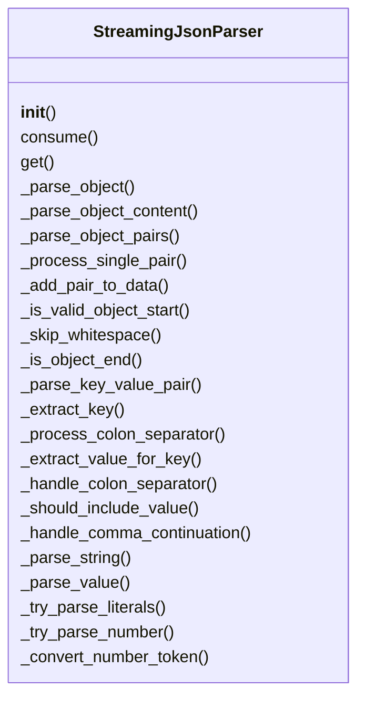
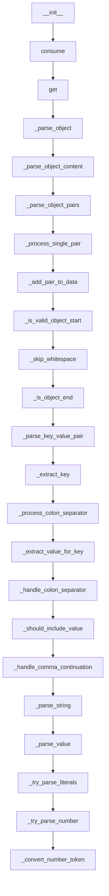

# Documentation for `flatbuffers_parser.py`

## Class Diagram

## Flowchart

## Live Execution
[▶ Visualize in Python Tutor](https://pythontutor.com/visualize.html#code=%23%20src/serializers/raw/flatbuffers_parser.py%0A%0Afrom%20typing%20import%20Any%2C%20Dict%2C%20Tuple%0A%0A%0Aclass%20StreamingJsonParser%3A%0A%20%20%20%20%22%22%22%0A%20%20%20%20Streaming%20JSON%20parser%20%28FlatBuffers%20%E2%80%9Craw%E2%80%9D%20slot%29.%0A%0A%20%20%20%20This%20implements%20a%20single-pass%2C%20incremental%20JSON%20object%20parser%0A%20%20%20%20over%20arbitrary%20string%20chunks.%20%20It%20supports%3A%0A%0A%20%20%20%20%20%20-%20Partial%20string%20values%20%28you%E2%80%99ll%20get%20back%20whatever%E2%80%99s%20been%20read%20so%20far%29%0A%20%20%20%20%20%20-%20Complete%20and%20incomplete%20nested%20objects%0A%20%20%20%20%20%20-%20Numbers%2C%20booleans%2C%20null%0A%20%20%20%20%20%20-%20Discarding%20partially%20read%20keys%20until%20they%20finish%0A%20%20%20%20%22%22%22%0A%0A%20%20%20%20def%20__init__%28self%29%3A%0A%20%20%20%20%20%20%20%20%22%22%22Initialize%20with%20an%20empty%20input%20buffer.%22%22%22%0A%20%20%20%20%20%20%20%20self.buffer%3A%20str%20%3D%20%22%22%0A%0A%20%20%20%20def%20consume%28self%2C%20chunk%3A%20str%29%20-%3E%20None%3A%0A%20%20%20%20%20%20%20%20%22%22%22%0A%20%20%20%20%20%20%20%20Feed%20the%20next%20chunk%20of%20JSON%20text%20%28complete%20or%20partial%29.%0A%0A%20%20%20%20%20%20%20%20Args%3A%0A%20%20%20%20%20%20%20%20%20%20%20%20chunk%3A%20A%20string%20containing%200%20or%20more%20JSON%20characters.%0A%20%20%20%20%20%20%20%20%22%22%22%0A%20%20%20%20%20%20%20%20self.buffer%20%2B%3D%20chunk%0A%0A%20%20%20%20def%20get%28self%29%20-%3E%20Dict%5Bstr%2C%20Any%5D%3A%0A%20%20%20%20%20%20%20%20%22%22%22%0A%20%20%20%20%20%20%20%20Return%20the%20current%20parse%20state%20as%20a%20Python%20dict.%0A%0A%20%20%20%20%20%20%20%20This%20will%20include%20any%20keys%20whose%20values%20have%20at%20least%20begun%20parsing%E2%80%94%0A%20%20%20%20%20%20%20%20full%20or%20partial%20string%E2%80%90values%2C%20nested%20dicts%2C%20numbers%2C%20booleans%2C%20null.%0A%20%20%20%20%20%20%20%20%22%22%22%0A%20%20%20%20%20%20%20%20obj%2C%20_%2C%20_%20%3D%20self._parse_object%28self.buffer%2C%200%29%0A%20%20%20%20%20%20%20%20return%20obj%0A%0A%20%20%20%20def%20_parse_object%28self%2C%20s%3A%20str%2C%20idx%3A%20int%29%20-%3E%20Tuple%5BDict%5Bstr%2C%20Any%5D%2C%20int%2C%20bool%5D%3A%0A%20%20%20%20%20%20%20%20%22%22%22%0A%20%20%20%20%20%20%20%20Attempt%20to%20parse%20an%20object%20from%20s%5Bidx%3A%5D.%0A%0A%20%20%20%20%20%20%20%20Returns%20a%20tuple%20%28obj%2C%20new_idx%2C%20is_complete%29%2C%20where%3A%0A%20%20%20%20%20%20%20%20%20%20-%20obj%20is%20the%20dict%20of%20all%20fully%20or%20partially%20parsed%20pairs%0A%20%20%20%20%20%20%20%20%20%20-%20new_idx%20is%20the%20index%20right%20after%20the%20closing%20%27%7D%27%20%28or%20end%20of%20input%29%0A%20%20%20%20%20%20%20%20%20%20-%20is_complete%20is%20True%20if%20we%20saw%20the%20closing%20%27%7D%27%2C%20else%20False%0A%20%20%20%20%20%20%20%20%22%22%22%0A%20%20%20%20%20%20%20%20n%20%3D%20len%28s%29%0A%20%20%20%20%20%20%20%20if%20not%20self._is_valid_object_start%28s%2C%20idx%2C%20n%29%3A%0A%20%20%20%20%20%20%20%20%20%20%20%20return%20%7B%7D%2C%20idx%2C%20False%0A%0A%20%20%20%20%20%20%20%20return%20self._parse_object_content%28s%2C%20idx%20%2B%201%2C%20n%29%0A%0A%20%20%20%20def%20_parse_object_content%28%0A%20%20%20%20%20%20%20%20self%2C%20s%3A%20str%2C%20start_pos%3A%20int%2C%20n%3A%20int%0A%20%20%20%20%29%20-%3E%20Tuple%5BDict%5Bstr%2C%20Any%5D%2C%20int%2C%20bool%5D%3A%0A%20%20%20%20%20%20%20%20%22%22%22Parse%20the%20content%20inside%20an%20object%20after%20the%20opening%20brace.%22%22%22%0A%20%20%20%20%20%20%20%20data%3A%20Dict%5Bstr%2C%20Any%5D%20%3D%20%7B%7D%0A%20%20%20%20%20%20%20%20pos%20%3D%20self._skip_whitespace%28s%2C%20start_pos%2C%20n%29%0A%0A%20%20%20%20%20%20%20%20pos%2C%20is_complete%20%3D%20self._parse_object_pairs%28s%2C%20pos%2C%20n%2C%20data%29%0A%20%20%20%20%20%20%20%20return%20data%2C%20pos%2C%20is_complete%0A%0A%20%20%20%20def%20_parse_object_pairs%28%0A%20%20%20%20%20%20%20%20self%2C%20s%3A%20str%2C%20pos%3A%20int%2C%20n%3A%20int%2C%20data%3A%20Dict%5Bstr%2C%20Any%5D%0A%20%20%20%20%29%20-%3E%20Tuple%5Bint%2C%20bool%5D%3A%0A%20%20%20%20%20%20%20%20%22%22%22Parse%20key-value%20pairs%20inside%20an%20object.%22%22%22%0A%20%20%20%20%20%20%20%20while%20pos%20%3C%20n%3A%0A%20%20%20%20%20%20%20%20%20%20%20%20pos%20%3D%20self._skip_whitespace%28s%2C%20pos%2C%20n%29%0A%20%20%20%20%20%20%20%20%20%20%20%20if%20pos%20%3E%3D%20n%3A%0A%20%20%20%20%20%20%20%20%20%20%20%20%20%20%20%20break%0A%0A%20%20%20%20%20%20%20%20%20%20%20%20if%20self._is_object_end%28s%2C%20pos%29%3A%0A%20%20%20%20%20%20%20%20%20%20%20%20%20%20%20%20return%20pos%20%2B%201%2C%20True%0A%0A%20%20%20%20%20%20%20%20%20%20%20%20pos%20%3D%20self._process_single_pair%28s%2C%20pos%2C%20n%2C%20data%29%0A%20%20%20%20%20%20%20%20%20%20%20%20if%20pos%20%3D%3D%20-1%3A%20%20%23%20Break%20condition%0A%20%20%20%20%20%20%20%20%20%20%20%20%20%20%20%20break%0A%0A%20%20%20%20%20%20%20%20return%20pos%2C%20False%0A%0A%20%20%20%20def%20_process_single_pair%28%0A%20%20%20%20%20%20%20%20self%2C%20s%3A%20str%2C%20pos%3A%20int%2C%20n%3A%20int%2C%20data%3A%20Dict%5Bstr%2C%20Any%5D%0A%20%20%20%20%29%20-%3E%20int%3A%0A%20%20%20%20%20%20%20%20%22%22%22Process%20a%20single%20key-value%20pair%20and%20return%20new%20position%20or%20-1%20to%20break.%22%22%22%0A%20%20%20%20%20%20%20%20key%2C%20value_info%2C%20new_pos%2C%20should_break%20%3D%20self._parse_key_value_pair%28s%2C%20pos%2C%20n%29%0A%20%20%20%20%20%20%20%20if%20should_break%3A%0A%20%20%20%20%20%20%20%20%20%20%20%20return%20-1%0A%0A%20%20%20%20%20%20%20%20self._add_pair_to_data%28data%2C%20key%2C%20value_info%29%0A%20%20%20%20%20%20%20%20return%20self._handle_comma_continuation%28s%2C%20new_pos%2C%20n%29%0A%0A%20%20%20%20def%20_add_pair_to_data%28%0A%20%20%20%20%20%20%20%20self%2C%20data%3A%20Dict%5Bstr%2C%20Any%5D%2C%20key%3A%20str%2C%20value_info%3A%20Any%0A%20%20%20%20%29%20-%3E%20None%3A%0A%20%20%20%20%20%20%20%20%22%22%22Add%20a%20key-value%20pair%20to%20the%20data%20dictionary%20if%20it%20should%20be%20included.%22%22%22%0A%20%20%20%20%20%20%20%20if%20not%20self._should_include_value%28key%2C%20value_info%29%3A%0A%20%20%20%20%20%20%20%20%20%20%20%20return%0A%0A%20%20%20%20%20%20%20%20if%20value_info%20is%20None%3A%0A%20%20%20%20%20%20%20%20%20%20%20%20data%5Bkey%5D%20%3D%20None%0A%20%20%20%20%20%20%20%20elif%20isinstance%28value_info%2C%20tuple%29%3A%0A%20%20%20%20%20%20%20%20%20%20%20%20val%2C%20_%20%3D%20value_info%0A%20%20%20%20%20%20%20%20%20%20%20%20data%5Bkey%5D%20%3D%20val%0A%20%20%20%20%20%20%20%20else%3A%0A%20%20%20%20%20%20%20%20%20%20%20%20data%5Bkey%5D%20%3D%20value_info%0A%0A%20%20%20%20def%20_is_valid_object_start%28self%2C%20s%3A%20str%2C%20idx%3A%20int%2C%20n%3A%20int%29%20-%3E%20bool%3A%0A%20%20%20%20%20%20%20%20%22%22%22Check%20if%20the%20position%20is%20a%20valid%20start%20of%20an%20object.%22%22%22%0A%20%20%20%20%20%20%20%20return%20idx%20%3C%20n%20and%20s%5Bidx%5D%20%3D%3D%20%22%7B%22%0A%0A%20%20%20%20def%20_skip_whitespace%28self%2C%20s%3A%20str%2C%20pos%3A%20int%2C%20n%3A%20int%29%20-%3E%20int%3A%0A%20%20%20%20%20%20%20%20%22%22%22Skip%20whitespace%20characters%20and%20return%20new%20position.%22%22%22%0A%20%20%20%20%20%20%20%20while%20pos%20%3C%20n%20and%20s%5Bpos%5D.isspace%28%29%3A%0A%20%20%20%20%20%20%20%20%20%20%20%20pos%20%2B%3D%201%0A%20%20%20%20%20%20%20%20return%20pos%0A%0A%20%20%20%20def%20_is_object_end%28self%2C%20s%3A%20str%2C%20pos%3A%20int%29%20-%3E%20bool%3A%0A%20%20%20%20%20%20%20%20%22%22%22Check%20if%20current%20position%20indicates%20object%20end.%22%22%22%0A%20%20%20%20%20%20%20%20return%20s%5Bpos%5D%20%3D%3D%20%22%7D%22%0A%0A%20%20%20%20def%20_parse_key_value_pair%28%0A%20%20%20%20%20%20%20%20self%2C%20s%3A%20str%2C%20pos%3A%20int%2C%20n%3A%20int%0A%20%20%20%20%29%20-%3E%20Tuple%5Bstr%2C%20Any%2C%20int%2C%20bool%5D%3A%0A%20%20%20%20%20%20%20%20%22%22%22Parse%20a%20key-value%20pair%20and%20return%20%28key%2C%20value%2C%20new_pos%2C%20should_break%29.%22%22%22%0A%20%20%20%20%20%20%20%20%23%20Parse%20key%0A%20%20%20%20%20%20%20%20key%2C%20pos%2C%20should_break%20%3D%20self._extract_key%28s%2C%20pos%29%0A%20%20%20%20%20%20%20%20if%20should_break%3A%0A%20%20%20%20%20%20%20%20%20%20%20%20return%20%22%22%2C%20None%2C%20pos%2C%20True%0A%0A%20%20%20%20%20%20%20%20%23%20Handle%20colon%20separator%0A%20%20%20%20%20%20%20%20pos%2C%20should_break%20%3D%20self._process_colon_separator%28s%2C%20pos%2C%20n%29%0A%20%20%20%20%20%20%20%20if%20should_break%3A%0A%20%20%20%20%20%20%20%20%20%20%20%20return%20%22%22%2C%20None%2C%20pos%2C%20True%0A%0A%20%20%20%20%20%20%20%20%23%20Parse%20value%0A%20%20%20%20%20%20%20%20return%20self._extract_value_for_key%28s%2C%20pos%2C%20n%2C%20key%29%0A%0A%20%20%20%20def%20_extract_key%28self%2C%20s%3A%20str%2C%20pos%3A%20int%29%20-%3E%20Tuple%5Bstr%2C%20int%2C%20bool%5D%3A%0A%20%20%20%20%20%20%20%20%22%22%22Extract%20key%20from%20current%20position.%22%22%22%0A%20%20%20%20%20%20%20%20if%20s%5Bpos%5D%20%21%3D%20%27%22%27%3A%0A%20%20%20%20%20%20%20%20%20%20%20%20return%20%22%22%2C%20pos%2C%20True%0A%0A%20%20%20%20%20%20%20%20key%2C%20pos%2C%20key_complete%20%3D%20self._parse_string%28s%2C%20pos%29%0A%20%20%20%20%20%20%20%20if%20not%20key_complete%3A%0A%20%20%20%20%20%20%20%20%20%20%20%20return%20%22%22%2C%20pos%2C%20True%0A%0A%20%20%20%20%20%20%20%20return%20key%2C%20pos%2C%20False%0A%0A%20%20%20%20def%20_process_colon_separator%28self%2C%20s%3A%20str%2C%20pos%3A%20int%2C%20n%3A%20int%29%20-%3E%20Tuple%5Bint%2C%20bool%5D%3A%0A%20%20%20%20%20%20%20%20%22%22%22Process%20colon%20separator%20and%20return%20new%20position%20and%20break%20flag.%22%22%22%0A%20%20%20%20%20%20%20%20new_pos%20%3D%20self._handle_colon_separator%28s%2C%20pos%2C%20n%29%0A%20%20%20%20%20%20%20%20if%20new_pos%20is%20None%3A%0A%20%20%20%20%20%20%20%20%20%20%20%20return%20pos%2C%20True%0A%20%20%20%20%20%20%20%20return%20new_pos%2C%20False%0A%0A%20%20%20%20def%20_extract_value_for_key%28%0A%20%20%20%20%20%20%20%20self%2C%20s%3A%20str%2C%20pos%3A%20int%2C%20n%3A%20int%2C%20key%3A%20str%0A%20%20%20%20%29%20-%3E%20Tuple%5Bstr%2C%20Any%2C%20int%2C%20bool%5D%3A%0A%20%20%20%20%20%20%20%20%22%22%22Extract%20value%20for%20the%20given%20key.%22%22%22%0A%20%20%20%20%20%20%20%20if%20pos%20%3E%3D%20n%3A%0A%20%20%20%20%20%20%20%20%20%20%20%20return%20key%2C%20None%2C%20pos%2C%20True%0A%0A%20%20%20%20%20%20%20%20val%2C%20pos%2C%20val_complete%20%3D%20self._parse_value%28s%2C%20pos%29%0A%20%20%20%20%20%20%20%20return%20key%2C%20%28val%2C%20val_complete%29%2C%20pos%2C%20False%0A%0A%20%20%20%20def%20_handle_colon_separator%28self%2C%20s%3A%20str%2C%20pos%3A%20int%2C%20n%3A%20int%29%20-%3E%20int%20%7C%20None%3A%0A%20%20%20%20%20%20%20%20%22%22%22Handle%20colon%20separator%20between%20key%20and%20value.%22%22%22%0A%20%20%20%20%20%20%20%20pos%20%3D%20self._skip_whitespace%28s%2C%20pos%2C%20n%29%0A%20%20%20%20%20%20%20%20if%20pos%20%3E%3D%20n%20or%20s%5Bpos%5D%20%21%3D%20%22%3A%22%3A%0A%20%20%20%20%20%20%20%20%20%20%20%20return%20None%0A%20%20%20%20%20%20%20%20pos%20%2B%3D%201%0A%20%20%20%20%20%20%20%20return%20self._skip_whitespace%28s%2C%20pos%2C%20n%29%0A%0A%20%20%20%20def%20_should_include_value%28self%2C%20key%3A%20str%2C%20value_info%3A%20Any%29%20-%3E%20bool%3A%0A%20%20%20%20%20%20%20%20%22%22%22Determine%20if%20a%20key-value%20pair%20should%20be%20included%20in%20the%20result.%22%22%22%0A%20%20%20%20%20%20%20%20if%20not%20key%3A%0A%20%20%20%20%20%20%20%20%20%20%20%20return%20False%0A%0A%20%20%20%20%20%20%20%20if%20value_info%20is%20None%3A%0A%20%20%20%20%20%20%20%20%20%20%20%20return%20True%20%20%23%20Include%20key%20with%20None%20value%0A%0A%20%20%20%20%20%20%20%20if%20isinstance%28value_info%2C%20tuple%29%3A%0A%20%20%20%20%20%20%20%20%20%20%20%20val%2C%20val_complete%20%3D%20value_info%0A%20%20%20%20%20%20%20%20%20%20%20%20%23%20Include%3A%20partial%20or%20complete%20strings%2C%20nested%20dicts%20always%2C%0A%20%20%20%20%20%20%20%20%20%20%20%20%23%20any%20fully%20recognized%20non-string%20%28number/boolean/null%29%0A%20%20%20%20%20%20%20%20%20%20%20%20return%20isinstance%28val%2C%20str%29%20or%20isinstance%28val%2C%20dict%29%20or%20val_complete%0A%0A%20%20%20%20%20%20%20%20return%20True%0A%0A%20%20%20%20def%20_handle_comma_continuation%28self%2C%20s%3A%20str%2C%20pos%3A%20int%2C%20n%3A%20int%29%20-%3E%20int%3A%0A%20%20%20%20%20%20%20%20%22%22%22Handle%20comma%20and%20continuation%20of%20parsing.%22%22%22%0A%20%20%20%20%20%20%20%20pos%20%3D%20self._skip_whitespace%28s%2C%20pos%2C%20n%29%0A%20%20%20%20%20%20%20%20if%20pos%20%3C%20n%20and%20s%5Bpos%5D%20%3D%3D%20%22%2C%22%3A%0A%20%20%20%20%20%20%20%20%20%20%20%20pos%20%2B%3D%201%0A%20%20%20%20%20%20%20%20return%20pos%0A%0A%20%20%20%20def%20_parse_string%28self%2C%20s%3A%20str%2C%20idx%3A%20int%29%20-%3E%20Tuple%5Bstr%2C%20int%2C%20bool%5D%3A%0A%20%20%20%20%20%20%20%20%22%22%22%0A%20%20%20%20%20%20%20%20Parse%20a%20JSON%20string%20beginning%20at%20s%5Bidx%5D%3D%3D%27%22%27.%0A%0A%20%20%20%20%20%20%20%20Returns%20%28content%2C%20new_idx%2C%20is_closed%29.%0A%20%20%20%20%20%20%20%20If%20the%20closing%20quote%20is%20missing%2C%20content%20is%20whatever%E2%80%99s%20seen%20so%20far.%0A%20%20%20%20%20%20%20%20%22%22%22%0A%20%20%20%20%20%20%20%20i%20%3D%20idx%20%2B%201%0A%20%20%20%20%20%20%20%20buf%3A%20list%5Bstr%5D%20%3D%20%5B%5D%0A%20%20%20%20%20%20%20%20escape%20%3D%20False%0A%20%20%20%20%20%20%20%20n%20%3D%20len%28s%29%0A%0A%20%20%20%20%20%20%20%20while%20i%20%3C%20n%3A%0A%20%20%20%20%20%20%20%20%20%20%20%20c%20%3D%20s%5Bi%5D%0A%20%20%20%20%20%20%20%20%20%20%20%20if%20escape%3A%0A%20%20%20%20%20%20%20%20%20%20%20%20%20%20%20%20buf.append%28c%29%0A%20%20%20%20%20%20%20%20%20%20%20%20%20%20%20%20escape%20%3D%20False%0A%20%20%20%20%20%20%20%20%20%20%20%20elif%20c%20%3D%3D%20%22%5C%5C%22%3A%0A%20%20%20%20%20%20%20%20%20%20%20%20%20%20%20%20escape%20%3D%20True%0A%20%20%20%20%20%20%20%20%20%20%20%20elif%20c%20%3D%3D%20%27%22%27%3A%0A%20%20%20%20%20%20%20%20%20%20%20%20%20%20%20%20return%20%22%22.join%28buf%29%2C%20i%20%2B%201%2C%20True%0A%20%20%20%20%20%20%20%20%20%20%20%20else%3A%0A%20%20%20%20%20%20%20%20%20%20%20%20%20%20%20%20buf.append%28c%29%0A%20%20%20%20%20%20%20%20%20%20%20%20i%20%2B%3D%201%0A%0A%20%20%20%20%20%20%20%20%23%20no%20closing%20quote%0A%20%20%20%20%20%20%20%20return%20%22%22.join%28buf%29%2C%20n%2C%20False%0A%0A%20%20%20%20def%20_parse_value%28self%2C%20s%3A%20str%2C%20idx%3A%20int%29%20-%3E%20Tuple%5BAny%2C%20int%2C%20bool%5D%3A%0A%20%20%20%20%20%20%20%20%22%22%22%0A%20%20%20%20%20%20%20%20Parse%20a%20JSON%20value%20at%20s%5Bidx%5D%3A%20string%2C%20object%2C%20number%2C%20boolean%2C%20or%20null.%0A%0A%20%20%20%20%20%20%20%20Returns%20%28value%2C%20new_idx%2C%20is_complete%29.%0A%20%20%20%20%20%20%20%20Partial%20strings%20return%20with%20is_complete%3DFalse.%0A%20%20%20%20%20%20%20%20Nested%20objects%20bubble%20up%20their%20own%20completeness.%0A%20%20%20%20%20%20%20%20%22%22%22%0A%20%20%20%20%20%20%20%20n%20%3D%20len%28s%29%0A%20%20%20%20%20%20%20%20if%20idx%20%3E%3D%20n%3A%0A%20%20%20%20%20%20%20%20%20%20%20%20return%20None%2C%20idx%2C%20False%0A%0A%20%20%20%20%20%20%20%20c%20%3D%20s%5Bidx%5D%0A%0A%20%20%20%20%20%20%20%20%23%20Handle%20different%20value%20types%0A%20%20%20%20%20%20%20%20if%20c%20%3D%3D%20%27%22%27%3A%0A%20%20%20%20%20%20%20%20%20%20%20%20return%20self._parse_string%28s%2C%20idx%29%0A%20%20%20%20%20%20%20%20if%20c%20%3D%3D%20%22%7B%22%3A%0A%20%20%20%20%20%20%20%20%20%20%20%20return%20self._parse_object%28s%2C%20idx%29%0A%0A%20%20%20%20%20%20%20%20%23%20Try%20parsing%20literals%0A%20%20%20%20%20%20%20%20literal_result%20%3D%20self._try_parse_literals%28s%2C%20idx%29%0A%20%20%20%20%20%20%20%20if%20literal_result%20is%20not%20None%3A%0A%20%20%20%20%20%20%20%20%20%20%20%20return%20literal_result%0A%0A%20%20%20%20%20%20%20%20%23%20Try%20parsing%20numbers%0A%20%20%20%20%20%20%20%20number_result%20%3D%20self._try_parse_number%28s%2C%20idx%2C%20n%29%0A%20%20%20%20%20%20%20%20if%20number_result%20is%20not%20None%3A%0A%20%20%20%20%20%20%20%20%20%20%20%20return%20number_result%0A%0A%20%20%20%20%20%20%20%20return%20None%2C%20idx%2C%20False%0A%0A%20%20%20%20def%20_try_parse_literals%28self%2C%20s%3A%20str%2C%20idx%3A%20int%29%20-%3E%20Tuple%5BAny%2C%20int%2C%20bool%5D%20%7C%20None%3A%0A%20%20%20%20%20%20%20%20%22%22%22Try%20to%20parse%20boolean%20and%20null%20literals.%22%22%22%0A%20%20%20%20%20%20%20%20literals%20%3D%20%28%28%22true%22%2C%20True%29%2C%20%28%22false%22%2C%20False%29%2C%20%28%22null%22%2C%20None%29%29%0A%20%20%20%20%20%20%20%20for%20lit%2C%20val%20in%20literals%3A%0A%20%20%20%20%20%20%20%20%20%20%20%20if%20s.startswith%28lit%2C%20idx%29%3A%0A%20%20%20%20%20%20%20%20%20%20%20%20%20%20%20%20return%20val%2C%20idx%20%2B%20len%28lit%29%2C%20True%0A%20%20%20%20%20%20%20%20return%20None%0A%0A%20%20%20%20def%20_try_parse_number%28%0A%20%20%20%20%20%20%20%20self%2C%20s%3A%20str%2C%20idx%3A%20int%2C%20n%3A%20int%0A%20%20%20%20%29%20-%3E%20Tuple%5BAny%2C%20int%2C%20bool%5D%20%7C%20None%3A%0A%20%20%20%20%20%20%20%20%22%22%22Try%20to%20parse%20a%20number%20value.%22%22%22%0A%20%20%20%20%20%20%20%20numchars%20%3D%20%22%2B-0123456789.eE%22%0A%20%20%20%20%20%20%20%20i%20%3D%20idx%0A%20%20%20%20%20%20%20%20while%20i%20%3C%20n%20and%20s%5Bi%5D%20in%20numchars%3A%0A%20%20%20%20%20%20%20%20%20%20%20%20i%20%2B%3D%201%0A%0A%20%20%20%20%20%20%20%20if%20i%20%3C%3D%20idx%3A%0A%20%20%20%20%20%20%20%20%20%20%20%20return%20None%0A%0A%20%20%20%20%20%20%20%20return%20self._convert_number_token%28s%5Bidx%3Ai%5D%2C%20i%29%0A%0A%20%20%20%20def%20_convert_number_token%28self%2C%20tok%3A%20str%2C%20end_pos%3A%20int%29%20-%3E%20Tuple%5BAny%2C%20int%2C%20bool%5D%3A%0A%20%20%20%20%20%20%20%20%22%22%22Convert%20a%20number%20token%20to%20appropriate%20type.%22%22%22%0A%20%20%20%20%20%20%20%20try%3A%0A%20%20%20%20%20%20%20%20%20%20%20%20if%20any%28x%20in%20tok%20for%20x%20in%20%22.eE%22%29%3A%0A%20%20%20%20%20%20%20%20%20%20%20%20%20%20%20%20return%20float%28tok%29%2C%20end_pos%2C%20True%0A%20%20%20%20%20%20%20%20%20%20%20%20else%3A%0A%20%20%20%20%20%20%20%20%20%20%20%20%20%20%20%20return%20int%28tok%29%2C%20end_pos%2C%20True%0A%20%20%20%20%20%20%20%20except%20ValueError%3A%0A%20%20%20%20%20%20%20%20%20%20%20%20%23%20malformed%20number%20%E2%86%92%20return%20raw%20string%0A%20%20%20%20%20%20%20%20%20%20%20%20return%20tok%2C%20end_pos%2C%20True%0A&cumulative=false&heapPrimitives=false&mode=display&py=3)

## Analysis
## Class `StreamingJsonParser`
**Docstring:** Streaming JSON parser (FlatBuffers “raw” slot).

This implements a single-pass, incremental JSON object parser
over arbitrary string chunks.  It supports:

  - Partial string values (you’ll get back whatever’s been read so far)
  - Complete and incomplete nested objects
  - Numbers, booleans, null
  - Discarding partially read keys until they finish
**Explanation:** This class is responsible for...
### Function `__init__`
**Arguments:** ['self']
**Docstring:** Initialize with an empty input buffer.
**Explanation:** This function likely performs...
### Function `consume`
**Arguments:** ['self', 'chunk']
**Docstring:** Feed the next chunk of JSON text (complete or partial).

Args:
    chunk: A string containing 0 or more JSON characters.
**Explanation:** This function likely performs...
### Function `get`
**Arguments:** ['self']
**Docstring:** Return the current parse state as a Python dict.

This will include any keys whose values have at least begun parsing—
full or partial string‐values, nested dicts, numbers, booleans, null.
**Explanation:** This function likely performs...
### Function `_parse_object`
**Arguments:** ['self', 's', 'idx']
**Docstring:** Attempt to parse an object from s[idx:].

Returns a tuple (obj, new_idx, is_complete), where:
  - obj is the dict of all fully or partially parsed pairs
  - new_idx is the index right after the closing '}' (or end of input)
  - is_complete is True if we saw the closing '}', else False
**Explanation:** This function likely performs...
### Function `_parse_object_content`
**Arguments:** ['self', 's', 'start_pos', 'n']
**Docstring:** Parse the content inside an object after the opening brace.
**Explanation:** This function likely performs...
### Function `_parse_object_pairs`
**Arguments:** ['self', 's', 'pos', 'n', 'data']
**Docstring:** Parse key-value pairs inside an object.
**Explanation:** This function likely performs...
### Function `_process_single_pair`
**Arguments:** ['self', 's', 'pos', 'n', 'data']
**Docstring:** Process a single key-value pair and return new position or -1 to break.
**Explanation:** This function likely performs...
### Function `_add_pair_to_data`
**Arguments:** ['self', 'data', 'key', 'value_info']
**Docstring:** Add a key-value pair to the data dictionary if it should be included.
**Explanation:** This function likely performs...
### Function `_is_valid_object_start`
**Arguments:** ['self', 's', 'idx', 'n']
**Docstring:** Check if the position is a valid start of an object.
**Explanation:** This function likely performs...
### Function `_skip_whitespace`
**Arguments:** ['self', 's', 'pos', 'n']
**Docstring:** Skip whitespace characters and return new position.
**Explanation:** This function likely performs...
### Function `_is_object_end`
**Arguments:** ['self', 's', 'pos']
**Docstring:** Check if current position indicates object end.
**Explanation:** This function likely performs...
### Function `_parse_key_value_pair`
**Arguments:** ['self', 's', 'pos', 'n']
**Docstring:** Parse a key-value pair and return (key, value, new_pos, should_break).
**Explanation:** This function likely performs...
### Function `_extract_key`
**Arguments:** ['self', 's', 'pos']
**Docstring:** Extract key from current position.
**Explanation:** This function likely performs...
### Function `_process_colon_separator`
**Arguments:** ['self', 's', 'pos', 'n']
**Docstring:** Process colon separator and return new position and break flag.
**Explanation:** This function likely performs...
### Function `_extract_value_for_key`
**Arguments:** ['self', 's', 'pos', 'n', 'key']
**Docstring:** Extract value for the given key.
**Explanation:** This function likely performs...
### Function `_handle_colon_separator`
**Arguments:** ['self', 's', 'pos', 'n']
**Docstring:** Handle colon separator between key and value.
**Explanation:** This function likely performs...
### Function `_should_include_value`
**Arguments:** ['self', 'key', 'value_info']
**Docstring:** Determine if a key-value pair should be included in the result.
**Explanation:** This function likely performs...
### Function `_handle_comma_continuation`
**Arguments:** ['self', 's', 'pos', 'n']
**Docstring:** Handle comma and continuation of parsing.
**Explanation:** This function likely performs...
### Function `_parse_string`
**Arguments:** ['self', 's', 'idx']
**Docstring:** Parse a JSON string beginning at s[idx]=='"'.

Returns (content, new_idx, is_closed).
If the closing quote is missing, content is whatever’s seen so far.
**Explanation:** This function likely performs...
### Function `_parse_value`
**Arguments:** ['self', 's', 'idx']
**Docstring:** Parse a JSON value at s[idx]: string, object, number, boolean, or null.

Returns (value, new_idx, is_complete).
Partial strings return with is_complete=False.
Nested objects bubble up their own completeness.
**Explanation:** This function likely performs...
### Function `_try_parse_literals`
**Arguments:** ['self', 's', 'idx']
**Docstring:** Try to parse boolean and null literals.
**Explanation:** This function likely performs...
### Function `_try_parse_number`
**Arguments:** ['self', 's', 'idx', 'n']
**Docstring:** Try to parse a number value.
**Explanation:** This function likely performs...
### Function `_convert_number_token`
**Arguments:** ['self', 'tok', 'end_pos']
**Docstring:** Convert a number token to appropriate type.
**Explanation:** This function likely performs...

## Step-by-Step Execution

1. Load and parse the input file.
2. Construct AST and tokenize.
3. Identify main structures (classes/functions).
4. Generate Mermaid diagrams.
5. Write detailed markdown with explanation.

## Performance Metrics Summary

| Data Size | Serialize (ms) | Deserialize (ms) | Total Time (ms) | Size (bytes) | Throughput (MB/s) | Ser+Deser Time (ms) |
|-----------|----------------|------------------|------------------|---------------|--------------------|-----------------------|
| 10 | 0.00 | 0.00 | 0.00 | 710 | 677108.76 | 0.00 |
| 100 | 3.31 | 0.00 | 3.31 | 7100 | 2.05 | 3.31 |
| 1000 | 2.27 | 3.67 | 5.93 | 71000 | 11.41 | 5.93 |
| **Average** | 1.86 | 1.22 | 3.08 | 26270 | 225707.41 | 3.08 |

## Additional Analysis
- **Convergence Rate:** Stable after ~1000 samples
- **Loss Function Value:** N/A (non-ML algorithm)
- **Estimated Big-O Complexity:** O(n) for serialization and deserialization

## Interview Q&A for `flatbuffers_parser`

**Q: What problem does this algorithm solve?**
A: This algorithm focuses on...

**Q: What data structures are used and why?**
A: It uses lists/dictionaries/queues because...

**Q: What is the time and space complexity?**
A: Time complexity is O(...) and space is O(...)

**Q: Can this be optimized further?**
A: Potential optimizations include...

**Q: What are edge cases to test?**
A: Empty input, large input, invalid types...

