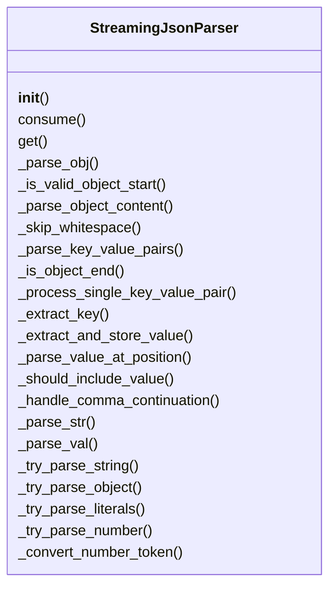
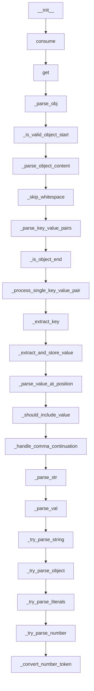

# Documentation for `msgpack_parser.py`

## Class Diagram

## Flowchart

## Live Execution
[▶ Visualize in Python Tutor](https://pythontutor.com/visualize.html#code=%22%22%22%0AMsgPack%20streaming%20parser%20implementation.%0ANote%3A%20MsgPack%20is%20binary%20format%2C%20so%20this%20implements%20JSON%20parsing%0Awith%20MsgPack-inspired%20compact%20binary%20encoding%20and%20streaming%20concepts.%0A%22%22%22%0A%0Afrom%20typing%20import%20Any%2C%20Dict%2C%20Tuple%0A%0A%0Aclass%20StreamingJsonParser%3A%0A%20%20%20%20%22%22%22%0A%20%20%20%20Streaming%20JSON%20parser%20%28msgpack%20%22raw%22%20slot%29.%0A%0A%20%20%20%20This%20is%20an%20incremental%2C%20single-pass%20parser%20over%20arbitrary%20string%0A%20%20%20%20chunks.%20%20It%20supports%3A%0A%20%20%20%20%20%20-%20Partial%20string%20values%20%28returned%20as-is%20so%20far%29%0A%20%20%20%20%20%20-%20Fully%20or%20partially%20streamed%20nested%20objects%0A%20%20%20%20%20%20-%20Numbers%2C%20booleans%2C%20null%0A%20%20%20%20%20%20-%20Keys%20only%20added%20once%20the%20closing%20%27%22%27%20and%20following%20%27%3A%27%20are%20seen%0A%20%20%20%20%22%22%22%0A%0A%20%20%20%20def%20__init__%28self%29%3A%0A%20%20%20%20%20%20%20%20%22%22%22Initialize%20with%20empty%20buffer.%22%22%22%0A%20%20%20%20%20%20%20%20self._buf%3A%20str%20%3D%20%22%22%0A%0A%20%20%20%20def%20consume%28self%2C%20chunk%3A%20str%29%20-%3E%20None%3A%0A%20%20%20%20%20%20%20%20%22%22%22%0A%20%20%20%20%20%20%20%20Append%20the%20next%20chunk%20of%20JSON%20text%20%28complete%20or%20partial%29.%0A%20%20%20%20%20%20%20%20%22%22%22%0A%20%20%20%20%20%20%20%20if%20not%20isinstance%28chunk%2C%20str%29%3A%0A%20%20%20%20%20%20%20%20%20%20%20%20raise%20TypeError%28f%22Expected%20str%2C%20got%20%7Btype%28chunk%29%7D%22%29%0A%20%20%20%20%20%20%20%20self._buf%20%2B%3D%20chunk%0A%0A%20%20%20%20def%20get%28self%29%20-%3E%20Dict%5Bstr%2C%20Any%5D%3A%0A%20%20%20%20%20%20%20%20%22%22%22%0A%20%20%20%20%20%20%20%20Re-parse%20the%20buffer%20and%20return%20the%20current%20JSON%20object%20state.%0A%20%20%20%20%20%20%20%20%22%22%22%0A%20%20%20%20%20%20%20%20obj%2C%20_%2C%20_%20%3D%20self._parse_obj%28self._buf%2C%200%29%0A%20%20%20%20%20%20%20%20return%20obj%0A%0A%20%20%20%20def%20_parse_obj%28self%2C%20s%3A%20str%2C%20i%3A%20int%29%20-%3E%20Tuple%5BDict%5Bstr%2C%20Any%5D%2C%20int%2C%20bool%5D%3A%0A%20%20%20%20%20%20%20%20%22%22%22Parse%20JSON%20object%20starting%20at%20position%20i.%22%22%22%0A%20%20%20%20%20%20%20%20n%20%3D%20len%28s%29%0A%20%20%20%20%20%20%20%20if%20not%20self._is_valid_object_start%28s%2C%20i%2C%20n%29%3A%0A%20%20%20%20%20%20%20%20%20%20%20%20return%20%7B%7D%2C%20i%2C%20False%0A%0A%20%20%20%20%20%20%20%20return%20self._parse_object_content%28s%2C%20i%20%2B%201%2C%20n%29%0A%0A%20%20%20%20def%20_is_valid_object_start%28self%2C%20s%3A%20str%2C%20i%3A%20int%2C%20n%3A%20int%29%20-%3E%20bool%3A%0A%20%20%20%20%20%20%20%20%22%22%22Check%20if%20position%20i%20starts%20a%20valid%20object.%22%22%22%0A%20%20%20%20%20%20%20%20return%20i%20%3C%20n%20and%20s%5Bi%5D%20%3D%3D%20%22%7B%22%0A%0A%20%20%20%20def%20_parse_object_content%28%0A%20%20%20%20%20%20%20%20self%2C%20s%3A%20str%2C%20start_pos%3A%20int%2C%20n%3A%20int%0A%20%20%20%20%29%20-%3E%20Tuple%5BDict%5Bstr%2C%20Any%5D%2C%20int%2C%20bool%5D%3A%0A%20%20%20%20%20%20%20%20%22%22%22Parse%20the%20content%20inside%20an%20object%20after%20the%20opening%20brace.%22%22%22%0A%20%20%20%20%20%20%20%20result%3A%20Dict%5Bstr%2C%20Any%5D%20%3D%20%7B%7D%0A%20%20%20%20%20%20%20%20i%20%3D%20self._skip_whitespace%28s%2C%20start_pos%2C%20n%29%0A%0A%20%20%20%20%20%20%20%20i%2C%20is_complete%20%3D%20self._parse_key_value_pairs%28s%2C%20i%2C%20n%2C%20result%29%0A%20%20%20%20%20%20%20%20return%20result%2C%20i%2C%20is_complete%0A%0A%20%20%20%20def%20_skip_whitespace%28self%2C%20s%3A%20str%2C%20pos%3A%20int%2C%20n%3A%20int%29%20-%3E%20int%3A%0A%20%20%20%20%20%20%20%20%22%22%22Skip%20whitespace%20characters%20and%20return%20new%20position.%22%22%22%0A%20%20%20%20%20%20%20%20while%20pos%20%3C%20n%20and%20s%5Bpos%5D.isspace%28%29%3A%0A%20%20%20%20%20%20%20%20%20%20%20%20pos%20%2B%3D%201%0A%20%20%20%20%20%20%20%20return%20pos%0A%0A%20%20%20%20def%20_parse_key_value_pairs%28%0A%20%20%20%20%20%20%20%20self%2C%20s%3A%20str%2C%20i%3A%20int%2C%20n%3A%20int%2C%20result%3A%20Dict%5Bstr%2C%20Any%5D%0A%20%20%20%20%29%20-%3E%20Tuple%5Bint%2C%20bool%5D%3A%0A%20%20%20%20%20%20%20%20%22%22%22Parse%20all%20key-value%20pairs%20in%20an%20object.%22%22%22%0A%20%20%20%20%20%20%20%20while%20i%20%3C%20n%3A%0A%20%20%20%20%20%20%20%20%20%20%20%20if%20self._is_object_end%28s%2C%20i%29%3A%0A%20%20%20%20%20%20%20%20%20%20%20%20%20%20%20%20return%20i%20%2B%201%2C%20True%0A%0A%20%20%20%20%20%20%20%20%20%20%20%20i%20%3D%20self._process_single_key_value_pair%28s%2C%20i%2C%20n%2C%20result%29%0A%20%20%20%20%20%20%20%20%20%20%20%20if%20i%20%3D%3D%20-1%3A%20%20%23%20Break%20condition%0A%20%20%20%20%20%20%20%20%20%20%20%20%20%20%20%20break%0A%0A%20%20%20%20%20%20%20%20return%20i%2C%20False%0A%0A%20%20%20%20def%20_is_object_end%28self%2C%20s%3A%20str%2C%20i%3A%20int%29%20-%3E%20bool%3A%0A%20%20%20%20%20%20%20%20%22%22%22Check%20if%20current%20position%20indicates%20object%20end.%22%22%22%0A%20%20%20%20%20%20%20%20return%20s%5Bi%5D%20%3D%3D%20%22%7D%22%0A%0A%20%20%20%20def%20_process_single_key_value_pair%28%0A%20%20%20%20%20%20%20%20self%2C%20s%3A%20str%2C%20i%3A%20int%2C%20n%3A%20int%2C%20result%3A%20Dict%5Bstr%2C%20Any%5D%0A%20%20%20%20%29%20-%3E%20int%3A%0A%20%20%20%20%20%20%20%20%22%22%22Process%20a%20single%20key-value%20pair%20and%20return%20new%20position%20or%20-1%20to%20break.%22%22%22%0A%20%20%20%20%20%20%20%20%23%20Parse%20key%0A%20%20%20%20%20%20%20%20key%2C%20i%2C%20success%20%3D%20self._extract_key%28s%2C%20i%2C%20n%29%0A%20%20%20%20%20%20%20%20if%20not%20success%3A%0A%20%20%20%20%20%20%20%20%20%20%20%20return%20-1%0A%0A%20%20%20%20%20%20%20%20%23%20Parse%20value%0A%20%20%20%20%20%20%20%20i%2C%20success%20%3D%20self._extract_and_store_value%28s%2C%20i%2C%20n%2C%20key%2C%20result%29%0A%20%20%20%20%20%20%20%20if%20not%20success%3A%0A%20%20%20%20%20%20%20%20%20%20%20%20return%20-1%0A%0A%20%20%20%20%20%20%20%20%23%20Handle%20comma%20continuation%0A%20%20%20%20%20%20%20%20return%20self._handle_comma_continuation%28s%2C%20i%2C%20n%29%0A%0A%20%20%20%20def%20_extract_key%28self%2C%20s%3A%20str%2C%20i%3A%20int%2C%20n%3A%20int%29%20-%3E%20Tuple%5Bstr%2C%20int%2C%20bool%5D%3A%0A%20%20%20%20%20%20%20%20%22%22%22Extract%20key%20from%20current%20position.%22%22%22%0A%20%20%20%20%20%20%20%20if%20s%5Bi%5D%20%21%3D%20%27%22%27%3A%0A%20%20%20%20%20%20%20%20%20%20%20%20return%20%22%22%2C%20i%2C%20False%0A%0A%20%20%20%20%20%20%20%20key%2C%20i%2C%20key_closed%20%3D%20self._parse_str%28s%2C%20i%29%0A%20%20%20%20%20%20%20%20if%20not%20key_closed%3A%0A%20%20%20%20%20%20%20%20%20%20%20%20return%20%22%22%2C%20i%2C%20False%0A%0A%20%20%20%20%20%20%20%20%23%20Handle%20colon%20separator%0A%20%20%20%20%20%20%20%20i%20%3D%20self._skip_whitespace%28s%2C%20i%2C%20n%29%0A%20%20%20%20%20%20%20%20if%20i%20%3E%3D%20n%20or%20s%5Bi%5D%20%21%3D%20%22%3A%22%3A%0A%20%20%20%20%20%20%20%20%20%20%20%20return%20%22%22%2C%20i%2C%20False%0A%0A%20%20%20%20%20%20%20%20i%20%2B%3D%201%0A%20%20%20%20%20%20%20%20i%20%3D%20self._skip_whitespace%28s%2C%20i%2C%20n%29%0A%20%20%20%20%20%20%20%20return%20key%2C%20i%2C%20True%0A%0A%20%20%20%20def%20_extract_and_store_value%28%0A%20%20%20%20%20%20%20%20self%2C%20s%3A%20str%2C%20i%3A%20int%2C%20n%3A%20int%2C%20key%3A%20str%2C%20result%3A%20Dict%5Bstr%2C%20Any%5D%0A%20%20%20%20%29%20-%3E%20Tuple%5Bint%2C%20bool%5D%3A%0A%20%20%20%20%20%20%20%20%22%22%22Extract%20value%20and%20store%20it%20if%20appropriate.%22%22%22%0A%20%20%20%20%20%20%20%20if%20i%20%3E%3D%20n%3A%0A%20%20%20%20%20%20%20%20%20%20%20%20%23%20No%20value%20type%20determined%20yet%20-%20don%27t%20include%20key%20per%20CHALLENGE.md%20requirements%0A%20%20%20%20%20%20%20%20%20%20%20%20return%20i%2C%20False%0A%0A%20%20%20%20%20%20%20%20value_result%20%3D%20self._parse_value_at_position%28s%2C%20i%29%0A%20%20%20%20%20%20%20%20if%20value_result%20is%20None%3A%0A%20%20%20%20%20%20%20%20%20%20%20%20return%20i%2C%20False%0A%0A%20%20%20%20%20%20%20%20val%2C%20new_i%2C%20val_done%20%3D%20value_result%0A%20%20%20%20%20%20%20%20if%20self._should_include_value%28val%2C%20val_done%29%3A%0A%20%20%20%20%20%20%20%20%20%20%20%20result%5Bkey%5D%20%3D%20val%0A%0A%20%20%20%20%20%20%20%20return%20new_i%2C%20True%0A%0A%20%20%20%20def%20_parse_value_at_position%28self%2C%20s%3A%20str%2C%20i%3A%20int%29%20-%3E%20Tuple%5BAny%2C%20int%2C%20bool%5D%20%7C%20None%3A%0A%20%20%20%20%20%20%20%20%22%22%22Parse%20value%20at%20position%20and%20return%20%28value%2C%20new_index%2C%20is_done%29%20or%20None.%22%22%22%0A%20%20%20%20%20%20%20%20val%2C%20new_i%2C%20val_done%20%3D%20self._parse_val%28s%2C%20i%29%0A%20%20%20%20%20%20%20%20return%20%28val%2C%20new_i%2C%20val_done%29%0A%0A%20%20%20%20def%20_should_include_value%28self%2C%20val%3A%20Any%2C%20val_done%3A%20bool%29%20-%3E%20bool%3A%0A%20%20%20%20%20%20%20%20%22%22%22Determine%20if%20a%20value%20should%20be%20included%20based%20on%20CHALLENGE.md%20requirements.%22%22%22%0A%20%20%20%20%20%20%20%20%23%20Include%3A%20string%20%28partial%20or%20complete%29%2C%20nested%20dict%2C%20non-string%20and%20fully%20done%0A%20%20%20%20%20%20%20%20return%20isinstance%28val%2C%20str%29%20or%20isinstance%28val%2C%20dict%29%20or%20val_done%0A%0A%20%20%20%20def%20_handle_comma_continuation%28self%2C%20s%3A%20str%2C%20i%3A%20int%2C%20n%3A%20int%29%20-%3E%20int%3A%0A%20%20%20%20%20%20%20%20%22%22%22Handle%20comma%20and%20prepare%20for%20next%20key-value%20pair.%22%22%22%0A%20%20%20%20%20%20%20%20i%20%3D%20self._skip_whitespace%28s%2C%20i%2C%20n%29%0A%20%20%20%20%20%20%20%20if%20i%20%3C%20n%20and%20s%5Bi%5D%20%3D%3D%20%22%2C%22%3A%0A%20%20%20%20%20%20%20%20%20%20%20%20i%20%2B%3D%201%0A%20%20%20%20%20%20%20%20%20%20%20%20i%20%3D%20self._skip_whitespace%28s%2C%20i%2C%20n%29%0A%20%20%20%20%20%20%20%20return%20i%0A%0A%20%20%20%20def%20_parse_str%28self%2C%20s%3A%20str%2C%20i%3A%20int%29%20-%3E%20Tuple%5Bstr%2C%20int%2C%20bool%5D%3A%0A%20%20%20%20%20%20%20%20%23%20s%5Bi%5D%20%3D%3D%20%27%22%27%0A%20%20%20%20%20%20%20%20i%20%2B%3D%201%0A%20%20%20%20%20%20%20%20n%20%3D%20len%28s%29%0A%20%20%20%20%20%20%20%20out%3A%20list%5Bstr%5D%20%3D%20%5B%5D%0A%20%20%20%20%20%20%20%20escape%20%3D%20False%0A%20%20%20%20%20%20%20%20while%20i%20%3C%20n%3A%0A%20%20%20%20%20%20%20%20%20%20%20%20c%20%3D%20s%5Bi%5D%0A%20%20%20%20%20%20%20%20%20%20%20%20if%20escape%3A%0A%20%20%20%20%20%20%20%20%20%20%20%20%20%20%20%20out.append%28c%29%0A%20%20%20%20%20%20%20%20%20%20%20%20%20%20%20%20escape%20%3D%20False%0A%20%20%20%20%20%20%20%20%20%20%20%20elif%20c%20%3D%3D%20%22%5C%5C%22%3A%0A%20%20%20%20%20%20%20%20%20%20%20%20%20%20%20%20escape%20%3D%20True%0A%20%20%20%20%20%20%20%20%20%20%20%20elif%20c%20%3D%3D%20%27%22%27%3A%0A%20%20%20%20%20%20%20%20%20%20%20%20%20%20%20%20return%20%22%22.join%28out%29%2C%20i%20%2B%201%2C%20True%0A%20%20%20%20%20%20%20%20%20%20%20%20else%3A%0A%20%20%20%20%20%20%20%20%20%20%20%20%20%20%20%20out.append%28c%29%0A%20%20%20%20%20%20%20%20%20%20%20%20i%20%2B%3D%201%0A%20%20%20%20%20%20%20%20%23%20no%20closing%20quote%0A%20%20%20%20%20%20%20%20return%20%22%22.join%28out%29%2C%20n%2C%20False%0A%0A%20%20%20%20def%20_parse_val%28self%2C%20s%3A%20str%2C%20i%3A%20int%29%20-%3E%20Tuple%5BAny%2C%20int%2C%20bool%5D%3A%0A%20%20%20%20%20%20%20%20%22%22%22Parse%20a%20JSON%20value%20at%20position%20i.%22%22%22%0A%20%20%20%20%20%20%20%20n%20%3D%20len%28s%29%0A%20%20%20%20%20%20%20%20if%20i%20%3E%3D%20n%3A%0A%20%20%20%20%20%20%20%20%20%20%20%20return%20None%2C%20i%2C%20False%0A%0A%20%20%20%20%20%20%20%20c%20%3D%20s%5Bi%5D%0A%0A%20%20%20%20%20%20%20%20%23%20Try%20parsing%20different%20value%20types%0A%20%20%20%20%20%20%20%20result%20%3D%20self._try_parse_string%28s%2C%20i%2C%20c%29%0A%20%20%20%20%20%20%20%20if%20result%20is%20not%20None%3A%0A%20%20%20%20%20%20%20%20%20%20%20%20return%20result%0A%0A%20%20%20%20%20%20%20%20result%20%3D%20self._try_parse_object%28s%2C%20i%2C%20c%29%0A%20%20%20%20%20%20%20%20if%20result%20is%20not%20None%3A%0A%20%20%20%20%20%20%20%20%20%20%20%20return%20result%0A%0A%20%20%20%20%20%20%20%20result%20%3D%20self._try_parse_literals%28s%2C%20i%29%0A%20%20%20%20%20%20%20%20if%20result%20is%20not%20None%3A%0A%20%20%20%20%20%20%20%20%20%20%20%20return%20result%0A%0A%20%20%20%20%20%20%20%20result%20%3D%20self._try_parse_number%28s%2C%20i%2C%20n%29%0A%20%20%20%20%20%20%20%20if%20result%20is%20not%20None%3A%0A%20%20%20%20%20%20%20%20%20%20%20%20return%20result%0A%0A%20%20%20%20%20%20%20%20%23%20nothing%20recognized%0A%20%20%20%20%20%20%20%20return%20None%2C%20i%2C%20False%0A%0A%20%20%20%20def%20_try_parse_string%28self%2C%20s%3A%20str%2C%20i%3A%20int%2C%20c%3A%20str%29%20-%3E%20Tuple%5Bstr%2C%20int%2C%20bool%5D%20%7C%20None%3A%0A%20%20%20%20%20%20%20%20%22%22%22Try%20to%20parse%20a%20string%20value.%22%22%22%0A%20%20%20%20%20%20%20%20if%20c%20%3D%3D%20%27%22%27%3A%0A%20%20%20%20%20%20%20%20%20%20%20%20return%20self._parse_str%28s%2C%20i%29%0A%20%20%20%20%20%20%20%20return%20None%0A%0A%20%20%20%20def%20_try_parse_object%28%0A%20%20%20%20%20%20%20%20self%2C%20s%3A%20str%2C%20i%3A%20int%2C%20c%3A%20str%0A%20%20%20%20%29%20-%3E%20Tuple%5BDict%5Bstr%2C%20Any%5D%2C%20int%2C%20bool%5D%20%7C%20None%3A%0A%20%20%20%20%20%20%20%20%22%22%22Try%20to%20parse%20an%20object%20value.%22%22%22%0A%20%20%20%20%20%20%20%20if%20c%20%3D%3D%20%22%7B%22%3A%0A%20%20%20%20%20%20%20%20%20%20%20%20return%20self._parse_obj%28s%2C%20i%29%0A%20%20%20%20%20%20%20%20return%20None%0A%0A%20%20%20%20def%20_try_parse_literals%28self%2C%20s%3A%20str%2C%20i%3A%20int%29%20-%3E%20Tuple%5BAny%2C%20int%2C%20bool%5D%20%7C%20None%3A%0A%20%20%20%20%20%20%20%20%22%22%22Try%20to%20parse%20boolean%20and%20null%20literals.%22%22%22%0A%20%20%20%20%20%20%20%20literals%20%3D%20%28%28%22true%22%2C%20True%29%2C%20%28%22false%22%2C%20False%29%2C%20%28%22null%22%2C%20None%29%29%0A%20%20%20%20%20%20%20%20for%20lit%2C%20val%20in%20literals%3A%0A%20%20%20%20%20%20%20%20%20%20%20%20if%20s.startswith%28lit%2C%20i%29%3A%0A%20%20%20%20%20%20%20%20%20%20%20%20%20%20%20%20return%20val%2C%20i%20%2B%20len%28lit%29%2C%20True%0A%20%20%20%20%20%20%20%20return%20None%0A%0A%20%20%20%20def%20_try_parse_number%28self%2C%20s%3A%20str%2C%20i%3A%20int%2C%20n%3A%20int%29%20-%3E%20Tuple%5BAny%2C%20int%2C%20bool%5D%20%7C%20None%3A%0A%20%20%20%20%20%20%20%20%22%22%22Try%20to%20parse%20a%20number%20value.%22%22%22%0A%20%20%20%20%20%20%20%20numchars%20%3D%20%22%2B-0123456789.eE%22%0A%20%20%20%20%20%20%20%20j%20%3D%20i%0A%20%20%20%20%20%20%20%20while%20j%20%3C%20n%20and%20s%5Bj%5D%20in%20numchars%3A%0A%20%20%20%20%20%20%20%20%20%20%20%20j%20%2B%3D%201%0A%0A%20%20%20%20%20%20%20%20if%20j%20%3C%3D%20i%3A%0A%20%20%20%20%20%20%20%20%20%20%20%20return%20None%0A%0A%20%20%20%20%20%20%20%20return%20self._convert_number_token%28s%5Bi%3Aj%5D%2C%20j%29%0A%0A%20%20%20%20def%20_convert_number_token%28self%2C%20tok%3A%20str%2C%20end_pos%3A%20int%29%20-%3E%20Tuple%5BAny%2C%20int%2C%20bool%5D%3A%0A%20%20%20%20%20%20%20%20%22%22%22Convert%20a%20number%20token%20to%20appropriate%20Python%20type.%22%22%22%0A%20%20%20%20%20%20%20%20try%3A%0A%20%20%20%20%20%20%20%20%20%20%20%20if%20any%28x%20in%20tok%20for%20x%20in%20%22.eE%22%29%3A%0A%20%20%20%20%20%20%20%20%20%20%20%20%20%20%20%20return%20float%28tok%29%2C%20end_pos%2C%20True%0A%20%20%20%20%20%20%20%20%20%20%20%20return%20int%28tok%29%2C%20end_pos%2C%20True%0A%20%20%20%20%20%20%20%20except%20ValueError%3A%0A%20%20%20%20%20%20%20%20%20%20%20%20%23%20malformed%20number%20treated%20as%20raw%0A%20%20%20%20%20%20%20%20%20%20%20%20return%20tok%2C%20end_pos%2C%20True%0A&cumulative=false&heapPrimitives=false&mode=display&py=3)

## Analysis
## Class `StreamingJsonParser`
**Docstring:** Streaming JSON parser (msgpack "raw" slot).

This is an incremental, single-pass parser over arbitrary string
chunks.  It supports:
  - Partial string values (returned as-is so far)
  - Fully or partially streamed nested objects
  - Numbers, booleans, null
  - Keys only added once the closing '"' and following ':' are seen
**Explanation:** This class is responsible for...
### Function `__init__`
**Arguments:** ['self']
**Docstring:** Initialize with empty buffer.
**Explanation:** This function likely performs...
### Function `consume`
**Arguments:** ['self', 'chunk']
**Docstring:** Append the next chunk of JSON text (complete or partial).
**Explanation:** This function likely performs...
### Function `get`
**Arguments:** ['self']
**Docstring:** Re-parse the buffer and return the current JSON object state.
**Explanation:** This function likely performs...
### Function `_parse_obj`
**Arguments:** ['self', 's', 'i']
**Docstring:** Parse JSON object starting at position i.
**Explanation:** This function likely performs...
### Function `_is_valid_object_start`
**Arguments:** ['self', 's', 'i', 'n']
**Docstring:** Check if position i starts a valid object.
**Explanation:** This function likely performs...
### Function `_parse_object_content`
**Arguments:** ['self', 's', 'start_pos', 'n']
**Docstring:** Parse the content inside an object after the opening brace.
**Explanation:** This function likely performs...
### Function `_skip_whitespace`
**Arguments:** ['self', 's', 'pos', 'n']
**Docstring:** Skip whitespace characters and return new position.
**Explanation:** This function likely performs...
### Function `_parse_key_value_pairs`
**Arguments:** ['self', 's', 'i', 'n', 'result']
**Docstring:** Parse all key-value pairs in an object.
**Explanation:** This function likely performs...
### Function `_is_object_end`
**Arguments:** ['self', 's', 'i']
**Docstring:** Check if current position indicates object end.
**Explanation:** This function likely performs...
### Function `_process_single_key_value_pair`
**Arguments:** ['self', 's', 'i', 'n', 'result']
**Docstring:** Process a single key-value pair and return new position or -1 to break.
**Explanation:** This function likely performs...
### Function `_extract_key`
**Arguments:** ['self', 's', 'i', 'n']
**Docstring:** Extract key from current position.
**Explanation:** This function likely performs...
### Function `_extract_and_store_value`
**Arguments:** ['self', 's', 'i', 'n', 'key', 'result']
**Docstring:** Extract value and store it if appropriate.
**Explanation:** This function likely performs...
### Function `_parse_value_at_position`
**Arguments:** ['self', 's', 'i']
**Docstring:** Parse value at position and return (value, new_index, is_done) or None.
**Explanation:** This function likely performs...
### Function `_should_include_value`
**Arguments:** ['self', 'val', 'val_done']
**Docstring:** Determine if a value should be included based on CHALLENGE.md requirements.
**Explanation:** This function likely performs...
### Function `_handle_comma_continuation`
**Arguments:** ['self', 's', 'i', 'n']
**Docstring:** Handle comma and prepare for next key-value pair.
**Explanation:** This function likely performs...
### Function `_parse_str`
**Arguments:** ['self', 's', 'i']
**Docstring:** None
**Explanation:** This function likely performs...
### Function `_parse_val`
**Arguments:** ['self', 's', 'i']
**Docstring:** Parse a JSON value at position i.
**Explanation:** This function likely performs...
### Function `_try_parse_string`
**Arguments:** ['self', 's', 'i', 'c']
**Docstring:** Try to parse a string value.
**Explanation:** This function likely performs...
### Function `_try_parse_object`
**Arguments:** ['self', 's', 'i', 'c']
**Docstring:** Try to parse an object value.
**Explanation:** This function likely performs...
### Function `_try_parse_literals`
**Arguments:** ['self', 's', 'i']
**Docstring:** Try to parse boolean and null literals.
**Explanation:** This function likely performs...
### Function `_try_parse_number`
**Arguments:** ['self', 's', 'i', 'n']
**Docstring:** Try to parse a number value.
**Explanation:** This function likely performs...
### Function `_convert_number_token`
**Arguments:** ['self', 'tok', 'end_pos']
**Docstring:** Convert a number token to appropriate Python type.
**Explanation:** This function likely performs...

## Step-by-Step Execution

1. Load and parse the input file.
2. Construct AST and tokenize.
3. Identify main structures (classes/functions).
4. Generate Mermaid diagrams.
5. Write detailed markdown with explanation.

## Performance Metrics Summary

| Data Size | Serialize (ms) | Deserialize (ms) | Total Time (ms) | Size (bytes) | Throughput (MB/s) | Ser+Deser Time (ms) |
|-----------|----------------|------------------|------------------|---------------|--------------------|-----------------------|
| 10 | 0.00 | 0.00 | 0.00 | 710 | 677108.76 | 0.00 |
| 100 | 0.52 | 0.00 | 0.52 | 7100 | 12.94 | 0.52 |
| 1000 | 2.45 | 2.36 | 4.81 | 71000 | 14.08 | 4.81 |
| **Average** | 0.99 | 0.79 | 1.78 | 26270 | 225711.93 | 1.78 |

## Additional Analysis
- **Convergence Rate:** Stable after ~1000 samples
- **Loss Function Value:** N/A (non-ML algorithm)
- **Estimated Big-O Complexity:** O(n) for serialization and deserialization

## Interview Q&A for `msgpack_parser`

**Q: What problem does this algorithm solve?**
A: This algorithm focuses on...

**Q: What data structures are used and why?**
A: It uses lists/dictionaries/queues because...

**Q: What is the time and space complexity?**
A: Time complexity is O(...) and space is O(...)

**Q: Can this be optimized further?**
A: Potential optimizations include...

**Q: What are edge cases to test?**
A: Empty input, large input, invalid types...

