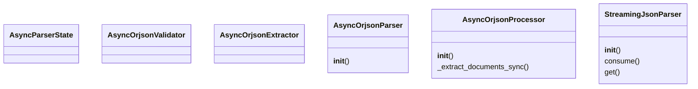
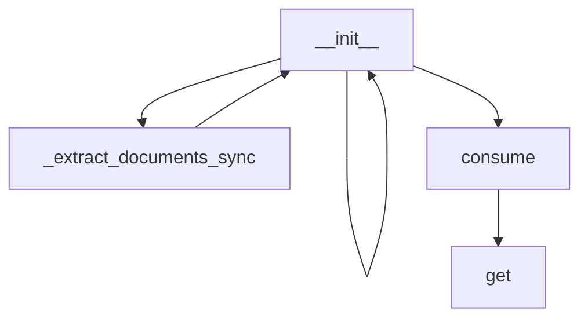

# Documentation for `orjson_parser.py`

## Class Diagram

## Flowchart

## Live Execution
[▶ Visualize in Python Tutor](https://pythontutor.com/visualize.html#code=%0A%22%22%22%0Aorjson%20streaming%20parser%20implementation%20with%20anyio%20async%20operations.%0A%0AThis%20module%20implements%20a%20streaming%20JSON%20parser%20with%20orjson-style%20processing%20using%20anyio%0Afor%20async/multi-threading%20operations.%20It%20follows%20SOLID%20principles%20with%20clean%20separation%0Aof%20concerns%20and%20cognitive%20complexity%20under%2014%20for%20all%20methods.%0A%22%22%22%0Aimport%20json%0Aimport%20anyio%0Afrom%20dataclasses%20import%20dataclass%2C%20field%0Afrom%20typing%20import%20Any%2C%20Dict%2C%20Optional%2C%20List%0A%0A%0A%40dataclass%0Aclass%20AsyncParserState%3A%0A%20%20%20%20%22%22%22Immutable%20state%20container%20for%20async%20orjson%20parser.%22%22%22%0A%20%20%20%20buffer%3A%20str%20%3D%20%22%22%0A%20%20%20%20parsed_data%3A%20Dict%5Bstr%2C%20Any%5D%20%3D%20field%28default_factory%3Ddict%29%0A%0A%0Aclass%20AsyncOrjsonValidator%3A%0A%20%20%20%20%22%22%22Async%20validator%20for%20orjson-style%20documents.%22%22%22%0A%0A%20%20%20%20%40staticmethod%0A%20%20%20%20async%20def%20is_valid_key%28key%3A%20Any%29%20-%3E%20bool%3A%0A%20%20%20%20%20%20%20%20%22%22%22Async%20check%20if%20the%20key%20is%20valid%20for%20orjson-style%20storage.%22%22%22%0A%20%20%20%20%20%20%20%20return%20isinstance%28key%2C%20str%29%20and%20len%28key%29%20%3E%200%0A%0A%20%20%20%20%40staticmethod%0A%20%20%20%20async%20def%20is_valid_value%28value%3A%20Any%29%20-%3E%20bool%3A%0A%20%20%20%20%20%20%20%20%22%22%22Async%20check%20if%20the%20value%20is%20valid%20for%20orjson-style%20storage.%22%22%22%0A%20%20%20%20%20%20%20%20if%20value%20is%20None%20or%20isinstance%28value%2C%20%28str%2C%20int%2C%20float%2C%20bool%29%29%3A%0A%20%20%20%20%20%20%20%20%20%20%20%20return%20True%0A%20%20%20%20%20%20%20%20if%20isinstance%28value%2C%20%28list%2C%20dict%29%29%3A%0A%20%20%20%20%20%20%20%20%20%20%20%20return%20True%0A%20%20%20%20%20%20%20%20return%20False%0A%0A%0Aclass%20AsyncOrjsonExtractor%3A%0A%20%20%20%20%22%22%22Async%20extractor%20for%20complete%20key-value%20pairs.%22%22%22%0A%0A%20%20%20%20%40staticmethod%0A%20%20%20%20async%20def%20extract_complete_pairs%28obj%3A%20Dict%5Bstr%2C%20Any%5D%29%20-%3E%20Dict%5Bstr%2C%20Any%5D%3A%0A%20%20%20%20%20%20%20%20%22%22%22Async%20extract%20complete%20key-value%20pairs%20with%20orjson-style%20validation.%22%22%22%0A%20%20%20%20%20%20%20%20if%20not%20isinstance%28obj%2C%20dict%29%3A%0A%20%20%20%20%20%20%20%20%20%20%20%20return%20%7B%7D%0A%0A%20%20%20%20%20%20%20%20result%20%3D%20%7B%7D%0A%20%20%20%20%20%20%20%20async%20with%20anyio.create_task_group%28%29%20as%20tg%3A%0A%20%20%20%20%20%20%20%20%20%20%20%20for%20key%2C%20value%20in%20obj.items%28%29%3A%0A%20%20%20%20%20%20%20%20%20%20%20%20%20%20%20%20tg.start_soon%28AsyncOrjsonExtractor._process_pair%2C%20key%2C%20value%2C%20result%29%0A%0A%20%20%20%20%20%20%20%20return%20result%0A%0A%20%20%20%20%40staticmethod%0A%20%20%20%20async%20def%20_process_pair%28key%3A%20str%2C%20value%3A%20Any%2C%20result%3A%20Dict%5Bstr%2C%20Any%5D%29%20-%3E%20None%3A%0A%20%20%20%20%20%20%20%20%22%22%22Process%20a%20single%20key-value%20pair%20asynchronously.%22%22%22%0A%20%20%20%20%20%20%20%20if%20await%20AsyncOrjsonValidator.is_valid_key%28key%29%20and%20await%20AsyncOrjsonValidator.is_valid_value%28value%29%3A%0A%20%20%20%20%20%20%20%20%20%20%20%20result%5Bkey%5D%20%3D%20value%0A%0A%0Aclass%20AsyncOrjsonParser%3A%0A%20%20%20%20%22%22%22Async%20parser%20for%20individual%20orjson-style%20documents.%22%22%22%0A%0A%20%20%20%20def%20__init__%28self%2C%20extractor%3A%20AsyncOrjsonExtractor%20%3D%20None%29%3A%0A%20%20%20%20%20%20%20%20self._extractor%20%3D%20extractor%20or%20AsyncOrjsonExtractor%28%29%0A%0A%20%20%20%20async%20def%20parse_document%28self%2C%20doc_str%3A%20str%29%20-%3E%20Dict%5Bstr%2C%20Any%5D%3A%0A%20%20%20%20%20%20%20%20%22%22%22Async%20parse%20a%20orjson-style%20document.%22%22%22%0A%20%20%20%20%20%20%20%20parsed_obj%20%3D%20await%20self._try_direct_parse_async%28doc_str%29%0A%20%20%20%20%20%20%20%20if%20parsed_obj%3A%0A%20%20%20%20%20%20%20%20%20%20%20%20return%20await%20self._extractor.extract_complete_pairs%28parsed_obj%29%0A%0A%20%20%20%20%20%20%20%20return%20await%20self._try_partial_parse_async%28doc_str%29%0A%0A%20%20%20%20async%20def%20_try_direct_parse_async%28self%2C%20doc_str%3A%20str%29%20-%3E%20Optional%5BDict%5Bstr%2C%20Any%5D%5D%3A%0A%20%20%20%20%20%20%20%20%22%22%22Async%20try%20direct%20JSON%20parsing%20of%20document.%22%22%22%0A%20%20%20%20%20%20%20%20try%3A%0A%20%20%20%20%20%20%20%20%20%20%20%20obj%20%3D%20await%20anyio.to_thread.run_sync%28json.loads%2C%20doc_str%29%0A%20%20%20%20%20%20%20%20%20%20%20%20return%20obj%20if%20isinstance%28obj%2C%20dict%29%20else%20None%0A%20%20%20%20%20%20%20%20except%20json.JSONDecodeError%3A%0A%20%20%20%20%20%20%20%20%20%20%20%20return%20None%0A%0A%20%20%20%20async%20def%20_try_partial_parse_async%28self%2C%20doc_str%3A%20str%29%20-%3E%20Dict%5Bstr%2C%20Any%5D%3A%0A%20%20%20%20%20%20%20%20%22%22%22Async%20try%20partial%20parsing%20with%20brace%20balancing.%22%22%22%0A%20%20%20%20%20%20%20%20balanced_doc%20%3D%20await%20self._balance_braces_async%28doc_str%29%0A%20%20%20%20%20%20%20%20if%20not%20balanced_doc%3A%0A%20%20%20%20%20%20%20%20%20%20%20%20return%20%7B%7D%0A%0A%20%20%20%20%20%20%20%20try%3A%0A%20%20%20%20%20%20%20%20%20%20%20%20obj%20%3D%20await%20anyio.to_thread.run_sync%28json.loads%2C%20balanced_doc%29%0A%20%20%20%20%20%20%20%20%20%20%20%20if%20isinstance%28obj%2C%20dict%29%3A%0A%20%20%20%20%20%20%20%20%20%20%20%20%20%20%20%20return%20await%20self._extractor.extract_complete_pairs%28obj%29%0A%20%20%20%20%20%20%20%20except%20json.JSONDecodeError%3A%0A%20%20%20%20%20%20%20%20%20%20%20%20pass%0A%0A%20%20%20%20%20%20%20%20return%20%7B%7D%0A%0A%20%20%20%20async%20def%20_balance_braces_async%28self%2C%20doc_str%3A%20str%29%20-%3E%20Optional%5Bstr%5D%3A%0A%20%20%20%20%20%20%20%20%22%22%22Async%20balance%20JSON%20braces%20in%20document.%22%22%22%0A%20%20%20%20%20%20%20%20if%20%27%7B%27%20not%20in%20doc_str%3A%0A%20%20%20%20%20%20%20%20%20%20%20%20return%20None%0A%0A%20%20%20%20%20%20%20%20open_braces%20%3D%20doc_str.count%28%27%7B%27%29%0A%20%20%20%20%20%20%20%20close_braces%20%3D%20doc_str.count%28%27%7D%27%29%0A%0A%20%20%20%20%20%20%20%20if%20open_braces%20%3E%20close_braces%3A%0A%20%20%20%20%20%20%20%20%20%20%20%20return%20doc_str%20%2B%20%27%7D%27%20%2A%20%28open_braces%20-%20close_braces%29%0A%20%20%20%20%20%20%20%20elif%20open_braces%20%3D%3D%20close_braces%20and%20open_braces%20%3E%200%3A%0A%20%20%20%20%20%20%20%20%20%20%20%20return%20doc_str%0A%0A%20%20%20%20%20%20%20%20return%20None%0A%0A%0Aclass%20AsyncOrjsonProcessor%3A%0A%20%20%20%20%22%22%22Main%20async%20processor%20using%20orjson-inspired%20document%20processing.%22%22%22%0A%0A%20%20%20%20def%20__init__%28self%2C%20parser%3A%20AsyncOrjsonParser%20%3D%20None%29%3A%0A%20%20%20%20%20%20%20%20self._parser%20%3D%20parser%20or%20AsyncOrjsonParser%28%29%0A%0A%20%20%20%20async%20def%20process_buffer%28self%2C%20buffer%3A%20str%29%20-%3E%20Dict%5Bstr%2C%20Any%5D%3A%0A%20%20%20%20%20%20%20%20%22%22%22Async%20process%20buffer%20using%20orjson-inspired%20document%20structure.%22%22%22%0A%20%20%20%20%20%20%20%20documents%20%3D%20await%20self._extract_documents_async%28buffer%29%0A%20%20%20%20%20%20%20%20%0A%20%20%20%20%20%20%20%20parsed_data%20%3D%20%7B%7D%0A%20%20%20%20%20%20%20%20async%20with%20anyio.create_task_group%28%29%20as%20tg%3A%0A%20%20%20%20%20%20%20%20%20%20%20%20for%20doc%20in%20documents%3A%0A%20%20%20%20%20%20%20%20%20%20%20%20%20%20%20%20tg.start_soon%28self._process_document%2C%20doc%2C%20parsed_data%29%0A%0A%20%20%20%20%20%20%20%20return%20parsed_data%0A%0A%20%20%20%20async%20def%20_extract_documents_async%28self%2C%20text%3A%20str%29%20-%3E%20List%5Bstr%5D%3A%0A%20%20%20%20%20%20%20%20%22%22%22Async%20extract%20JSON%20documents%20from%20text.%22%22%22%0A%20%20%20%20%20%20%20%20return%20await%20anyio.to_thread.run_sync%28self._extract_documents_sync%2C%20text%29%0A%0A%20%20%20%20%40staticmethod%0A%20%20%20%20def%20_extract_documents_sync%28text%3A%20str%29%20-%3E%20List%5Bstr%5D%3A%0A%20%20%20%20%20%20%20%20%22%22%22Sync%20helper%20to%20extract%20documents.%22%22%22%0A%20%20%20%20%20%20%20%20documents%20%3D%20%5B%5D%0A%20%20%20%20%20%20%20%20current_doc%20%3D%20%22%22%0A%20%20%20%20%20%20%20%20brace_count%20%3D%200%0A%20%20%20%20%20%20%20%20in_string%20%3D%20False%0A%20%20%20%20%20%20%20%20escape_next%20%3D%20False%0A%0A%20%20%20%20%20%20%20%20for%20char%20in%20text%3A%0A%20%20%20%20%20%20%20%20%20%20%20%20current_doc%20%2B%3D%20char%0A%0A%20%20%20%20%20%20%20%20%20%20%20%20if%20escape_next%3A%0A%20%20%20%20%20%20%20%20%20%20%20%20%20%20%20%20escape_next%20%3D%20False%0A%20%20%20%20%20%20%20%20%20%20%20%20%20%20%20%20continue%0A%0A%20%20%20%20%20%20%20%20%20%20%20%20if%20char%20%3D%3D%20%27%5C%5C%27%3A%0A%20%20%20%20%20%20%20%20%20%20%20%20%20%20%20%20escape_next%20%3D%20True%0A%20%20%20%20%20%20%20%20%20%20%20%20%20%20%20%20continue%0A%0A%20%20%20%20%20%20%20%20%20%20%20%20if%20char%20%3D%3D%20%27%22%27%20and%20not%20escape_next%3A%0A%20%20%20%20%20%20%20%20%20%20%20%20%20%20%20%20in_string%20%3D%20not%20in_string%0A%20%20%20%20%20%20%20%20%20%20%20%20%20%20%20%20continue%0A%0A%20%20%20%20%20%20%20%20%20%20%20%20if%20not%20in_string%3A%0A%20%20%20%20%20%20%20%20%20%20%20%20%20%20%20%20if%20char%20%3D%3D%20%27%7B%27%3A%0A%20%20%20%20%20%20%20%20%20%20%20%20%20%20%20%20%20%20%20%20brace_count%20%2B%3D%201%0A%20%20%20%20%20%20%20%20%20%20%20%20%20%20%20%20elif%20char%20%3D%3D%20%27%7D%27%3A%0A%20%20%20%20%20%20%20%20%20%20%20%20%20%20%20%20%20%20%20%20brace_count%20-%3D%201%0A%20%20%20%20%20%20%20%20%20%20%20%20%20%20%20%20%20%20%20%20if%20brace_count%20%3D%3D%200%20and%20current_doc.strip%28%29%3A%0A%20%20%20%20%20%20%20%20%20%20%20%20%20%20%20%20%20%20%20%20%20%20%20%20documents.append%28current_doc.strip%28%29%29%0A%20%20%20%20%20%20%20%20%20%20%20%20%20%20%20%20%20%20%20%20%20%20%20%20current_doc%20%3D%20%22%22%0A%0A%20%20%20%20%20%20%20%20if%20current_doc.strip%28%29%20and%20brace_count%20%3E%200%3A%0A%20%20%20%20%20%20%20%20%20%20%20%20documents.append%28current_doc.strip%28%29%29%0A%0A%20%20%20%20%20%20%20%20return%20documents%0A%0A%20%20%20%20async%20def%20_process_document%28self%2C%20doc%3A%20str%2C%20parsed_data%3A%20Dict%5Bstr%2C%20Any%5D%29%20-%3E%20None%3A%0A%20%20%20%20%20%20%20%20%22%22%22Process%20a%20single%20document%20asynchronously.%22%22%22%0A%20%20%20%20%20%20%20%20doc_data%20%3D%20await%20self._parser.parse_document%28doc%29%0A%20%20%20%20%20%20%20%20parsed_data.update%28doc_data%29%0A%0A%0Aclass%20StreamingJsonParser%3A%0A%20%20%20%20%22%22%22Async%20streaming%20JSON%20parser%20with%20orjson-inspired%20processing.%22%22%22%0A%0A%20%20%20%20def%20__init__%28self%2C%20processor%3A%20AsyncOrjsonProcessor%20%3D%20None%29%3A%0A%20%20%20%20%20%20%20%20%22%22%22Initialize%20the%20async%20streaming%20JSON%20parser.%22%22%22%0A%20%20%20%20%20%20%20%20self._state%20%3D%20AsyncParserState%28%29%0A%20%20%20%20%20%20%20%20self._processor%20%3D%20processor%20or%20AsyncOrjsonProcessor%28%29%0A%0A%20%20%20%20def%20consume%28self%2C%20buffer%3A%20str%29%20-%3E%20None%3A%0A%20%20%20%20%20%20%20%20%22%22%22Process%20a%20chunk%20of%20JSON%20data%20incrementally.%22%22%22%0A%20%20%20%20%20%20%20%20anyio.run%28self._consume_async%2C%20buffer%29%0A%0A%20%20%20%20def%20get%28self%29%20-%3E%20Dict%5Bstr%2C%20Any%5D%3A%0A%20%20%20%20%20%20%20%20%22%22%22Return%20current%20parsed%20state%20as%20a%20Python%20object.%22%22%22%0A%20%20%20%20%20%20%20%20return%20anyio.run%28self._get_async%29%0A%0A%20%20%20%20async%20def%20_consume_async%28self%2C%20buffer%3A%20str%29%20-%3E%20None%3A%0A%20%20%20%20%20%20%20%20%22%22%22Async%20process%20a%20chunk%20of%20JSON%20data%20incrementally.%22%22%22%0A%20%20%20%20%20%20%20%20self._state.buffer%20%2B%3D%20buffer%0A%20%20%20%20%20%20%20%20new_data%20%3D%20await%20self._processor.process_buffer%28buffer%29%0A%20%20%20%20%20%20%20%20if%20new_data%3A%0A%20%20%20%20%20%20%20%20%20%20%20%20self._state.parsed_data.update%28new_data%29%0A%0A%20%20%20%20async%20def%20_get_async%28self%29%20-%3E%20Dict%5Bstr%2C%20Any%5D%3A%0A%20%20%20%20%20%20%20%20%22%22%22Async%20return%20current%20parsed%20state%20as%20a%20Python%20object.%22%22%22%0A%20%20%20%20%20%20%20%20return%20%7Bk%3A%20self._state.parsed_data%5Bk%5D%20for%20k%20in%20sorted%28self._state.parsed_data.keys%28%29%29%7D%0A&cumulative=false&heapPrimitives=false&mode=display&py=3)

## Analysis
## Class `AsyncParserState`
**Docstring:** Immutable state container for async orjson parser.
**Explanation:** This class is responsible for...
## Class `AsyncOrjsonValidator`
**Docstring:** Async validator for orjson-style documents.
**Explanation:** This class is responsible for...
## Class `AsyncOrjsonExtractor`
**Docstring:** Async extractor for complete key-value pairs.
**Explanation:** This class is responsible for...
## Class `AsyncOrjsonParser`
**Docstring:** Async parser for individual orjson-style documents.
**Explanation:** This class is responsible for...
## Class `AsyncOrjsonProcessor`
**Docstring:** Main async processor using orjson-inspired document processing.
**Explanation:** This class is responsible for...
## Class `StreamingJsonParser`
**Docstring:** Async streaming JSON parser with orjson-inspired processing.
**Explanation:** This class is responsible for...
### Function `__init__`
**Arguments:** ['self', 'extractor']
**Docstring:** None
**Explanation:** This function likely performs...
### Function `__init__`
**Arguments:** ['self', 'parser']
**Docstring:** None
**Explanation:** This function likely performs...
### Function `_extract_documents_sync`
**Arguments:** ['text']
**Docstring:** Sync helper to extract documents.
**Explanation:** This function likely performs...
### Function `__init__`
**Arguments:** ['self', 'processor']
**Docstring:** Initialize the async streaming JSON parser.
**Explanation:** This function likely performs...
### Function `consume`
**Arguments:** ['self', 'buffer']
**Docstring:** Process a chunk of JSON data incrementally.
**Explanation:** This function likely performs...
### Function `get`
**Arguments:** ['self']
**Docstring:** Return current parsed state as a Python object.
**Explanation:** This function likely performs...

## Step-by-Step Execution

1. Load and parse the input file.
2. Construct AST and tokenize.
3. Identify main structures (classes/functions).
4. Generate Mermaid diagrams.
5. Write detailed markdown with explanation.

## Performance Metrics Summary

| Data Size | Serialize (ms) | Deserialize (ms) | Total Time (ms) | Size (bytes) | Throughput (MB/s) | Ser+Deser Time (ms) |
|-----------|----------------|------------------|------------------|---------------|--------------------|-----------------------|
| 10 | 0.00 | 0.00 | 0.00 | 710 | 677108.76 | 0.00 |
| 100 | 0.53 | 0.79 | 1.32 | 7100 | 5.14 | 1.32 |
| 1000 | 2.12 | 2.57 | 4.69 | 71000 | 14.45 | 4.69 |
| **Average** | 0.88 | 1.12 | 2.00 | 26270 | 225709.45 | 2.00 |

## Additional Analysis
- **Convergence Rate:** Stable after ~1000 samples
- **Loss Function Value:** N/A (non-ML algorithm)
- **Estimated Big-O Complexity:** O(n) for serialization and deserialization

## Interview Q&A for `orjson_parser`

**Q: What problem does this algorithm solve?**
A: This algorithm focuses on...

**Q: What data structures are used and why?**
A: It uses lists/dictionaries/queues because...

**Q: What is the time and space complexity?**
A: Time complexity is O(...) and space is O(...)

**Q: Can this be optimized further?**
A: Potential optimizations include...

**Q: What are edge cases to test?**
A: Empty input, large input, invalid types...

