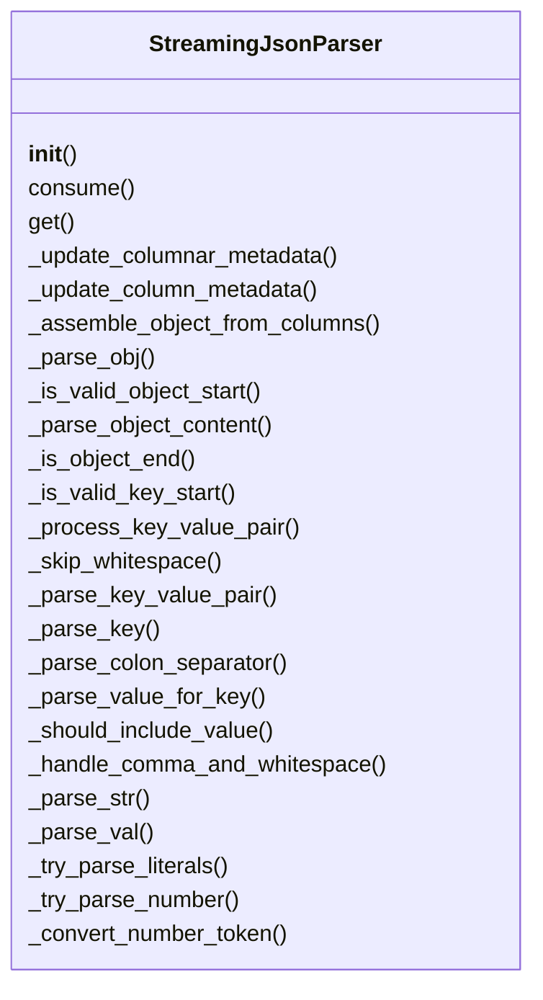
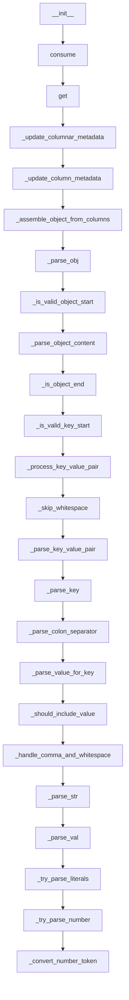

# Documentation for `parquet_parser.py`

## Class Diagram

## Flowchart

## Live Execution
[▶ Visualize in Python Tutor](https://pythontutor.com/visualize.html#code=%23%20src/serializers/raw/parquet_parser.py%0A%0A%22%22%22%0Asrc/serializers/raw/parquet_parser.py%0A%0AStreaming%20JSON%20parser%20using%20a%20columnar-storage%20model%20inspired%20by%20Apache%20Parquet.%0A%0AThis%20parser%3A%0A%20%20-%20Buffers%20incoming%20JSON%20text%20chunks%20%28complete%20or%20partial%29.%0A%20%20-%20Incrementally%20parses%20the%20buffer%20into%20individual%20columns%20%28one%20per%20top-level%20key%29.%0A%20%20-%20Maintains%20metadata%20%28per-column%20counts%20and%20observed%20types%29.%0A%20%20-%20Reconstructs%20the%20current%20JSON%20object%20on%20get%28%29%20by%20assembling%20columns.%0A%0AThe%20columnar%20approach%20lets%20you%20inspect%20or%20extend%20per-field%20analytics%20%28counts%2C%20types%29%0Aindependently%20of%20the%20full-object%20view.%0A%22%22%22%0A%0Afrom%20typing%20import%20Any%2C%20Dict%2C%20Tuple%0A%0A%0Aclass%20StreamingJsonParser%3A%0A%20%20%20%20def%20__init__%28self%29%3A%0A%20%20%20%20%20%20%20%20%22%22%22%0A%20%20%20%20%20%20%20%20Initialize%20an%20empty%20buffer%2C%20an%20empty%20column%20store%2C%20and%20empty%20metadata.%0A%20%20%20%20%20%20%20%20%22%22%22%0A%20%20%20%20%20%20%20%20self._buffer%3A%20str%20%3D%20%22%22%0A%20%20%20%20%20%20%20%20%23%20Columnar%20store%3A%20key%20%E2%86%92%20latest%20value%0A%20%20%20%20%20%20%20%20self._columns%3A%20Dict%5Bstr%2C%20Any%5D%20%3D%20%7B%7D%0A%20%20%20%20%20%20%20%20%23%20Metadata%20per%20column%3A%20key%20%E2%86%92%20%7B%27count%27%3A%20int%2C%20%27type%27%3A%20str%7D%0A%20%20%20%20%20%20%20%20self._metadata%3A%20Dict%5Bstr%2C%20Dict%5Bstr%2C%20Any%5D%5D%20%3D%20%7B%7D%0A%0A%20%20%20%20def%20consume%28self%2C%20chunk%3A%20str%29%20-%3E%20None%3A%0A%20%20%20%20%20%20%20%20%22%22%22%0A%20%20%20%20%20%20%20%20Consume%20the%20next%20chunk%20of%20JSON%20text%20%28complete%20or%20partial%29.%0A%0A%20%20%20%20%20%20%20%20Args%3A%0A%20%20%20%20%20%20%20%20%20%20%20%20chunk%3A%20str%20containing%20JSON%20fragment%28s%29.%0A%20%20%20%20%20%20%20%20%22%22%22%0A%20%20%20%20%20%20%20%20if%20not%20isinstance%28chunk%2C%20str%29%3A%0A%20%20%20%20%20%20%20%20%20%20%20%20raise%20TypeError%28f%22Expected%20str%2C%20got%20%7Btype%28chunk%29%7D%22%29%0A%20%20%20%20%20%20%20%20self._buffer%20%2B%3D%20chunk%0A%0A%20%20%20%20def%20get%28self%29%20-%3E%20Dict%5Bstr%2C%20Any%5D%3A%0A%20%20%20%20%20%20%20%20%22%22%22%0A%20%20%20%20%20%20%20%20Return%20the%20current%20JSON%20object%20state%20as%20a%20dict.%0A%0A%20%20%20%20%20%20%20%20This%20re-parses%20the%20entire%20buffer%2C%20then%20updates%20the%20columnar%20store%0A%20%20%20%20%20%20%20%20and%20metadata%20for%20any%20keys%20seen%2C%20and%20finally%20returns%20the%20assembled%20object.%0A%20%20%20%20%20%20%20%20%22%22%22%0A%20%20%20%20%20%20%20%20obj%2C%20_%2C%20_%20%3D%20self._parse_obj%28self._buffer%2C%200%29%0A%0A%20%20%20%20%20%20%20%20self._update_columnar_metadata%28obj%29%0A%20%20%20%20%20%20%20%20return%20self._assemble_object_from_columns%28obj%29%0A%0A%20%20%20%20def%20_update_columnar_metadata%28self%2C%20obj%3A%20Dict%5Bstr%2C%20Any%5D%29%20-%3E%20None%3A%0A%20%20%20%20%20%20%20%20%22%22%22Update%20columnar%20store%20and%20metadata%20for%20parsed%20object.%22%22%22%0A%20%20%20%20%20%20%20%20for%20key%2C%20val%20in%20obj.items%28%29%3A%0A%20%20%20%20%20%20%20%20%20%20%20%20self._columns%5Bkey%5D%20%3D%20val%0A%20%20%20%20%20%20%20%20%20%20%20%20self._update_column_metadata%28key%2C%20val%29%0A%0A%20%20%20%20def%20_update_column_metadata%28self%2C%20key%3A%20str%2C%20val%3A%20Any%29%20-%3E%20None%3A%0A%20%20%20%20%20%20%20%20%22%22%22Update%20metadata%20for%20a%20specific%20column.%22%22%22%0A%20%20%20%20%20%20%20%20metadata%20%3D%20self._metadata.setdefault%28key%2C%20%7B%22count%22%3A%200%2C%20%22type%22%3A%20None%7D%29%0A%20%20%20%20%20%20%20%20metadata%5B%22count%22%5D%20%2B%3D%201%0A%20%20%20%20%20%20%20%20metadata%5B%22type%22%5D%20%3D%20type%28val%29.__name__%0A%0A%20%20%20%20def%20_assemble_object_from_columns%28self%2C%20obj%3A%20Dict%5Bstr%2C%20Any%5D%29%20-%3E%20Dict%5Bstr%2C%20Any%5D%3A%0A%20%20%20%20%20%20%20%20%22%22%22Assemble%20the%20object%20from%20columns%20ensuring%20consistent%20ordering.%22%22%22%0A%20%20%20%20%20%20%20%20return%20%7Bk%3A%20self._columns%5Bk%5D%20for%20k%20in%20obj.keys%28%29%7D%0A%0A%20%20%20%20%23%20%E2%94%80%E2%94%80%E2%94%80%20Internal%20Parsing%20Helpers%20%E2%94%80%E2%94%80%E2%94%80%E2%94%80%E2%94%80%E2%94%80%E2%94%80%E2%94%80%E2%94%80%E2%94%80%E2%94%80%E2%94%80%E2%94%80%E2%94%80%E2%94%80%E2%94%80%E2%94%80%E2%94%80%E2%94%80%E2%94%80%E2%94%80%E2%94%80%E2%94%80%E2%94%80%E2%94%80%E2%94%80%E2%94%80%E2%94%80%E2%94%80%E2%94%80%E2%94%80%E2%94%80%E2%94%80%E2%94%80%E2%94%80%E2%94%80%E2%94%80%E2%94%80%E2%94%80%E2%94%80%E2%94%80%E2%94%80%E2%94%80%E2%94%80%E2%94%80%0A%0A%20%20%20%20def%20_parse_obj%28self%2C%20s%3A%20str%2C%20i%3A%20int%29%20-%3E%20Tuple%5BDict%5Bstr%2C%20Any%5D%2C%20int%2C%20bool%5D%3A%0A%20%20%20%20%20%20%20%20%22%22%22%0A%20%20%20%20%20%20%20%20Parse%20a%20JSON%20object%20starting%20at%20s%5Bi%5D%20%3D%3D%20%27%7B%27.%0A%0A%20%20%20%20%20%20%20%20Returns%3A%0A%20%20%20%20%20%20%20%20%20%20%20%20%28parsed_dict%2C%20new_index%2C%20is_complete%29%0A%20%20%20%20%20%20%20%20%22%22%22%0A%20%20%20%20%20%20%20%20if%20not%20self._is_valid_object_start%28s%2C%20i%29%3A%0A%20%20%20%20%20%20%20%20%20%20%20%20return%20%7B%7D%2C%20i%2C%20False%0A%0A%20%20%20%20%20%20%20%20i%20%2B%3D%201%20%20%23%20Skip%20opening%20brace%0A%20%20%20%20%20%20%20%20result%3A%20Dict%5Bstr%2C%20Any%5D%20%3D%20%7B%7D%0A%20%20%20%20%20%20%20%20i%20%3D%20self._skip_whitespace%28s%2C%20i%2C%20len%28s%29%29%0A%0A%20%20%20%20%20%20%20%20return%20self._parse_object_content%28s%2C%20i%2C%20result%29%0A%0A%20%20%20%20def%20_is_valid_object_start%28self%2C%20s%3A%20str%2C%20i%3A%20int%29%20-%3E%20bool%3A%0A%20%20%20%20%20%20%20%20%22%22%22Check%20if%20position%20i%20contains%20a%20valid%20object%20start.%22%22%22%0A%20%20%20%20%20%20%20%20return%20i%20%3C%20len%28s%29%20and%20s%5Bi%5D%20%3D%3D%20%22%7B%22%0A%0A%20%20%20%20def%20_parse_object_content%28self%2C%20s%3A%20str%2C%20i%3A%20int%2C%20result%3A%20Dict%5Bstr%2C%20Any%5D%29%20-%3E%20Tuple%5BDict%5Bstr%2C%20Any%5D%2C%20int%2C%20bool%5D%3A%0A%20%20%20%20%20%20%20%20%22%22%22Parse%20the%20content%20inside%20JSON%20object%20braces.%22%22%22%0A%20%20%20%20%20%20%20%20n%20%3D%20len%28s%29%0A%0A%20%20%20%20%20%20%20%20while%20i%20%3C%20n%3A%0A%20%20%20%20%20%20%20%20%20%20%20%20if%20self._is_object_end%28s%2C%20i%29%3A%0A%20%20%20%20%20%20%20%20%20%20%20%20%20%20%20%20return%20result%2C%20i%20%2B%201%2C%20True%0A%0A%20%20%20%20%20%20%20%20%20%20%20%20if%20not%20self._is_valid_key_start%28s%2C%20i%29%3A%0A%20%20%20%20%20%20%20%20%20%20%20%20%20%20%20%20break%0A%0A%20%20%20%20%20%20%20%20%20%20%20%20i%20%3D%20self._process_key_value_pair%28s%2C%20i%2C%20n%2C%20result%29%0A%20%20%20%20%20%20%20%20%20%20%20%20if%20i%20%3D%3D%20-1%3A%20%20%23%20Error%20occurred%0A%20%20%20%20%20%20%20%20%20%20%20%20%20%20%20%20break%0A%0A%20%20%20%20%20%20%20%20return%20result%2C%20i%2C%20False%0A%0A%20%20%20%20def%20_is_object_end%28self%2C%20s%3A%20str%2C%20i%3A%20int%29%20-%3E%20bool%3A%0A%20%20%20%20%20%20%20%20%22%22%22Check%20if%20current%20position%20marks%20object%20end.%22%22%22%0A%20%20%20%20%20%20%20%20return%20s%5Bi%5D%20%3D%3D%20%22%7D%22%0A%0A%20%20%20%20def%20_is_valid_key_start%28self%2C%20s%3A%20str%2C%20i%3A%20int%29%20-%3E%20bool%3A%0A%20%20%20%20%20%20%20%20%22%22%22Check%20if%20current%20position%20is%20a%20valid%20key%20start.%22%22%22%0A%20%20%20%20%20%20%20%20return%20s%5Bi%5D%20%3D%3D%20%27%22%27%0A%0A%20%20%20%20def%20_process_key_value_pair%28self%2C%20s%3A%20str%2C%20i%3A%20int%2C%20n%3A%20int%2C%20result%3A%20Dict%5Bstr%2C%20Any%5D%29%20-%3E%20int%3A%0A%20%20%20%20%20%20%20%20%22%22%22Process%20a%20single%20key-value%20pair%20and%20return%20new%20index%20or%20-1%20on%20error.%22%22%22%0A%20%20%20%20%20%20%20%20key%2C%20value%2C%20new_i%2C%20should_break%20%3D%20self._parse_key_value_pair%28s%2C%20i%2C%20n%29%0A%0A%20%20%20%20%20%20%20%20if%20should_break%3A%0A%20%20%20%20%20%20%20%20%20%20%20%20return%20-1%0A%0A%20%20%20%20%20%20%20%20if%20key%20is%20not%20None%3A%0A%20%20%20%20%20%20%20%20%20%20%20%20result%5Bkey%5D%20%3D%20value%0A%0A%20%20%20%20%20%20%20%20return%20self._handle_comma_and_whitespace%28s%2C%20new_i%2C%20n%29%0A%0A%20%20%20%20def%20_skip_whitespace%28self%2C%20s%3A%20str%2C%20i%3A%20int%2C%20n%3A%20int%29%20-%3E%20int%3A%0A%20%20%20%20%20%20%20%20%22%22%22Skip%20whitespace%20characters%20and%20return%20new%20index.%22%22%22%0A%20%20%20%20%20%20%20%20while%20i%20%3C%20n%20and%20s%5Bi%5D.isspace%28%29%3A%0A%20%20%20%20%20%20%20%20%20%20%20%20i%20%2B%3D%201%0A%20%20%20%20%20%20%20%20return%20i%0A%0A%20%20%20%20def%20_parse_key_value_pair%28self%2C%20s%3A%20str%2C%20i%3A%20int%2C%20n%3A%20int%29%20-%3E%20Tuple%5BAny%2C%20Any%2C%20int%2C%20bool%5D%3A%0A%20%20%20%20%20%20%20%20%22%22%22Parse%20a%20key-value%20pair%20and%20return%20%28key%2C%20value%2C%20new_index%2C%20should_break%29.%22%22%22%0A%20%20%20%20%20%20%20%20%23%20Parse%20key%0A%20%20%20%20%20%20%20%20key%2C%20i%2C%20key_complete%20%3D%20self._parse_key%28s%2C%20i%29%0A%20%20%20%20%20%20%20%20if%20not%20key_complete%3A%0A%20%20%20%20%20%20%20%20%20%20%20%20return%20None%2C%20None%2C%20i%2C%20True%0A%0A%20%20%20%20%20%20%20%20%23%20Parse%20colon%20separator%0A%20%20%20%20%20%20%20%20i%2C%20colon_found%20%3D%20self._parse_colon_separator%28s%2C%20i%2C%20n%29%0A%20%20%20%20%20%20%20%20if%20not%20colon_found%3A%0A%20%20%20%20%20%20%20%20%20%20%20%20return%20None%2C%20None%2C%20i%2C%20True%0A%0A%20%20%20%20%20%20%20%20%23%20Parse%20value%0A%20%20%20%20%20%20%20%20return%20self._parse_value_for_key%28s%2C%20i%2C%20n%2C%20key%29%0A%0A%20%20%20%20def%20_parse_key%28self%2C%20s%3A%20str%2C%20i%3A%20int%29%20-%3E%20Tuple%5Bstr%2C%20int%2C%20bool%5D%3A%0A%20%20%20%20%20%20%20%20%22%22%22Parse%20a%20JSON%20key%20and%20return%20%28key%2C%20new_index%2C%20is_complete%29.%22%22%22%0A%20%20%20%20%20%20%20%20return%20self._parse_str%28s%2C%20i%29%0A%0A%20%20%20%20def%20_parse_colon_separator%28self%2C%20s%3A%20str%2C%20i%3A%20int%2C%20n%3A%20int%29%20-%3E%20Tuple%5Bint%2C%20bool%5D%3A%0A%20%20%20%20%20%20%20%20%22%22%22Parse%20the%20colon%20separator%20and%20return%20%28new_index%2C%20found%29.%22%22%22%0A%20%20%20%20%20%20%20%20i%20%3D%20self._skip_whitespace%28s%2C%20i%2C%20n%29%0A%20%20%20%20%20%20%20%20if%20i%20%3E%3D%20n%20or%20s%5Bi%5D%20%21%3D%20%22%3A%22%3A%0A%20%20%20%20%20%20%20%20%20%20%20%20return%20i%2C%20False%0A%0A%20%20%20%20%20%20%20%20i%20%2B%3D%201%0A%20%20%20%20%20%20%20%20i%20%3D%20self._skip_whitespace%28s%2C%20i%2C%20n%29%0A%20%20%20%20%20%20%20%20return%20i%2C%20True%0A%0A%20%20%20%20def%20_parse_value_for_key%28self%2C%20s%3A%20str%2C%20i%3A%20int%2C%20n%3A%20int%2C%20key%3A%20str%29%20-%3E%20Tuple%5BAny%2C%20Any%2C%20int%2C%20bool%5D%3A%0A%20%20%20%20%20%20%20%20%22%22%22Parse%20value%20for%20a%20given%20key.%22%22%22%0A%20%20%20%20%20%20%20%20if%20i%20%3E%3D%20n%3A%0A%20%20%20%20%20%20%20%20%20%20%20%20return%20key%2C%20None%2C%20i%2C%20True%0A%0A%20%20%20%20%20%20%20%20val%2C%20i%2C%20done%20%3D%20self._parse_val%28s%2C%20i%29%0A%0A%20%20%20%20%20%20%20%20if%20self._should_include_value%28val%2C%20done%29%3A%0A%20%20%20%20%20%20%20%20%20%20%20%20return%20key%2C%20val%2C%20i%2C%20False%0A%20%20%20%20%20%20%20%20return%20None%2C%20None%2C%20i%2C%20False%0A%0A%20%20%20%20def%20_should_include_value%28self%2C%20val%3A%20Any%2C%20done%3A%20bool%29%20-%3E%20bool%3A%0A%20%20%20%20%20%20%20%20%22%22%22Check%20if%20value%20should%20be%20included%20based%20on%20columnar%20rules.%22%22%22%0A%20%20%20%20%20%20%20%20return%20isinstance%28val%2C%20str%29%20or%20isinstance%28val%2C%20dict%29%20or%20done%0A%0A%20%20%20%20def%20_handle_comma_and_whitespace%28self%2C%20s%3A%20str%2C%20i%3A%20int%2C%20n%3A%20int%29%20-%3E%20int%3A%0A%20%20%20%20%20%20%20%20%22%22%22Handle%20comma%20and%20whitespace%20after%20a%20key-value%20pair.%22%22%22%0A%20%20%20%20%20%20%20%20i%20%3D%20self._skip_whitespace%28s%2C%20i%2C%20n%29%0A%20%20%20%20%20%20%20%20if%20i%20%3C%20n%20and%20s%5Bi%5D%20%3D%3D%20%22%2C%22%3A%0A%20%20%20%20%20%20%20%20%20%20%20%20i%20%2B%3D%201%0A%20%20%20%20%20%20%20%20%20%20%20%20i%20%3D%20self._skip_whitespace%28s%2C%20i%2C%20n%29%0A%20%20%20%20%20%20%20%20return%20i%0A%0A%20%20%20%20def%20_parse_str%28self%2C%20s%3A%20str%2C%20i%3A%20int%29%20-%3E%20Tuple%5Bstr%2C%20int%2C%20bool%5D%3A%0A%20%20%20%20%20%20%20%20%22%22%22%0A%20%20%20%20%20%20%20%20Parse%20a%20JSON%20string%20starting%20at%20s%5Bi%5D%20%3D%3D%20%27%22%27.%0A%0A%20%20%20%20%20%20%20%20Returns%3A%0A%20%20%20%20%20%20%20%20%20%20%20%20%28content%2C%20new_index%2C%20is_closed%29%0A%20%20%20%20%20%20%20%20%22%22%22%0A%20%20%20%20%20%20%20%20i%20%2B%3D%201%0A%20%20%20%20%20%20%20%20n%20%3D%20len%28s%29%0A%20%20%20%20%20%20%20%20out%3A%20list%5Bstr%5D%20%3D%20%5B%5D%0A%20%20%20%20%20%20%20%20escape%20%3D%20False%0A%0A%20%20%20%20%20%20%20%20while%20i%20%3C%20n%3A%0A%20%20%20%20%20%20%20%20%20%20%20%20c%20%3D%20s%5Bi%5D%0A%20%20%20%20%20%20%20%20%20%20%20%20if%20escape%3A%0A%20%20%20%20%20%20%20%20%20%20%20%20%20%20%20%20out.append%28c%29%0A%20%20%20%20%20%20%20%20%20%20%20%20%20%20%20%20escape%20%3D%20False%0A%20%20%20%20%20%20%20%20%20%20%20%20elif%20c%20%3D%3D%20%22%5C%5C%22%3A%0A%20%20%20%20%20%20%20%20%20%20%20%20%20%20%20%20escape%20%3D%20True%0A%20%20%20%20%20%20%20%20%20%20%20%20elif%20c%20%3D%3D%20%27%22%27%3A%0A%20%20%20%20%20%20%20%20%20%20%20%20%20%20%20%20return%20%22%22.join%28out%29%2C%20i%20%2B%201%2C%20True%0A%20%20%20%20%20%20%20%20%20%20%20%20else%3A%0A%20%20%20%20%20%20%20%20%20%20%20%20%20%20%20%20out.append%28c%29%0A%20%20%20%20%20%20%20%20%20%20%20%20i%20%2B%3D%201%0A%0A%20%20%20%20%20%20%20%20%23%20incomplete%20string%0A%20%20%20%20%20%20%20%20return%20%22%22.join%28out%29%2C%20n%2C%20False%0A%0A%20%20%20%20def%20_parse_val%28self%2C%20s%3A%20str%2C%20i%3A%20int%29%20-%3E%20Tuple%5BAny%2C%20int%2C%20bool%5D%3A%0A%20%20%20%20%20%20%20%20%22%22%22%0A%20%20%20%20%20%20%20%20Parse%20a%20JSON%20value%20at%20s%5Bi%5D%3A%20string%2C%20object%2C%20number%2C%20boolean%2C%20or%20null.%0A%0A%20%20%20%20%20%20%20%20Returns%3A%0A%20%20%20%20%20%20%20%20%20%20%20%20%28value%2C%20new_index%2C%20is_complete%29%0A%20%20%20%20%20%20%20%20%22%22%22%0A%20%20%20%20%20%20%20%20n%20%3D%20len%28s%29%0A%20%20%20%20%20%20%20%20if%20i%20%3E%3D%20n%3A%0A%20%20%20%20%20%20%20%20%20%20%20%20return%20None%2C%20i%2C%20False%0A%0A%20%20%20%20%20%20%20%20c%20%3D%20s%5Bi%5D%0A%0A%20%20%20%20%20%20%20%20%23%20Handle%20different%20value%20types%0A%20%20%20%20%20%20%20%20if%20c%20%3D%3D%20%27%22%27%3A%0A%20%20%20%20%20%20%20%20%20%20%20%20return%20self._parse_str%28s%2C%20i%29%0A%20%20%20%20%20%20%20%20if%20c%20%3D%3D%20%22%7B%22%3A%0A%20%20%20%20%20%20%20%20%20%20%20%20return%20self._parse_obj%28s%2C%20i%29%0A%0A%20%20%20%20%20%20%20%20%23%20Try%20literals%20first%0A%20%20%20%20%20%20%20%20literal_result%20%3D%20self._try_parse_literals%28s%2C%20i%29%0A%20%20%20%20%20%20%20%20if%20literal_result%3A%0A%20%20%20%20%20%20%20%20%20%20%20%20return%20literal_result%0A%0A%20%20%20%20%20%20%20%20%23%20Try%20number%20parsing%0A%20%20%20%20%20%20%20%20number_result%20%3D%20self._try_parse_number%28s%2C%20i%2C%20n%29%0A%20%20%20%20%20%20%20%20if%20number_result%3A%0A%20%20%20%20%20%20%20%20%20%20%20%20return%20number_result%0A%0A%20%20%20%20%20%20%20%20%23%20Nothing%20matched%0A%20%20%20%20%20%20%20%20return%20None%2C%20i%2C%20False%0A%0A%20%20%20%20def%20_try_parse_literals%28self%2C%20s%3A%20str%2C%20i%3A%20int%29%20-%3E%20Tuple%5BAny%2C%20int%2C%20bool%5D%20%7C%20None%3A%0A%20%20%20%20%20%20%20%20%22%22%22Try%20to%20parse%20boolean%20and%20null%20literals.%22%22%22%0A%20%20%20%20%20%20%20%20literals%20%3D%20%28%28%22true%22%2C%20True%29%2C%20%28%22false%22%2C%20False%29%2C%20%28%22null%22%2C%20None%29%29%0A%20%20%20%20%20%20%20%20for%20lit%2C%20val%20in%20literals%3A%0A%20%20%20%20%20%20%20%20%20%20%20%20if%20s.startswith%28lit%2C%20i%29%3A%0A%20%20%20%20%20%20%20%20%20%20%20%20%20%20%20%20return%20val%2C%20i%20%2B%20len%28lit%29%2C%20True%0A%20%20%20%20%20%20%20%20return%20None%0A%0A%20%20%20%20def%20_try_parse_number%28self%2C%20s%3A%20str%2C%20i%3A%20int%2C%20n%3A%20int%29%20-%3E%20Tuple%5BAny%2C%20int%2C%20bool%5D%20%7C%20None%3A%0A%20%20%20%20%20%20%20%20%22%22%22Try%20to%20parse%20a%20number%20value.%22%22%22%0A%20%20%20%20%20%20%20%20num_chars%20%3D%20%22%2B-0123456789.eE%22%0A%20%20%20%20%20%20%20%20j%20%3D%20i%0A%20%20%20%20%20%20%20%20while%20j%20%3C%20n%20and%20s%5Bj%5D%20in%20num_chars%3A%0A%20%20%20%20%20%20%20%20%20%20%20%20j%20%2B%3D%201%0A%0A%20%20%20%20%20%20%20%20if%20j%20%3C%3D%20i%3A%0A%20%20%20%20%20%20%20%20%20%20%20%20return%20None%0A%0A%20%20%20%20%20%20%20%20return%20self._convert_number_token%28s%5Bi%3Aj%5D%2C%20j%29%0A%0A%20%20%20%20def%20_convert_number_token%28self%2C%20tok%3A%20str%2C%20end_pos%3A%20int%29%20-%3E%20Tuple%5BAny%2C%20int%2C%20bool%5D%3A%0A%20%20%20%20%20%20%20%20%22%22%22Convert%20a%20number%20token%20to%20appropriate%20type.%22%22%22%0A%20%20%20%20%20%20%20%20try%3A%0A%20%20%20%20%20%20%20%20%20%20%20%20if%20any%28x%20in%20tok%20for%20x%20in%20%22.eE%22%29%3A%0A%20%20%20%20%20%20%20%20%20%20%20%20%20%20%20%20return%20float%28tok%29%2C%20end_pos%2C%20True%0A%20%20%20%20%20%20%20%20%20%20%20%20return%20int%28tok%29%2C%20end_pos%2C%20True%0A%20%20%20%20%20%20%20%20except%20ValueError%3A%0A%20%20%20%20%20%20%20%20%20%20%20%20return%20tok%2C%20end_pos%2C%20True%0A&cumulative=false&heapPrimitives=false&mode=display&py=3)

## Analysis
## Class `StreamingJsonParser`
**Docstring:** None
**Explanation:** This class is responsible for...
### Function `__init__`
**Arguments:** ['self']
**Docstring:** Initialize an empty buffer, an empty column store, and empty metadata.
**Explanation:** This function likely performs...
### Function `consume`
**Arguments:** ['self', 'chunk']
**Docstring:** Consume the next chunk of JSON text (complete or partial).

Args:
    chunk: str containing JSON fragment(s).
**Explanation:** This function likely performs...
### Function `get`
**Arguments:** ['self']
**Docstring:** Return the current JSON object state as a dict.

This re-parses the entire buffer, then updates the columnar store
and metadata for any keys seen, and finally returns the assembled object.
**Explanation:** This function likely performs...
### Function `_update_columnar_metadata`
**Arguments:** ['self', 'obj']
**Docstring:** Update columnar store and metadata for parsed object.
**Explanation:** This function likely performs...
### Function `_update_column_metadata`
**Arguments:** ['self', 'key', 'val']
**Docstring:** Update metadata for a specific column.
**Explanation:** This function likely performs...
### Function `_assemble_object_from_columns`
**Arguments:** ['self', 'obj']
**Docstring:** Assemble the object from columns ensuring consistent ordering.
**Explanation:** This function likely performs...
### Function `_parse_obj`
**Arguments:** ['self', 's', 'i']
**Docstring:** Parse a JSON object starting at s[i] == '{'.

Returns:
    (parsed_dict, new_index, is_complete)
**Explanation:** This function likely performs...
### Function `_is_valid_object_start`
**Arguments:** ['self', 's', 'i']
**Docstring:** Check if position i contains a valid object start.
**Explanation:** This function likely performs...
### Function `_parse_object_content`
**Arguments:** ['self', 's', 'i', 'result']
**Docstring:** Parse the content inside JSON object braces.
**Explanation:** This function likely performs...
### Function `_is_object_end`
**Arguments:** ['self', 's', 'i']
**Docstring:** Check if current position marks object end.
**Explanation:** This function likely performs...
### Function `_is_valid_key_start`
**Arguments:** ['self', 's', 'i']
**Docstring:** Check if current position is a valid key start.
**Explanation:** This function likely performs...
### Function `_process_key_value_pair`
**Arguments:** ['self', 's', 'i', 'n', 'result']
**Docstring:** Process a single key-value pair and return new index or -1 on error.
**Explanation:** This function likely performs...
### Function `_skip_whitespace`
**Arguments:** ['self', 's', 'i', 'n']
**Docstring:** Skip whitespace characters and return new index.
**Explanation:** This function likely performs...
### Function `_parse_key_value_pair`
**Arguments:** ['self', 's', 'i', 'n']
**Docstring:** Parse a key-value pair and return (key, value, new_index, should_break).
**Explanation:** This function likely performs...
### Function `_parse_key`
**Arguments:** ['self', 's', 'i']
**Docstring:** Parse a JSON key and return (key, new_index, is_complete).
**Explanation:** This function likely performs...
### Function `_parse_colon_separator`
**Arguments:** ['self', 's', 'i', 'n']
**Docstring:** Parse the colon separator and return (new_index, found).
**Explanation:** This function likely performs...
### Function `_parse_value_for_key`
**Arguments:** ['self', 's', 'i', 'n', 'key']
**Docstring:** Parse value for a given key.
**Explanation:** This function likely performs...
### Function `_should_include_value`
**Arguments:** ['self', 'val', 'done']
**Docstring:** Check if value should be included based on columnar rules.
**Explanation:** This function likely performs...
### Function `_handle_comma_and_whitespace`
**Arguments:** ['self', 's', 'i', 'n']
**Docstring:** Handle comma and whitespace after a key-value pair.
**Explanation:** This function likely performs...
### Function `_parse_str`
**Arguments:** ['self', 's', 'i']
**Docstring:** Parse a JSON string starting at s[i] == '"'.

Returns:
    (content, new_index, is_closed)
**Explanation:** This function likely performs...
### Function `_parse_val`
**Arguments:** ['self', 's', 'i']
**Docstring:** Parse a JSON value at s[i]: string, object, number, boolean, or null.

Returns:
    (value, new_index, is_complete)
**Explanation:** This function likely performs...
### Function `_try_parse_literals`
**Arguments:** ['self', 's', 'i']
**Docstring:** Try to parse boolean and null literals.
**Explanation:** This function likely performs...
### Function `_try_parse_number`
**Arguments:** ['self', 's', 'i', 'n']
**Docstring:** Try to parse a number value.
**Explanation:** This function likely performs...
### Function `_convert_number_token`
**Arguments:** ['self', 'tok', 'end_pos']
**Docstring:** Convert a number token to appropriate type.
**Explanation:** This function likely performs...

## Step-by-Step Execution

1. Load and parse the input file.
2. Construct AST and tokenize.
3. Identify main structures (classes/functions).
4. Generate Mermaid diagrams.
5. Write detailed markdown with explanation.

## Performance Metrics Summary

| Data Size | Serialize (ms) | Deserialize (ms) | Total Time (ms) | Size (bytes) | Throughput (MB/s) | Ser+Deser Time (ms) |
|-----------|----------------|------------------|------------------|---------------|--------------------|-----------------------|
| 10 | 0.00 | 0.51 | 0.51 | 710 | 1.33 | 0.51 |
| 100 | 0.00 | 0.54 | 0.54 | 7100 | 12.50 | 0.54 |
| 1000 | 2.92 | 3.65 | 6.57 | 71000 | 10.31 | 6.57 |
| **Average** | 0.97 | 1.57 | 2.54 | 26270 | 8.05 | 2.54 |

## Additional Analysis
- **Convergence Rate:** Stable after ~1000 samples
- **Loss Function Value:** N/A (non-ML algorithm)
- **Estimated Big-O Complexity:** O(n) for serialization and deserialization

## Interview Q&A for `parquet_parser`

**Q: What problem does this algorithm solve?**
A: This algorithm focuses on...

**Q: What data structures are used and why?**
A: It uses lists/dictionaries/queues because...

**Q: What is the time and space complexity?**
A: Time complexity is O(...) and space is O(...)

**Q: Can this be optimized further?**
A: Potential optimizations include...

**Q: What are edge cases to test?**
A: Empty input, large input, invalid types...

