# Documentation for `pickle_parser.py`

## Class Diagram

```mermaid
classDiagram
  class StreamingJsonParser
  StreamingJsonParser : __init__()
  StreamingJsonParser : consume()
  StreamingJsonParser : get()
  StreamingJsonParser : _handle_escape_char()
  StreamingJsonParser : _finalize_value()
  StreamingJsonParser : _parse_and_finalize_number()
  StreamingJsonParser : _process_buffer()
  class ParserState
  class StringState
  StringState : process_char()
  class CharacterValidator
  CharacterValidator : is_valid_key()
  CharacterValidator : is_escape_char()
  CharacterValidator : is_quote_char()
  CharacterValidator : is_open_brace()
  CharacterValidator : is_close_brace()
  class PairExtractor
  PairExtractor : extract_complete_pairs()
  class BraceCounter
  BraceCounter : update_count()
  BraceCounter : is_balanced()
  class ObjectBoundaryFinder
  ObjectBoundaryFinder : find_object_end()
  ObjectBoundaryFinder : find_string_end()
  ObjectBoundaryFinder : _starts_with_quote()
  ObjectBoundaryFinder : _find_closing_quote()
  class JsonValidator
  JsonValidator : is_valid_dict()
  JsonValidator : has_content()
  class BraceBalancer
  BraceBalancer : count_braces()
  BraceBalancer : needs_balancing()
  BraceBalancer : balance_string()
  class ObjectParser
  ObjectParser : __init__()
  ObjectParser : parse_object_at_position()
  ObjectParser : _parse_complete_object()
  class PartialParser
  PartialParser : __init__()
  PartialParser : try_partial_parse()
  PartialParser : _try_parse_substring()
  PartialParser : _balance_braces()
  PartialParser : _try_parse_json()
  class StringHandler
  StringHandler : __init__()
  StringHandler : handle_string_start()
  class SingleThreadedProcessor
  SingleThreadedProcessor : __init__()
  SingleThreadedProcessor : parse_single_threaded()
  SingleThreadedProcessor : _process_character()
  SingleThreadedProcessor : _handle_open_brace()
  SingleThreadedProcessor : _handle_quote()
```

## Flowchart

## Live Execution
[▶ Visualize in Python Tutor](https://pythontutor.com/visualize.html#code=%22%22%22%0APickle%20streaming%20parser%20implementation%20with%20SOLID%20principles.%0A%0AThis%20module%20%2Apreviously%2A%20implemented%20a%20streaming%20JSON%20parser%20inspired%20by%20Pickle%20object%20serialization.%0AThe%20StreamingJsonParser%20class%20below%20has%20been%20refactored%20to%20be%20a%20direct%2C%20byte-based%0Astreaming%20JSON%20parser%20adhering%20to%20the%20project-wide%20specification.%0AThe%20original%20Pickle-inspired%20helper%20classes%20remain%20but%20are%20no%20longer%20used%20by%20StreamingJsonParser.%0A%22%22%22%0Aimport%20json%0Afrom%20dataclasses%20import%20dataclass%2C%20field%0Afrom%20typing%20import%20Any%2C%20Dict%2C%20Optional%2C%20Tuple%0A%0A%23%20---%20Start%20of%20Refactored%20StreamingJsonParser%20and%20its%20dependencies%20---%0A%23%20%28Identical%20to%20the%20implementation%20in%20raw/ultrajson_parser.py%20for%20consistency%20and%20compliance%29%0A%0A%23%20State%20constants%20for%20the%20parser%0A_ST_EXPECT_OBJ_START%20%3D%200%0A_ST_EXPECT_KEY_START%20%3D%201%20%20%23%20After%20%27%7B%27%20or%20%27%2C%27%0A_ST_IN_KEY%20%3D%202%0A_ST_IN_KEY_ESCAPE%20%3D%203%0A_ST_EXPECT_COLON%20%3D%204%0A_ST_EXPECT_VALUE_START%20%3D%205%0A_ST_IN_STRING_VALUE%20%3D%206%0A_ST_IN_STRING_VALUE_ESCAPE%20%3D%207%0A_ST_IN_NUMBER%20%3D%208%0A_ST_IN_TRUE%20%3D%209%0A_ST_IN_FALSE%20%3D%2010%0A_ST_IN_NULL%20%3D%2011%0A_ST_EXPECT_COMMA_OR_OBJ_END%20%3D%2012%0A_ST_OBJ_END%20%3D%2013%0A_ST_ERROR%20%3D%2099%0A%0A_WHITESPACE%20%3D%20b%22%20%5Ct%5Cn%5Cr%22%0A_DIGITS%20%3D%20b%220123456789%22%0A_NUMBER_CHARS%20%3D%20_DIGITS%20%2B%20b%22-.eE%2B%22%0A%0Aclass%20StreamingJsonParser%3A%0A%20%20%20%20%22%22%22%0A%20%20%20%20A%20streaming%20JSON%20parser%20that%20processes%20byte-based%20input%20incrementally.%0A%20%20%20%20It%20can%20handle%20partial%20JSON%20objects%20and%20incomplete%20string%20values%2C%0A%20%20%20%20returning%20the%20currently%20parsed%20data%20structure%20at%20any%20point.%0A%20%20%20%20This%20version%20replaces%20the%20original%20Pickle-style%20parser%20in%20this%20module.%0A%20%20%20%20%22%22%22%0A%0A%20%20%20%20def%20__init__%28self%29%3A%0A%20%20%20%20%20%20%20%20%22%22%22Initializes%20the%20streaming%20JSON%20parser.%22%22%22%0A%20%20%20%20%20%20%20%20self._buffer%20%3D%20bytearray%28%29%0A%20%20%20%20%20%20%20%20self._result%3A%20Dict%5Bstr%2C%20Any%5D%20%3D%20%7B%7D%0A%20%20%20%20%20%20%20%20self._state%20%3D%20_ST_EXPECT_OBJ_START%0A%0A%20%20%20%20%20%20%20%20self._current_key_bytes%20%3D%20bytearray%28%29%0A%20%20%20%20%20%20%20%20self._current_value_bytes%20%3D%20bytearray%28%29%0A%20%20%20%20%20%20%20%20%0A%20%20%20%20%20%20%20%20self._active_key%3A%20Optional%5Bstr%5D%20%3D%20None%20%23%20Stores%20the%20decoded%20string%20of%20the%20last%20fully%20parsed%20key%0A%20%20%20%20%20%20%20%20self._idx%20%3D%200%20%23%20Current%20parsing%20index%20within%20self._buffer%0A%0A%20%20%20%20def%20consume%28self%2C%20buffer%3A%20str%29%20-%3E%20None%3A%0A%20%20%20%20%20%20%20%20%22%22%22%0A%20%20%20%20%20%20%20%20Consumes%20a%20chunk%20of%20JSON%20data.%0A%0A%20%20%20%20%20%20%20%20Args%3A%0A%20%20%20%20%20%20%20%20%20%20%20%20buffer%3A%20A%20string%20containing%20a%20part%20of%20the%20JSON%20document.%0A%20%20%20%20%20%20%20%20%22%22%22%0A%20%20%20%20%20%20%20%20if%20not%20isinstance%28buffer%2C%20str%29%3A%0A%20%20%20%20%20%20%20%20%20%20%20%20return%20%23%20Ignore%20invalid%20chunk%20types%20gracefully%0A%20%20%20%20%20%20%20%20%23%20Convert%20string%20to%20bytes%20for%20internal%20processing%0A%20%20%20%20%20%20%20%20chunk%20%3D%20buffer.encode%28%27utf-8%27%29%0A%20%20%20%20%20%20%20%20self._buffer.extend%28chunk%29%0A%20%20%20%20%20%20%20%20self._process_buffer%28%29%0A%0A%20%20%20%20def%20get%28self%29%20-%3E%20Dict%5Bstr%2C%20Any%5D%3A%0A%20%20%20%20%20%20%20%20%22%22%22%0A%20%20%20%20%20%20%20%20Returns%20the%20current%20state%20of%20the%20parsed%20JSON%20object.%0A%20%20%20%20%20%20%20%20This%20includes%20any%20fully%20parsed%20key-value%20pairs%20and%20partially%0A%20%20%20%20%20%20%20%20completed%20string%20values%20if%20a%20key%20has%20been%20fully%20parsed.%0A%20%20%20%20%20%20%20%20Incomplete%20keys%20are%20not%20included.%0A%0A%20%20%20%20%20%20%20%20Returns%3A%0A%20%20%20%20%20%20%20%20%20%20%20%20A%20dictionary%20representing%20the%20currently%20parsed%20JSON%20object.%0A%20%20%20%20%20%20%20%20%22%22%22%0A%20%20%20%20%20%20%20%20output_dict%20%3D%20self._result.copy%28%29%0A%0A%20%20%20%20%20%20%20%20if%20self._active_key%20is%20not%20None%20and%20self._state%20%3D%3D%20_ST_IN_STRING_VALUE%3A%0A%20%20%20%20%20%20%20%20%20%20%20%20if%20self._current_value_bytes%3A%0A%20%20%20%20%20%20%20%20%20%20%20%20%20%20%20%20try%3A%0A%20%20%20%20%20%20%20%20%20%20%20%20%20%20%20%20%20%20%20%20partial_value_str%20%3D%20self._current_value_bytes.decode%28%27utf-8%27%2C%20errors%3D%27replace%27%29%0A%20%20%20%20%20%20%20%20%20%20%20%20%20%20%20%20%20%20%20%20output_dict%5Bself._active_key%5D%20%3D%20partial_value_str%0A%20%20%20%20%20%20%20%20%20%20%20%20%20%20%20%20except%20Exception%3A%0A%20%20%20%20%20%20%20%20%20%20%20%20%20%20%20%20%20%20%20%20pass%20%0A%20%20%20%20%20%20%20%20return%20output_dict%0A%0A%20%20%20%20def%20_handle_escape_char%28self%2C%20byte_val%3A%20int%29%20-%3E%20int%3A%0A%20%20%20%20%20%20%20%20%22%22%22Handles%20JSON%20escape%20sequences.%22%22%22%0A%20%20%20%20%20%20%20%20if%20byte_val%20%3D%3D%20b%27%22%27%5B0%5D%3A%20return%20b%27%22%27%5B0%5D%0A%20%20%20%20%20%20%20%20if%20byte_val%20%3D%3D%20b%27%5C%5C%27%5B0%5D%3A%20return%20b%27%5C%5C%27%5B0%5D%0A%20%20%20%20%20%20%20%20if%20byte_val%20%3D%3D%20b%27/%27%5B0%5D%3A%20return%20b%27/%27%5B0%5D%0A%20%20%20%20%20%20%20%20if%20byte_val%20%3D%3D%20b%27b%27%5B0%5D%3A%20return%20b%27%5Cb%27%5B0%5D%0A%20%20%20%20%20%20%20%20if%20byte_val%20%3D%3D%20b%27f%27%5B0%5D%3A%20return%20b%27%5Cf%27%5B0%5D%0A%20%20%20%20%20%20%20%20if%20byte_val%20%3D%3D%20b%27n%27%5B0%5D%3A%20return%20b%27%5Cn%27%5B0%5D%0A%20%20%20%20%20%20%20%20if%20byte_val%20%3D%3D%20b%27r%27%5B0%5D%3A%20return%20b%27%5Cr%27%5B0%5D%0A%20%20%20%20%20%20%20%20if%20byte_val%20%3D%3D%20b%27t%27%5B0%5D%3A%20return%20b%27%5Ct%27%5B0%5D%0A%20%20%20%20%20%20%20%20return%20byte_val%0A%0A%20%20%20%20def%20_finalize_value%28self%2C%20value%3A%20Any%29%3A%0A%20%20%20%20%20%20%20%20%22%22%22Helper%20to%20assign%20a%20parsed%20value%20to%20the%20active%20key%20and%20reset.%22%22%22%0A%20%20%20%20%20%20%20%20if%20self._active_key%20is%20not%20None%3A%0A%20%20%20%20%20%20%20%20%20%20%20%20self._result%5Bself._active_key%5D%20%3D%20value%0A%20%20%20%20%20%20%20%20self._active_key%20%3D%20None%0A%20%20%20%20%20%20%20%20self._current_value_bytes.clear%28%29%0A%20%20%20%20%20%20%20%20self._state%20%3D%20_ST_EXPECT_COMMA_OR_OBJ_END%0A%20%20%20%20%20%20%20%20%0A%20%20%20%20def%20_parse_and_finalize_number%28self%29%3A%0A%20%20%20%20%20%20%20%20%22%22%22Parses%20the%20number%20in%20_current_value_bytes%20and%20finalizes%20it.%22%22%22%0A%20%20%20%20%20%20%20%20if%20not%20self._current_value_bytes%3A%0A%20%20%20%20%20%20%20%20%20%20%20%20self._state%20%3D%20_ST_ERROR%3B%20return%20False%0A%0A%20%20%20%20%20%20%20%20num_str%20%3D%20self._current_value_bytes.decode%28%27utf-8%27%29%20%0A%0A%20%20%20%20%20%20%20%20if%20num_str%20%3D%3D%20%22-%22%20or%20num_str%20%3D%3D%20%22%2B%22%20or%20num_str.endswith%28%28%27.%27%2C%20%27e%27%2C%20%27E%27%2C%20%27%2B%27%2C%20%27-%27%29%29%3A%0A%20%20%20%20%20%20%20%20%20%20%20%20self._state%20%3D%20_ST_ERROR%3B%20return%20False%0A%0A%20%20%20%20%20%20%20%20try%3A%0A%20%20%20%20%20%20%20%20%20%20%20%20if%20any%28c%20in%20num_str%20for%20c%20in%20%28%27.%27%2C%20%27e%27%2C%20%27E%27%29%29%3A%0A%20%20%20%20%20%20%20%20%20%20%20%20%20%20%20%20parsed_num%20%3D%20float%28num_str%29%0A%20%20%20%20%20%20%20%20%20%20%20%20else%3A%0A%20%20%20%20%20%20%20%20%20%20%20%20%20%20%20%20parsed_num%20%3D%20int%28num_str%29%0A%20%20%20%20%20%20%20%20%20%20%20%20self._finalize_value%28parsed_num%29%0A%20%20%20%20%20%20%20%20%20%20%20%20return%20True%0A%20%20%20%20%20%20%20%20except%20ValueError%3A%20%0A%20%20%20%20%20%20%20%20%20%20%20%20self._state%20%3D%20_ST_ERROR%3B%20return%20False%0A%0A%20%20%20%20def%20_process_buffer%28self%29%3A%0A%20%20%20%20%20%20%20%20%22%22%22Processes%20the%20internal%20buffer%20to%20parse%20JSON%20content%20using%20a%20state%20machine.%22%22%22%0A%20%20%20%20%20%20%20%20buffer_len%20%3D%20len%28self._buffer%29%0A%20%20%20%20%20%20%20%20while%20self._idx%20%3C%20buffer_len%3A%0A%20%20%20%20%20%20%20%20%20%20%20%20byte%20%3D%20self._buffer%5Bself._idx%5D%0A%0A%20%20%20%20%20%20%20%20%20%20%20%20if%20self._state%20%3D%3D%20_ST_EXPECT_OBJ_START%3A%0A%20%20%20%20%20%20%20%20%20%20%20%20%20%20%20%20if%20byte%20in%20_WHITESPACE%3A%20self._idx%20%2B%3D%201%3B%20continue%0A%20%20%20%20%20%20%20%20%20%20%20%20%20%20%20%20if%20byte%20%3D%3D%20b%27%7B%27%5B0%5D%3A%20self._state%20%3D%20_ST_EXPECT_KEY_START%3B%20self._idx%20%2B%3D%201%0A%20%20%20%20%20%20%20%20%20%20%20%20%20%20%20%20else%3A%20self._state%20%3D%20_ST_ERROR%3B%20return%20%0A%20%20%20%20%20%20%20%20%20%20%20%20%0A%20%20%20%20%20%20%20%20%20%20%20%20elif%20self._state%20%3D%3D%20_ST_EXPECT_KEY_START%3A%0A%20%20%20%20%20%20%20%20%20%20%20%20%20%20%20%20if%20byte%20in%20_WHITESPACE%3A%20self._idx%20%2B%3D%201%3B%20continue%0A%20%20%20%20%20%20%20%20%20%20%20%20%20%20%20%20if%20byte%20%3D%3D%20b%27%22%27%5B0%5D%3A%0A%20%20%20%20%20%20%20%20%20%20%20%20%20%20%20%20%20%20%20%20self._state%20%3D%20_ST_IN_KEY%0A%20%20%20%20%20%20%20%20%20%20%20%20%20%20%20%20%20%20%20%20self._current_key_bytes.clear%28%29%0A%20%20%20%20%20%20%20%20%20%20%20%20%20%20%20%20%20%20%20%20self._active_key%20%3D%20None%20%0A%20%20%20%20%20%20%20%20%20%20%20%20%20%20%20%20%20%20%20%20self._idx%20%2B%3D%201%0A%20%20%20%20%20%20%20%20%20%20%20%20%20%20%20%20elif%20byte%20%3D%3D%20b%27%7D%27%5B0%5D%3A%20self._state%20%3D%20_ST_OBJ_END%3B%20self._idx%20%2B%3D%201%0A%20%20%20%20%20%20%20%20%20%20%20%20%20%20%20%20else%3A%20self._state%20%3D%20_ST_ERROR%3B%20return%20%0A%0A%20%20%20%20%20%20%20%20%20%20%20%20elif%20self._state%20%3D%3D%20_ST_IN_KEY%3A%0A%20%20%20%20%20%20%20%20%20%20%20%20%20%20%20%20if%20byte%20%3D%3D%20b%27%5C%5C%27%5B0%5D%3A%20self._state%20%3D%20_ST_IN_KEY_ESCAPE%3B%20self._idx%20%2B%3D%201%0A%20%20%20%20%20%20%20%20%20%20%20%20%20%20%20%20elif%20byte%20%3D%3D%20b%27%22%27%5B0%5D%3A%0A%20%20%20%20%20%20%20%20%20%20%20%20%20%20%20%20%20%20%20%20try%3A%0A%20%20%20%20%20%20%20%20%20%20%20%20%20%20%20%20%20%20%20%20%20%20%20%20self._active_key%20%3D%20self._current_key_bytes.decode%28%27utf-8%27%29%0A%20%20%20%20%20%20%20%20%20%20%20%20%20%20%20%20%20%20%20%20%20%20%20%20self._state%20%3D%20_ST_EXPECT_COLON%0A%20%20%20%20%20%20%20%20%20%20%20%20%20%20%20%20%20%20%20%20except%20UnicodeDecodeError%3A%0A%20%20%20%20%20%20%20%20%20%20%20%20%20%20%20%20%20%20%20%20%20%20%20%20self._active_key%20%3D%20None%3B%20self._state%20%3D%20_ST_ERROR%3B%20return%20%0A%20%20%20%20%20%20%20%20%20%20%20%20%20%20%20%20%20%20%20%20self._idx%20%2B%3D%201%0A%20%20%20%20%20%20%20%20%20%20%20%20%20%20%20%20else%3A%20self._current_key_bytes.append%28byte%29%3B%20self._idx%20%2B%3D%201%0A%20%20%20%20%20%20%20%20%20%20%20%20%0A%20%20%20%20%20%20%20%20%20%20%20%20elif%20self._state%20%3D%3D%20_ST_IN_KEY_ESCAPE%3A%0A%20%20%20%20%20%20%20%20%20%20%20%20%20%20%20%20self._current_key_bytes.append%28self._handle_escape_char%28byte%29%29%0A%20%20%20%20%20%20%20%20%20%20%20%20%20%20%20%20self._state%20%3D%20_ST_IN_KEY%3B%20self._idx%20%2B%3D%201%0A%0A%20%20%20%20%20%20%20%20%20%20%20%20elif%20self._state%20%3D%3D%20_ST_EXPECT_COLON%3A%0A%20%20%20%20%20%20%20%20%20%20%20%20%20%20%20%20if%20byte%20in%20_WHITESPACE%3A%20self._idx%20%2B%3D%201%3B%20continue%0A%20%20%20%20%20%20%20%20%20%20%20%20%20%20%20%20if%20byte%20%3D%3D%20b%27%3A%27%5B0%5D%3A%20self._state%20%3D%20_ST_EXPECT_VALUE_START%3B%20self._idx%20%2B%3D%201%0A%20%20%20%20%20%20%20%20%20%20%20%20%20%20%20%20else%3A%20self._state%20%3D%20_ST_ERROR%3B%20return%20%0A%0A%20%20%20%20%20%20%20%20%20%20%20%20elif%20self._state%20%3D%3D%20_ST_EXPECT_VALUE_START%3A%0A%20%20%20%20%20%20%20%20%20%20%20%20%20%20%20%20if%20byte%20in%20_WHITESPACE%3A%20self._idx%20%2B%3D%201%3B%20continue%0A%20%20%20%20%20%20%20%20%20%20%20%20%20%20%20%20self._current_value_bytes.clear%28%29%0A%20%20%20%20%20%20%20%20%20%20%20%20%20%20%20%20if%20byte%20%3D%3D%20b%27%22%27%5B0%5D%3A%20self._state%20%3D%20_ST_IN_STRING_VALUE%3B%20self._idx%20%2B%3D%201%0A%20%20%20%20%20%20%20%20%20%20%20%20%20%20%20%20elif%20byte%20%3D%3D%20b%27t%27%5B0%5D%3A%20self._state%20%3D%20_ST_IN_TRUE%3B%20self._current_value_bytes.append%28byte%29%3B%20self._idx%20%2B%3D%201%0A%20%20%20%20%20%20%20%20%20%20%20%20%20%20%20%20elif%20byte%20%3D%3D%20b%27f%27%5B0%5D%3A%20self._state%20%3D%20_ST_IN_FALSE%3B%20self._current_value_bytes.append%28byte%29%3B%20self._idx%20%2B%3D%201%0A%20%20%20%20%20%20%20%20%20%20%20%20%20%20%20%20elif%20byte%20%3D%3D%20b%27n%27%5B0%5D%3A%20self._state%20%3D%20_ST_IN_NULL%3B%20self._current_value_bytes.append%28byte%29%3B%20self._idx%20%2B%3D%201%0A%20%20%20%20%20%20%20%20%20%20%20%20%20%20%20%20elif%20byte%20in%20_NUMBER_CHARS%20and%20%28byte%20%21%3D%20b%27%2B%27%5B0%5D%29%3A%20%0A%20%20%20%20%20%20%20%20%20%20%20%20%20%20%20%20%20%20%20%20self._state%20%3D%20_ST_IN_NUMBER%3B%20self._current_value_bytes.append%28byte%29%3B%20self._idx%20%2B%3D%201%0A%20%20%20%20%20%20%20%20%20%20%20%20%20%20%20%20else%3A%20self._state%20%3D%20_ST_ERROR%3B%20return%20%0A%0A%20%20%20%20%20%20%20%20%20%20%20%20elif%20self._state%20%3D%3D%20_ST_IN_STRING_VALUE%3A%0A%20%20%20%20%20%20%20%20%20%20%20%20%20%20%20%20if%20byte%20%3D%3D%20b%27%5C%5C%27%5B0%5D%3A%20self._state%20%3D%20_ST_IN_STRING_VALUE_ESCAPE%3B%20self._idx%20%2B%3D%201%0A%20%20%20%20%20%20%20%20%20%20%20%20%20%20%20%20elif%20byte%20%3D%3D%20b%27%22%27%5B0%5D%3A%0A%20%20%20%20%20%20%20%20%20%20%20%20%20%20%20%20%20%20%20%20if%20self._active_key%20is%20not%20None%3A%0A%20%20%20%20%20%20%20%20%20%20%20%20%20%20%20%20%20%20%20%20%20%20%20%20try%3A%0A%20%20%20%20%20%20%20%20%20%20%20%20%20%20%20%20%20%20%20%20%20%20%20%20%20%20%20%20value_str%20%3D%20self._current_value_bytes.decode%28%27utf-8%27%29%0A%20%20%20%20%20%20%20%20%20%20%20%20%20%20%20%20%20%20%20%20%20%20%20%20%20%20%20%20self._finalize_value%28value_str%29%0A%20%20%20%20%20%20%20%20%20%20%20%20%20%20%20%20%20%20%20%20%20%20%20%20except%20UnicodeDecodeError%3A%20%0A%20%20%20%20%20%20%20%20%20%20%20%20%20%20%20%20%20%20%20%20%20%20%20%20%20%20%20%20value_str%20%3D%20self._current_value_bytes.decode%28%27utf-8%27%2C%20errors%3D%27replace%27%29%0A%20%20%20%20%20%20%20%20%20%20%20%20%20%20%20%20%20%20%20%20%20%20%20%20%20%20%20%20self._finalize_value%28value_str%29%0A%20%20%20%20%20%20%20%20%20%20%20%20%20%20%20%20%20%20%20%20else%3A%20%0A%20%20%20%20%20%20%20%20%20%20%20%20%20%20%20%20%20%20%20%20%20%20%20%20self._state%20%3D%20_ST_ERROR%3B%20return%0A%20%20%20%20%20%20%20%20%20%20%20%20%20%20%20%20%20%20%20%20self._idx%20%2B%3D%201%0A%20%20%20%20%20%20%20%20%20%20%20%20%20%20%20%20else%3A%20self._current_value_bytes.append%28byte%29%3B%20self._idx%20%2B%3D%201%0A%0A%20%20%20%20%20%20%20%20%20%20%20%20elif%20self._state%20%3D%3D%20_ST_IN_STRING_VALUE_ESCAPE%3A%0A%20%20%20%20%20%20%20%20%20%20%20%20%20%20%20%20self._current_value_bytes.append%28self._handle_escape_char%28byte%29%29%0A%20%20%20%20%20%20%20%20%20%20%20%20%20%20%20%20self._state%20%3D%20_ST_IN_STRING_VALUE%3B%20self._idx%20%2B%3D%201%0A%20%20%20%20%20%20%20%20%20%20%20%20%0A%20%20%20%20%20%20%20%20%20%20%20%20elif%20self._state%20%3D%3D%20_ST_IN_TRUE%3A%0A%20%20%20%20%20%20%20%20%20%20%20%20%20%20%20%20self._current_value_bytes.append%28byte%29%3B%20self._idx%20%2B%3D%201%0A%20%20%20%20%20%20%20%20%20%20%20%20%20%20%20%20if%20self._current_value_bytes%20%3D%3D%20b%22true%22%3A%20self._finalize_value%28True%29%0A%20%20%20%20%20%20%20%20%20%20%20%20%20%20%20%20elif%20not%20b%22true%22.startswith%28self._current_value_bytes%29%3A%20self._state%20%3D%20_ST_ERROR%3B%20return%0A%20%20%20%20%20%20%20%20%20%20%20%20%0A%20%20%20%20%20%20%20%20%20%20%20%20elif%20self._state%20%3D%3D%20_ST_IN_FALSE%3A%0A%20%20%20%20%20%20%20%20%20%20%20%20%20%20%20%20self._current_value_bytes.append%28byte%29%3B%20self._idx%20%2B%3D%201%0A%20%20%20%20%20%20%20%20%20%20%20%20%20%20%20%20if%20self._current_value_bytes%20%3D%3D%20b%22false%22%3A%20self._finalize_value%28False%29%0A%20%20%20%20%20%20%20%20%20%20%20%20%20%20%20%20elif%20not%20b%22false%22.startswith%28self._current_value_bytes%29%3A%20self._state%20%3D%20_ST_ERROR%3B%20return%0A%0A%20%20%20%20%20%20%20%20%20%20%20%20elif%20self._state%20%3D%3D%20_ST_IN_NULL%3A%0A%20%20%20%20%20%20%20%20%20%20%20%20%20%20%20%20self._current_value_bytes.append%28byte%29%3B%20self._idx%20%2B%3D%201%0A%20%20%20%20%20%20%20%20%20%20%20%20%20%20%20%20if%20self._current_value_bytes%20%3D%3D%20b%22null%22%3A%20self._finalize_value%28None%29%0A%20%20%20%20%20%20%20%20%20%20%20%20%20%20%20%20elif%20not%20b%22null%22.startswith%28self._current_value_bytes%29%3A%20self._state%20%3D%20_ST_ERROR%3B%20return%0A%20%20%20%20%20%20%20%20%20%20%20%20%0A%20%20%20%20%20%20%20%20%20%20%20%20elif%20self._state%20%3D%3D%20_ST_IN_NUMBER%3A%0A%20%20%20%20%20%20%20%20%20%20%20%20%20%20%20%20if%20byte%20in%20_NUMBER_CHARS%3A%20%0A%20%20%20%20%20%20%20%20%20%20%20%20%20%20%20%20%20%20%20%20self._current_value_bytes.append%28byte%29%3B%20self._idx%20%2B%3D%201%0A%20%20%20%20%20%20%20%20%20%20%20%20%20%20%20%20else%3A%20%0A%20%20%20%20%20%20%20%20%20%20%20%20%20%20%20%20%20%20%20%20if%20not%20self._parse_and_finalize_number%28%29%3A%20return%20%0A%20%20%20%20%20%20%20%20%20%20%20%20%0A%20%20%20%20%20%20%20%20%20%20%20%20elif%20self._state%20%3D%3D%20_ST_EXPECT_COMMA_OR_OBJ_END%3A%0A%20%20%20%20%20%20%20%20%20%20%20%20%20%20%20%20if%20byte%20in%20_WHITESPACE%3A%20self._idx%20%2B%3D%201%3B%20continue%0A%20%20%20%20%20%20%20%20%20%20%20%20%20%20%20%20if%20byte%20%3D%3D%20b%27%2C%27%5B0%5D%3A%20self._state%20%3D%20_ST_EXPECT_KEY_START%3B%20self._idx%20%2B%3D%201%0A%20%20%20%20%20%20%20%20%20%20%20%20%20%20%20%20elif%20byte%20%3D%3D%20b%27%7D%27%5B0%5D%3A%20self._state%20%3D%20_ST_OBJ_END%3B%20self._idx%20%2B%3D%201%0A%20%20%20%20%20%20%20%20%20%20%20%20%20%20%20%20else%3A%20self._state%20%3D%20_ST_ERROR%3B%20return%20%0A%0A%20%20%20%20%20%20%20%20%20%20%20%20elif%20self._state%20%3D%3D%20_ST_OBJ_END%3A%0A%20%20%20%20%20%20%20%20%20%20%20%20%20%20%20%20if%20byte%20in%20_WHITESPACE%3A%20self._idx%20%2B%3D%201%3B%20continue%20%0A%20%20%20%20%20%20%20%20%20%20%20%20%20%20%20%20self._state%20%3D%20_ST_ERROR%3B%20return%20%0A%0A%20%20%20%20%20%20%20%20%20%20%20%20elif%20self._state%20%3D%3D%20_ST_ERROR%3A%0A%20%20%20%20%20%20%20%20%20%20%20%20%20%20%20%20return%20%0A%0A%20%20%20%20%20%20%20%20%20%20%20%20else%3A%20%0A%20%20%20%20%20%20%20%20%20%20%20%20%20%20%20%20self._state%20%3D%20_ST_ERROR%3B%20return%0A%20%20%20%20%20%20%20%20%0A%20%20%20%20%20%20%20%20if%20self._idx%20%3E%200%3A%0A%20%20%20%20%20%20%20%20%20%20%20%20self._buffer%20%3D%20self._buffer%5Bself._idx%3A%5D%0A%20%20%20%20%20%20%20%20%20%20%20%20self._idx%20%3D%200%0A%0A%23%20---%20End%20of%20Refactored%20StreamingJsonParser%20---%0A%0A%23%20---%20Original%20Pickle-inspired%20helper%20classes%20%28now%20unused%20by%20StreamingJsonParser%29%20---%0A%40dataclass%0Aclass%20ParserState%3A%20%23%20Original%20class%0A%20%20%20%20%22%22%22Immutable%20state%20container%20for%20the%20Pickle%20parser.%22%22%22%0A%20%20%20%20buffer%3A%20str%20%3D%20%22%22%0A%20%20%20%20parsed_data%3A%20Dict%5Bstr%2C%20Any%5D%20%3D%20field%28default_factory%3Ddict%29%0A%0A%0A%40dataclass%28frozen%3DTrue%29%0Aclass%20StringState%3A%0A%20%20%20%20%22%22%22Immutable%20state%20for%20string%20parsing.%22%22%22%0A%20%20%20%20in_string%3A%20bool%20%3D%20False%0A%20%20%20%20escape_next%3A%20bool%20%3D%20False%0A%0A%20%20%20%20def%20process_char%28self%2C%20char%3A%20str%29%20-%3E%20%27StringState%27%3A%0A%20%20%20%20%20%20%20%20%22%22%22Process%20character%20and%20return%20new%20state.%22%22%22%0A%20%20%20%20%20%20%20%20if%20self.escape_next%3A%0A%20%20%20%20%20%20%20%20%20%20%20%20return%20StringState%28self.in_string%2C%20False%29%0A%0A%20%20%20%20%20%20%20%20if%20CharacterValidator.is_escape_char%28char%29%3A%0A%20%20%20%20%20%20%20%20%20%20%20%20return%20StringState%28self.in_string%2C%20True%29%0A%0A%20%20%20%20%20%20%20%20if%20CharacterValidator.is_quote_char%28char%29%3A%0A%20%20%20%20%20%20%20%20%20%20%20%20return%20StringState%28not%20self.in_string%2C%20False%29%0A%0A%20%20%20%20%20%20%20%20return%20StringState%28self.in_string%2C%20False%29%0A%0A%0Aclass%20CharacterValidator%3A%0A%20%20%20%20%22%22%22Stateless%20validator%20for%20Pickle-style%20character%20processing.%22%22%22%0A%0A%20%20%20%20%40staticmethod%0A%20%20%20%20def%20is_valid_key%28key%3A%20str%29%20-%3E%20bool%3A%0A%20%20%20%20%20%20%20%20%22%22%22Check%20if%20the%20key%20is%20valid%20and%20complete.%22%22%22%0A%20%20%20%20%20%20%20%20return%20isinstance%28key%2C%20str%29%20and%20len%28key%29%20%3E%200%0A%0A%20%20%20%20%40staticmethod%0A%20%20%20%20def%20is_escape_char%28char%3A%20str%29%20-%3E%20bool%3A%0A%20%20%20%20%20%20%20%20%22%22%22Check%20if%20character%20is%20an%20escape%20character.%22%22%22%0A%20%20%20%20%20%20%20%20return%20char%20%3D%3D%20%27%5C%5C%27%0A%0A%20%20%20%20%40staticmethod%0A%20%20%20%20def%20is_quote_char%28char%3A%20str%29%20-%3E%20bool%3A%0A%20%20%20%20%20%20%20%20%22%22%22Check%20if%20the%20character%20is%20a%20quote.%22%22%22%0A%20%20%20%20%20%20%20%20return%20char%20%3D%3D%20%27%22%27%0A%0A%20%20%20%20%40staticmethod%0A%20%20%20%20def%20is_open_brace%28char%3A%20str%29%20-%3E%20bool%3A%0A%20%20%20%20%20%20%20%20%22%22%22Check%20if%20character%20is%20an%20opening%20brace.%22%22%22%0A%20%20%20%20%20%20%20%20return%20char%20%3D%3D%20%27%7B%27%0A%0A%20%20%20%20%40staticmethod%0A%20%20%20%20def%20is_close_brace%28char%3A%20str%29%20-%3E%20bool%3A%0A%20%20%20%20%20%20%20%20%22%22%22Check%20if%20character%20is%20a%20closing%20brace.%22%22%22%0A%20%20%20%20%20%20%20%20return%20char%20%3D%3D%20%27%7D%27%0A%0A%0Aclass%20PairExtractor%3A%20%23%20Original%20class%0A%20%20%20%20%22%22%22Extracts%20complete%20key-value%20pairs%20from%20objects%20using%20stateless%20operations.%22%22%22%0A%0A%20%20%20%20%40staticmethod%0A%20%20%20%20def%20extract_complete_pairs%28obj%3A%20Dict%5Bstr%2C%20Any%5D%29%20-%3E%20Dict%5Bstr%2C%20Any%5D%3A%0A%20%20%20%20%20%20%20%20%22%22%22Extract%20complete%20key-value%20pairs%2C%20allowing%20partial%20string%20values.%22%22%22%0A%20%20%20%20%20%20%20%20if%20not%20isinstance%28obj%2C%20dict%29%3A%0A%20%20%20%20%20%20%20%20%20%20%20%20return%20%7B%7D%0A%0A%20%20%20%20%20%20%20%20return%20%7B%0A%20%20%20%20%20%20%20%20%20%20%20%20key%3A%20value%0A%20%20%20%20%20%20%20%20%20%20%20%20for%20key%2C%20value%20in%20obj.items%28%29%0A%20%20%20%20%20%20%20%20%20%20%20%20if%20CharacterValidator.is_valid_key%28key%29%0A%20%20%20%20%20%20%20%20%7D%0A%0A%0Aclass%20BraceCounter%3A%0A%20%20%20%20%22%22%22Stateless%20utility%20for%20brace%20counting.%22%22%22%0A%0A%20%20%20%20%40staticmethod%0A%20%20%20%20def%20update_count%28char%3A%20str%2C%20current_count%3A%20int%2C%20in_string%3A%20bool%29%20-%3E%20int%3A%0A%20%20%20%20%20%20%20%20%22%22%22Update%20brace%20count%20based%20on%20character.%22%22%22%0A%20%20%20%20%20%20%20%20if%20in_string%3A%0A%20%20%20%20%20%20%20%20%20%20%20%20return%20current_count%0A%0A%20%20%20%20%20%20%20%20if%20CharacterValidator.is_open_brace%28char%29%3A%0A%20%20%20%20%20%20%20%20%20%20%20%20return%20current_count%20%2B%201%0A%20%20%20%20%20%20%20%20elif%20CharacterValidator.is_close_brace%28char%29%3A%0A%20%20%20%20%20%20%20%20%20%20%20%20return%20current_count%20-%201%0A%0A%20%20%20%20%20%20%20%20return%20current_count%0A%0A%20%20%20%20%40staticmethod%0A%20%20%20%20def%20is_balanced%28count%3A%20int%29%20-%3E%20bool%3A%0A%20%20%20%20%20%20%20%20%22%22%22Check%20if%20braces%20are%20balanced.%22%22%22%0A%20%20%20%20%20%20%20%20return%20count%20%3D%3D%200%0A%0A%0Aclass%20ObjectBoundaryFinder%3A%0A%20%20%20%20%22%22%22Finds%20object%20boundaries%20using%20Pickle-inspired%20techniques.%22%22%22%0A%0A%20%20%20%20%40staticmethod%0A%20%20%20%20def%20find_object_end%28json_str%3A%20str%29%20-%3E%20int%3A%0A%20%20%20%20%20%20%20%20%22%22%22Find%20the%20end%20position%20of%20a%20complete%20JSON%20object.%22%22%22%0A%20%20%20%20%20%20%20%20brace_count%20%3D%200%0A%20%20%20%20%20%20%20%20string_state%20%3D%20StringState%28%29%0A%0A%20%20%20%20%20%20%20%20for%20i%2C%20char%20in%20enumerate%28json_str%29%3A%0A%20%20%20%20%20%20%20%20%20%20%20%20string_state%20%3D%20string_state.process_char%28char%29%0A%20%20%20%20%20%20%20%20%20%20%20%20brace_count%20%3D%20BraceCounter.update_count%28char%2C%20brace_count%2C%20string_state.in_string%29%0A%0A%20%20%20%20%20%20%20%20%20%20%20%20if%20BraceCounter.is_balanced%28brace_count%29%20and%20i%20%3E%200%3A%0A%20%20%20%20%20%20%20%20%20%20%20%20%20%20%20%20return%20i%0A%0A%20%20%20%20%20%20%20%20return%20-1%0A%0A%20%20%20%20%40staticmethod%0A%20%20%20%20def%20find_string_end%28json_str%3A%20str%29%20-%3E%20int%3A%0A%20%20%20%20%20%20%20%20%22%22%22Find%20the%20end%20position%20of%20a%20string.%22%22%22%0A%20%20%20%20%20%20%20%20if%20not%20ObjectBoundaryFinder._starts_with_quote%28json_str%29%3A%0A%20%20%20%20%20%20%20%20%20%20%20%20return%20-1%0A%0A%20%20%20%20%20%20%20%20return%20ObjectBoundaryFinder._find_closing_quote%28json_str%29%0A%0A%20%20%20%20%40staticmethod%0A%20%20%20%20def%20_starts_with_quote%28json_str%3A%20str%29%20-%3E%20bool%3A%0A%20%20%20%20%20%20%20%20%22%22%22Check%20if%20string%20starts%20with%20quote.%22%22%22%0A%20%20%20%20%20%20%20%20return%20json_str.startswith%28%27%22%27%29%0A%0A%20%20%20%20%40staticmethod%0A%20%20%20%20def%20_find_closing_quote%28json_str%3A%20str%29%20-%3E%20int%3A%0A%20%20%20%20%20%20%20%20%22%22%22Find%20the%20closing%20quote%20position.%22%22%22%0A%20%20%20%20%20%20%20%20escape_next%20%3D%20False%0A%0A%20%20%20%20%20%20%20%20for%20i%20in%20range%281%2C%20len%28json_str%29%29%3A%0A%20%20%20%20%20%20%20%20%20%20%20%20char%20%3D%20json_str%5Bi%5D%0A%0A%20%20%20%20%20%20%20%20%20%20%20%20if%20escape_next%3A%0A%20%20%20%20%20%20%20%20%20%20%20%20%20%20%20%20escape_next%20%3D%20False%0A%20%20%20%20%20%20%20%20%20%20%20%20%20%20%20%20continue%0A%0A%20%20%20%20%20%20%20%20%20%20%20%20if%20CharacterValidator.is_escape_char%28char%29%3A%0A%20%20%20%20%20%20%20%20%20%20%20%20%20%20%20%20escape_next%20%3D%20True%0A%20%20%20%20%20%20%20%20%20%20%20%20%20%20%20%20continue%0A%0A%20%20%20%20%20%20%20%20%20%20%20%20if%20CharacterValidator.is_quote_char%28char%29%3A%0A%20%20%20%20%20%20%20%20%20%20%20%20%20%20%20%20return%20i%0A%0A%20%20%20%20%20%20%20%20return%20-1%0A%0A%0Aclass%20JsonValidator%3A%0A%20%20%20%20%22%22%22Stateless%20utility%20for%20JSON%20validation.%22%22%22%0A%0A%20%20%20%20%40staticmethod%0A%20%20%20%20def%20is_valid_dict%28obj%3A%20Any%29%20-%3E%20bool%3A%0A%20%20%20%20%20%20%20%20%22%22%22Check%20if%20an%20object%20is%20a%20valid%20dictionary.%22%22%22%0A%20%20%20%20%20%20%20%20return%20isinstance%28obj%2C%20dict%29%0A%0A%20%20%20%20%40staticmethod%0A%20%20%20%20def%20has_content%28data%3A%20Dict%5Bstr%2C%20Any%5D%29%20-%3E%20bool%3A%0A%20%20%20%20%20%20%20%20%22%22%22Check%20if%20the%20dictionary%20has%20content.%22%22%22%0A%20%20%20%20%20%20%20%20return%20bool%28data%29%0A%0A%0Aclass%20BraceBalancer%3A%0A%20%20%20%20%22%22%22Stateless%20utility%20for%20brace%20balancing.%22%22%22%0A%0A%20%20%20%20%40staticmethod%0A%20%20%20%20def%20count_braces%28text%3A%20str%29%20-%3E%20Tuple%5Bint%2C%20int%5D%3A%0A%20%20%20%20%20%20%20%20%22%22%22Count%20open%20and%20close%20braces.%22%22%22%0A%20%20%20%20%20%20%20%20return%20text.count%28%27%7B%27%29%2C%20text.count%28%27%7D%27%29%0A%0A%20%20%20%20%40staticmethod%0A%20%20%20%20def%20needs_balancing%28open_count%3A%20int%2C%20close_count%3A%20int%29%20-%3E%20bool%3A%0A%20%20%20%20%20%20%20%20%22%22%22Check%20if%20braces%20need%20balancing.%22%22%22%0A%20%20%20%20%20%20%20%20return%20open_count%20%3E%20close_count%0A%0A%20%20%20%20%40staticmethod%0A%20%20%20%20def%20balance_string%28text%3A%20str%2C%20open_count%3A%20int%2C%20close_count%3A%20int%29%20-%3E%20str%3A%0A%20%20%20%20%20%20%20%20%22%22%22Balance%20braces%20in%20string.%22%22%22%0A%20%20%20%20%20%20%20%20missing_braces%20%3D%20open_count%20-%20close_count%0A%20%20%20%20%20%20%20%20return%20text%20%2B%20%27%7D%27%20%2A%20missing_braces%0A%0A%0Aclass%20ObjectParser%3A%20%23%20Original%20class%0A%20%20%20%20%22%22%22Parses%20JSON%20objects%20using%20Pickle-inspired%20techniques.%22%22%22%0A%0A%20%20%20%20def%20__init__%28self%2C%0A%20%20%20%20%20%20%20%20%20%20%20%20%20%20%20%20%20boundary_finder%3A%20ObjectBoundaryFinder%20%3D%20None%2C%0A%20%20%20%20%20%20%20%20%20%20%20%20%20%20%20%20%20pair_extractor%3A%20PairExtractor%20%3D%20None%29%3A%0A%20%20%20%20%20%20%20%20self._boundary_finder%20%3D%20boundary_finder%20or%20ObjectBoundaryFinder%28%29%0A%20%20%20%20%20%20%20%20self._pair_extractor%20%3D%20pair_extractor%20or%20PairExtractor%28%29%0A%0A%20%20%20%20def%20parse_object_at_position%28self%2C%20buffer%3A%20str%2C%20position%3A%20int%29%20-%3E%20Dict%5Bstr%2C%20Any%5D%3A%0A%20%20%20%20%20%20%20%20%22%22%22Parse%20JSON%20object%20starting%20at%20given%20position.%22%22%22%0A%20%20%20%20%20%20%20%20try%3A%0A%20%20%20%20%20%20%20%20%20%20%20%20remaining%20%3D%20buffer%5Bposition%3A%5D%0A%20%20%20%20%20%20%20%20%20%20%20%20obj_end%20%3D%20self._boundary_finder.find_object_end%28remaining%29%0A%0A%20%20%20%20%20%20%20%20%20%20%20%20if%20obj_end%20%3E%200%3A%0A%20%20%20%20%20%20%20%20%20%20%20%20%20%20%20%20return%20self._parse_complete_object%28remaining%2C%20obj_end%29%0A%0A%20%20%20%20%20%20%20%20except%20ValueError%3A%0A%20%20%20%20%20%20%20%20%20%20%20%20pass%0A%0A%20%20%20%20%20%20%20%20return%20%7B%7D%0A%0A%20%20%20%20def%20_parse_complete_object%28self%2C%20remaining%3A%20str%2C%20obj_end%3A%20int%29%20-%3E%20Dict%5Bstr%2C%20Any%5D%3A%0A%20%20%20%20%20%20%20%20%22%22%22Parse%20a%20complete%20JSON%20object.%22%22%22%0A%20%20%20%20%20%20%20%20json_str%20%3D%20remaining%5B%3Aobj_end%20%2B%201%5D%0A%0A%20%20%20%20%20%20%20%20try%3A%0A%20%20%20%20%20%20%20%20%20%20%20%20obj%20%3D%20json.loads%28json_str%29%0A%20%20%20%20%20%20%20%20%20%20%20%20if%20JsonValidator.is_valid_dict%28obj%29%3A%0A%20%20%20%20%20%20%20%20%20%20%20%20%20%20%20%20return%20self._pair_extractor.extract_complete_pairs%28obj%29%0A%20%20%20%20%20%20%20%20except%20json.JSONDecodeError%3A%0A%20%20%20%20%20%20%20%20%20%20%20%20pass%0A%0A%20%20%20%20%20%20%20%20return%20%7B%7D%0A%0A%0Aclass%20PartialParser%3A%0A%20%20%20%20%22%22%22Handles%20partial%20JSON%20parsing%20using%20Pickle-inspired%20reconstruction.%22%22%22%0A%0A%20%20%20%20def%20__init__%28self%2C%20pair_extractor%3A%20PairExtractor%20%3D%20None%29%3A%0A%20%20%20%20%20%20%20%20self._pair_extractor%20%3D%20pair_extractor%20or%20PairExtractor%28%29%0A%0A%20%20%20%20def%20try_partial_parse%28self%2C%20buffer%3A%20str%2C%20position%3A%20int%29%20-%3E%20Dict%5Bstr%2C%20Any%5D%3A%0A%20%20%20%20%20%20%20%20%22%22%22Try%20to%20parse%20partial%20JSON%20objects.%22%22%22%0A%20%20%20%20%20%20%20%20remaining%20%3D%20buffer%5Bposition%3A%5D%0A%0A%20%20%20%20%20%20%20%20for%20end_pos%20in%20range%28len%28remaining%29%2C%200%2C%20-1%29%3A%0A%20%20%20%20%20%20%20%20%20%20%20%20test_str%20%3D%20remaining%5B%3Aend_pos%5D%0A%20%20%20%20%20%20%20%20%20%20%20%20result%20%3D%20self._try_parse_substring%28test_str%29%0A%20%20%20%20%20%20%20%20%20%20%20%20if%20result%3A%0A%20%20%20%20%20%20%20%20%20%20%20%20%20%20%20%20return%20result%0A%0A%20%20%20%20%20%20%20%20return%20%7B%7D%0A%0A%20%20%20%20def%20_try_parse_substring%28self%2C%20test_str%3A%20str%29%20-%3E%20Dict%5Bstr%2C%20Any%5D%3A%0A%20%20%20%20%20%20%20%20%22%22%22Try%20to%20parse%20a%20substring.%22%22%22%0A%20%20%20%20%20%20%20%20balanced_str%20%3D%20self._balance_braces%28test_str%29%0A%20%20%20%20%20%20%20%20if%20not%20balanced_str%3A%0A%20%20%20%20%20%20%20%20%20%20%20%20return%20%7B%7D%0A%0A%20%20%20%20%20%20%20%20parsed_obj%20%3D%20self._try_parse_json%28balanced_str%29%0A%20%20%20%20%20%20%20%20if%20not%20parsed_obj%3A%0A%20%20%20%20%20%20%20%20%20%20%20%20return%20%7B%7D%0A%0A%20%20%20%20%20%20%20%20return%20self._pair_extractor.extract_complete_pairs%28parsed_obj%29%0A%0A%20%20%20%20%40staticmethod%0A%20%20%20%20def%20_balance_braces%28test_str%3A%20str%29%20-%3E%20Optional%5Bstr%5D%3A%0A%20%20%20%20%20%20%20%20%22%22%22Balance%20braces%20in%20a%20JSON%20string.%22%22%22%0A%20%20%20%20%20%20%20%20open_count%2C%20close_count%20%3D%20BraceBalancer.count_braces%28test_str%29%0A%0A%20%20%20%20%20%20%20%20if%20BraceBalancer.needs_balancing%28open_count%2C%20close_count%29%3A%0A%20%20%20%20%20%20%20%20%20%20%20%20return%20BraceBalancer.balance_string%28test_str%2C%20open_count%2C%20close_count%29%0A%0A%20%20%20%20%20%20%20%20return%20None%20%23%20Original%20returned%20None%2C%20not%20test_str%0A%0A%20%20%20%20%40staticmethod%0A%20%20%20%20def%20_try_parse_json%28json_str%3A%20str%29%20-%3E%20Optional%5BDict%5Bstr%2C%20Any%5D%5D%3A%0A%20%20%20%20%20%20%20%20%22%22%22Try%20to%20parse%20JSON%20string.%22%22%22%0A%20%20%20%20%20%20%20%20try%3A%0A%20%20%20%20%20%20%20%20%20%20%20%20obj%20%3D%20json.loads%28json_str%29%0A%20%20%20%20%20%20%20%20%20%20%20%20return%20obj%20if%20JsonValidator.is_valid_dict%28obj%29%20else%20None%0A%20%20%20%20%20%20%20%20except%20json.JSONDecodeError%3A%0A%20%20%20%20%20%20%20%20%20%20%20%20return%20None%0A%0A%0Aclass%20StringHandler%3A%0A%20%20%20%20%22%22%22Handles%20string%20processing%20using%20Pickle-inspired%20techniques.%22%22%22%0A%0A%20%20%20%20def%20__init__%28self%2C%20boundary_finder%3A%20ObjectBoundaryFinder%20%3D%20None%29%3A%0A%20%20%20%20%20%20%20%20self._boundary_finder%20%3D%20boundary_finder%20or%20ObjectBoundaryFinder%28%29%0A%0A%20%20%20%20def%20handle_string_start%28self%2C%20buffer%3A%20str%2C%20position%3A%20int%29%20-%3E%20bool%3A%0A%20%20%20%20%20%20%20%20%22%22%22Handle%20the%20start%20of%20string%20value.%22%22%22%0A%20%20%20%20%20%20%20%20try%3A%0A%20%20%20%20%20%20%20%20%20%20%20%20remaining%20%3D%20buffer%5Bposition%3A%5D%0A%20%20%20%20%20%20%20%20%20%20%20%20string_end%20%3D%20self._boundary_finder.find_string_end%28remaining%29%0A%20%20%20%20%20%20%20%20%20%20%20%20return%20string_end%20%3E%200%0A%20%20%20%20%20%20%20%20except%20%28IndexError%2C%20AttributeError%2C%20TypeError%29%3A%0A%20%20%20%20%20%20%20%20%20%20%20%20return%20False%0A%0A%0Aclass%20SingleThreadedProcessor%3A%0A%20%20%20%20%22%22%22Single-threaded%20processor%20for%20Pickle-inspired%20parsing%20with%20dependency%20injection.%22%22%22%0A%0A%20%20%20%20def%20__init__%28self%2C%0A%20%20%20%20%20%20%20%20%20%20%20%20%20%20%20%20%20object_parser%3A%20ObjectParser%20%3D%20None%2C%0A%20%20%20%20%20%20%20%20%20%20%20%20%20%20%20%20%20string_handler%3A%20StringHandler%20%3D%20None%2C%0A%20%20%20%20%20%20%20%20%20%20%20%20%20%20%20%20%20partial_parser%3A%20PartialParser%20%3D%20None%29%3A%0A%20%20%20%20%20%20%20%20self._object_parser%20%3D%20object_parser%20or%20ObjectParser%28%29%0A%20%20%20%20%20%20%20%20self._string_handler%20%3D%20string_handler%20or%20StringHandler%28%29%0A%20%20%20%20%20%20%20%20self._partial_parser%20%3D%20partial_parser%20or%20PartialParser%28%29%0A%0A%20%20%20%20def%20parse_single_threaded%28self%2C%20buffer%3A%20str%29%20-%3E%20Dict%5Bstr%2C%20Any%5D%3A%20%23%20Original%20took%20str%0A%20%20%20%20%20%20%20%20%22%22%22Parse%20using%20single-threaded%20Pickle-inspired%20strategy.%22%22%22%0A%20%20%20%20%20%20%20%20%23%20This%20method%20is%20part%20of%20the%20original%20structure%20and%20is%20no%20longer%20directly%0A%20%20%20%20%20%20%20%20%23%20called%20by%20the%20refactored%20StreamingJsonParser.%0A%20%20%20%20%20%20%20%20parsed_data%20%3D%20%7B%7D%0A%20%20%20%20%20%20%20%20for%20i%2C%20char%20in%20enumerate%28buffer%29%3A%0A%20%20%20%20%20%20%20%20%20%20%20%20new_data%20%3D%20self._process_character%28char%2C%20buffer%2C%20i%29%0A%20%20%20%20%20%20%20%20%20%20%20%20if%20JsonValidator.has_content%28new_data%29%3A%0A%20%20%20%20%20%20%20%20%20%20%20%20%20%20%20%20parsed_data.update%28new_data%29%0A%20%20%20%20%20%20%20%20return%20parsed_data%0A%0A%20%20%20%20def%20_process_character%28self%2C%20char%3A%20str%2C%20buffer%3A%20str%2C%20position%3A%20int%29%20-%3E%20Dict%5Bstr%2C%20Any%5D%3A%0A%20%20%20%20%20%20%20%20%22%22%22Process%20a%20single%20character.%22%22%22%0A%20%20%20%20%20%20%20%20if%20CharacterValidator.is_open_brace%28char%29%3A%0A%20%20%20%20%20%20%20%20%20%20%20%20return%20self._handle_open_brace%28buffer%2C%20position%29%0A%20%20%20%20%20%20%20%20elif%20CharacterValidator.is_quote_char%28char%29%3A%0A%20%20%20%20%20%20%20%20%20%20%20%20self._handle_quote%28buffer%2C%20position%29%0A%20%20%20%20%20%20%20%20return%20%7B%7D%0A%0A%20%20%20%20def%20_handle_open_brace%28self%2C%20buffer%3A%20str%2C%20position%3A%20int%29%20-%3E%20Dict%5Bstr%2C%20Any%5D%3A%0A%20%20%20%20%20%20%20%20%22%22%22Handle%20opening%20brace%20with%20fallback.%22%22%22%0A%20%20%20%20%20%20%20%20new_data%20%3D%20self._object_parser.parse_object_at_position%28buffer%2C%20position%29%0A%20%20%20%20%20%20%20%20if%20not%20JsonValidator.has_content%28new_data%29%3A%0A%20%20%20%20%20%20%20%20%20%20%20%20new_data%20%3D%20self._partial_parser.try_partial_parse%28buffer%2C%20position%29%0A%20%20%20%20%20%20%20%20return%20new_data%0A%0A%20%20%20%20def%20_handle_quote%28self%2C%20buffer%3A%20str%2C%20position%3A%20int%29%20-%3E%20None%3A%0A%20%20%20%20%20%20%20%20%22%22%22Handle%20quote%20character.%22%22%22%0A%20%20%20%20%20%20%20%20self._string_handler.handle_string_start%28buffer%2C%20position%29%0A%0A%23%20Mandatory%20tests%20for%20the%20refactored%20StreamingJsonParser%0Adef%20test_streaming_json_parser%28%29%3A%0A%20%20%20%20parser%20%3D%20StreamingJsonParser%28%29%0A%20%20%20%20parser.consume%28%27%7B%22foo%22%3A%20%22bar%22%7D%27%29%0A%20%20%20%20assert%20parser.get%28%29%20%3D%3D%20%7B%22foo%22%3A%20%22bar%22%7D%0A%0Adef%20test_chunked_streaming_json_parser%28%29%3A%0A%20%20%20%20parser%20%3D%20StreamingJsonParser%28%29%0A%20%20%20%20parser.consume%28%27%7B%22foo%22%3A%20%27%29%0A%20%20%20%20parser.consume%28%27%22bar%22%7D%27%29%0A%20%20%20%20assert%20parser.get%28%29%20%3D%3D%20%7B%22foo%22%3A%20%22bar%22%7D%0A%0Adef%20test_partial_streaming_json_parser%28%29%3A%0A%20%20%20%20parser%20%3D%20StreamingJsonParser%28%29%0A%20%20%20%20parser.consume%28%27%7B%22foo%22%3A%20%22bar%27%29%0A%20%20%20%20assert%20parser.get%28%29%20%3D%3D%20%7B%22foo%22%3A%20%22bar%22%7D%0A%0Aif%20__name__%20%3D%3D%20%27__main__%27%3A%0A%20%20%20%20test_streaming_json_parser%28%29%0A%20%20%20%20test_chunked_streaming_json_parser%28%29%0A%20%20%20%20test_partial_streaming_json_parser%28%29%0A%20%20%20%20print%28%22Refactored%20StreamingJsonParser%20tests%20passed%20successfully%21%22%29%0A&cumulative=false&heapPrimitives=false&mode=display&py=3)

## Analysis
## Class `StreamingJsonParser`
**Docstring:** A streaming JSON parser that processes byte-based input incrementally.
It can handle partial JSON objects and incomplete string values,
returning the currently parsed data structure at any point.
This version replaces the original Pickle-style parser in this module.
**Explanation:** This class is responsible for...
## Class `ParserState`
**Docstring:** Immutable state container for the Pickle parser.
**Explanation:** This class is responsible for...
## Class `StringState`
**Docstring:** Immutable state for string parsing.
**Explanation:** This class is responsible for...
## Class `CharacterValidator`
**Docstring:** Stateless validator for Pickle-style character processing.
**Explanation:** This class is responsible for...
## Class `PairExtractor`
**Docstring:** Extracts complete key-value pairs from objects using stateless operations.
**Explanation:** This class is responsible for...
## Class `BraceCounter`
**Docstring:** Stateless utility for brace counting.
**Explanation:** This class is responsible for...
## Class `ObjectBoundaryFinder`
**Docstring:** Finds object boundaries using Pickle-inspired techniques.
**Explanation:** This class is responsible for...
## Class `JsonValidator`
**Docstring:** Stateless utility for JSON validation.
**Explanation:** This class is responsible for...
## Class `BraceBalancer`
**Docstring:** Stateless utility for brace balancing.
**Explanation:** This class is responsible for...
## Class `ObjectParser`
**Docstring:** Parses JSON objects using Pickle-inspired techniques.
**Explanation:** This class is responsible for...
## Class `PartialParser`
**Docstring:** Handles partial JSON parsing using Pickle-inspired reconstruction.
**Explanation:** This class is responsible for...
## Class `StringHandler`
**Docstring:** Handles string processing using Pickle-inspired techniques.
**Explanation:** This class is responsible for...
## Class `SingleThreadedProcessor`
**Docstring:** Single-threaded processor for Pickle-inspired parsing with dependency injection.
**Explanation:** This class is responsible for...
### Function `test_streaming_json_parser`
**Arguments:** []
**Docstring:** None
**Explanation:** This function likely performs...
### Function `test_chunked_streaming_json_parser`
**Arguments:** []
**Docstring:** None
**Explanation:** This function likely performs...
### Function `test_partial_streaming_json_parser`
**Arguments:** []
**Docstring:** None
**Explanation:** This function likely performs...
### Function `__init__`
**Arguments:** ['self']
**Docstring:** Initializes the streaming JSON parser.
**Explanation:** This function likely performs...
### Function `consume`
**Arguments:** ['self', 'buffer']
**Docstring:** Consumes a chunk of JSON data.

Args:
    buffer: A string containing a part of the JSON document.
**Explanation:** This function likely performs...
### Function `get`
**Arguments:** ['self']
**Docstring:** Returns the current state of the parsed JSON object.
This includes any fully parsed key-value pairs and partially
completed string values if a key has been fully parsed.
Incomplete keys are not included.

Returns:
    A dictionary representing the currently parsed JSON object.
**Explanation:** This function likely performs...
### Function `_handle_escape_char`
**Arguments:** ['self', 'byte_val']
**Docstring:** Handles JSON escape sequences.
**Explanation:** This function likely performs...
### Function `_finalize_value`
**Arguments:** ['self', 'value']
**Docstring:** Helper to assign a parsed value to the active key and reset.
**Explanation:** This function likely performs...
### Function `_parse_and_finalize_number`
**Arguments:** ['self']
**Docstring:** Parses the number in _current_value_bytes and finalizes it.
**Explanation:** This function likely performs...
### Function `_process_buffer`
**Arguments:** ['self']
**Docstring:** Processes the internal buffer to parse JSON content using a state machine.
**Explanation:** This function likely performs...
### Function `process_char`
**Arguments:** ['self', 'char']
**Docstring:** Process character and return new state.
**Explanation:** This function likely performs...
### Function `is_valid_key`
**Arguments:** ['key']
**Docstring:** Check if the key is valid and complete.
**Explanation:** This function likely performs...
### Function `is_escape_char`
**Arguments:** ['char']
**Docstring:** Check if character is an escape character.
**Explanation:** This function likely performs...
### Function `is_quote_char`
**Arguments:** ['char']
**Docstring:** Check if the character is a quote.
**Explanation:** This function likely performs...
### Function `is_open_brace`
**Arguments:** ['char']
**Docstring:** Check if character is an opening brace.
**Explanation:** This function likely performs...
### Function `is_close_brace`
**Arguments:** ['char']
**Docstring:** Check if character is a closing brace.
**Explanation:** This function likely performs...
### Function `extract_complete_pairs`
**Arguments:** ['obj']
**Docstring:** Extract complete key-value pairs, allowing partial string values.
**Explanation:** This function likely performs...
### Function `update_count`
**Arguments:** ['char', 'current_count', 'in_string']
**Docstring:** Update brace count based on character.
**Explanation:** This function likely performs...
### Function `is_balanced`
**Arguments:** ['count']
**Docstring:** Check if braces are balanced.
**Explanation:** This function likely performs...
### Function `find_object_end`
**Arguments:** ['json_str']
**Docstring:** Find the end position of a complete JSON object.
**Explanation:** This function likely performs...
### Function `find_string_end`
**Arguments:** ['json_str']
**Docstring:** Find the end position of a string.
**Explanation:** This function likely performs...
### Function `_starts_with_quote`
**Arguments:** ['json_str']
**Docstring:** Check if string starts with quote.
**Explanation:** This function likely performs...
### Function `_find_closing_quote`
**Arguments:** ['json_str']
**Docstring:** Find the closing quote position.
**Explanation:** This function likely performs...
### Function `is_valid_dict`
**Arguments:** ['obj']
**Docstring:** Check if an object is a valid dictionary.
**Explanation:** This function likely performs...
### Function `has_content`
**Arguments:** ['data']
**Docstring:** Check if the dictionary has content.
**Explanation:** This function likely performs...
### Function `count_braces`
**Arguments:** ['text']
**Docstring:** Count open and close braces.
**Explanation:** This function likely performs...
### Function `needs_balancing`
**Arguments:** ['open_count', 'close_count']
**Docstring:** Check if braces need balancing.
**Explanation:** This function likely performs...
### Function `balance_string`
**Arguments:** ['text', 'open_count', 'close_count']
**Docstring:** Balance braces in string.
**Explanation:** This function likely performs...
### Function `__init__`
**Arguments:** ['self', 'boundary_finder', 'pair_extractor']
**Docstring:** None
**Explanation:** This function likely performs...
### Function `parse_object_at_position`
**Arguments:** ['self', 'buffer', 'position']
**Docstring:** Parse JSON object starting at given position.
**Explanation:** This function likely performs...
### Function `_parse_complete_object`
**Arguments:** ['self', 'remaining', 'obj_end']
**Docstring:** Parse a complete JSON object.
**Explanation:** This function likely performs...
### Function `__init__`
**Arguments:** ['self', 'pair_extractor']
**Docstring:** None
**Explanation:** This function likely performs...
### Function `try_partial_parse`
**Arguments:** ['self', 'buffer', 'position']
**Docstring:** Try to parse partial JSON objects.
**Explanation:** This function likely performs...
### Function `_try_parse_substring`
**Arguments:** ['self', 'test_str']
**Docstring:** Try to parse a substring.
**Explanation:** This function likely performs...
### Function `_balance_braces`
**Arguments:** ['test_str']
**Docstring:** Balance braces in a JSON string.
**Explanation:** This function likely performs...
### Function `_try_parse_json`
**Arguments:** ['json_str']
**Docstring:** Try to parse JSON string.
**Explanation:** This function likely performs...
### Function `__init__`
**Arguments:** ['self', 'boundary_finder']
**Docstring:** None
**Explanation:** This function likely performs...
### Function `handle_string_start`
**Arguments:** ['self', 'buffer', 'position']
**Docstring:** Handle the start of string value.
**Explanation:** This function likely performs...
### Function `__init__`
**Arguments:** ['self', 'object_parser', 'string_handler', 'partial_parser']
**Docstring:** None
**Explanation:** This function likely performs...
### Function `parse_single_threaded`
**Arguments:** ['self', 'buffer']
**Docstring:** Parse using single-threaded Pickle-inspired strategy.
**Explanation:** This function likely performs...
### Function `_process_character`
**Arguments:** ['self', 'char', 'buffer', 'position']
**Docstring:** Process a single character.
**Explanation:** This function likely performs...
### Function `_handle_open_brace`
**Arguments:** ['self', 'buffer', 'position']
**Docstring:** Handle opening brace with fallback.
**Explanation:** This function likely performs...
### Function `_handle_quote`
**Arguments:** ['self', 'buffer', 'position']
**Docstring:** Handle quote character.
**Explanation:** This function likely performs...

## Step-by-Step Execution

1. Load and parse the input file.
2. Construct AST and tokenize.
3. Identify main structures (classes/functions).
4. Generate Mermaid diagrams.
5. Write detailed markdown with explanation.

## Performance Metrics Summary

| Data Size | Serialize (ms) | Deserialize (ms) | Total Time (ms) | Size (bytes) | Throughput (MB/s) | Ser+Deser Time (ms) |
|-----------|----------------|------------------|------------------|---------------|--------------------|-----------------------|
| 10 | 0.00 | 0.00 | 0.00 | 710 | 677108.76 | 0.00 |
| 100 | 0.57 | 0.00 | 0.57 | 7100 | 11.88 | 0.57 |
| 1000 | 2.12 | 3.13 | 5.25 | 71000 | 12.90 | 5.25 |
| **Average** | 0.90 | 1.04 | 1.94 | 26270 | 225711.18 | 1.94 |

## Additional Analysis
- **Convergence Rate:** Stable after ~1000 samples
- **Loss Function Value:** N/A (non-ML algorithm)
- **Estimated Big-O Complexity:** O(n) for serialization and deserialization

## Interview Q&A for `pickle_parser`

**Q: What problem does this algorithm solve?**
A: This algorithm focuses on...

**Q: What data structures are used and why?**
A: It uses lists/dictionaries/queues because...

**Q: What is the time and space complexity?**
A: Time complexity is O(...) and space is O(...)

**Q: Can this be optimized further?**
A: Potential optimizations include...

**Q: What are edge cases to test?**
A: Empty input, large input, invalid types...

