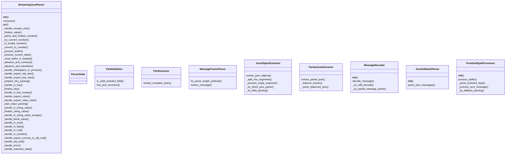

# Documentation for `protobuf_parser.py`

## Class Diagram

## Flowchart

```mermaid
flowchart TD
  test_streaming_json_parser --> test_chunked_streaming_json_parser
  test_chunked_streaming_json_parser --> test_partial_streaming_json_parser
  test_partial_streaming_json_parser --> __init__
  __init__ --> consume
  consume --> get
  get --> _handle_escape_char
  _handle_escape_char --> _finalize_value
  _finalize_value --> _parse_and_finalize_number
  _parse_and_finalize_number --> _try_convert_number
  _try_convert_number --> _is_invalid_number
  _is_invalid_number --> _convert_to_number
  _convert_to_number --> _process_buffer
  _process_buffer --> _process_current_state
  _process_current_state --> _reset_buffer_if_needed
  _reset_buffer_if_needed --> _advance_and_continue
  _advance_and_continue --> _advance_and_transition
  _advance_and_transition --> _handle_whitespace_or_process
  _handle_whitespace_or_process --> _handle_expect_obj_start
  _handle_expect_obj_start --> _handle_expect_key_start
  _handle_expect_key_start --> _prepare_key_parsing
  _prepare_key_parsing --> _handle_in_key
  _handle_in_key --> _finalize_key
  _finalize_key --> _handle_in_key_escape
  _handle_in_key_escape --> _handle_expect_colon
  _handle_expect_colon --> _handle_expect_value_start
  _handle_expect_value_start --> _start_value_parsing
  _start_value_parsing --> _handle_in_string_value
  _handle_in_string_value --> _finalize_string_value
  _finalize_string_value --> _handle_in_string_value_escape
  _handle_in_string_value_escape --> _handle_literal_value
  _handle_literal_value --> _handle_in_true
  _handle_in_true --> _handle_in_false
  _handle_in_false --> _handle_in_null
  _handle_in_null --> _handle_in_number
  _handle_in_number --> _handle_expect_comma_or_obj_end
  _handle_expect_comma_or_obj_end --> _handle_obj_end
  _handle_obj_end --> _handle_error
  _handle_error --> _handle_unknown_state
  _handle_unknown_state --> is_valid_protobuf_field
  is_valid_protobuf_field --> has_json_structure
  has_json_structure --> extract_complete_pairs
  extract_complete_pairs --> try_parse_length_prefixed
  try_parse_length_prefixed --> extract_message
  extract_message --> extract_json_objects
  extract_json_objects --> _split_into_segments
  _split_into_segments --> _process_single_segment
  _process_single_segment --> _try_direct_json_parse
  _try_direct_json_parse --> _try_field_parsing
  _try_field_parsing --> extract_partial_json
  extract_partial_json --> _balance_braces
  _balance_braces --> _parse_balanced_json
  _parse_balanced_json --> __init__
  __init__ --> decode_message
  decode_message --> _try_utf8_decode
  _try_utf8_decode --> _try_partial_message_parse
  _try_partial_message_parse --> __init__
  __init__ --> parse_json_messages
  parse_json_messages --> __init__
  __init__ --> process_buffer
  process_buffer --> _parse_protobuf_style
  _parse_protobuf_style --> _process_next_message
  _process_next_message --> _try_fallback_parsing
  _try_fallback_parsing --> process_non_whitespace
  process_non_whitespace --> process_non_whitespace
  process_non_whitespace --> process_non_whitespace
  process_non_whitespace --> process_non_whitespace
```

## Live Execution
[▶ Visualize in Python Tutor](https://pythontutor.com/visualize.html#code=%22%22%22%0AProtocol%20Buffers%20streaming%20parser%20implementation%20with%20SOLID%20principles.%0A%0AThis%20module%20%2Apreviously%2A%20implemented%20a%20streaming%20JSON%20parser%20inspired%20by%20Protocol%20Buffers%20message%20framing.%0AThe%20StreamingJsonParser%20class%20below%20has%20been%20refactored%20to%20be%20a%20direct%2C%20byte-based%0Astreaming%20JSON%20parser%20adhering%20to%20the%20project-wide%20specification.%0AThe%20original%20Protobuf-inspired%20helper%20classes%20remain%20but%20are%20no%20longer%20used%20by%20StreamingJsonParser.%0A%22%22%22%0A%0Aimport%20json%0Aimport%20struct%0Afrom%20dataclasses%20import%20dataclass%2C%20field%0Afrom%20typing%20import%20Any%2C%20Dict%2C%20List%2C%20Optional%0A%0A%23%20---%20Start%20of%20Refactored%20StreamingJsonParser%20and%20its%20dependencies%20---%0A%23%20%28Identical%20to%20the%20implementation%20in%20raw/ultrajson_parser.py%20for%20consistency%20and%20compliance%29%0A%0A%23%20State%20constants%20for%20the%20parser%0A_ST_EXPECT_OBJ_START%20%3D%200%0A_ST_EXPECT_KEY_START%20%3D%201%20%20%23%20After%20%27%7B%27%20or%20%27%2C%27%0A_ST_IN_KEY%20%3D%202%0A_ST_IN_KEY_ESCAPE%20%3D%203%0A_ST_EXPECT_COLON%20%3D%204%0A_ST_EXPECT_VALUE_START%20%3D%205%0A_ST_IN_STRING_VALUE%20%3D%206%0A_ST_IN_STRING_VALUE_ESCAPE%20%3D%207%0A_ST_IN_NUMBER%20%3D%208%0A_ST_IN_TRUE%20%3D%209%0A_ST_IN_FALSE%20%3D%2010%0A_ST_IN_NULL%20%3D%2011%0A_ST_EXPECT_COMMA_OR_OBJ_END%20%3D%2012%0A_ST_OBJ_END%20%3D%2013%0A_ST_ERROR%20%3D%2099%0A%0A_WHITESPACE%20%3D%20b%22%20%5Ct%5Cn%5Cr%22%0A_DIGITS%20%3D%20b%220123456789%22%0A_NUMBER_CHARS%20%3D%20_DIGITS%20%2B%20b%22-.eE%2B%22%0A%0A%0Aclass%20StreamingJsonParser%3A%0A%20%20%20%20%22%22%22%0A%20%20%20%20A%20streaming%20JSON%20parser%20that%20processes%20byte-based%20input%20incrementally.%0A%20%20%20%20It%20can%20handle%20partial%20JSON%20objects%20and%20incomplete%20string%20values%2C%0A%20%20%20%20returning%20the%20currently%20parsed%20data%20structure%20at%20any%20point.%0A%20%20%20%20This%20version%20replaces%20the%20original%20Protobuf-style%20parser%20in%20this%20module.%0A%20%20%20%20%22%22%22%0A%0A%20%20%20%20def%20__init__%28self%29%3A%0A%20%20%20%20%20%20%20%20%22%22%22Initializes%20the%20streaming%20JSON%20parser.%22%22%22%0A%20%20%20%20%20%20%20%20self._buffer%20%3D%20bytearray%28%29%0A%20%20%20%20%20%20%20%20self._result%3A%20Dict%5Bstr%2C%20Any%5D%20%3D%20%7B%7D%0A%20%20%20%20%20%20%20%20self._state%20%3D%20_ST_EXPECT_OBJ_START%0A%0A%20%20%20%20%20%20%20%20self._current_key_bytes%20%3D%20bytearray%28%29%0A%20%20%20%20%20%20%20%20self._current_value_bytes%20%3D%20bytearray%28%29%0A%0A%20%20%20%20%20%20%20%20self._active_key%3A%20str%20%7C%20None%20%3D%20None%0A%20%20%20%20%20%20%20%20self._idx%20%3D%200%0A%0A%20%20%20%20def%20consume%28self%2C%20chunk%3A%20str%29%20-%3E%20None%3A%0A%20%20%20%20%20%20%20%20%22%22%22%0A%20%20%20%20%20%20%20%20Appends%20a%20chunk%20of%20JSON%20string%20to%20the%20internal%20buffer%20and%20processes%20it%0A%20%20%20%20%20%20%20%20after%20converting%20to%20bytes.%0A%0A%20%20%20%20%20%20%20%20Args%3A%0A%20%20%20%20%20%20%20%20%20%20%20%20chunk%3A%20A%20string%20containing%20a%20part%20of%20the%20JSON%20document.%0A%20%20%20%20%20%20%20%20%22%22%22%0A%20%20%20%20%20%20%20%20if%20not%20isinstance%28chunk%2C%20str%29%3A%0A%20%20%20%20%20%20%20%20%20%20%20%20return%0A%0A%20%20%20%20%20%20%20%20byte_chunk%20%3D%20chunk.encode%28%22utf-8%22%2C%20errors%3D%22replace%22%29%0A%20%20%20%20%20%20%20%20self._buffer.extend%28byte_chunk%29%0A%20%20%20%20%20%20%20%20self._process_buffer%28%29%0A%0A%20%20%20%20def%20get%28self%29%20-%3E%20Dict%5Bstr%2C%20Any%5D%3A%0A%20%20%20%20%20%20%20%20%22%22%22%0A%20%20%20%20%20%20%20%20Returns%20the%20current%20state%20of%20the%20parsed%20JSON%20object.%0A%20%20%20%20%20%20%20%20This%20includes%20any%20fully%20parsed%20key-value%20pairs%20and%20partially%0A%20%20%20%20%20%20%20%20completed%20string%20values%20if%20a%20key%20has%20been%20fully%20parsed.%0A%20%20%20%20%20%20%20%20Incomplete%20keys%20are%20not%20included.%0A%0A%20%20%20%20%20%20%20%20Returns%3A%0A%20%20%20%20%20%20%20%20%20%20%20%20A%20dictionary%20representing%20the%20currently%20parsed%20JSON%20object.%0A%20%20%20%20%20%20%20%20%22%22%22%0A%20%20%20%20%20%20%20%20output_dict%20%3D%20self._result.copy%28%29%0A%0A%20%20%20%20%20%20%20%20if%20self._active_key%20is%20not%20None%20and%20self._state%20%3D%3D%20_ST_IN_STRING_VALUE%3A%0A%20%20%20%20%20%20%20%20%20%20%20%20if%20self._current_value_bytes%3A%0A%20%20%20%20%20%20%20%20%20%20%20%20%20%20%20%20try%3A%0A%20%20%20%20%20%20%20%20%20%20%20%20%20%20%20%20%20%20%20%20partial_value_str%20%3D%20self._current_value_bytes.decode%28%0A%20%20%20%20%20%20%20%20%20%20%20%20%20%20%20%20%20%20%20%20%20%20%20%20%22utf-8%22%2C%20errors%3D%22replace%22%0A%20%20%20%20%20%20%20%20%20%20%20%20%20%20%20%20%20%20%20%20%29%0A%20%20%20%20%20%20%20%20%20%20%20%20%20%20%20%20%20%20%20%20output_dict%5Bself._active_key%5D%20%3D%20partial_value_str%0A%20%20%20%20%20%20%20%20%20%20%20%20%20%20%20%20except%20Exception%3A%0A%20%20%20%20%20%20%20%20%20%20%20%20%20%20%20%20%20%20%20%20pass%0A%20%20%20%20%20%20%20%20return%20output_dict%0A%0A%20%20%20%20def%20_handle_escape_char%28self%2C%20byte_val%3A%20int%29%20-%3E%20int%3A%0A%20%20%20%20%20%20%20%20%22%22%22Handles%20JSON%20escape%20sequences.%22%22%22%0A%20%20%20%20%20%20%20%20escape_map%20%3D%20%7B%0A%20%20%20%20%20%20%20%20%20%20%20%20b%27%22%27%5B0%5D%3A%20b%27%22%27%5B0%5D%2C%0A%20%20%20%20%20%20%20%20%20%20%20%20b%22%5C%5C%22%5B0%5D%3A%20b%22%5C%5C%22%5B0%5D%2C%0A%20%20%20%20%20%20%20%20%20%20%20%20b%22/%22%5B0%5D%3A%20b%22/%22%5B0%5D%2C%0A%20%20%20%20%20%20%20%20%20%20%20%20b%22b%22%5B0%5D%3A%20b%22%5Cb%22%5B0%5D%2C%0A%20%20%20%20%20%20%20%20%20%20%20%20b%22f%22%5B0%5D%3A%20b%22%5Cf%22%5B0%5D%2C%0A%20%20%20%20%20%20%20%20%20%20%20%20b%22n%22%5B0%5D%3A%20b%22%5Cn%22%5B0%5D%2C%0A%20%20%20%20%20%20%20%20%20%20%20%20b%22r%22%5B0%5D%3A%20b%22%5Cr%22%5B0%5D%2C%0A%20%20%20%20%20%20%20%20%20%20%20%20b%22t%22%5B0%5D%3A%20b%22%5Ct%22%5B0%5D%2C%0A%20%20%20%20%20%20%20%20%7D%0A%20%20%20%20%20%20%20%20return%20escape_map.get%28byte_val%2C%20byte_val%29%0A%0A%20%20%20%20def%20_finalize_value%28self%2C%20value%3A%20Any%29%3A%0A%20%20%20%20%20%20%20%20%22%22%22Helper%20to%20assign%20a%20parsed%20value%20to%20the%20active%20key%20and%20reset.%22%22%22%0A%20%20%20%20%20%20%20%20if%20self._active_key%20is%20not%20None%3A%0A%20%20%20%20%20%20%20%20%20%20%20%20self._result%5Bself._active_key%5D%20%3D%20value%0A%20%20%20%20%20%20%20%20self._active_key%20%3D%20None%0A%20%20%20%20%20%20%20%20self._current_value_bytes.clear%28%29%0A%20%20%20%20%20%20%20%20self._state%20%3D%20_ST_EXPECT_COMMA_OR_OBJ_END%0A%0A%20%20%20%20def%20_parse_and_finalize_number%28self%29%3A%0A%20%20%20%20%20%20%20%20%22%22%22Parses%20the%20number%20in%20_current_value_bytes%20and%20finalizes%20it.%22%22%22%0A%20%20%20%20%20%20%20%20if%20not%20self._current_value_bytes%3A%0A%20%20%20%20%20%20%20%20%20%20%20%20self._state%20%3D%20_ST_ERROR%0A%20%20%20%20%20%20%20%20%20%20%20%20return%20False%0A%0A%20%20%20%20%20%20%20%20return%20self._try_convert_number%28%29%0A%0A%20%20%20%20def%20_try_convert_number%28self%29%20-%3E%20bool%3A%0A%20%20%20%20%20%20%20%20%22%22%22Try%20to%20convert%20current%20value%20bytes%20to%20a%20number.%22%22%22%0A%20%20%20%20%20%20%20%20num_str%20%3D%20self._current_value_bytes.decode%28%22utf-8%22%29%0A%0A%20%20%20%20%20%20%20%20if%20self._is_invalid_number%28num_str%29%3A%0A%20%20%20%20%20%20%20%20%20%20%20%20self._state%20%3D%20_ST_ERROR%0A%20%20%20%20%20%20%20%20%20%20%20%20return%20False%0A%0A%20%20%20%20%20%20%20%20try%3A%0A%20%20%20%20%20%20%20%20%20%20%20%20parsed_num%20%3D%20self._convert_to_number%28num_str%29%0A%20%20%20%20%20%20%20%20%20%20%20%20self._finalize_value%28parsed_num%29%0A%20%20%20%20%20%20%20%20%20%20%20%20return%20True%0A%20%20%20%20%20%20%20%20except%20ValueError%3A%0A%20%20%20%20%20%20%20%20%20%20%20%20self._state%20%3D%20_ST_ERROR%0A%20%20%20%20%20%20%20%20%20%20%20%20return%20False%0A%0A%20%20%20%20def%20_is_invalid_number%28self%2C%20num_str%3A%20str%29%20-%3E%20bool%3A%0A%20%20%20%20%20%20%20%20%22%22%22Check%20if%20number%20string%20is%20invalid.%22%22%22%0A%20%20%20%20%20%20%20%20return%20num_str%20in%20%28%22-%22%2C%20%22%2B%22%29%20or%20num_str.endswith%28%28%22.%22%2C%20%22e%22%2C%20%22E%22%2C%20%22%2B%22%2C%20%22-%22%29%29%0A%0A%20%20%20%20def%20_convert_to_number%28self%2C%20num_str%3A%20str%29%3A%0A%20%20%20%20%20%20%20%20%22%22%22Convert%20number%20string%20to%20appropriate%20type.%22%22%22%0A%20%20%20%20%20%20%20%20if%20any%28c%20in%20num_str%20for%20c%20in%20%28%22.%22%2C%20%22e%22%2C%20%22E%22%29%29%3A%0A%20%20%20%20%20%20%20%20%20%20%20%20return%20float%28num_str%29%0A%20%20%20%20%20%20%20%20return%20int%28num_str%29%0A%0A%20%20%20%20def%20_process_buffer%28self%29%3A%0A%20%20%20%20%20%20%20%20%22%22%22Processes%20the%20internal%20buffer%20to%20parse%20JSON%20content%20using%20a%20state%20machine.%22%22%22%0A%20%20%20%20%20%20%20%20buffer_len%20%3D%20len%28self._buffer%29%0A%20%20%20%20%20%20%20%20while%20self._idx%20%3C%20buffer_len%3A%0A%20%20%20%20%20%20%20%20%20%20%20%20byte%20%3D%20self._buffer%5Bself._idx%5D%0A%0A%20%20%20%20%20%20%20%20%20%20%20%20if%20not%20self._process_current_state%28byte%29%3A%0A%20%20%20%20%20%20%20%20%20%20%20%20%20%20%20%20return%0A%0A%20%20%20%20%20%20%20%20self._reset_buffer_if_needed%28%29%0A%0A%20%20%20%20def%20_process_current_state%28self%2C%20byte%3A%20int%29%20-%3E%20bool%3A%0A%20%20%20%20%20%20%20%20%22%22%22Process%20a%20single%20byte%20based%20on%20current%20state.%20Returns%20False%20if%20should%20stop.%22%22%22%0A%20%20%20%20%20%20%20%20state_handlers%20%3D%20%7B%0A%20%20%20%20%20%20%20%20%20%20%20%20_ST_EXPECT_OBJ_START%3A%20self._handle_expect_obj_start%2C%0A%20%20%20%20%20%20%20%20%20%20%20%20_ST_EXPECT_KEY_START%3A%20self._handle_expect_key_start%2C%0A%20%20%20%20%20%20%20%20%20%20%20%20_ST_IN_KEY%3A%20self._handle_in_key%2C%0A%20%20%20%20%20%20%20%20%20%20%20%20_ST_IN_KEY_ESCAPE%3A%20self._handle_in_key_escape%2C%0A%20%20%20%20%20%20%20%20%20%20%20%20_ST_EXPECT_COLON%3A%20self._handle_expect_colon%2C%0A%20%20%20%20%20%20%20%20%20%20%20%20_ST_EXPECT_VALUE_START%3A%20self._handle_expect_value_start%2C%0A%20%20%20%20%20%20%20%20%20%20%20%20_ST_IN_STRING_VALUE%3A%20self._handle_in_string_value%2C%0A%20%20%20%20%20%20%20%20%20%20%20%20_ST_IN_STRING_VALUE_ESCAPE%3A%20self._handle_in_string_value_escape%2C%0A%20%20%20%20%20%20%20%20%20%20%20%20_ST_IN_TRUE%3A%20self._handle_in_true%2C%0A%20%20%20%20%20%20%20%20%20%20%20%20_ST_IN_FALSE%3A%20self._handle_in_false%2C%0A%20%20%20%20%20%20%20%20%20%20%20%20_ST_IN_NULL%3A%20self._handle_in_null%2C%0A%20%20%20%20%20%20%20%20%20%20%20%20_ST_IN_NUMBER%3A%20self._handle_in_number%2C%0A%20%20%20%20%20%20%20%20%20%20%20%20_ST_EXPECT_COMMA_OR_OBJ_END%3A%20self._handle_expect_comma_or_obj_end%2C%0A%20%20%20%20%20%20%20%20%20%20%20%20_ST_OBJ_END%3A%20self._handle_obj_end%2C%0A%20%20%20%20%20%20%20%20%20%20%20%20_ST_ERROR%3A%20self._handle_error%2C%0A%20%20%20%20%20%20%20%20%7D%0A%0A%20%20%20%20%20%20%20%20handler%20%3D%20state_handlers.get%28self._state%2C%20self._handle_unknown_state%29%0A%20%20%20%20%20%20%20%20return%20handler%28byte%29%0A%0A%20%20%20%20def%20_reset_buffer_if_needed%28self%29%3A%0A%20%20%20%20%20%20%20%20%22%22%22Reset%20buffer%20position%20if%20we%27ve%20processed%20some%20bytes.%22%22%22%0A%20%20%20%20%20%20%20%20if%20self._idx%20%3E%200%3A%0A%20%20%20%20%20%20%20%20%20%20%20%20self._buffer%20%3D%20self._buffer%5Bself._idx%20%3A%5D%0A%20%20%20%20%20%20%20%20%20%20%20%20self._idx%20%3D%200%0A%0A%20%20%20%20def%20_advance_and_continue%28self%29%20-%3E%20bool%3A%0A%20%20%20%20%20%20%20%20%22%22%22Helper%20to%20advance%20index%20and%20continue%20processing.%22%22%22%0A%20%20%20%20%20%20%20%20self._idx%20%2B%3D%201%0A%20%20%20%20%20%20%20%20return%20True%0A%0A%20%20%20%20def%20_advance_and_transition%28self%2C%20new_state%3A%20int%29%20-%3E%20bool%3A%0A%20%20%20%20%20%20%20%20%22%22%22Helper%20to%20advance%20index%20and%20transition%20to%20new%20state.%22%22%22%0A%20%20%20%20%20%20%20%20self._state%20%3D%20new_state%0A%20%20%20%20%20%20%20%20self._idx%20%2B%3D%201%0A%20%20%20%20%20%20%20%20return%20True%0A%0A%20%20%20%20def%20_handle_whitespace_or_process%28self%2C%20byte%3A%20int%2C%20processor_func%29%20-%3E%20bool%3A%0A%20%20%20%20%20%20%20%20%22%22%22Handle%20whitespace%20or%20delegate%20to%20processor%20function.%22%22%22%0A%20%20%20%20%20%20%20%20if%20byte%20in%20_WHITESPACE%3A%0A%20%20%20%20%20%20%20%20%20%20%20%20return%20self._advance_and_continue%28%29%0A%20%20%20%20%20%20%20%20return%20processor_func%28byte%29%0A%0A%20%20%20%20def%20_handle_expect_obj_start%28self%2C%20byte%3A%20int%29%20-%3E%20bool%3A%0A%20%20%20%20%20%20%20%20%22%22%22Handle%20_ST_EXPECT_OBJ_START%20state.%22%22%22%0A%0A%20%20%20%20%20%20%20%20def%20process_non_whitespace%28b%3A%20int%29%20-%3E%20bool%3A%0A%20%20%20%20%20%20%20%20%20%20%20%20if%20b%20%3D%3D%20b%22%7B%22%5B0%5D%3A%0A%20%20%20%20%20%20%20%20%20%20%20%20%20%20%20%20return%20self._advance_and_transition%28_ST_EXPECT_KEY_START%29%0A%20%20%20%20%20%20%20%20%20%20%20%20self._state%20%3D%20_ST_ERROR%0A%20%20%20%20%20%20%20%20%20%20%20%20return%20False%0A%0A%20%20%20%20%20%20%20%20return%20self._handle_whitespace_or_process%28byte%2C%20process_non_whitespace%29%0A%0A%20%20%20%20def%20_handle_expect_key_start%28self%2C%20byte%3A%20int%29%20-%3E%20bool%3A%0A%20%20%20%20%20%20%20%20%22%22%22Handle%20_ST_EXPECT_KEY_START%20state.%22%22%22%0A%0A%20%20%20%20%20%20%20%20def%20process_non_whitespace%28b%3A%20int%29%20-%3E%20bool%3A%0A%20%20%20%20%20%20%20%20%20%20%20%20if%20b%20%3D%3D%20b%27%22%27%5B0%5D%3A%0A%20%20%20%20%20%20%20%20%20%20%20%20%20%20%20%20self._prepare_key_parsing%28%29%0A%20%20%20%20%20%20%20%20%20%20%20%20%20%20%20%20return%20True%0A%20%20%20%20%20%20%20%20%20%20%20%20if%20b%20%3D%3D%20b%22%7D%22%5B0%5D%3A%0A%20%20%20%20%20%20%20%20%20%20%20%20%20%20%20%20return%20self._advance_and_transition%28_ST_OBJ_END%29%0A%20%20%20%20%20%20%20%20%20%20%20%20self._state%20%3D%20_ST_ERROR%0A%20%20%20%20%20%20%20%20%20%20%20%20return%20False%0A%0A%20%20%20%20%20%20%20%20return%20self._handle_whitespace_or_process%28byte%2C%20process_non_whitespace%29%0A%0A%20%20%20%20def%20_prepare_key_parsing%28self%29%3A%0A%20%20%20%20%20%20%20%20%22%22%22Prepare%20for%20key%20parsing.%22%22%22%0A%20%20%20%20%20%20%20%20self._state%20%3D%20_ST_IN_KEY%0A%20%20%20%20%20%20%20%20self._current_key_bytes.clear%28%29%0A%20%20%20%20%20%20%20%20self._active_key%20%3D%20None%0A%20%20%20%20%20%20%20%20self._idx%20%2B%3D%201%0A%0A%20%20%20%20def%20_handle_in_key%28self%2C%20byte%3A%20int%29%20-%3E%20bool%3A%0A%20%20%20%20%20%20%20%20%22%22%22Handle%20_ST_IN_KEY%20state.%22%22%22%0A%20%20%20%20%20%20%20%20if%20byte%20%3D%3D%20b%22%5C%5C%22%5B0%5D%3A%0A%20%20%20%20%20%20%20%20%20%20%20%20self._state%20%3D%20_ST_IN_KEY_ESCAPE%0A%20%20%20%20%20%20%20%20%20%20%20%20self._idx%20%2B%3D%201%0A%20%20%20%20%20%20%20%20%20%20%20%20return%20True%0A%20%20%20%20%20%20%20%20if%20byte%20%3D%3D%20b%27%22%27%5B0%5D%3A%0A%20%20%20%20%20%20%20%20%20%20%20%20return%20self._finalize_key%28%29%0A%20%20%20%20%20%20%20%20self._current_key_bytes.append%28byte%29%0A%20%20%20%20%20%20%20%20self._idx%20%2B%3D%201%0A%20%20%20%20%20%20%20%20return%20True%0A%0A%20%20%20%20def%20_finalize_key%28self%29%20-%3E%20bool%3A%0A%20%20%20%20%20%20%20%20%22%22%22Finalize%20the%20current%20key%20and%20transition%20to%20expect%20colon%20state.%22%22%22%0A%20%20%20%20%20%20%20%20try%3A%0A%20%20%20%20%20%20%20%20%20%20%20%20self._active_key%20%3D%20self._current_key_bytes.decode%28%22utf-8%22%29%0A%20%20%20%20%20%20%20%20%20%20%20%20self._state%20%3D%20_ST_EXPECT_COLON%0A%20%20%20%20%20%20%20%20%20%20%20%20self._idx%20%2B%3D%201%0A%20%20%20%20%20%20%20%20%20%20%20%20return%20True%0A%20%20%20%20%20%20%20%20except%20UnicodeDecodeError%3A%0A%20%20%20%20%20%20%20%20%20%20%20%20self._active_key%20%3D%20None%0A%20%20%20%20%20%20%20%20%20%20%20%20self._state%20%3D%20_ST_ERROR%0A%20%20%20%20%20%20%20%20%20%20%20%20return%20False%0A%0A%20%20%20%20def%20_handle_in_key_escape%28self%2C%20byte%3A%20int%29%20-%3E%20bool%3A%0A%20%20%20%20%20%20%20%20%22%22%22Handle%20_ST_IN_KEY_ESCAPE%20state.%22%22%22%0A%20%20%20%20%20%20%20%20self._current_key_bytes.append%28self._handle_escape_char%28byte%29%29%0A%20%20%20%20%20%20%20%20self._state%20%3D%20_ST_IN_KEY%0A%20%20%20%20%20%20%20%20self._idx%20%2B%3D%201%0A%20%20%20%20%20%20%20%20return%20True%0A%0A%20%20%20%20def%20_handle_expect_colon%28self%2C%20byte%3A%20int%29%20-%3E%20bool%3A%0A%20%20%20%20%20%20%20%20%22%22%22Handle%20_ST_EXPECT_COLON%20state.%22%22%22%0A%0A%20%20%20%20%20%20%20%20def%20process_non_whitespace%28b%3A%20int%29%20-%3E%20bool%3A%0A%20%20%20%20%20%20%20%20%20%20%20%20if%20b%20%3D%3D%20b%22%3A%22%5B0%5D%3A%0A%20%20%20%20%20%20%20%20%20%20%20%20%20%20%20%20return%20self._advance_and_transition%28_ST_EXPECT_VALUE_START%29%0A%20%20%20%20%20%20%20%20%20%20%20%20self._state%20%3D%20_ST_ERROR%0A%20%20%20%20%20%20%20%20%20%20%20%20return%20False%0A%0A%20%20%20%20%20%20%20%20return%20self._handle_whitespace_or_process%28byte%2C%20process_non_whitespace%29%0A%0A%20%20%20%20def%20_handle_expect_value_start%28self%2C%20byte%3A%20int%29%20-%3E%20bool%3A%0A%20%20%20%20%20%20%20%20%22%22%22Handle%20_ST_EXPECT_VALUE_START%20state.%22%22%22%0A%0A%20%20%20%20%20%20%20%20def%20process_non_whitespace%28b%3A%20int%29%20-%3E%20bool%3A%0A%20%20%20%20%20%20%20%20%20%20%20%20self._current_value_bytes.clear%28%29%0A%20%20%20%20%20%20%20%20%20%20%20%20return%20self._start_value_parsing%28b%29%0A%0A%20%20%20%20%20%20%20%20return%20self._handle_whitespace_or_process%28byte%2C%20process_non_whitespace%29%0A%0A%20%20%20%20def%20_start_value_parsing%28self%2C%20byte%3A%20int%29%20-%3E%20bool%3A%0A%20%20%20%20%20%20%20%20%22%22%22Start%20parsing%20a%20value%20based%20on%20the%20first%20character.%22%22%22%0A%20%20%20%20%20%20%20%20value_starters%20%3D%20%7B%0A%20%20%20%20%20%20%20%20%20%20%20%20b%27%22%27%5B0%5D%3A%20%28_ST_IN_STRING_VALUE%2C%20False%29%2C%0A%20%20%20%20%20%20%20%20%20%20%20%20b%22t%22%5B0%5D%3A%20%28_ST_IN_TRUE%2C%20True%29%2C%0A%20%20%20%20%20%20%20%20%20%20%20%20b%22f%22%5B0%5D%3A%20%28_ST_IN_FALSE%2C%20True%29%2C%0A%20%20%20%20%20%20%20%20%20%20%20%20b%22n%22%5B0%5D%3A%20%28_ST_IN_NULL%2C%20True%29%2C%0A%20%20%20%20%20%20%20%20%7D%0A%0A%20%20%20%20%20%20%20%20if%20byte%20in%20value_starters%3A%0A%20%20%20%20%20%20%20%20%20%20%20%20state%2C%20append_byte%20%3D%20value_starters%5Bbyte%5D%0A%20%20%20%20%20%20%20%20%20%20%20%20self._state%20%3D%20state%0A%20%20%20%20%20%20%20%20%20%20%20%20if%20append_byte%3A%0A%20%20%20%20%20%20%20%20%20%20%20%20%20%20%20%20self._current_value_bytes.append%28byte%29%0A%20%20%20%20%20%20%20%20%20%20%20%20self._idx%20%2B%3D%201%0A%20%20%20%20%20%20%20%20%20%20%20%20return%20True%0A%0A%20%20%20%20%20%20%20%20if%20byte%20in%20_NUMBER_CHARS%20and%20byte%20%21%3D%20b%22%2B%22%5B0%5D%3A%0A%20%20%20%20%20%20%20%20%20%20%20%20self._state%20%3D%20_ST_IN_NUMBER%0A%20%20%20%20%20%20%20%20%20%20%20%20self._current_value_bytes.append%28byte%29%0A%20%20%20%20%20%20%20%20%20%20%20%20self._idx%20%2B%3D%201%0A%20%20%20%20%20%20%20%20%20%20%20%20return%20True%0A%0A%20%20%20%20%20%20%20%20self._state%20%3D%20_ST_ERROR%0A%20%20%20%20%20%20%20%20return%20False%0A%0A%20%20%20%20def%20_handle_in_string_value%28self%2C%20byte%3A%20int%29%20-%3E%20bool%3A%0A%20%20%20%20%20%20%20%20%22%22%22Handle%20_ST_IN_STRING_VALUE%20state.%22%22%22%0A%20%20%20%20%20%20%20%20if%20byte%20%3D%3D%20b%22%5C%5C%22%5B0%5D%3A%0A%20%20%20%20%20%20%20%20%20%20%20%20self._state%20%3D%20_ST_IN_STRING_VALUE_ESCAPE%0A%20%20%20%20%20%20%20%20%20%20%20%20self._idx%20%2B%3D%201%0A%20%20%20%20%20%20%20%20%20%20%20%20return%20True%0A%20%20%20%20%20%20%20%20if%20byte%20%3D%3D%20b%27%22%27%5B0%5D%3A%0A%20%20%20%20%20%20%20%20%20%20%20%20return%20self._finalize_string_value%28%29%0A%20%20%20%20%20%20%20%20self._current_value_bytes.append%28byte%29%0A%20%20%20%20%20%20%20%20self._idx%20%2B%3D%201%0A%20%20%20%20%20%20%20%20return%20True%0A%0A%20%20%20%20def%20_finalize_string_value%28self%29%20-%3E%20bool%3A%0A%20%20%20%20%20%20%20%20%22%22%22Finalize%20the%20current%20string%20value.%22%22%22%0A%20%20%20%20%20%20%20%20if%20self._active_key%20is%20not%20None%3A%0A%20%20%20%20%20%20%20%20%20%20%20%20try%3A%0A%20%20%20%20%20%20%20%20%20%20%20%20%20%20%20%20value_str%20%3D%20self._current_value_bytes.decode%28%22utf-8%22%29%0A%20%20%20%20%20%20%20%20%20%20%20%20%20%20%20%20self._finalize_value%28value_str%29%0A%20%20%20%20%20%20%20%20%20%20%20%20except%20UnicodeDecodeError%3A%0A%20%20%20%20%20%20%20%20%20%20%20%20%20%20%20%20value_str%20%3D%20self._current_value_bytes.decode%28%22utf-8%22%2C%20errors%3D%22replace%22%29%0A%20%20%20%20%20%20%20%20%20%20%20%20%20%20%20%20self._finalize_value%28value_str%29%0A%20%20%20%20%20%20%20%20%20%20%20%20self._idx%20%2B%3D%201%0A%20%20%20%20%20%20%20%20%20%20%20%20return%20True%0A%20%20%20%20%20%20%20%20self._state%20%3D%20_ST_ERROR%0A%20%20%20%20%20%20%20%20return%20False%0A%0A%20%20%20%20def%20_handle_in_string_value_escape%28self%2C%20byte%3A%20int%29%20-%3E%20bool%3A%0A%20%20%20%20%20%20%20%20%22%22%22Handle%20_ST_IN_STRING_VALUE_ESCAPE%20state.%22%22%22%0A%20%20%20%20%20%20%20%20self._current_value_bytes.append%28self._handle_escape_char%28byte%29%29%0A%20%20%20%20%20%20%20%20self._state%20%3D%20_ST_IN_STRING_VALUE%0A%20%20%20%20%20%20%20%20self._idx%20%2B%3D%201%0A%20%20%20%20%20%20%20%20return%20True%0A%0A%20%20%20%20def%20_handle_literal_value%28self%2C%20byte%3A%20int%2C%20literal%3A%20bytes%2C%20value%3A%20Any%29%20-%3E%20bool%3A%0A%20%20%20%20%20%20%20%20%22%22%22Handle%20parsing%20of%20literal%20values%20%28true%2C%20false%2C%20null%29.%22%22%22%0A%20%20%20%20%20%20%20%20self._current_value_bytes.append%28byte%29%0A%20%20%20%20%20%20%20%20self._idx%20%2B%3D%201%0A%20%20%20%20%20%20%20%20if%20self._current_value_bytes%20%3D%3D%20literal%3A%0A%20%20%20%20%20%20%20%20%20%20%20%20self._finalize_value%28value%29%0A%20%20%20%20%20%20%20%20%20%20%20%20return%20True%0A%20%20%20%20%20%20%20%20if%20not%20literal.startswith%28self._current_value_bytes%29%3A%0A%20%20%20%20%20%20%20%20%20%20%20%20self._state%20%3D%20_ST_ERROR%0A%20%20%20%20%20%20%20%20%20%20%20%20return%20False%0A%20%20%20%20%20%20%20%20return%20True%0A%0A%20%20%20%20def%20_handle_in_true%28self%2C%20byte%3A%20int%29%20-%3E%20bool%3A%0A%20%20%20%20%20%20%20%20%22%22%22Handle%20_ST_IN_TRUE%20state.%22%22%22%0A%20%20%20%20%20%20%20%20return%20self._handle_literal_value%28byte%2C%20b%22true%22%2C%20True%29%0A%0A%20%20%20%20def%20_handle_in_false%28self%2C%20byte%3A%20int%29%20-%3E%20bool%3A%0A%20%20%20%20%20%20%20%20%22%22%22Handle%20_ST_IN_FALSE%20state.%22%22%22%0A%20%20%20%20%20%20%20%20return%20self._handle_literal_value%28byte%2C%20b%22false%22%2C%20False%29%0A%0A%20%20%20%20def%20_handle_in_null%28self%2C%20byte%3A%20int%29%20-%3E%20bool%3A%0A%20%20%20%20%20%20%20%20%22%22%22Handle%20_ST_IN_NULL%20state.%22%22%22%0A%20%20%20%20%20%20%20%20return%20self._handle_literal_value%28byte%2C%20b%22null%22%2C%20None%29%0A%0A%20%20%20%20def%20_handle_in_number%28self%2C%20byte%3A%20int%29%20-%3E%20bool%3A%0A%20%20%20%20%20%20%20%20%22%22%22Handle%20_ST_IN_NUMBER%20state.%22%22%22%0A%20%20%20%20%20%20%20%20if%20byte%20in%20_NUMBER_CHARS%3A%0A%20%20%20%20%20%20%20%20%20%20%20%20self._current_value_bytes.append%28byte%29%0A%20%20%20%20%20%20%20%20%20%20%20%20self._idx%20%2B%3D%201%0A%20%20%20%20%20%20%20%20%20%20%20%20return%20True%0A%20%20%20%20%20%20%20%20return%20self._parse_and_finalize_number%28%29%0A%0A%20%20%20%20def%20_handle_expect_comma_or_obj_end%28self%2C%20byte%3A%20int%29%20-%3E%20bool%3A%0A%20%20%20%20%20%20%20%20%22%22%22Handle%20_ST_EXPECT_COMMA_OR_OBJ_END%20state.%22%22%22%0A%20%20%20%20%20%20%20%20if%20byte%20in%20_WHITESPACE%3A%0A%20%20%20%20%20%20%20%20%20%20%20%20self._idx%20%2B%3D%201%0A%20%20%20%20%20%20%20%20%20%20%20%20return%20True%0A%20%20%20%20%20%20%20%20if%20byte%20%3D%3D%20b%22%2C%22%5B0%5D%3A%0A%20%20%20%20%20%20%20%20%20%20%20%20self._state%20%3D%20_ST_EXPECT_KEY_START%0A%20%20%20%20%20%20%20%20%20%20%20%20self._idx%20%2B%3D%201%0A%20%20%20%20%20%20%20%20%20%20%20%20return%20True%0A%20%20%20%20%20%20%20%20if%20byte%20%3D%3D%20b%22%7D%22%5B0%5D%3A%0A%20%20%20%20%20%20%20%20%20%20%20%20self._state%20%3D%20_ST_OBJ_END%0A%20%20%20%20%20%20%20%20%20%20%20%20self._idx%20%2B%3D%201%0A%20%20%20%20%20%20%20%20%20%20%20%20return%20True%0A%20%20%20%20%20%20%20%20self._state%20%3D%20_ST_ERROR%0A%20%20%20%20%20%20%20%20return%20False%0A%0A%20%20%20%20def%20_handle_obj_end%28self%2C%20byte%3A%20int%29%20-%3E%20bool%3A%0A%20%20%20%20%20%20%20%20%22%22%22Handle%20_ST_OBJ_END%20state.%22%22%22%0A%20%20%20%20%20%20%20%20if%20byte%20in%20_WHITESPACE%3A%0A%20%20%20%20%20%20%20%20%20%20%20%20self._idx%20%2B%3D%201%0A%20%20%20%20%20%20%20%20%20%20%20%20return%20True%0A%20%20%20%20%20%20%20%20self._state%20%3D%20_ST_ERROR%0A%20%20%20%20%20%20%20%20return%20False%0A%0A%20%20%20%20def%20_handle_error%28self%2C%20byte%3A%20int%29%20-%3E%20bool%3A%0A%20%20%20%20%20%20%20%20%22%22%22Handle%20_ST_ERROR%20state.%22%22%22%0A%20%20%20%20%20%20%20%20return%20False%0A%0A%20%20%20%20def%20_handle_unknown_state%28self%2C%20byte%3A%20int%29%20-%3E%20bool%3A%0A%20%20%20%20%20%20%20%20%22%22%22Handle%20unknown%20state.%22%22%22%0A%20%20%20%20%20%20%20%20self._state%20%3D%20_ST_ERROR%0A%20%20%20%20%20%20%20%20return%20False%0A%0A%0A%23%20---%20End%20of%20Refactored%20StreamingJsonParser%20---%0A%0A%0A%23%20---%20Original%20Protobuf-inspired%20helper%20classes%20%28now%20unused%20by%20StreamingJsonParser%29%20---%0A%40dataclass%0Aclass%20ParserState%3A%0A%20%20%20%20%22%22%22Immutable%20state%20container%20for%20the%20Protobuf%20parser.%22%22%22%0A%0A%20%20%20%20buffer%3A%20str%20%3D%20%22%22%0A%20%20%20%20parsed_data%3A%20Dict%5Bstr%2C%20Any%5D%20%3D%20field%28default_factory%3Ddict%29%0A%0A%0Aclass%20FieldValidator%3A%0A%20%20%20%20%22%22%22Stateless%20validator%20for%20Protobuf-style%20fields.%22%22%22%0A%0A%20%20%20%20%40staticmethod%0A%20%20%20%20def%20is_valid_protobuf_field%28key%3A%20str%29%20-%3E%20bool%3A%0A%20%20%20%20%20%20%20%20%22%22%22Validate%20if%20a%20key%20represents%20a%20valid%20Protobuf-style%20field.%22%22%22%0A%20%20%20%20%20%20%20%20return%20isinstance%28key%2C%20str%29%20and%20len%28key%29%20%3E%200%0A%0A%20%20%20%20%40staticmethod%0A%20%20%20%20def%20has_json_structure%28segment%3A%20str%29%20-%3E%20bool%3A%0A%20%20%20%20%20%20%20%20%22%22%22Check%20if%20segment%20contains%20JSON-like%20structure.%22%22%22%0A%20%20%20%20%20%20%20%20return%20%22%3A%22%20in%20segment%20and%20%28%22%7B%22%20in%20segment%20or%20%27%22%27%20in%20segment%29%0A%0A%0Aclass%20PairExtractor%3A%0A%20%20%20%20%22%22%22Extracts%20complete%20key-value%20pairs%20from%20objects%20using%20stateless%20operations.%22%22%22%0A%0A%20%20%20%20%40staticmethod%0A%20%20%20%20def%20extract_complete_pairs%28obj%3A%20Dict%5Bstr%2C%20Any%5D%29%20-%3E%20Dict%5Bstr%2C%20Any%5D%3A%0A%20%20%20%20%20%20%20%20%22%22%22Extract%20complete%20key-value%20pairs%2C%20allowing%20partial%20string%20values.%22%22%22%0A%20%20%20%20%20%20%20%20if%20not%20isinstance%28obj%2C%20dict%29%3A%0A%20%20%20%20%20%20%20%20%20%20%20%20return%20%7B%7D%0A%0A%20%20%20%20%20%20%20%20return%20%7B%0A%20%20%20%20%20%20%20%20%20%20%20%20key%3A%20value%0A%20%20%20%20%20%20%20%20%20%20%20%20for%20key%2C%20value%20in%20obj.items%28%29%0A%20%20%20%20%20%20%20%20%20%20%20%20if%20FieldValidator.is_valid_protobuf_field%28key%29%0A%20%20%20%20%20%20%20%20%7D%0A%0A%0Aclass%20MessageFrameParser%3A%0A%20%20%20%20%22%22%22Handles%20Protobuf-style%20message%20framing%20with%20stateless%20operations.%22%22%22%0A%0A%20%20%20%20%40staticmethod%0A%20%20%20%20def%20try_parse_length_prefixed%28message_buffer%3A%20bytearray%29%20-%3E%20Optional%5Bint%5D%3A%0A%20%20%20%20%20%20%20%20%22%22%22Try%20to%20parse%20a%20length-prefixed%20message.%22%22%22%0A%20%20%20%20%20%20%20%20if%20len%28message_buffer%29%20%3C%204%3A%0A%20%20%20%20%20%20%20%20%20%20%20%20return%20None%0A%0A%20%20%20%20%20%20%20%20try%3A%0A%20%20%20%20%20%20%20%20%20%20%20%20length%20%3D%20struct.unpack%28%22%3EI%22%2C%20message_buffer%5B%3A4%5D%29%5B0%5D%0A%20%20%20%20%20%20%20%20%20%20%20%20return%20length%0A%20%20%20%20%20%20%20%20except%20struct.error%3A%0A%20%20%20%20%20%20%20%20%20%20%20%20return%20None%0A%0A%20%20%20%20%40staticmethod%0A%20%20%20%20def%20extract_message%28message_buffer%3A%20bytearray%2C%20length%3A%20int%29%20-%3E%20Optional%5Bbytearray%5D%3A%0A%20%20%20%20%20%20%20%20%22%22%22Extract%20a%20message%20of%20specified%20length.%22%22%22%0A%20%20%20%20%20%20%20%20total_length%20%3D%20length%20%2B%204%20%20%23%20%2B4%20for%20length%20prefix%0A%20%20%20%20%20%20%20%20if%20len%28message_buffer%29%20%3C%20total_length%3A%0A%20%20%20%20%20%20%20%20%20%20%20%20return%20None%0A%0A%20%20%20%20%20%20%20%20message_bytes%20%3D%20message_buffer%5B4%3Atotal_length%5D%0A%20%20%20%20%20%20%20%20del%20message_buffer%5B%3Atotal_length%5D%0A%20%20%20%20%20%20%20%20return%20message_bytes%0A%0A%0Aclass%20JsonObjectExtractor%3A%0A%20%20%20%20%22%22%22Stateless%20utility%20for%20extracting%20JSON%20objects%20from%20text.%22%22%22%0A%0A%20%20%20%20%40staticmethod%0A%20%20%20%20def%20extract_json_objects%28text%3A%20str%29%20-%3E%20Dict%5Bstr%2C%20Any%5D%3A%0A%20%20%20%20%20%20%20%20%22%22%22Extract%20JSON%20objects%20from%20text%20by%20processing%20segments.%22%22%22%0A%20%20%20%20%20%20%20%20result%20%3D%20%7B%7D%0A%20%20%20%20%20%20%20%20segments%20%3D%20JsonObjectExtractor._split_into_segments%28text%29%0A%0A%20%20%20%20%20%20%20%20for%20segment%20in%20segments%3A%0A%20%20%20%20%20%20%20%20%20%20%20%20segment_result%20%3D%20JsonObjectExtractor._process_single_segment%28segment%29%0A%20%20%20%20%20%20%20%20%20%20%20%20if%20segment_result%3A%0A%20%20%20%20%20%20%20%20%20%20%20%20%20%20%20%20result.update%28segment_result%29%0A%0A%20%20%20%20%20%20%20%20return%20result%0A%0A%20%20%20%20%40staticmethod%0A%20%20%20%20def%20_split_into_segments%28text%3A%20str%29%20-%3E%20List%5Bstr%5D%3A%0A%20%20%20%20%20%20%20%20%22%22%22Split%20text%20into%20processable%20segments.%22%22%22%0A%20%20%20%20%20%20%20%20return%20%5Bsegment.strip%28%29%20for%20segment%20in%20text.split%28%22%5Cn%22%29%20if%20segment.strip%28%29%5D%0A%0A%20%20%20%20%40staticmethod%0A%20%20%20%20def%20_process_single_segment%28segment%3A%20str%29%20-%3E%20Dict%5Bstr%2C%20Any%5D%3A%0A%20%20%20%20%20%20%20%20%22%22%22Process%20a%20single%20text%20segment%20for%20JSON%20content.%22%22%22%0A%20%20%20%20%20%20%20%20direct_result%20%3D%20JsonObjectExtractor._try_direct_json_parse%28segment%29%0A%20%20%20%20%20%20%20%20if%20direct_result%3A%0A%20%20%20%20%20%20%20%20%20%20%20%20return%20direct_result%0A%20%20%20%20%20%20%20%20return%20JsonObjectExtractor._try_field_parsing%28segment%29%0A%0A%20%20%20%20%40staticmethod%0A%20%20%20%20def%20_try_direct_json_parse%28segment%3A%20str%29%20-%3E%20Dict%5Bstr%2C%20Any%5D%3A%0A%20%20%20%20%20%20%20%20%22%22%22Attempt%20direct%20JSON%20parsing%20of%20segment.%22%22%22%0A%20%20%20%20%20%20%20%20try%3A%0A%20%20%20%20%20%20%20%20%20%20%20%20obj%20%3D%20json.loads%28segment%29%0A%20%20%20%20%20%20%20%20%20%20%20%20if%20isinstance%28obj%2C%20dict%29%3A%0A%20%20%20%20%20%20%20%20%20%20%20%20%20%20%20%20return%20PairExtractor.extract_complete_pairs%28obj%29%0A%20%20%20%20%20%20%20%20except%20json.JSONDecodeError%3A%0A%20%20%20%20%20%20%20%20%20%20%20%20pass%0A%20%20%20%20%20%20%20%20return%20%7B%7D%0A%0A%20%20%20%20%40staticmethod%0A%20%20%20%20def%20_try_field_parsing%28segment%3A%20str%29%20-%3E%20Dict%5Bstr%2C%20Any%5D%3A%0A%20%20%20%20%20%20%20%20%22%22%22Try%20field-by-field%20parsing%20for%20Protobuf-style%20segments.%22%22%22%0A%20%20%20%20%20%20%20%20if%20not%20FieldValidator.has_json_structure%28segment%29%3A%0A%20%20%20%20%20%20%20%20%20%20%20%20return%20%7B%7D%0A%20%20%20%20%20%20%20%20if%20%22%7B%22%20in%20segment%3A%0A%20%20%20%20%20%20%20%20%20%20%20%20return%20PartialJsonExtractor.extract_partial_json%28segment%29%0A%20%20%20%20%20%20%20%20return%20%7B%7D%0A%0A%0Aclass%20PartialJsonExtractor%3A%0A%20%20%20%20%22%22%22Stateless%20utility%20for%20extracting%20partial%20JSON%20with%20brace%20balancing.%22%22%22%0A%0A%20%20%20%20%40staticmethod%0A%20%20%20%20def%20extract_partial_json%28segment%3A%20str%29%20-%3E%20Dict%5Bstr%2C%20Any%5D%3A%0A%20%20%20%20%20%20%20%20%22%22%22Extract%20partial%20JSON%20from%20segment%20with%20automatic%20brace%20balancing.%22%22%22%0A%20%20%20%20%20%20%20%20start_pos%20%3D%20segment.find%28%22%7B%22%29%0A%20%20%20%20%20%20%20%20if%20start_pos%20%3D%3D%20-1%3A%0A%20%20%20%20%20%20%20%20%20%20%20%20return%20%7B%7D%0A%20%20%20%20%20%20%20%20json_part%20%3D%20segment%5Bstart_pos%3A%5D%0A%20%20%20%20%20%20%20%20balanced_json%20%3D%20PartialJsonExtractor._balance_braces%28json_part%29%0A%20%20%20%20%20%20%20%20return%20PartialJsonExtractor._parse_balanced_json%28balanced_json%29%0A%0A%20%20%20%20%40staticmethod%0A%20%20%20%20def%20_balance_braces%28json_part%3A%20str%29%20-%3E%20str%3A%0A%20%20%20%20%20%20%20%20%22%22%22Balance%20opening%20and%20closing%20braces%20in%20JSON%20string.%22%22%22%0A%20%20%20%20%20%20%20%20open_braces%20%3D%20json_part.count%28%22%7B%22%29%0A%20%20%20%20%20%20%20%20close_braces%20%3D%20json_part.count%28%22%7D%22%29%0A%20%20%20%20%20%20%20%20if%20open_braces%20%3E%20close_braces%3A%0A%20%20%20%20%20%20%20%20%20%20%20%20return%20json_part%20%2B%20%22%7D%22%20%2A%20%28open_braces%20-%20close_braces%29%0A%20%20%20%20%20%20%20%20return%20json_part%0A%0A%20%20%20%20%40staticmethod%0A%20%20%20%20def%20_parse_balanced_json%28balanced_json%3A%20str%29%20-%3E%20Dict%5Bstr%2C%20Any%5D%3A%0A%20%20%20%20%20%20%20%20%22%22%22Parse%20balanced%20JSON%20string.%22%22%22%0A%20%20%20%20%20%20%20%20try%3A%0A%20%20%20%20%20%20%20%20%20%20%20%20obj%20%3D%20json.loads%28balanced_json%29%0A%20%20%20%20%20%20%20%20%20%20%20%20if%20isinstance%28obj%2C%20dict%29%3A%0A%20%20%20%20%20%20%20%20%20%20%20%20%20%20%20%20return%20PairExtractor.extract_complete_pairs%28obj%29%0A%20%20%20%20%20%20%20%20except%20json.JSONDecodeError%3A%0A%20%20%20%20%20%20%20%20%20%20%20%20pass%0A%20%20%20%20%20%20%20%20return%20%7B%7D%0A%0A%0Aclass%20MessageDecoder%3A%0A%20%20%20%20%22%22%22Decodes%20individual%20messages%20with%20dependency%20injection.%22%22%22%0A%0A%20%20%20%20def%20__init__%28self%2C%20pair_extractor%3A%20PairExtractor%20%3D%20None%29%3A%0A%20%20%20%20%20%20%20%20self._pair_extractor%20%3D%20pair_extractor%20or%20PairExtractor%28%29%0A%0A%20%20%20%20def%20decode_message%28self%2C%20message_bytes%3A%20bytearray%29%20-%3E%20Dict%5Bstr%2C%20Any%5D%3A%0A%20%20%20%20%20%20%20%20%22%22%22Process%20a%20complete%20message%20with%20fallback%20mechanisms.%22%22%22%0A%20%20%20%20%20%20%20%20utf8_result%20%3D%20self._try_utf8_decode%28message_bytes%29%0A%20%20%20%20%20%20%20%20if%20utf8_result%3A%0A%20%20%20%20%20%20%20%20%20%20%20%20return%20utf8_result%0A%20%20%20%20%20%20%20%20return%20self._try_partial_message_parse%28message_bytes%29%0A%0A%20%20%20%20def%20_try_utf8_decode%28self%2C%20message_bytes%3A%20bytearray%29%20-%3E%20Dict%5Bstr%2C%20Any%5D%3A%0A%20%20%20%20%20%20%20%20%22%22%22Try%20to%20decode%20message%20as%20UTF-8%20JSON.%22%22%22%0A%20%20%20%20%20%20%20%20try%3A%0A%20%20%20%20%20%20%20%20%20%20%20%20message_str%20%3D%20message_bytes.decode%28%22utf-8%22%29%0A%20%20%20%20%20%20%20%20%20%20%20%20obj%20%3D%20json.loads%28message_str%29%0A%20%20%20%20%20%20%20%20%20%20%20%20if%20isinstance%28obj%2C%20dict%29%3A%0A%20%20%20%20%20%20%20%20%20%20%20%20%20%20%20%20return%20self._pair_extractor.extract_complete_pairs%28obj%29%0A%20%20%20%20%20%20%20%20except%20%28UnicodeDecodeError%2C%20json.JSONDecodeError%29%3A%0A%20%20%20%20%20%20%20%20%20%20%20%20pass%0A%20%20%20%20%20%20%20%20return%20%7B%7D%0A%0A%20%20%20%20def%20_try_partial_message_parse%28self%2C%20message_bytes%3A%20bytearray%29%20-%3E%20Dict%5Bstr%2C%20Any%5D%3A%0A%20%20%20%20%20%20%20%20%22%22%22Try%20to%20parse%20a%20partial%20message%20with%20error%20recovery.%22%22%22%0A%20%20%20%20%20%20%20%20try%3A%0A%20%20%20%20%20%20%20%20%20%20%20%20message_str%20%3D%20message_bytes.decode%28%22utf-8%22%2C%20errors%3D%22replace%22%29%0A%20%20%20%20%20%20%20%20%20%20%20%20if%20%22%7B%22%20in%20message_str%3A%0A%20%20%20%20%20%20%20%20%20%20%20%20%20%20%20%20return%20JsonObjectExtractor.extract_json_objects%28message_str%29%0A%20%20%20%20%20%20%20%20except%20ValueError%3A%0A%20%20%20%20%20%20%20%20%20%20%20%20pass%0A%20%20%20%20%20%20%20%20return%20%7B%7D%0A%0A%0Aclass%20JsonFallbackParser%3A%0A%20%20%20%20%22%22%22Fallback%20JSON-based%20message%20parsing%20with%20dependency%20injection.%22%22%22%0A%0A%20%20%20%20def%20__init__%28self%2C%20message_decoder%3A%20MessageDecoder%20%3D%20None%29%3A%0A%20%20%20%20%20%20%20%20self._message_decoder%20%3D%20message_decoder%20or%20MessageDecoder%28%29%0A%0A%20%20%20%20def%20parse_json_messages%28self%2C%20message_buffer%3A%20bytearray%29%20-%3E%20Dict%5Bstr%2C%20Any%5D%3A%0A%20%20%20%20%20%20%20%20%22%22%22Fallback%20to%20JSON-based%20message%20parsing.%22%22%22%0A%20%20%20%20%20%20%20%20try%3A%0A%20%20%20%20%20%20%20%20%20%20%20%20buffer_str%20%3D%20message_buffer.decode%28%22utf-8%22%2C%20errors%3D%22ignore%22%29%0A%20%20%20%20%20%20%20%20%20%20%20%20message_buffer.clear%28%29%0A%20%20%20%20%20%20%20%20%20%20%20%20fake_message%20%3D%20buffer_str.encode%28%22utf-8%22%29%0A%20%20%20%20%20%20%20%20%20%20%20%20return%20self._message_decoder.decode_message%28bytearray%28fake_message%29%29%0A%20%20%20%20%20%20%20%20except%20ValueError%3A%0A%20%20%20%20%20%20%20%20%20%20%20%20return%20%7B%7D%0A%0A%0Aclass%20ProtobufStyleProcessor%3A%0A%20%20%20%20%22%22%22Main%20processor%20using%20Protobuf-inspired%20message%20framing%20with%20dependency%20injection.%22%22%22%0A%0A%20%20%20%20def%20__init__%28%0A%20%20%20%20%20%20%20%20self%2C%0A%20%20%20%20%20%20%20%20frame_parser%3A%20MessageFrameParser%20%3D%20None%2C%0A%20%20%20%20%20%20%20%20message_decoder%3A%20MessageDecoder%20%3D%20None%2C%0A%20%20%20%20%20%20%20%20fallback_parser%3A%20JsonFallbackParser%20%3D%20None%2C%0A%20%20%20%20%29%3A%0A%20%20%20%20%20%20%20%20self._frame_parser%20%3D%20frame_parser%20or%20MessageFrameParser%28%29%0A%20%20%20%20%20%20%20%20self._message_decoder%20%3D%20message_decoder%20or%20MessageDecoder%28%29%0A%20%20%20%20%20%20%20%20self._fallback_parser%20%3D%20fallback_parser%20or%20JsonFallbackParser%28%0A%20%20%20%20%20%20%20%20%20%20%20%20self._message_decoder%0A%20%20%20%20%20%20%20%20%29%0A%20%20%20%20%20%20%20%20self._message_buffer%20%3D%20bytearray%28%29%0A%0A%20%20%20%20def%20process_buffer%28self%2C%20buffer%3A%20str%29%20-%3E%20Dict%5Bstr%2C%20Any%5D%3A%0A%20%20%20%20%20%20%20%20%22%22%22Parse%20using%20Protobuf-inspired%20message%20framing.%22%22%22%0A%20%20%20%20%20%20%20%20buffer_bytes%20%3D%20buffer.encode%28%22utf-8%22%29%0A%20%20%20%20%20%20%20%20self._message_buffer.extend%28buffer_bytes%29%0A%20%20%20%20%20%20%20%20return%20self._parse_protobuf_style%28%29%0A%0A%20%20%20%20def%20_parse_protobuf_style%28self%29%20-%3E%20Dict%5Bstr%2C%20Any%5D%3A%0A%20%20%20%20%20%20%20%20%22%22%22Parse%20using%20Protobuf-inspired%20message%20framing%20with%20clear%20separation.%22%22%22%0A%20%20%20%20%20%20%20%20parsed_data%20%3D%20%7B%7D%0A%20%20%20%20%20%20%20%20while%20len%28self._message_buffer%29%20%3E%200%3A%0A%20%20%20%20%20%20%20%20%20%20%20%20processing_result%20%3D%20self._process_next_message%28%29%0A%20%20%20%20%20%20%20%20%20%20%20%20if%20processing_result%20is%20None%3A%0A%20%20%20%20%20%20%20%20%20%20%20%20%20%20%20%20fallback_data%20%3D%20self._try_fallback_parsing%28%29%0A%20%20%20%20%20%20%20%20%20%20%20%20%20%20%20%20if%20fallback_data%3A%0A%20%20%20%20%20%20%20%20%20%20%20%20%20%20%20%20%20%20%20%20parsed_data.update%28fallback_data%29%0A%20%20%20%20%20%20%20%20%20%20%20%20%20%20%20%20break%0A%20%20%20%20%20%20%20%20%20%20%20%20if%20processing_result%3A%0A%20%20%20%20%20%20%20%20%20%20%20%20%20%20%20%20parsed_data.update%28processing_result%29%0A%20%20%20%20%20%20%20%20return%20parsed_data%0A%0A%20%20%20%20def%20_process_next_message%28self%29%20-%3E%20Optional%5BDict%5Bstr%2C%20Any%5D%5D%3A%0A%20%20%20%20%20%20%20%20%22%22%22Process%20the%20next%20complete%20message%20from%20buffer.%22%22%22%0A%20%20%20%20%20%20%20%20message_length%20%3D%20self._frame_parser.try_parse_length_prefixed%28%0A%20%20%20%20%20%20%20%20%20%20%20%20self._message_buffer%0A%20%20%20%20%20%20%20%20%29%0A%20%20%20%20%20%20%20%20if%20message_length%20is%20None%3A%0A%20%20%20%20%20%20%20%20%20%20%20%20return%20None%0A%20%20%20%20%20%20%20%20message_bytes%20%3D%20self._frame_parser.extract_message%28%0A%20%20%20%20%20%20%20%20%20%20%20%20self._message_buffer%2C%20message_length%0A%20%20%20%20%20%20%20%20%29%0A%20%20%20%20%20%20%20%20if%20message_bytes%20is%20None%3A%0A%20%20%20%20%20%20%20%20%20%20%20%20return%20None%0A%20%20%20%20%20%20%20%20return%20self._message_decoder.decode_message%28message_bytes%29%0A%0A%20%20%20%20def%20_try_fallback_parsing%28self%29%20-%3E%20Dict%5Bstr%2C%20Any%5D%3A%0A%20%20%20%20%20%20%20%20%22%22%22Try%20fallback%20parsing%20when%20length-prefixed%20parsing%20fails.%22%22%22%0A%20%20%20%20%20%20%20%20return%20self._fallback_parser.parse_json_messages%28self._message_buffer%29%0A%0A%0A%23%20Mandatory%20tests%20for%20the%20refactored%20StreamingJsonParser%0Adef%20test_streaming_json_parser%28%29%3A%0A%20%20%20%20parser%20%3D%20StreamingJsonParser%28%29%0A%20%20%20%20parser.consume%28%27%7B%22foo%22%3A%20%22bar%22%7D%27%29%0A%20%20%20%20assert%20parser.get%28%29%20%3D%3D%20%7B%22foo%22%3A%20%22bar%22%7D%0A%0A%0Adef%20test_chunked_streaming_json_parser%28%29%3A%0A%20%20%20%20parser%20%3D%20StreamingJsonParser%28%29%0A%20%20%20%20parser.consume%28%27%7B%22foo%22%3A%20%27%29%0A%20%20%20%20parser.consume%28%27%22bar%22%7D%27%29%0A%20%20%20%20assert%20parser.get%28%29%20%3D%3D%20%7B%22foo%22%3A%20%22bar%22%7D%0A%0A%0Adef%20test_partial_streaming_json_parser%28%29%3A%0A%20%20%20%20parser%20%3D%20StreamingJsonParser%28%29%0A%20%20%20%20parser.consume%28%27%7B%22foo%22%3A%20%22bar%27%29%0A%20%20%20%20assert%20parser.get%28%29%20%3D%3D%20%7B%22foo%22%3A%20%22bar%22%7D%0A%0A%0Aif%20__name__%20%3D%3D%20%22__main__%22%3A%0A%20%20%20%20test_streaming_json_parser%28%29%0A%20%20%20%20test_chunked_streaming_json_parser%28%29%0A%20%20%20%20test_partial_streaming_json_parser%28%29%0A%20%20%20%20print%28%22Refactored%20StreamingJsonParser%20tests%20passed%20successfully%21%22%29%0A&cumulative=false&heapPrimitives=false&mode=display&py=3)

## Analysis
## Class `StreamingJsonParser`
**Docstring:** A streaming JSON parser that processes byte-based input incrementally.
It can handle partial JSON objects and incomplete string values,
returning the currently parsed data structure at any point.
This version replaces the original Protobuf-style parser in this module.
**Explanation:** This class is responsible for...
## Class `ParserState`
**Docstring:** Immutable state container for the Protobuf parser.
**Explanation:** This class is responsible for...
## Class `FieldValidator`
**Docstring:** Stateless validator for Protobuf-style fields.
**Explanation:** This class is responsible for...
## Class `PairExtractor`
**Docstring:** Extracts complete key-value pairs from objects using stateless operations.
**Explanation:** This class is responsible for...
## Class `MessageFrameParser`
**Docstring:** Handles Protobuf-style message framing with stateless operations.
**Explanation:** This class is responsible for...
## Class `JsonObjectExtractor`
**Docstring:** Stateless utility for extracting JSON objects from text.
**Explanation:** This class is responsible for...
## Class `PartialJsonExtractor`
**Docstring:** Stateless utility for extracting partial JSON with brace balancing.
**Explanation:** This class is responsible for...
## Class `MessageDecoder`
**Docstring:** Decodes individual messages with dependency injection.
**Explanation:** This class is responsible for...
## Class `JsonFallbackParser`
**Docstring:** Fallback JSON-based message parsing with dependency injection.
**Explanation:** This class is responsible for...
## Class `ProtobufStyleProcessor`
**Docstring:** Main processor using Protobuf-inspired message framing with dependency injection.
**Explanation:** This class is responsible for...
### Function `test_streaming_json_parser`
**Arguments:** []
**Docstring:** None
**Explanation:** This function likely performs...
### Function `test_chunked_streaming_json_parser`
**Arguments:** []
**Docstring:** None
**Explanation:** This function likely performs...
### Function `test_partial_streaming_json_parser`
**Arguments:** []
**Docstring:** None
**Explanation:** This function likely performs...
### Function `__init__`
**Arguments:** ['self']
**Docstring:** Initializes the streaming JSON parser.
**Explanation:** This function likely performs...
### Function `consume`
**Arguments:** ['self', 'chunk']
**Docstring:** Appends a chunk of JSON string to the internal buffer and processes it
after converting to bytes.

Args:
    chunk: A string containing a part of the JSON document.
**Explanation:** This function likely performs...
### Function `get`
**Arguments:** ['self']
**Docstring:** Returns the current state of the parsed JSON object.
This includes any fully parsed key-value pairs and partially
completed string values if a key has been fully parsed.
Incomplete keys are not included.

Returns:
    A dictionary representing the currently parsed JSON object.
**Explanation:** This function likely performs...
### Function `_handle_escape_char`
**Arguments:** ['self', 'byte_val']
**Docstring:** Handles JSON escape sequences.
**Explanation:** This function likely performs...
### Function `_finalize_value`
**Arguments:** ['self', 'value']
**Docstring:** Helper to assign a parsed value to the active key and reset.
**Explanation:** This function likely performs...
### Function `_parse_and_finalize_number`
**Arguments:** ['self']
**Docstring:** Parses the number in _current_value_bytes and finalizes it.
**Explanation:** This function likely performs...
### Function `_try_convert_number`
**Arguments:** ['self']
**Docstring:** Try to convert current value bytes to a number.
**Explanation:** This function likely performs...
### Function `_is_invalid_number`
**Arguments:** ['self', 'num_str']
**Docstring:** Check if number string is invalid.
**Explanation:** This function likely performs...
### Function `_convert_to_number`
**Arguments:** ['self', 'num_str']
**Docstring:** Convert number string to appropriate type.
**Explanation:** This function likely performs...
### Function `_process_buffer`
**Arguments:** ['self']
**Docstring:** Processes the internal buffer to parse JSON content using a state machine.
**Explanation:** This function likely performs...
### Function `_process_current_state`
**Arguments:** ['self', 'byte']
**Docstring:** Process a single byte based on current state. Returns False if should stop.
**Explanation:** This function likely performs...
### Function `_reset_buffer_if_needed`
**Arguments:** ['self']
**Docstring:** Reset buffer position if we've processed some bytes.
**Explanation:** This function likely performs...
### Function `_advance_and_continue`
**Arguments:** ['self']
**Docstring:** Helper to advance index and continue processing.
**Explanation:** This function likely performs...
### Function `_advance_and_transition`
**Arguments:** ['self', 'new_state']
**Docstring:** Helper to advance index and transition to new state.
**Explanation:** This function likely performs...
### Function `_handle_whitespace_or_process`
**Arguments:** ['self', 'byte', 'processor_func']
**Docstring:** Handle whitespace or delegate to processor function.
**Explanation:** This function likely performs...
### Function `_handle_expect_obj_start`
**Arguments:** ['self', 'byte']
**Docstring:** Handle _ST_EXPECT_OBJ_START state.
**Explanation:** This function likely performs...
### Function `_handle_expect_key_start`
**Arguments:** ['self', 'byte']
**Docstring:** Handle _ST_EXPECT_KEY_START state.
**Explanation:** This function likely performs...
### Function `_prepare_key_parsing`
**Arguments:** ['self']
**Docstring:** Prepare for key parsing.
**Explanation:** This function likely performs...
### Function `_handle_in_key`
**Arguments:** ['self', 'byte']
**Docstring:** Handle _ST_IN_KEY state.
**Explanation:** This function likely performs...
### Function `_finalize_key`
**Arguments:** ['self']
**Docstring:** Finalize the current key and transition to expect colon state.
**Explanation:** This function likely performs...
### Function `_handle_in_key_escape`
**Arguments:** ['self', 'byte']
**Docstring:** Handle _ST_IN_KEY_ESCAPE state.
**Explanation:** This function likely performs...
### Function `_handle_expect_colon`
**Arguments:** ['self', 'byte']
**Docstring:** Handle _ST_EXPECT_COLON state.
**Explanation:** This function likely performs...
### Function `_handle_expect_value_start`
**Arguments:** ['self', 'byte']
**Docstring:** Handle _ST_EXPECT_VALUE_START state.
**Explanation:** This function likely performs...
### Function `_start_value_parsing`
**Arguments:** ['self', 'byte']
**Docstring:** Start parsing a value based on the first character.
**Explanation:** This function likely performs...
### Function `_handle_in_string_value`
**Arguments:** ['self', 'byte']
**Docstring:** Handle _ST_IN_STRING_VALUE state.
**Explanation:** This function likely performs...
### Function `_finalize_string_value`
**Arguments:** ['self']
**Docstring:** Finalize the current string value.
**Explanation:** This function likely performs...
### Function `_handle_in_string_value_escape`
**Arguments:** ['self', 'byte']
**Docstring:** Handle _ST_IN_STRING_VALUE_ESCAPE state.
**Explanation:** This function likely performs...
### Function `_handle_literal_value`
**Arguments:** ['self', 'byte', 'literal', 'value']
**Docstring:** Handle parsing of literal values (true, false, null).
**Explanation:** This function likely performs...
### Function `_handle_in_true`
**Arguments:** ['self', 'byte']
**Docstring:** Handle _ST_IN_TRUE state.
**Explanation:** This function likely performs...
### Function `_handle_in_false`
**Arguments:** ['self', 'byte']
**Docstring:** Handle _ST_IN_FALSE state.
**Explanation:** This function likely performs...
### Function `_handle_in_null`
**Arguments:** ['self', 'byte']
**Docstring:** Handle _ST_IN_NULL state.
**Explanation:** This function likely performs...
### Function `_handle_in_number`
**Arguments:** ['self', 'byte']
**Docstring:** Handle _ST_IN_NUMBER state.
**Explanation:** This function likely performs...
### Function `_handle_expect_comma_or_obj_end`
**Arguments:** ['self', 'byte']
**Docstring:** Handle _ST_EXPECT_COMMA_OR_OBJ_END state.
**Explanation:** This function likely performs...
### Function `_handle_obj_end`
**Arguments:** ['self', 'byte']
**Docstring:** Handle _ST_OBJ_END state.
**Explanation:** This function likely performs...
### Function `_handle_error`
**Arguments:** ['self', 'byte']
**Docstring:** Handle _ST_ERROR state.
**Explanation:** This function likely performs...
### Function `_handle_unknown_state`
**Arguments:** ['self', 'byte']
**Docstring:** Handle unknown state.
**Explanation:** This function likely performs...
### Function `is_valid_protobuf_field`
**Arguments:** ['key']
**Docstring:** Validate if a key represents a valid Protobuf-style field.
**Explanation:** This function likely performs...
### Function `has_json_structure`
**Arguments:** ['segment']
**Docstring:** Check if segment contains JSON-like structure.
**Explanation:** This function likely performs...
### Function `extract_complete_pairs`
**Arguments:** ['obj']
**Docstring:** Extract complete key-value pairs, allowing partial string values.
**Explanation:** This function likely performs...
### Function `try_parse_length_prefixed`
**Arguments:** ['message_buffer']
**Docstring:** Try to parse a length-prefixed message.
**Explanation:** This function likely performs...
### Function `extract_message`
**Arguments:** ['message_buffer', 'length']
**Docstring:** Extract a message of specified length.
**Explanation:** This function likely performs...
### Function `extract_json_objects`
**Arguments:** ['text']
**Docstring:** Extract JSON objects from text by processing segments.
**Explanation:** This function likely performs...
### Function `_split_into_segments`
**Arguments:** ['text']
**Docstring:** Split text into processable segments.
**Explanation:** This function likely performs...
### Function `_process_single_segment`
**Arguments:** ['segment']
**Docstring:** Process a single text segment for JSON content.
**Explanation:** This function likely performs...
### Function `_try_direct_json_parse`
**Arguments:** ['segment']
**Docstring:** Attempt direct JSON parsing of segment.
**Explanation:** This function likely performs...
### Function `_try_field_parsing`
**Arguments:** ['segment']
**Docstring:** Try field-by-field parsing for Protobuf-style segments.
**Explanation:** This function likely performs...
### Function `extract_partial_json`
**Arguments:** ['segment']
**Docstring:** Extract partial JSON from segment with automatic brace balancing.
**Explanation:** This function likely performs...
### Function `_balance_braces`
**Arguments:** ['json_part']
**Docstring:** Balance opening and closing braces in JSON string.
**Explanation:** This function likely performs...
### Function `_parse_balanced_json`
**Arguments:** ['balanced_json']
**Docstring:** Parse balanced JSON string.
**Explanation:** This function likely performs...
### Function `__init__`
**Arguments:** ['self', 'pair_extractor']
**Docstring:** None
**Explanation:** This function likely performs...
### Function `decode_message`
**Arguments:** ['self', 'message_bytes']
**Docstring:** Process a complete message with fallback mechanisms.
**Explanation:** This function likely performs...
### Function `_try_utf8_decode`
**Arguments:** ['self', 'message_bytes']
**Docstring:** Try to decode message as UTF-8 JSON.
**Explanation:** This function likely performs...
### Function `_try_partial_message_parse`
**Arguments:** ['self', 'message_bytes']
**Docstring:** Try to parse a partial message with error recovery.
**Explanation:** This function likely performs...
### Function `__init__`
**Arguments:** ['self', 'message_decoder']
**Docstring:** None
**Explanation:** This function likely performs...
### Function `parse_json_messages`
**Arguments:** ['self', 'message_buffer']
**Docstring:** Fallback to JSON-based message parsing.
**Explanation:** This function likely performs...
### Function `__init__`
**Arguments:** ['self', 'frame_parser', 'message_decoder', 'fallback_parser']
**Docstring:** None
**Explanation:** This function likely performs...
### Function `process_buffer`
**Arguments:** ['self', 'buffer']
**Docstring:** Parse using Protobuf-inspired message framing.
**Explanation:** This function likely performs...
### Function `_parse_protobuf_style`
**Arguments:** ['self']
**Docstring:** Parse using Protobuf-inspired message framing with clear separation.
**Explanation:** This function likely performs...
### Function `_process_next_message`
**Arguments:** ['self']
**Docstring:** Process the next complete message from buffer.
**Explanation:** This function likely performs...
### Function `_try_fallback_parsing`
**Arguments:** ['self']
**Docstring:** Try fallback parsing when length-prefixed parsing fails.
**Explanation:** This function likely performs...
### Function `process_non_whitespace`
**Arguments:** ['b']
**Docstring:** None
**Explanation:** This function likely performs...
### Function `process_non_whitespace`
**Arguments:** ['b']
**Docstring:** None
**Explanation:** This function likely performs...
### Function `process_non_whitespace`
**Arguments:** ['b']
**Docstring:** None
**Explanation:** This function likely performs...
### Function `process_non_whitespace`
**Arguments:** ['b']
**Docstring:** None
**Explanation:** This function likely performs...

## Step-by-Step Execution

1. Load and parse the input file.
2. Construct AST and tokenize.
3. Identify main structures (classes/functions).
4. Generate Mermaid diagrams.
5. Write detailed markdown with explanation.

## Performance Metrics Summary

| Data Size | Serialize (ms) | Deserialize (ms) | Total Time (ms) | Size (bytes) | Throughput (MB/s) | Ser+Deser Time (ms) |
|-----------|----------------|------------------|------------------|---------------|--------------------|-----------------------|
| 10 | 0.53 | 0.00 | 0.53 | 710 | 1.28 | 0.53 |
| 100 | 0.00 | 0.00 | 0.00 | 7100 | 6771087.65 | 0.00 |
| 1000 | 1.86 | 2.77 | 4.63 | 71000 | 14.62 | 4.63 |
| **Average** | 0.80 | 0.92 | 1.72 | 26270 | 2257034.52 | 1.72 |

## Additional Analysis
- **Convergence Rate:** Stable after ~1000 samples
- **Loss Function Value:** N/A (non-ML algorithm)
- **Estimated Big-O Complexity:** O(n) for serialization and deserialization

## Interview Q&A for `protobuf_parser`

**Q: What problem does this algorithm solve?**
A: This algorithm focuses on...

**Q: What data structures are used and why?**
A: It uses lists/dictionaries/queues because...

**Q: What is the time and space complexity?**
A: Time complexity is O(...) and space is O(...)

**Q: Can this be optimized further?**
A: Potential optimizations include...

**Q: What are edge cases to test?**
A: Empty input, large input, invalid types...

