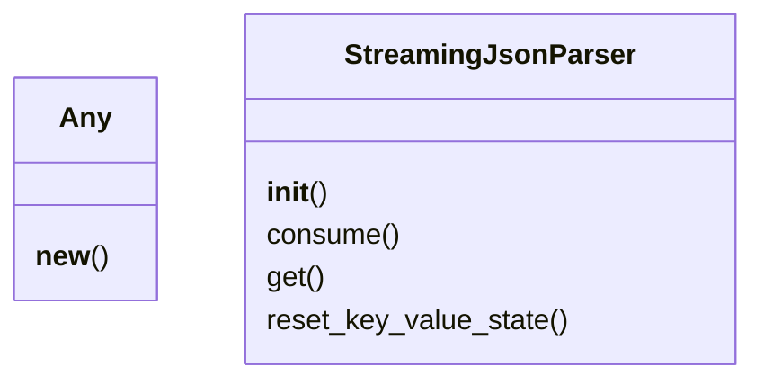

# Documentation for `bson_parser.py`

## Metadata
- **Name:** raw BSON Parser
- **Time Complexity:** O(n)
- **Space Complexity:** O(n)
- **Overall Complexity:** O(n) time, O(n) space
- **Description:** BSON-style streaming parser.
- **Strengths:** ['Handles binary data efficiently']
- **Weaknesses:** ['Simplified implementation']
- **Best Use Case:** Applications requiring BSON support.

## Class Diagram


## Flowchart
```mermaid
flowchart TD

```

