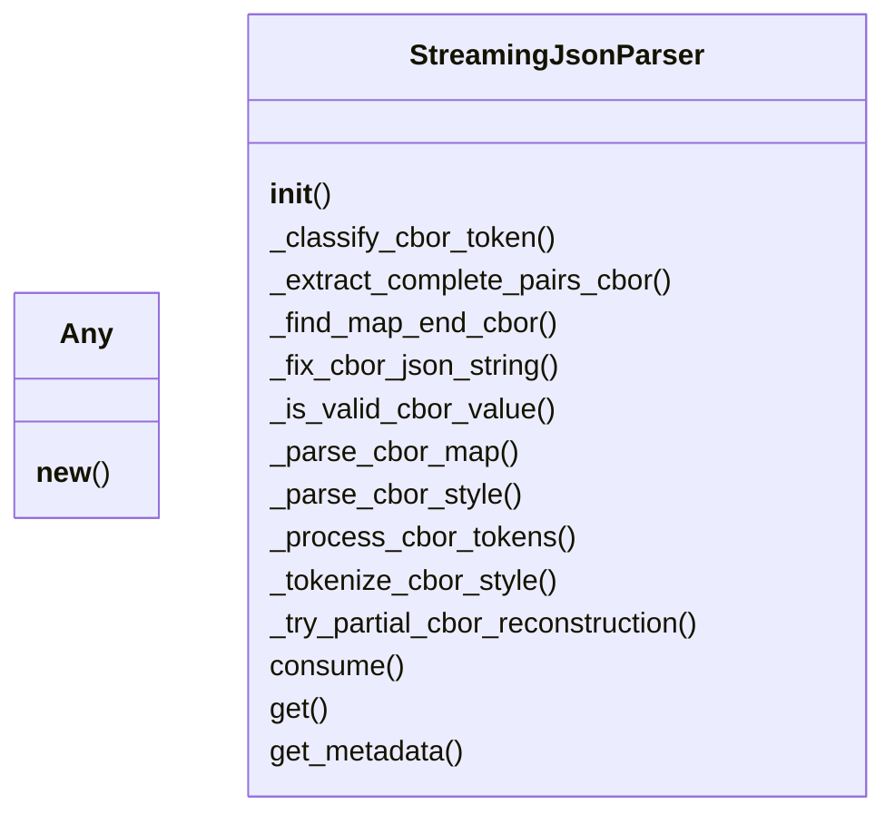

# Documentation for `cbor_parser.py`

## Class Diagram

```mermaid
classDiagram
  class Any
  Any : __new__()
  class StreamingJsonParser
  StreamingJsonParser : __init__()
  StreamingJsonParser : _classify_cbor_token()
  StreamingJsonParser : _extract_complete_pairs_cbor()
  StreamingJsonParser : _find_map_end_cbor()
  StreamingJsonParser : _fix_cbor_json_string()
  StreamingJsonParser : _is_valid_cbor_value()
  StreamingJsonParser : _parse_cbor_map()
  StreamingJsonParser : _parse_cbor_style()
  StreamingJsonParser : _process_cbor_tokens()
  StreamingJsonParser : _tokenize_cbor_style()
  StreamingJsonParser : _try_partial_cbor_reconstruction()
  StreamingJsonParser : consume()
  StreamingJsonParser : get()
  StreamingJsonParser : get_metadata()

```

## Flowchart
```mermaid
flowchart TD

```

