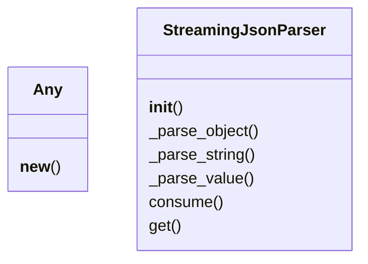

# Documentation for `pickle_parser.py`

## Class Diagram

```mermaid
classDiagram
  class Any
  Any : __new__()
  class StreamingJsonParser
  StreamingJsonParser : __init__()
  StreamingJsonParser : _parse_object()
  StreamingJsonParser : _parse_string()
  StreamingJsonParser : _parse_value()
  StreamingJsonParser : consume()
  StreamingJsonParser : get()

```

## Flowchart
```mermaid
flowchart TD

```

