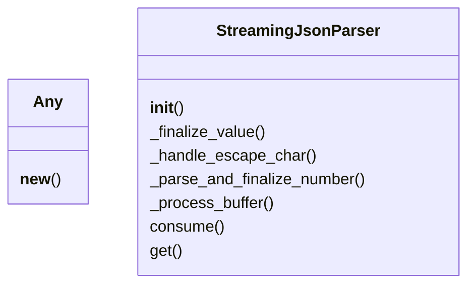
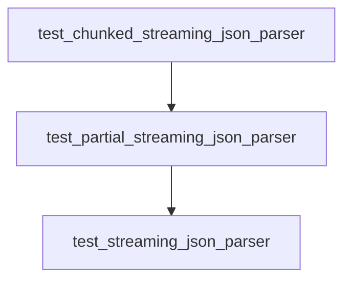

# Documentation for `ultrajson_parser.py`

## Class Diagram

```mermaid
classDiagram
  class Any
  Any : __new__()
  class StreamingJsonParser
  StreamingJsonParser : __init__()
  StreamingJsonParser : _finalize_value()
  StreamingJsonParser : _handle_escape_char()
  StreamingJsonParser : _parse_and_finalize_number()
  StreamingJsonParser : _process_buffer()
  StreamingJsonParser : consume()
  StreamingJsonParser : get()

```

## Flowchart

```mermaid
flowchart TD
  test_chunked_streaming_json_parser --> test_partial_streaming_json_parser
  test_partial_streaming_json_parser --> test_streaming_json_parser

```

