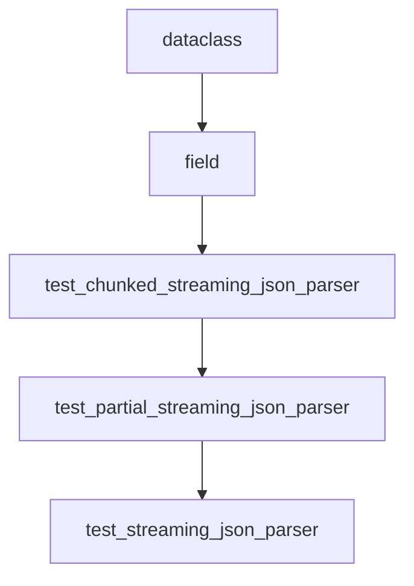

# Documentation for `bson_parser.py`

## Class Diagram

```mermaid
classDiagram
  class Any
  Any : __new__()
  class BinaryProcessor
  BinaryProcessor : convert_to_binary()
  BinaryProcessor : safe_decode_binary()
  BinaryProcessor : try_read_length()
  class BsonStyleProcessor
  BsonStyleProcessor : __init__()
  BsonStyleProcessor : _add_to_binary_buffer()
  BsonStyleProcessor : _clear_processed_data()
  BsonStyleProcessor : _get_remaining_string()
  BsonStyleProcessor : _has_remaining_data()
  BsonStyleProcessor : _parse_bson_style()
  BsonStyleProcessor : _parse_json_documents()
  BsonStyleProcessor : _process_current_document()
  BsonStyleProcessor : _try_process_document()
  BsonStyleProcessor : _try_read_document_length()
  BsonStyleProcessor : process_buffer()
  class DocumentExtractor
  DocumentExtractor : _is_string_delimiter()
  DocumentExtractor : _update_brace_count()
  DocumentExtractor : extract_documents()
  class DocumentFormatter
  DocumentFormatter : balance_braces()
  class DocumentParser
  DocumentParser : __init__()
  DocumentParser : _try_direct_parse()
  DocumentParser : _try_partial_parse()
  DocumentParser : parse_document()
  class DocumentValidator
  DocumentValidator : contains_json_structure()
  DocumentValidator : is_valid_key()
  DocumentValidator : is_valid_value()
  class PairExtractor
  PairExtractor : extract_complete_pairs()
  class ParserState
  ParserState : __eq__()
  ParserState : __init__()
  ParserState : __repr__()
  class StreamingJsonParser
  StreamingJsonParser : __init__()
  StreamingJsonParser : _finalize_value()
  StreamingJsonParser : _handle_escape_char()
  StreamingJsonParser : _parse_and_finalize_number()
  StreamingJsonParser : _process_buffer()
  StreamingJsonParser : consume()
  StreamingJsonParser : get()

```

## Flowchart

```mermaid
flowchart TD
  dataclass --> field
  field --> test_chunked_streaming_json_parser
  test_chunked_streaming_json_parser --> test_partial_streaming_json_parser
  test_partial_streaming_json_parser --> test_streaming_json_parser

```

