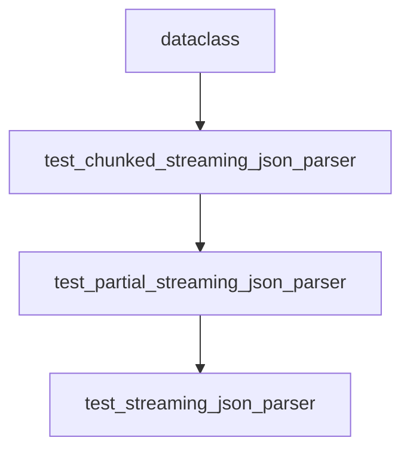

# Documentation for `cbor_parser.py`

## Class Diagram

```mermaid
classDiagram
  class Any
  Any : __new__()
  class CborProcessor
  CborProcessor : _parse_complete_segment()
  CborProcessor : _process_single_map()
  CborProcessor : process()
  class CborToken
  CborToken : __delattr__()
  CborToken : __eq__()
  CborToken : __hash__()
  CborToken : __init__()
  CborToken : __repr__()
  CborToken : __setattr__()
  class CborTokenizer
  CborTokenizer : _process_character()
  CborTokenizer : _process_non_string_character()
  CborTokenizer : _process_string_character()
  CborTokenizer : tokenize()
  class JsonStringBuilder
  JsonStringBuilder : _get_value_literal()
  JsonStringBuilder : _use_raw_token()
  JsonStringBuilder : build_json_string()
  JsonStringBuilder : repair_json_string()
  class MapTokenProcessor
  MapTokenProcessor : find_map_end()
  MapTokenProcessor : find_map_starts()
  class PartialObjectParser
  PartialObjectParser : _extract_key_at_index()
  PartialObjectParser : _has_colon_at_index()
  PartialObjectParser : _has_comma_at_index()
  PartialObjectParser : _parse_value_at_index()
  PartialObjectParser : _try_parse_key_value_pair()
  PartialObjectParser : parse_partial_object()
  class StreamingJsonParser
  StreamingJsonParser : __init__()
  StreamingJsonParser : _finalize_value()
  StreamingJsonParser : _handle_escape_char()
  StreamingJsonParser : _parse_and_finalize_number()
  StreamingJsonParser : _process_buffer()
  StreamingJsonParser : consume()
  StreamingJsonParser : get()
  class TokenBuffer
  TokenBuffer : flush_to_tokens()
  TokenBuffer : is_structural_char()
  TokenBuffer : is_whitespace()
  class TokenClassifier
  TokenClassifier : _classify_literal()
  TokenClassifier : _classify_numeric()
  TokenClassifier : _is_string_literal()
  TokenClassifier : classify_token()
  class TokenizeState
  TokenizeState : __eq__()
  TokenizeState : __init__()
  TokenizeState : __repr__()

```

## Flowchart

```mermaid
flowchart TD
  dataclass --> test_chunked_streaming_json_parser
  test_chunked_streaming_json_parser --> test_partial_streaming_json_parser
  test_partial_streaming_json_parser --> test_streaming_json_parser

```

