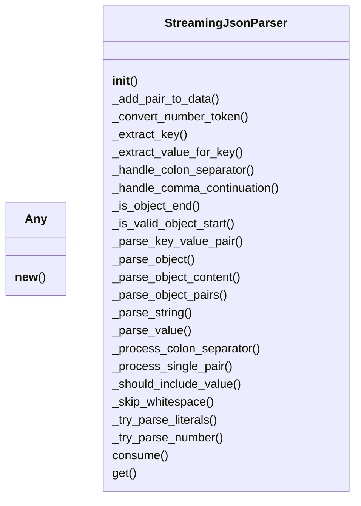

# Documentation for `flatbuffers_parser.py`

## Class Diagram

```mermaid
classDiagram
  class Any
  Any : __new__()
  class StreamingJsonParser
  StreamingJsonParser : __init__()
  StreamingJsonParser : _add_pair_to_data()
  StreamingJsonParser : _convert_number_token()
  StreamingJsonParser : _extract_key()
  StreamingJsonParser : _extract_value_for_key()
  StreamingJsonParser : _handle_colon_separator()
  StreamingJsonParser : _handle_comma_continuation()
  StreamingJsonParser : _is_object_end()
  StreamingJsonParser : _is_valid_object_start()
  StreamingJsonParser : _parse_key_value_pair()
  StreamingJsonParser : _parse_object()
  StreamingJsonParser : _parse_object_content()
  StreamingJsonParser : _parse_object_pairs()
  StreamingJsonParser : _parse_string()
  StreamingJsonParser : _parse_value()
  StreamingJsonParser : _process_colon_separator()
  StreamingJsonParser : _process_single_pair()
  StreamingJsonParser : _should_include_value()
  StreamingJsonParser : _skip_whitespace()
  StreamingJsonParser : _try_parse_literals()
  StreamingJsonParser : _try_parse_number()
  StreamingJsonParser : consume()
  StreamingJsonParser : get()

```

## Flowchart
```mermaid
flowchart TD

```

