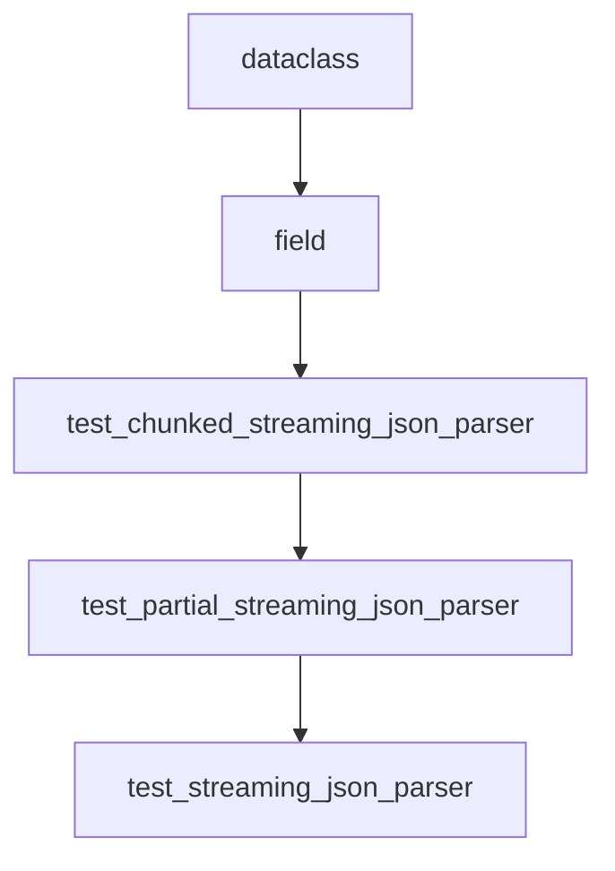

# Documentation for `parquet_parser.py`

## Class Diagram

```mermaid
classDiagram
  class Any
  Any : __new__()
  class FieldExtractor
  FieldExtractor : _extract_key_value_from_line()
  FieldExtractor : extract_fields()
  class JsonMessageDecoder
  JsonMessageDecoder : __init__()
  JsonMessageDecoder : decode()
  class MessageExtractionState
  MessageExtractionState : __init__()
  MessageExtractionState : _complete_message()
  MessageExtractionState : _handle_brace_character()
  MessageExtractionState : _is_string_delimiter()
  MessageExtractionState : finalize()
  MessageExtractionState : get_messages()
  MessageExtractionState : process_character()
  class MessageExtractor
  MessageExtractor : _update_braces()
  MessageExtractor : extract_messages()
  class MessageFormatter
  MessageFormatter : correct_format()
  class MessageValidator
  MessageValidator : is_valid_key()
  MessageValidator : is_valid_value()
  class PairExtractor
  PairExtractor : extract_complete_pairs()
  class ParquetStyleProcessor
  ParquetStyleProcessor : __init__()
  ParquetStyleProcessor : _decode_message()
  ParquetStyleProcessor : process_buffer()
  class ParsedMessage
  ParsedMessage : __delattr__()
  ParsedMessage : __eq__()
  ParsedMessage : __hash__()
  ParsedMessage : __init__()
  ParsedMessage : __repr__()
  ParsedMessage : __setattr__()
  class ParserState
  ParserState : __eq__()
  ParserState : __init__()
  ParserState : __repr__()
  class PartialMessageDecoder
  PartialMessageDecoder : __init__()
  PartialMessageDecoder : decode()
  class StreamingJsonParser
  StreamingJsonParser : __init__()
  StreamingJsonParser : _finalize_value()
  StreamingJsonParser : _handle_boolean_or_null()
  StreamingJsonParser : _handle_escape_char()
  StreamingJsonParser : _handle_expect_colon()
  StreamingJsonParser : _handle_expect_comma_or_obj_end()
  StreamingJsonParser : _handle_expect_key_start()
  StreamingJsonParser : _handle_expect_obj_start()
  StreamingJsonParser : _handle_expect_value_start()
  StreamingJsonParser : _handle_in_false()
  StreamingJsonParser : _handle_in_key()
  StreamingJsonParser : _handle_in_key_escape()
  StreamingJsonParser : _handle_in_null()
  StreamingJsonParser : _handle_in_number()
  StreamingJsonParser : _handle_in_string_value()
  StreamingJsonParser : _handle_in_string_value_escape()
  StreamingJsonParser : _handle_in_true()
  StreamingJsonParser : _handle_obj_end()
  StreamingJsonParser : _parse_and_finalize_number()
  StreamingJsonParser : _process_buffer()
  StreamingJsonParser : consume()
  StreamingJsonParser : get()
  class ValueParser
  ValueParser : _is_quoted_string()
  ValueParser : _try_parse_number()
  ValueParser : parse_value()

```

## Flowchart

```mermaid
flowchart TD
  dataclass --> field
  field --> test_chunked_streaming_json_parser
  test_chunked_streaming_json_parser --> test_partial_streaming_json_parser
  test_partial_streaming_json_parser --> test_streaming_json_parser

```

