# Documentation for `ultrajson_parser.py`

## Class Diagram

```mermaid
classDiagram
  class StreamingJsonParser
  StreamingJsonParser : __init__()
  StreamingJsonParser : consume()
  StreamingJsonParser : get()
  StreamingJsonParser : _handle_escape_char()
  StreamingJsonParser : _finalize_value()
  StreamingJsonParser : _parse_and_finalize_number()
  StreamingJsonParser : _process_buffer()
  class ParserState
  class ObjectParseState
  class ByteValidator
  ByteValidator : is_valid_key()
  ByteValidator : is_object_start_byte()
  ByteValidator : is_object_end_byte()
  ByteValidator : is_quote_byte()
  ByteValidator : is_escape_byte()
  class PairExtractor
  PairExtractor : extract_complete_pairs()
  class ByteProcessor
  ByteProcessor : convert_to_bytes()
  ByteProcessor : find_byte_position()
  ByteProcessor : safe_decode_bytes()
  class ObjectBoundaryFinder
  ObjectBoundaryFinder : find_object_boundaries()
  ObjectBoundaryFinder : _find_object_start()
  ObjectBoundaryFinder : _find_object_end()
  ObjectBoundaryFinder : _should_skip_byte()
  ObjectBoundaryFinder : _update_parse_state()
  ObjectBoundaryFinder : _is_object_complete()
  class ObjectParser
  ObjectParser : __init__()
  ObjectParser : parse_object()
  ObjectParser : _try_standard_json_parse()
  ObjectParser : _try_partial_parse()
  ObjectParser : _try_balance_and_parse()
  ObjectParser : _calculate_brace_balance()
  ObjectParser : _extract_fields_fast()
  ObjectParser : _extract_key_value_pairs()
  ObjectParser : _find_next_key()
  ObjectParser : _find_value_for_key()
  ObjectParser : _skip_whitespace()
  ObjectParser : _extract_value_fast()
  ObjectParser : _extract_string_value()
  ObjectParser : _extract_number_value()
  ObjectParser : _extract_literal_value()
  class UltraFastProcessor
  UltraFastProcessor : __init__()
  UltraFastProcessor : process_buffer()
  UltraFastProcessor : _has_more_data()
  UltraFastProcessor : _is_complete_object()
  UltraFastProcessor : _process_complete_object()
```

## Flowchart

## Live Execution
[▶ Visualize in Python Tutor](https://pythontutor.com/visualize.html#code=%22%22%22%0AUltra-JSON%20streaming%20parser%20implementation%20with%20SOLID%20principles.%0A%0AThis%20module%20%2Apreviously%2A%20implemented%20a%20streaming%20JSON%20parser%20inspired%20by%20Ultra-JSON%20high-performance%20techniques.%0AThe%20StreamingJsonParser%20class%20below%20has%20been%20refactored%20to%20be%20a%20direct%2C%20byte-based%0Astreaming%20JSON%20parser%20adhering%20to%20the%20project-wide%20specification.%0AThe%20original%20Ultra-JSON-inspired%20helper%20classes%20remain%20but%20are%20no%20longer%20used%20by%20StreamingJsonParser.%0A%22%22%22%0Aimport%20json%0Afrom%20dataclasses%20import%20dataclass%2C%20field%0Afrom%20typing%20import%20Any%2C%20Dict%2C%20Optional%2C%20Tuple%0A%0A%23%20---%20Start%20of%20Refactored%20StreamingJsonParser%20and%20its%20dependencies%20---%0A%23%20%28Identical%20to%20the%20implementation%20in%20raw/ultrajson_parser.py%20for%20consistency%20and%20compliance%29%0A%0A%23%20State%20constants%20for%20the%20parser%0A_ST_EXPECT_OBJ_START%20%3D%200%0A_ST_EXPECT_KEY_START%20%3D%201%20%20%23%20After%20%27%7B%27%20or%20%27%2C%27%0A_ST_IN_KEY%20%3D%202%0A_ST_IN_KEY_ESCAPE%20%3D%203%0A_ST_EXPECT_COLON%20%3D%204%0A_ST_EXPECT_VALUE_START%20%3D%205%0A_ST_IN_STRING_VALUE%20%3D%206%0A_ST_IN_STRING_VALUE_ESCAPE%20%3D%207%0A_ST_IN_NUMBER%20%3D%208%0A_ST_IN_TRUE%20%3D%209%0A_ST_IN_FALSE%20%3D%2010%0A_ST_IN_NULL%20%3D%2011%0A_ST_EXPECT_COMMA_OR_OBJ_END%20%3D%2012%0A_ST_OBJ_END%20%3D%2013%0A_ST_ERROR%20%3D%2099%0A%0A_WHITESPACE%20%3D%20b%22%20%5Ct%5Cn%5Cr%22%0A_DIGITS%20%3D%20b%220123456789%22%0A_NUMBER_CHARS%20%3D%20_DIGITS%20%2B%20b%22-.eE%2B%22%0A%0Aclass%20StreamingJsonParser%3A%0A%20%20%20%20%22%22%22%0A%20%20%20%20A%20streaming%20JSON%20parser%20that%20processes%20byte-based%20input%20incrementally.%0A%20%20%20%20It%20can%20handle%20partial%20JSON%20objects%20and%20incomplete%20string%20values%2C%0A%20%20%20%20returning%20the%20currently%20parsed%20data%20structure%20at%20any%20point.%0A%20%20%20%20This%20version%20replaces%20the%20original%20Ultra-JSON-style%20parser%20in%20this%20module.%0A%20%20%20%20%22%22%22%0A%0A%20%20%20%20def%20__init__%28self%29%3A%0A%20%20%20%20%20%20%20%20%22%22%22Initializes%20the%20streaming%20JSON%20parser.%22%22%22%0A%20%20%20%20%20%20%20%20self._buffer%20%3D%20bytearray%28%29%0A%20%20%20%20%20%20%20%20self._result%3A%20Dict%5Bstr%2C%20Any%5D%20%3D%20%7B%7D%0A%20%20%20%20%20%20%20%20self._state%20%3D%20_ST_EXPECT_OBJ_START%0A%0A%20%20%20%20%20%20%20%20self._current_key_bytes%20%3D%20bytearray%28%29%0A%20%20%20%20%20%20%20%20self._current_value_bytes%20%3D%20bytearray%28%29%0A%20%20%20%20%20%20%20%20%0A%20%20%20%20%20%20%20%20self._active_key%3A%20Optional%5Bstr%5D%20%3D%20None%20%23%20Stores%20the%20decoded%20string%20of%20the%20last%20fully%20parsed%20key%0A%20%20%20%20%20%20%20%20self._idx%20%3D%200%20%23%20Current%20parsing%20index%20within%20self._buffer%0A%0A%20%20%20%20def%20consume%28self%2C%20buffer%3A%20str%29%20-%3E%20None%3A%0A%20%20%20%20%20%20%20%20%22%22%22%0A%20%20%20%20%20%20%20%20Consumes%20a%20chunk%20of%20JSON%20data.%0A%0A%20%20%20%20%20%20%20%20Args%3A%0A%20%20%20%20%20%20%20%20%20%20%20%20buffer%3A%20A%20string%20containing%20a%20part%20of%20the%20JSON%20document.%0A%20%20%20%20%20%20%20%20%22%22%22%0A%20%20%20%20%20%20%20%20if%20not%20isinstance%28buffer%2C%20str%29%3A%0A%20%20%20%20%20%20%20%20%20%20%20%20return%20%23%20Ignore%20invalid%20chunk%20types%20gracefully%0A%20%20%20%20%20%20%20%20%23%20Convert%20string%20to%20bytes%20for%20internal%20processing%0A%20%20%20%20%20%20%20%20chunk%20%3D%20buffer.encode%28%27utf-8%27%29%0A%20%20%20%20%20%20%20%20self._buffer.extend%28chunk%29%0A%20%20%20%20%20%20%20%20self._process_buffer%28%29%0A%0A%20%20%20%20def%20get%28self%29%20-%3E%20Dict%5Bstr%2C%20Any%5D%3A%0A%20%20%20%20%20%20%20%20%22%22%22%0A%20%20%20%20%20%20%20%20Returns%20the%20current%20state%20of%20the%20parsed%20JSON%20object.%0A%20%20%20%20%20%20%20%20This%20includes%20any%20fully%20parsed%20key-value%20pairs%20and%20partially%0A%20%20%20%20%20%20%20%20completed%20string%20values%20if%20a%20key%20has%20been%20fully%20parsed.%0A%20%20%20%20%20%20%20%20Incomplete%20keys%20are%20not%20included.%0A%0A%20%20%20%20%20%20%20%20Returns%3A%0A%20%20%20%20%20%20%20%20%20%20%20%20A%20dictionary%20representing%20the%20currently%20parsed%20JSON%20object.%0A%20%20%20%20%20%20%20%20%22%22%22%0A%20%20%20%20%20%20%20%20output_dict%20%3D%20self._result.copy%28%29%0A%0A%20%20%20%20%20%20%20%20if%20self._active_key%20is%20not%20None%20and%20self._state%20%3D%3D%20_ST_IN_STRING_VALUE%3A%0A%20%20%20%20%20%20%20%20%20%20%20%20if%20self._current_value_bytes%3A%0A%20%20%20%20%20%20%20%20%20%20%20%20%20%20%20%20try%3A%0A%20%20%20%20%20%20%20%20%20%20%20%20%20%20%20%20%20%20%20%20partial_value_str%20%3D%20self._current_value_bytes.decode%28%27utf-8%27%2C%20errors%3D%27replace%27%29%0A%20%20%20%20%20%20%20%20%20%20%20%20%20%20%20%20%20%20%20%20output_dict%5Bself._active_key%5D%20%3D%20partial_value_str%0A%20%20%20%20%20%20%20%20%20%20%20%20%20%20%20%20except%20Exception%3A%0A%20%20%20%20%20%20%20%20%20%20%20%20%20%20%20%20%20%20%20%20pass%20%0A%20%20%20%20%20%20%20%20return%20output_dict%0A%0A%20%20%20%20def%20_handle_escape_char%28self%2C%20byte_val%3A%20int%29%20-%3E%20int%3A%0A%20%20%20%20%20%20%20%20%22%22%22Handles%20JSON%20escape%20sequences.%22%22%22%0A%20%20%20%20%20%20%20%20if%20byte_val%20%3D%3D%20b%27%22%27%5B0%5D%3A%20return%20b%27%22%27%5B0%5D%0A%20%20%20%20%20%20%20%20if%20byte_val%20%3D%3D%20b%27%5C%5C%27%5B0%5D%3A%20return%20b%27%5C%5C%27%5B0%5D%0A%20%20%20%20%20%20%20%20if%20byte_val%20%3D%3D%20b%27/%27%5B0%5D%3A%20return%20b%27/%27%5B0%5D%0A%20%20%20%20%20%20%20%20if%20byte_val%20%3D%3D%20b%27b%27%5B0%5D%3A%20return%20b%27%5Cb%27%5B0%5D%0A%20%20%20%20%20%20%20%20if%20byte_val%20%3D%3D%20b%27f%27%5B0%5D%3A%20return%20b%27%5Cf%27%5B0%5D%0A%20%20%20%20%20%20%20%20if%20byte_val%20%3D%3D%20b%27n%27%5B0%5D%3A%20return%20b%27%5Cn%27%5B0%5D%0A%20%20%20%20%20%20%20%20if%20byte_val%20%3D%3D%20b%27r%27%5B0%5D%3A%20return%20b%27%5Cr%27%5B0%5D%0A%20%20%20%20%20%20%20%20if%20byte_val%20%3D%3D%20b%27t%27%5B0%5D%3A%20return%20b%27%5Ct%27%5B0%5D%0A%20%20%20%20%20%20%20%20return%20byte_val%0A%0A%20%20%20%20def%20_finalize_value%28self%2C%20value%3A%20Any%29%3A%0A%20%20%20%20%20%20%20%20%22%22%22Helper%20to%20assign%20a%20parsed%20value%20to%20the%20active%20key%20and%20reset.%22%22%22%0A%20%20%20%20%20%20%20%20if%20self._active_key%20is%20not%20None%3A%0A%20%20%20%20%20%20%20%20%20%20%20%20self._result%5Bself._active_key%5D%20%3D%20value%0A%20%20%20%20%20%20%20%20self._active_key%20%3D%20None%0A%20%20%20%20%20%20%20%20self._current_value_bytes.clear%28%29%0A%20%20%20%20%20%20%20%20self._state%20%3D%20_ST_EXPECT_COMMA_OR_OBJ_END%0A%20%20%20%20%20%20%20%20%0A%20%20%20%20def%20_parse_and_finalize_number%28self%29%3A%0A%20%20%20%20%20%20%20%20%22%22%22Parses%20the%20number%20in%20_current_value_bytes%20and%20finalizes%20it.%22%22%22%0A%20%20%20%20%20%20%20%20if%20not%20self._current_value_bytes%3A%0A%20%20%20%20%20%20%20%20%20%20%20%20self._state%20%3D%20_ST_ERROR%3B%20return%20False%0A%0A%20%20%20%20%20%20%20%20num_str%20%3D%20self._current_value_bytes.decode%28%27utf-8%27%29%20%0A%0A%20%20%20%20%20%20%20%20if%20num_str%20%3D%3D%20%22-%22%20or%20num_str%20%3D%3D%20%22%2B%22%20or%20num_str.endswith%28%28%27.%27%2C%20%27e%27%2C%20%27E%27%2C%20%27%2B%27%2C%20%27-%27%29%29%3A%0A%20%20%20%20%20%20%20%20%20%20%20%20self._state%20%3D%20_ST_ERROR%3B%20return%20False%0A%0A%20%20%20%20%20%20%20%20try%3A%0A%20%20%20%20%20%20%20%20%20%20%20%20if%20any%28c%20in%20num_str%20for%20c%20in%20%28%27.%27%2C%20%27e%27%2C%20%27E%27%29%29%3A%0A%20%20%20%20%20%20%20%20%20%20%20%20%20%20%20%20parsed_num%20%3D%20float%28num_str%29%0A%20%20%20%20%20%20%20%20%20%20%20%20else%3A%0A%20%20%20%20%20%20%20%20%20%20%20%20%20%20%20%20parsed_num%20%3D%20int%28num_str%29%0A%20%20%20%20%20%20%20%20%20%20%20%20self._finalize_value%28parsed_num%29%0A%20%20%20%20%20%20%20%20%20%20%20%20return%20True%0A%20%20%20%20%20%20%20%20except%20ValueError%3A%20%0A%20%20%20%20%20%20%20%20%20%20%20%20self._state%20%3D%20_ST_ERROR%3B%20return%20False%0A%0A%20%20%20%20def%20_process_buffer%28self%29%3A%0A%20%20%20%20%20%20%20%20%22%22%22Processes%20the%20internal%20buffer%20to%20parse%20JSON%20content%20using%20a%20state%20machine.%22%22%22%0A%20%20%20%20%20%20%20%20buffer_len%20%3D%20len%28self._buffer%29%0A%20%20%20%20%20%20%20%20while%20self._idx%20%3C%20buffer_len%3A%0A%20%20%20%20%20%20%20%20%20%20%20%20byte%20%3D%20self._buffer%5Bself._idx%5D%0A%0A%20%20%20%20%20%20%20%20%20%20%20%20if%20self._state%20%3D%3D%20_ST_EXPECT_OBJ_START%3A%0A%20%20%20%20%20%20%20%20%20%20%20%20%20%20%20%20if%20byte%20in%20_WHITESPACE%3A%20self._idx%20%2B%3D%201%3B%20continue%0A%20%20%20%20%20%20%20%20%20%20%20%20%20%20%20%20if%20byte%20%3D%3D%20b%27%7B%27%5B0%5D%3A%20self._state%20%3D%20_ST_EXPECT_KEY_START%3B%20self._idx%20%2B%3D%201%0A%20%20%20%20%20%20%20%20%20%20%20%20%20%20%20%20else%3A%20self._state%20%3D%20_ST_ERROR%3B%20return%20%0A%20%20%20%20%20%20%20%20%20%20%20%20%0A%20%20%20%20%20%20%20%20%20%20%20%20elif%20self._state%20%3D%3D%20_ST_EXPECT_KEY_START%3A%0A%20%20%20%20%20%20%20%20%20%20%20%20%20%20%20%20if%20byte%20in%20_WHITESPACE%3A%20self._idx%20%2B%3D%201%3B%20continue%0A%20%20%20%20%20%20%20%20%20%20%20%20%20%20%20%20if%20byte%20%3D%3D%20b%27%22%27%5B0%5D%3A%0A%20%20%20%20%20%20%20%20%20%20%20%20%20%20%20%20%20%20%20%20self._state%20%3D%20_ST_IN_KEY%0A%20%20%20%20%20%20%20%20%20%20%20%20%20%20%20%20%20%20%20%20self._current_key_bytes.clear%28%29%0A%20%20%20%20%20%20%20%20%20%20%20%20%20%20%20%20%20%20%20%20self._active_key%20%3D%20None%20%0A%20%20%20%20%20%20%20%20%20%20%20%20%20%20%20%20%20%20%20%20self._idx%20%2B%3D%201%0A%20%20%20%20%20%20%20%20%20%20%20%20%20%20%20%20elif%20byte%20%3D%3D%20b%27%7D%27%5B0%5D%3A%20self._state%20%3D%20_ST_OBJ_END%3B%20self._idx%20%2B%3D%201%0A%20%20%20%20%20%20%20%20%20%20%20%20%20%20%20%20else%3A%20self._state%20%3D%20_ST_ERROR%3B%20return%20%0A%0A%20%20%20%20%20%20%20%20%20%20%20%20elif%20self._state%20%3D%3D%20_ST_IN_KEY%3A%0A%20%20%20%20%20%20%20%20%20%20%20%20%20%20%20%20if%20byte%20%3D%3D%20b%27%5C%5C%27%5B0%5D%3A%20self._state%20%3D%20_ST_IN_KEY_ESCAPE%3B%20self._idx%20%2B%3D%201%0A%20%20%20%20%20%20%20%20%20%20%20%20%20%20%20%20elif%20byte%20%3D%3D%20b%27%22%27%5B0%5D%3A%0A%20%20%20%20%20%20%20%20%20%20%20%20%20%20%20%20%20%20%20%20try%3A%0A%20%20%20%20%20%20%20%20%20%20%20%20%20%20%20%20%20%20%20%20%20%20%20%20self._active_key%20%3D%20self._current_key_bytes.decode%28%27utf-8%27%29%0A%20%20%20%20%20%20%20%20%20%20%20%20%20%20%20%20%20%20%20%20%20%20%20%20self._state%20%3D%20_ST_EXPECT_COLON%0A%20%20%20%20%20%20%20%20%20%20%20%20%20%20%20%20%20%20%20%20except%20UnicodeDecodeError%3A%0A%20%20%20%20%20%20%20%20%20%20%20%20%20%20%20%20%20%20%20%20%20%20%20%20self._active_key%20%3D%20None%3B%20self._state%20%3D%20_ST_ERROR%3B%20return%20%0A%20%20%20%20%20%20%20%20%20%20%20%20%20%20%20%20%20%20%20%20self._idx%20%2B%3D%201%0A%20%20%20%20%20%20%20%20%20%20%20%20%20%20%20%20else%3A%20self._current_key_bytes.append%28byte%29%3B%20self._idx%20%2B%3D%201%0A%20%20%20%20%20%20%20%20%20%20%20%20%0A%20%20%20%20%20%20%20%20%20%20%20%20elif%20self._state%20%3D%3D%20_ST_IN_KEY_ESCAPE%3A%0A%20%20%20%20%20%20%20%20%20%20%20%20%20%20%20%20self._current_key_bytes.append%28self._handle_escape_char%28byte%29%29%0A%20%20%20%20%20%20%20%20%20%20%20%20%20%20%20%20self._state%20%3D%20_ST_IN_KEY%3B%20self._idx%20%2B%3D%201%0A%0A%20%20%20%20%20%20%20%20%20%20%20%20elif%20self._state%20%3D%3D%20_ST_EXPECT_COLON%3A%0A%20%20%20%20%20%20%20%20%20%20%20%20%20%20%20%20if%20byte%20in%20_WHITESPACE%3A%20self._idx%20%2B%3D%201%3B%20continue%0A%20%20%20%20%20%20%20%20%20%20%20%20%20%20%20%20if%20byte%20%3D%3D%20b%27%3A%27%5B0%5D%3A%20self._state%20%3D%20_ST_EXPECT_VALUE_START%3B%20self._idx%20%2B%3D%201%0A%20%20%20%20%20%20%20%20%20%20%20%20%20%20%20%20else%3A%20self._state%20%3D%20_ST_ERROR%3B%20return%20%0A%0A%20%20%20%20%20%20%20%20%20%20%20%20elif%20self._state%20%3D%3D%20_ST_EXPECT_VALUE_START%3A%0A%20%20%20%20%20%20%20%20%20%20%20%20%20%20%20%20if%20byte%20in%20_WHITESPACE%3A%20self._idx%20%2B%3D%201%3B%20continue%0A%20%20%20%20%20%20%20%20%20%20%20%20%20%20%20%20self._current_value_bytes.clear%28%29%0A%20%20%20%20%20%20%20%20%20%20%20%20%20%20%20%20if%20byte%20%3D%3D%20b%27%22%27%5B0%5D%3A%20self._state%20%3D%20_ST_IN_STRING_VALUE%3B%20self._idx%20%2B%3D%201%0A%20%20%20%20%20%20%20%20%20%20%20%20%20%20%20%20elif%20byte%20%3D%3D%20b%27t%27%5B0%5D%3A%20self._state%20%3D%20_ST_IN_TRUE%3B%20self._current_value_bytes.append%28byte%29%3B%20self._idx%20%2B%3D%201%0A%20%20%20%20%20%20%20%20%20%20%20%20%20%20%20%20elif%20byte%20%3D%3D%20b%27f%27%5B0%5D%3A%20self._state%20%3D%20_ST_IN_FALSE%3B%20self._current_value_bytes.append%28byte%29%3B%20self._idx%20%2B%3D%201%0A%20%20%20%20%20%20%20%20%20%20%20%20%20%20%20%20elif%20byte%20%3D%3D%20b%27n%27%5B0%5D%3A%20self._state%20%3D%20_ST_IN_NULL%3B%20self._current_value_bytes.append%28byte%29%3B%20self._idx%20%2B%3D%201%0A%20%20%20%20%20%20%20%20%20%20%20%20%20%20%20%20elif%20byte%20in%20_NUMBER_CHARS%20and%20%28byte%20%21%3D%20b%27%2B%27%5B0%5D%29%3A%20%0A%20%20%20%20%20%20%20%20%20%20%20%20%20%20%20%20%20%20%20%20self._state%20%3D%20_ST_IN_NUMBER%3B%20self._current_value_bytes.append%28byte%29%3B%20self._idx%20%2B%3D%201%0A%20%20%20%20%20%20%20%20%20%20%20%20%20%20%20%20else%3A%20self._state%20%3D%20_ST_ERROR%3B%20return%20%0A%0A%20%20%20%20%20%20%20%20%20%20%20%20elif%20self._state%20%3D%3D%20_ST_IN_STRING_VALUE%3A%0A%20%20%20%20%20%20%20%20%20%20%20%20%20%20%20%20if%20byte%20%3D%3D%20b%27%5C%5C%27%5B0%5D%3A%20self._state%20%3D%20_ST_IN_STRING_VALUE_ESCAPE%3B%20self._idx%20%2B%3D%201%0A%20%20%20%20%20%20%20%20%20%20%20%20%20%20%20%20elif%20byte%20%3D%3D%20b%27%22%27%5B0%5D%3A%0A%20%20%20%20%20%20%20%20%20%20%20%20%20%20%20%20%20%20%20%20if%20self._active_key%20is%20not%20None%3A%0A%20%20%20%20%20%20%20%20%20%20%20%20%20%20%20%20%20%20%20%20%20%20%20%20try%3A%0A%20%20%20%20%20%20%20%20%20%20%20%20%20%20%20%20%20%20%20%20%20%20%20%20%20%20%20%20value_str%20%3D%20self._current_value_bytes.decode%28%27utf-8%27%29%0A%20%20%20%20%20%20%20%20%20%20%20%20%20%20%20%20%20%20%20%20%20%20%20%20%20%20%20%20self._finalize_value%28value_str%29%0A%20%20%20%20%20%20%20%20%20%20%20%20%20%20%20%20%20%20%20%20%20%20%20%20except%20UnicodeDecodeError%3A%20%0A%20%20%20%20%20%20%20%20%20%20%20%20%20%20%20%20%20%20%20%20%20%20%20%20%20%20%20%20value_str%20%3D%20self._current_value_bytes.decode%28%27utf-8%27%2C%20errors%3D%27replace%27%29%0A%20%20%20%20%20%20%20%20%20%20%20%20%20%20%20%20%20%20%20%20%20%20%20%20%20%20%20%20self._finalize_value%28value_str%29%0A%20%20%20%20%20%20%20%20%20%20%20%20%20%20%20%20%20%20%20%20else%3A%20%0A%20%20%20%20%20%20%20%20%20%20%20%20%20%20%20%20%20%20%20%20%20%20%20%20self._state%20%3D%20_ST_ERROR%3B%20return%0A%20%20%20%20%20%20%20%20%20%20%20%20%20%20%20%20%20%20%20%20self._idx%20%2B%3D%201%0A%20%20%20%20%20%20%20%20%20%20%20%20%20%20%20%20else%3A%20self._current_value_bytes.append%28byte%29%3B%20self._idx%20%2B%3D%201%0A%0A%20%20%20%20%20%20%20%20%20%20%20%20elif%20self._state%20%3D%3D%20_ST_IN_STRING_VALUE_ESCAPE%3A%0A%20%20%20%20%20%20%20%20%20%20%20%20%20%20%20%20self._current_value_bytes.append%28self._handle_escape_char%28byte%29%29%0A%20%20%20%20%20%20%20%20%20%20%20%20%20%20%20%20self._state%20%3D%20_ST_IN_STRING_VALUE%3B%20self._idx%20%2B%3D%201%0A%20%20%20%20%20%20%20%20%20%20%20%20%0A%20%20%20%20%20%20%20%20%20%20%20%20elif%20self._state%20%3D%3D%20_ST_IN_TRUE%3A%0A%20%20%20%20%20%20%20%20%20%20%20%20%20%20%20%20self._current_value_bytes.append%28byte%29%3B%20self._idx%20%2B%3D%201%0A%20%20%20%20%20%20%20%20%20%20%20%20%20%20%20%20if%20self._current_value_bytes%20%3D%3D%20b%22true%22%3A%20self._finalize_value%28True%29%0A%20%20%20%20%20%20%20%20%20%20%20%20%20%20%20%20elif%20not%20b%22true%22.startswith%28self._current_value_bytes%29%3A%20self._state%20%3D%20_ST_ERROR%3B%20return%0A%20%20%20%20%20%20%20%20%20%20%20%20%0A%20%20%20%20%20%20%20%20%20%20%20%20elif%20self._state%20%3D%3D%20_ST_IN_FALSE%3A%0A%20%20%20%20%20%20%20%20%20%20%20%20%20%20%20%20self._current_value_bytes.append%28byte%29%3B%20self._idx%20%2B%3D%201%0A%20%20%20%20%20%20%20%20%20%20%20%20%20%20%20%20if%20self._current_value_bytes%20%3D%3D%20b%22false%22%3A%20self._finalize_value%28False%29%0A%20%20%20%20%20%20%20%20%20%20%20%20%20%20%20%20elif%20not%20b%22false%22.startswith%28self._current_value_bytes%29%3A%20self._state%20%3D%20_ST_ERROR%3B%20return%0A%0A%20%20%20%20%20%20%20%20%20%20%20%20elif%20self._state%20%3D%3D%20_ST_IN_NULL%3A%0A%20%20%20%20%20%20%20%20%20%20%20%20%20%20%20%20self._current_value_bytes.append%28byte%29%3B%20self._idx%20%2B%3D%201%0A%20%20%20%20%20%20%20%20%20%20%20%20%20%20%20%20if%20self._current_value_bytes%20%3D%3D%20b%22null%22%3A%20self._finalize_value%28None%29%0A%20%20%20%20%20%20%20%20%20%20%20%20%20%20%20%20elif%20not%20b%22null%22.startswith%28self._current_value_bytes%29%3A%20self._state%20%3D%20_ST_ERROR%3B%20return%0A%20%20%20%20%20%20%20%20%20%20%20%20%0A%20%20%20%20%20%20%20%20%20%20%20%20elif%20self._state%20%3D%3D%20_ST_IN_NUMBER%3A%0A%20%20%20%20%20%20%20%20%20%20%20%20%20%20%20%20if%20byte%20in%20_NUMBER_CHARS%3A%20%0A%20%20%20%20%20%20%20%20%20%20%20%20%20%20%20%20%20%20%20%20self._current_value_bytes.append%28byte%29%3B%20self._idx%20%2B%3D%201%0A%20%20%20%20%20%20%20%20%20%20%20%20%20%20%20%20else%3A%20%0A%20%20%20%20%20%20%20%20%20%20%20%20%20%20%20%20%20%20%20%20if%20not%20self._parse_and_finalize_number%28%29%3A%20return%20%0A%20%20%20%20%20%20%20%20%20%20%20%20%0A%20%20%20%20%20%20%20%20%20%20%20%20elif%20self._state%20%3D%3D%20_ST_EXPECT_COMMA_OR_OBJ_END%3A%0A%20%20%20%20%20%20%20%20%20%20%20%20%20%20%20%20if%20byte%20in%20_WHITESPACE%3A%20self._idx%20%2B%3D%201%3B%20continue%0A%20%20%20%20%20%20%20%20%20%20%20%20%20%20%20%20if%20byte%20%3D%3D%20b%27%2C%27%5B0%5D%3A%20self._state%20%3D%20_ST_EXPECT_KEY_START%3B%20self._idx%20%2B%3D%201%0A%20%20%20%20%20%20%20%20%20%20%20%20%20%20%20%20elif%20byte%20%3D%3D%20b%27%7D%27%5B0%5D%3A%20self._state%20%3D%20_ST_OBJ_END%3B%20self._idx%20%2B%3D%201%0A%20%20%20%20%20%20%20%20%20%20%20%20%20%20%20%20else%3A%20self._state%20%3D%20_ST_ERROR%3B%20return%20%0A%0A%20%20%20%20%20%20%20%20%20%20%20%20elif%20self._state%20%3D%3D%20_ST_OBJ_END%3A%0A%20%20%20%20%20%20%20%20%20%20%20%20%20%20%20%20if%20byte%20in%20_WHITESPACE%3A%20self._idx%20%2B%3D%201%3B%20continue%20%0A%20%20%20%20%20%20%20%20%20%20%20%20%20%20%20%20self._state%20%3D%20_ST_ERROR%3B%20return%20%0A%0A%20%20%20%20%20%20%20%20%20%20%20%20elif%20self._state%20%3D%3D%20_ST_ERROR%3A%0A%20%20%20%20%20%20%20%20%20%20%20%20%20%20%20%20return%20%0A%0A%20%20%20%20%20%20%20%20%20%20%20%20else%3A%20%0A%20%20%20%20%20%20%20%20%20%20%20%20%20%20%20%20self._state%20%3D%20_ST_ERROR%3B%20return%0A%20%20%20%20%20%20%20%20%0A%20%20%20%20%20%20%20%20if%20self._idx%20%3E%200%3A%0A%20%20%20%20%20%20%20%20%20%20%20%20self._buffer%20%3D%20self._buffer%5Bself._idx%3A%5D%0A%20%20%20%20%20%20%20%20%20%20%20%20self._idx%20%3D%200%0A%0A%23%20---%20End%20of%20Refactored%20StreamingJsonParser%20---%0A%0A%23%20---%20Original%20Ultra-JSON-inspired%20helper%20classes%20%28now%20unused%20by%20StreamingJsonParser%29%20---%0A%40dataclass%0Aclass%20ParserState%3A%20%23%20Original%20class%0A%20%20%20%20%22%22%22Immutable%20state%20container%20for%20the%20Ultra-JSON%20parser.%22%22%22%0A%20%20%20%20buffer%3A%20str%20%3D%20%22%22%0A%20%20%20%20parsed_data%3A%20Dict%5Bstr%2C%20Any%5D%20%3D%20field%28default_factory%3Ddict%29%0A%0A%0A%40dataclass%0Aclass%20ObjectParseState%3A%0A%20%20%20%20%22%22%22Immutable%20state%20for%20object%20parsing.%22%22%22%0A%20%20%20%20brace_count%3A%20int%20%3D%200%0A%20%20%20%20in_string%3A%20bool%20%3D%20False%0A%20%20%20%20escape_next%3A%20bool%20%3D%20False%0A%0A%0Aclass%20ByteValidator%3A%0A%20%20%20%20%22%22%22Stateless%20validator%20for%20Ultra-JSON-style%20byte%20processing.%22%22%22%0A%0A%20%20%20%20%40staticmethod%0A%20%20%20%20def%20is_valid_key%28key%3A%20str%29%20-%3E%20bool%3A%0A%20%20%20%20%20%20%20%20%22%22%22Validate%20if%20a%20key%20is%20valid%20for%20high-performance%20processing.%22%22%22%0A%20%20%20%20%20%20%20%20return%20isinstance%28key%2C%20str%29%20and%20len%28key%29%20%3E%200%0A%0A%20%20%20%20%40staticmethod%0A%20%20%20%20def%20is_object_start_byte%28byte_val%3A%20int%29%20-%3E%20bool%3A%0A%20%20%20%20%20%20%20%20%22%22%22Check%20if%20byte%20represents%20object%20start.%22%22%22%0A%20%20%20%20%20%20%20%20return%20byte_val%20%3D%3D%20ord%28%27%7B%27%29%0A%0A%20%20%20%20%40staticmethod%0A%20%20%20%20def%20is_object_end_byte%28byte_val%3A%20int%29%20-%3E%20bool%3A%0A%20%20%20%20%20%20%20%20%22%22%22Check%20if%20byte%20represents%20object%20end.%22%22%22%0A%20%20%20%20%20%20%20%20return%20byte_val%20%3D%3D%20ord%28%27%7D%27%29%0A%0A%20%20%20%20%40staticmethod%0A%20%20%20%20def%20is_quote_byte%28byte_val%3A%20int%29%20-%3E%20bool%3A%0A%20%20%20%20%20%20%20%20%22%22%22Check%20if%20byte%20represents%20a%20quote.%22%22%22%0A%20%20%20%20%20%20%20%20return%20byte_val%20%3D%3D%20ord%28%27%22%27%29%0A%0A%20%20%20%20%40staticmethod%0A%20%20%20%20def%20is_escape_byte%28byte_val%3A%20int%29%20-%3E%20bool%3A%0A%20%20%20%20%20%20%20%20%22%22%22Check%20if%20byte%20represents%20an%20escape%20character.%22%22%22%0A%20%20%20%20%20%20%20%20return%20byte_val%20%3D%3D%20ord%28%27%5C%5C%27%29%0A%0A%0Aclass%20PairExtractor%3A%20%23%20Original%20class%0A%20%20%20%20%22%22%22Extracts%20complete%20key-value%20pairs%20from%20objects%20using%20stateless%20operations.%22%22%22%0A%0A%20%20%20%20%40staticmethod%0A%20%20%20%20def%20extract_complete_pairs%28obj%3A%20Dict%5Bstr%2C%20Any%5D%29%20-%3E%20Dict%5Bstr%2C%20Any%5D%3A%0A%20%20%20%20%20%20%20%20%22%22%22Extract%20complete%20key-value%20pairs%20for%20high-performance%20processing.%22%22%22%0A%20%20%20%20%20%20%20%20if%20not%20isinstance%28obj%2C%20dict%29%3A%0A%20%20%20%20%20%20%20%20%20%20%20%20return%20%7B%7D%0A%0A%20%20%20%20%20%20%20%20return%20%7B%0A%20%20%20%20%20%20%20%20%20%20%20%20key%3A%20value%0A%20%20%20%20%20%20%20%20%20%20%20%20for%20key%2C%20value%20in%20obj.items%28%29%0A%20%20%20%20%20%20%20%20%20%20%20%20if%20ByteValidator.is_valid_key%28key%29%0A%20%20%20%20%20%20%20%20%7D%0A%0A%0Aclass%20ByteProcessor%3A%0A%20%20%20%20%22%22%22Stateless%20utility%20for%20high-performance%20byte%20processing.%22%22%22%0A%0A%20%20%20%20%40staticmethod%0A%20%20%20%20def%20convert_to_bytes%28buffer%3A%20str%29%20-%3E%20bytearray%3A%0A%20%20%20%20%20%20%20%20%22%22%22Convert%20string%20buffer%20to%20bytes%20for%20faster%20processing.%22%22%22%0A%20%20%20%20%20%20%20%20return%20bytearray%28buffer.encode%28%27utf-8%27%29%29%0A%0A%20%20%20%20%40staticmethod%0A%20%20%20%20def%20find_byte_position%28buffer%3A%20bytearray%2C%20start_pos%3A%20int%2C%20target_byte%3A%20int%29%20-%3E%20int%3A%0A%20%20%20%20%20%20%20%20%22%22%22Find%20position%20of%20target%20byte%20in%20buffer.%22%22%22%0A%20%20%20%20%20%20%20%20for%20i%20in%20range%28start_pos%2C%20len%28buffer%29%29%3A%0A%20%20%20%20%20%20%20%20%20%20%20%20if%20buffer%5Bi%5D%20%3D%3D%20target_byte%3A%0A%20%20%20%20%20%20%20%20%20%20%20%20%20%20%20%20return%20i%0A%20%20%20%20%20%20%20%20return%20-1%0A%0A%20%20%20%20%40staticmethod%0A%20%20%20%20def%20safe_decode_bytes%28obj_bytes%3A%20bytearray%29%20-%3E%20str%3A%0A%20%20%20%20%20%20%20%20%22%22%22Safely%20decode%20bytes%20to%20string%20with%20error%20handling.%22%22%22%0A%20%20%20%20%20%20%20%20return%20obj_bytes.decode%28%27utf-8%27%2C%20errors%3D%27replace%27%29%0A%0A%0Aclass%20ObjectBoundaryFinder%3A%0A%20%20%20%20%22%22%22Finds%20object%20boundaries%20using%20Ultra-JSON-style%20fast%20scanning.%22%22%22%0A%0A%20%20%20%20%40staticmethod%0A%20%20%20%20def%20find_object_boundaries%28buffer%3A%20bytearray%2C%20start_pos%3A%20int%29%20-%3E%20Optional%5BTuple%5Bint%2C%20int%5D%5D%3A%0A%20%20%20%20%20%20%20%20%22%22%22Find%20the%20boundaries%20of%20the%20next%20JSON%20object.%22%22%22%0A%20%20%20%20%20%20%20%20obj_start%20%3D%20ObjectBoundaryFinder._find_object_start%28buffer%2C%20start_pos%29%0A%20%20%20%20%20%20%20%20if%20obj_start%20%3C%200%3A%0A%20%20%20%20%20%20%20%20%20%20%20%20return%20None%0A%0A%20%20%20%20%20%20%20%20obj_end%20%3D%20ObjectBoundaryFinder._find_object_end%28buffer%2C%20obj_start%29%0A%20%20%20%20%20%20%20%20if%20obj_end%20%3C%3D%20obj_start%3A%0A%20%20%20%20%20%20%20%20%20%20%20%20return%20None%0A%0A%20%20%20%20%20%20%20%20return%20obj_start%2C%20obj_end%0A%0A%20%20%20%20%40staticmethod%0A%20%20%20%20def%20_find_object_start%28buffer%3A%20bytearray%2C%20start_pos%3A%20int%29%20-%3E%20int%3A%0A%20%20%20%20%20%20%20%20%22%22%22Fast%20scan%20for%20object%20start%20using%20byte%20scanning.%22%22%22%0A%20%20%20%20%20%20%20%20return%20ByteProcessor.find_byte_position%28buffer%2C%20start_pos%2C%20ord%28%27%7B%27%29%29%0A%0A%20%20%20%20%40staticmethod%0A%20%20%20%20def%20_find_object_end%28buffer%3A%20bytearray%2C%20start_pos%3A%20int%29%20-%3E%20int%3A%0A%20%20%20%20%20%20%20%20%22%22%22Fast%20scan%20for%20the%20object%20end%20with%20minimal%20overhead.%22%22%22%0A%20%20%20%20%20%20%20%20state%20%3D%20ObjectParseState%28%29%0A%0A%20%20%20%20%20%20%20%20for%20i%20in%20range%28start_pos%2C%20len%28buffer%29%29%3A%0A%20%20%20%20%20%20%20%20%20%20%20%20byte_val%20%3D%20buffer%5Bi%5D%0A%0A%20%20%20%20%20%20%20%20%20%20%20%20if%20ObjectBoundaryFinder._should_skip_byte%28state%2C%20byte_val%29%3A%0A%20%20%20%20%20%20%20%20%20%20%20%20%20%20%20%20continue%0A%0A%20%20%20%20%20%20%20%20%20%20%20%20ObjectBoundaryFinder._update_parse_state%28state%2C%20byte_val%29%0A%0A%20%20%20%20%20%20%20%20%20%20%20%20if%20ObjectBoundaryFinder._is_object_complete%28state%29%3A%0A%20%20%20%20%20%20%20%20%20%20%20%20%20%20%20%20return%20i%0A%0A%20%20%20%20%20%20%20%20return%20-1%0A%0A%20%20%20%20%40staticmethod%0A%20%20%20%20def%20_should_skip_byte%28state%3A%20ObjectParseState%2C%20byte_val%3A%20int%29%20-%3E%20bool%3A%0A%20%20%20%20%20%20%20%20%22%22%22Check%20if%20the%20current%20byte%20should%20be%20skipped%20during%20parsing.%22%22%22%0A%20%20%20%20%20%20%20%20if%20state.escape_next%3A%0A%20%20%20%20%20%20%20%20%20%20%20%20state.escape_next%20%3D%20False%0A%20%20%20%20%20%20%20%20%20%20%20%20return%20True%0A%0A%20%20%20%20%20%20%20%20if%20ByteValidator.is_escape_byte%28byte_val%29%3A%0A%20%20%20%20%20%20%20%20%20%20%20%20state.escape_next%20%3D%20True%0A%20%20%20%20%20%20%20%20%20%20%20%20return%20True%0A%0A%20%20%20%20%20%20%20%20return%20False%0A%0A%20%20%20%20%40staticmethod%0A%20%20%20%20def%20_update_parse_state%28state%3A%20ObjectParseState%2C%20byte_val%3A%20int%29%20-%3E%20None%3A%0A%20%20%20%20%20%20%20%20%22%22%22Update%20parser%20state%20based%20on%20current%20byte.%22%22%22%0A%20%20%20%20%20%20%20%20if%20ByteValidator.is_quote_byte%28byte_val%29%20and%20not%20state.escape_next%3A%0A%20%20%20%20%20%20%20%20%20%20%20%20state.in_string%20%3D%20not%20state.in_string%0A%20%20%20%20%20%20%20%20%20%20%20%20return%0A%0A%20%20%20%20%20%20%20%20if%20not%20state.in_string%3A%0A%20%20%20%20%20%20%20%20%20%20%20%20if%20ByteValidator.is_object_start_byte%28byte_val%29%3A%0A%20%20%20%20%20%20%20%20%20%20%20%20%20%20%20%20state.brace_count%20%2B%3D%201%0A%20%20%20%20%20%20%20%20%20%20%20%20elif%20ByteValidator.is_object_end_byte%28byte_val%29%3A%0A%20%20%20%20%20%20%20%20%20%20%20%20%20%20%20%20state.brace_count%20-%3D%201%0A%0A%20%20%20%20%40staticmethod%0A%20%20%20%20def%20_is_object_complete%28state%3A%20ObjectParseState%29%20-%3E%20bool%3A%0A%20%20%20%20%20%20%20%20%22%22%22Check%20if%20object%20parsing%20is%20complete.%22%22%22%0A%20%20%20%20%20%20%20%20return%20not%20state.in_string%20and%20state.brace_count%20%3D%3D%200%0A%0A%0Aclass%20ObjectParser%3A%0A%20%20%20%20%22%22%22Parses%20individual%20objects%20using%20Ultra-JSON-style%20techniques.%22%22%22%0A%0A%20%20%20%20def%20__init__%28self%2C%20pair_extractor%3A%20PairExtractor%20%3D%20None%29%3A%0A%20%20%20%20%20%20%20%20self._pair_extractor%20%3D%20pair_extractor%20or%20PairExtractor%28%29%0A%0A%20%20%20%20def%20parse_object%28self%2C%20obj_bytes%3A%20bytearray%29%20-%3E%20Dict%5Bstr%2C%20Any%5D%3A%0A%20%20%20%20%20%20%20%20%22%22%22Parse%20object%20using%20Ultra-JSON%20style%20fast%20parsing.%22%22%22%0A%20%20%20%20%20%20%20%20parsed_obj%20%3D%20self._try_standard_json_parse%28obj_bytes%29%0A%20%20%20%20%20%20%20%20if%20parsed_obj%3A%0A%20%20%20%20%20%20%20%20%20%20%20%20return%20self._pair_extractor.extract_complete_pairs%28parsed_obj%29%0A%20%20%20%20%20%20%20%20return%20self._try_partial_parse%28obj_bytes%29%0A%0A%20%20%20%20%40staticmethod%0A%20%20%20%20def%20_try_standard_json_parse%28obj_bytes%3A%20bytearray%29%20-%3E%20Optional%5BDict%5Bstr%2C%20Any%5D%5D%3A%0A%20%20%20%20%20%20%20%20%22%22%22Attempt%20standard%20JSON%20parsing.%22%22%22%0A%20%20%20%20%20%20%20%20try%3A%0A%20%20%20%20%20%20%20%20%20%20%20%20obj_str%20%3D%20obj_bytes.decode%28%27utf-8%27%29%0A%20%20%20%20%20%20%20%20%20%20%20%20obj%20%3D%20json.loads%28obj_str%29%0A%20%20%20%20%20%20%20%20%20%20%20%20return%20obj%20if%20isinstance%28obj%2C%20dict%29%20else%20None%0A%20%20%20%20%20%20%20%20except%20%28UnicodeDecodeError%2C%20json.JSONDecodeError%29%3A%0A%20%20%20%20%20%20%20%20%20%20%20%20return%20None%0A%0A%20%20%20%20def%20_try_partial_parse%28self%2C%20obj_bytes%3A%20bytearray%29%20-%3E%20Dict%5Bstr%2C%20Any%5D%3A%0A%20%20%20%20%20%20%20%20%22%22%22Try%20partial%20parsing%20for%20incomplete%20objects.%22%22%22%0A%20%20%20%20%20%20%20%20try%3A%0A%20%20%20%20%20%20%20%20%20%20%20%20obj_str%20%3D%20ByteProcessor.safe_decode_bytes%28obj_bytes%29%0A%20%20%20%20%20%20%20%20%20%20%20%20balanced_obj%20%3D%20self._try_balance_and_parse%28obj_str%29%0A%20%20%20%20%20%20%20%20%20%20%20%20if%20balanced_obj%3A%0A%20%20%20%20%20%20%20%20%20%20%20%20%20%20%20%20return%20self._pair_extractor.extract_complete_pairs%28balanced_obj%29%0A%20%20%20%20%20%20%20%20%20%20%20%20else%3A%0A%20%20%20%20%20%20%20%20%20%20%20%20%20%20%20%20return%20self._extract_fields_fast%28obj_str%29%0A%20%20%20%20%20%20%20%20except%20ValueError%3A%0A%20%20%20%20%20%20%20%20%20%20%20%20return%20%7B%7D%0A%0A%20%20%20%20def%20_try_balance_and_parse%28self%2C%20obj_str%3A%20str%29%20-%3E%20Optional%5BDict%5Bstr%2C%20Any%5D%5D%3A%0A%20%20%20%20%20%20%20%20%22%22%22Try%20to%20balance%20braces%20and%20parse%20the%20object.%22%22%22%0A%20%20%20%20%20%20%20%20brace_balance%20%3D%20self._calculate_brace_balance%28obj_str%29%0A%20%20%20%20%20%20%20%20if%20brace_balance%20%3C%3D%200%3A%20return%20None%0A%20%20%20%20%20%20%20%20balanced_str%20%3D%20obj_str%20%2B%20%27%7D%27%20%2A%20brace_balance%0A%20%20%20%20%20%20%20%20try%3A%0A%20%20%20%20%20%20%20%20%20%20%20%20obj%20%3D%20json.loads%28balanced_str%29%0A%20%20%20%20%20%20%20%20%20%20%20%20return%20obj%20if%20isinstance%28obj%2C%20dict%29%20else%20None%0A%20%20%20%20%20%20%20%20except%20json.JSONDecodeError%3A%0A%20%20%20%20%20%20%20%20%20%20%20%20return%20None%0A%0A%20%20%20%20%40staticmethod%0A%20%20%20%20def%20_calculate_brace_balance%28obj_str%3A%20str%29%20-%3E%20int%3A%0A%20%20%20%20%20%20%20%20%22%22%22Calculate%20the%20balance%20of%20opening%20vs.%20closing%20braces.%22%22%22%0A%20%20%20%20%20%20%20%20open_braces%20%3D%20obj_str.count%28%27%7B%27%29%0A%20%20%20%20%20%20%20%20close_braces%20%3D%20obj_str.count%28%27%7D%27%29%0A%20%20%20%20%20%20%20%20return%20open_braces%20-%20close_braces%0A%0A%20%20%20%20def%20_extract_fields_fast%28self%2C%20obj_str%3A%20str%29%20-%3E%20Dict%5Bstr%2C%20Any%5D%3A%0A%20%20%20%20%20%20%20%20%22%22%22Fast%20field%20extraction%20using%20minimal%20parsing.%22%22%22%0A%20%20%20%20%20%20%20%20try%3A%0A%20%20%20%20%20%20%20%20%20%20%20%20extracted_fields%20%3D%20self._extract_key_value_pairs%28obj_str%29%0A%20%20%20%20%20%20%20%20%20%20%20%20return%20extracted_fields%20if%20extracted_fields%20else%20%7B%7D%0A%20%20%20%20%20%20%20%20except%20ValueError%3A%0A%20%20%20%20%20%20%20%20%20%20%20%20return%20%7B%7D%0A%0A%20%20%20%20%40staticmethod%0A%20%20%20%20def%20_extract_key_value_pairs%28obj_str%3A%20str%29%20-%3E%20Dict%5Bstr%2C%20Any%5D%3A%0A%20%20%20%20%20%20%20%20%22%22%22Extract%20key-value%20pairs%20from%20string%20using%20fast%20parsing.%22%22%22%0A%20%20%20%20%20%20%20%20result%20%3D%20%7B%7D%3B%20position%20%3D%200%0A%20%20%20%20%20%20%20%20while%20position%20%3C%20len%28obj_str%29%3A%0A%20%20%20%20%20%20%20%20%20%20%20%20key_info%20%3D%20ObjectParser._find_next_key%28obj_str%2C%20position%29%0A%20%20%20%20%20%20%20%20%20%20%20%20if%20not%20key_info%3A%20break%0A%20%20%20%20%20%20%20%20%20%20%20%20key%2C%20key_end_pos%20%3D%20key_info%0A%20%20%20%20%20%20%20%20%20%20%20%20value_info%20%3D%20ObjectParser._find_value_for_key%28obj_str%2C%20key_end_pos%29%0A%20%20%20%20%20%20%20%20%20%20%20%20if%20value_info%3A%0A%20%20%20%20%20%20%20%20%20%20%20%20%20%20%20%20value%2C%20next_position%20%3D%20value_info%0A%20%20%20%20%20%20%20%20%20%20%20%20%20%20%20%20result%5Bkey%5D%20%3D%20value%3B%20position%20%3D%20next_position%0A%20%20%20%20%20%20%20%20%20%20%20%20else%3A%20position%20%3D%20key_end_pos%20%2B%201%0A%20%20%20%20%20%20%20%20return%20result%0A%0A%20%20%20%20%40staticmethod%0A%20%20%20%20def%20_find_next_key%28obj_str%3A%20str%2C%20start_pos%3A%20int%29%20-%3E%20Optional%5BTuple%5Bstr%2C%20int%5D%5D%3A%0A%20%20%20%20%20%20%20%20%22%22%22Find%20the%20next%20key%20in%20the%20JSON%20string.%22%22%22%0A%20%20%20%20%20%20%20%20quote_pos%20%3D%20obj_str.find%28%27%22%27%2C%20start_pos%29%0A%20%20%20%20%20%20%20%20if%20quote_pos%20%3D%3D%20-1%3A%20return%20None%0A%20%20%20%20%20%20%20%20key_start%20%3D%20quote_pos%20%2B%201%0A%20%20%20%20%20%20%20%20key_end%20%3D%20obj_str.find%28%27%22%27%2C%20key_start%29%0A%20%20%20%20%20%20%20%20if%20key_end%20%3C%3D%20key_start%3A%20return%20None%0A%20%20%20%20%20%20%20%20key%20%3D%20obj_str%5Bkey_start%3Akey_end%5D%0A%20%20%20%20%20%20%20%20return%20key%2C%20key_end%0A%0A%20%20%20%20%40staticmethod%0A%20%20%20%20def%20_find_value_for_key%28obj_str%3A%20str%2C%20key_end_pos%3A%20int%29%20-%3E%20Optional%5BTuple%5BAny%2C%20int%5D%5D%3A%0A%20%20%20%20%20%20%20%20%22%22%22Find%20the%20value%20associated%20with%20a%20key.%22%22%22%0A%20%20%20%20%20%20%20%20colon_pos%20%3D%20obj_str.find%28%27%3A%27%2C%20key_end_pos%29%0A%20%20%20%20%20%20%20%20if%20colon_pos%20%3D%3D%20-1%3A%20return%20None%0A%20%20%20%20%20%20%20%20value_start%20%3D%20ObjectParser._skip_whitespace%28obj_str%2C%20colon_pos%20%2B%201%29%0A%20%20%20%20%20%20%20%20if%20value_start%20%3E%3D%20len%28obj_str%29%3A%20return%20None%0A%20%20%20%20%20%20%20%20value%20%3D%20ObjectParser._extract_value_fast%28obj_str%2C%20value_start%29%0A%20%20%20%20%20%20%20%20if%20value%20is%20None%3A%20return%20None%0A%20%20%20%20%20%20%20%20return%20value%2C%20value_start%20%2B%201%20%23%20This%20might%20need%20adjustment%20based%20on%20value%20length%0A%0A%20%20%20%20%40staticmethod%0A%20%20%20%20def%20_skip_whitespace%28obj_str%3A%20str%2C%20start_pos%3A%20int%29%20-%3E%20int%3A%0A%20%20%20%20%20%20%20%20%22%22%22Skip%20whitespace%20characters%20starting%20from%20position.%22%22%22%0A%20%20%20%20%20%20%20%20while%20start_pos%20%3C%20len%28obj_str%29%20and%20obj_str%5Bstart_pos%5D.isspace%28%29%3A%0A%20%20%20%20%20%20%20%20%20%20%20%20start_pos%20%2B%3D%201%0A%20%20%20%20%20%20%20%20return%20start_pos%0A%0A%20%20%20%20%40staticmethod%0A%20%20%20%20def%20_extract_value_fast%28obj_str%3A%20str%2C%20start_pos%3A%20int%29%20-%3E%20Any%3A%0A%20%20%20%20%20%20%20%20%22%22%22Fast%20value%20extraction%20with%20minimal%20overhead.%22%22%22%0A%20%20%20%20%20%20%20%20if%20start_pos%20%3E%3D%20len%28obj_str%29%3A%20return%20None%0A%20%20%20%20%20%20%20%20char%20%3D%20obj_str%5Bstart_pos%5D%0A%20%20%20%20%20%20%20%20if%20char%20%3D%3D%20%27%22%27%3A%20return%20ObjectParser._extract_string_value%28obj_str%2C%20start_pos%29%0A%20%20%20%20%20%20%20%20elif%20char.isdigit%28%29%20or%20char%20%3D%3D%20%27-%27%3A%20return%20ObjectParser._extract_number_value%28obj_str%2C%20start_pos%29%0A%20%20%20%20%20%20%20%20else%3A%20return%20ObjectParser._extract_literal_value%28obj_str%2C%20start_pos%29%0A%0A%20%20%20%20%40staticmethod%0A%20%20%20%20def%20_extract_string_value%28obj_str%3A%20str%2C%20start_pos%3A%20int%29%20-%3E%20Optional%5Bstr%5D%3A%0A%20%20%20%20%20%20%20%20%22%22%22Extract%20string%20value%20from%20JSON.%22%22%22%0A%20%20%20%20%20%20%20%20end_pos%20%3D%20obj_str.find%28%27%22%27%2C%20start_pos%20%2B%201%29%0A%20%20%20%20%20%20%20%20return%20obj_str%5Bstart_pos%20%2B%201%3Aend_pos%5D%20if%20end_pos%20%3E%20start_pos%20else%20None%0A%0A%20%20%20%20%40staticmethod%0A%20%20%20%20def%20_extract_number_value%28obj_str%3A%20str%2C%20start_pos%3A%20int%29%20-%3E%20Any%3A%0A%20%20%20%20%20%20%20%20%22%22%22Extract%20number%20value%20from%20JSON.%22%22%22%0A%20%20%20%20%20%20%20%20end_pos%20%3D%20start_pos%20%2B%201%0A%20%20%20%20%20%20%20%20while%20%28end_pos%20%3C%20len%28obj_str%29%20and%0A%20%20%20%20%20%20%20%20%20%20%20%20%20%20%20%28obj_str%5Bend_pos%5D.isdigit%28%29%20or%20obj_str%5Bend_pos%5D%20in%20%27.-%27%29%29%3A%0A%20%20%20%20%20%20%20%20%20%20%20%20end_pos%20%2B%3D%201%0A%20%20%20%20%20%20%20%20num_str%20%3D%20obj_str%5Bstart_pos%3Aend_pos%5D%0A%20%20%20%20%20%20%20%20try%3A%20return%20int%28num_str%29%20if%20%27.%27%20not%20in%20num_str%20else%20float%28num_str%29%0A%20%20%20%20%20%20%20%20except%20ValueError%3A%20return%20num_str%0A%0A%20%20%20%20%40staticmethod%0A%20%20%20%20def%20_extract_literal_value%28obj_str%3A%20str%2C%20start_pos%3A%20int%29%20-%3E%20Optional%5BAny%5D%3A%0A%20%20%20%20%20%20%20%20%22%22%22Extract%20literal%20values%20%28true%2C%20false%2C%20null%29%20from%20JSON.%22%22%22%0A%20%20%20%20%20%20%20%20remaining%20%3D%20obj_str%5Bstart_pos%3A%5D.lower%28%29%0A%20%20%20%20%20%20%20%20if%20remaining.startswith%28%27true%27%29%3A%20return%20True%0A%20%20%20%20%20%20%20%20elif%20remaining.startswith%28%27false%27%29%3A%20return%20False%0A%20%20%20%20%20%20%20%20elif%20remaining.startswith%28%27null%27%29%3A%20return%20None%0A%20%20%20%20%20%20%20%20return%20None%0A%0A%0Aclass%20UltraFastProcessor%3A%0A%20%20%20%20%22%22%22Main%20processor%20using%20Ultra-JSON-inspired%20high-performance%20techniques%20with%20dependency%20injection.%22%22%22%0A%0A%20%20%20%20def%20__init__%28self%2C%0A%20%20%20%20%20%20%20%20%20%20%20%20%20%20%20%20%20boundary_finder%3A%20ObjectBoundaryFinder%20%3D%20None%2C%0A%20%20%20%20%20%20%20%20%20%20%20%20%20%20%20%20%20object_parser%3A%20ObjectParser%20%3D%20None%29%3A%0A%20%20%20%20%20%20%20%20self._boundary_finder%20%3D%20boundary_finder%20or%20ObjectBoundaryFinder%28%29%0A%20%20%20%20%20%20%20%20self._object_parser%20%3D%20object_parser%20or%20ObjectParser%28%29%0A%20%20%20%20%20%20%20%20self._parse_position%20%3D%200%0A%0A%20%20%20%20def%20process_buffer%28self%2C%20buffer%3A%20str%29%20-%3E%20Dict%5Bstr%2C%20Any%5D%3A%20%23%20Original%20took%20str%0A%20%20%20%20%20%20%20%20%22%22%22Parse%20using%20Ultra-JSON%20inspired%20fast%20parsing%20techniques.%22%22%22%0A%20%20%20%20%20%20%20%20%23%20This%20method%20is%20part%20of%20the%20original%20structure%20and%20is%20no%20longer%20directly%0A%20%20%20%20%20%20%20%20%23%20called%20by%20the%20refactored%20StreamingJsonParser.%0A%20%20%20%20%20%20%20%20fast_buffer%20%3D%20ByteProcessor.convert_to_bytes%28buffer%29%0A%20%20%20%20%20%20%20%20parsed_data%20%3D%20%7B%7D%0A%20%20%20%20%20%20%20%20while%20self._has_more_data%28fast_buffer%29%3A%0A%20%20%20%20%20%20%20%20%20%20%20%20boundaries%20%3D%20self._boundary_finder.find_object_boundaries%28fast_buffer%2C%20self._parse_position%29%0A%20%20%20%20%20%20%20%20%20%20%20%20if%20not%20boundaries%3A%20break%0A%20%20%20%20%20%20%20%20%20%20%20%20obj_start%2C%20obj_end%20%3D%20boundaries%0A%20%20%20%20%20%20%20%20%20%20%20%20if%20self._is_complete_object%28obj_start%2C%20obj_end%29%3A%0A%20%20%20%20%20%20%20%20%20%20%20%20%20%20%20%20obj_data%20%3D%20self._process_complete_object%28fast_buffer%2C%20obj_start%2C%20obj_end%29%0A%20%20%20%20%20%20%20%20%20%20%20%20%20%20%20%20parsed_data.update%28obj_data%29%0A%20%20%20%20%20%20%20%20%20%20%20%20%20%20%20%20self._parse_position%20%3D%20obj_end%20%2B%201%0A%20%20%20%20%20%20%20%20%20%20%20%20else%3A%20break%0A%20%20%20%20%20%20%20%20return%20parsed_data%0A%0A%20%20%20%20def%20_has_more_data%28self%2C%20buffer%3A%20bytearray%29%20-%3E%20bool%3A%0A%20%20%20%20%20%20%20%20%22%22%22Check%20if%20there%27s%20more%20data%20to%20parse.%22%22%22%0A%20%20%20%20%20%20%20%20return%20self._parse_position%20%3C%20len%28buffer%29%0A%0A%20%20%20%20%40staticmethod%0A%20%20%20%20def%20_is_complete_object%28obj_start%3A%20int%2C%20obj_end%3A%20int%29%20-%3E%20bool%3A%0A%20%20%20%20%20%20%20%20%22%22%22Check%20if%20object%20boundaries%20represent%20a%20complete%20object.%22%22%22%0A%20%20%20%20%20%20%20%20return%20obj_end%20%3E%20obj_start%0A%0A%20%20%20%20def%20_process_complete_object%28self%2C%20buffer%3A%20bytearray%2C%20obj_start%3A%20int%2C%20obj_end%3A%20int%29%20-%3E%20Dict%5Bstr%2C%20Any%5D%3A%0A%20%20%20%20%20%20%20%20%22%22%22Process%20a%20complete%20JSON%20object.%22%22%22%0A%20%20%20%20%20%20%20%20obj_bytes%20%3D%20buffer%5Bobj_start%3Aobj_end%20%2B%201%5D%0A%20%20%20%20%20%20%20%20return%20self._object_parser.parse_object%28obj_bytes%29%0A%0A%23%20Mandatory%20tests%20for%20the%20refactored%20StreamingJsonParser%0Adef%20test_streaming_json_parser%28%29%3A%0A%20%20%20%20parser%20%3D%20StreamingJsonParser%28%29%0A%20%20%20%20parser.consume%28%27%7B%22foo%22%3A%20%22bar%22%7D%27%29%0A%20%20%20%20assert%20parser.get%28%29%20%3D%3D%20%7B%22foo%22%3A%20%22bar%22%7D%0A%0Adef%20test_chunked_streaming_json_parser%28%29%3A%0A%20%20%20%20parser%20%3D%20StreamingJsonParser%28%29%0A%20%20%20%20parser.consume%28%27%7B%22foo%22%3A%20%27%29%0A%20%20%20%20parser.consume%28%27%22bar%22%7D%27%29%0A%20%20%20%20assert%20parser.get%28%29%20%3D%3D%20%7B%22foo%22%3A%20%22bar%22%7D%0A%0Adef%20test_partial_streaming_json_parser%28%29%3A%0A%20%20%20%20parser%20%3D%20StreamingJsonParser%28%29%0A%20%20%20%20parser.consume%28%27%7B%22foo%22%3A%20%22bar%27%29%0A%20%20%20%20assert%20parser.get%28%29%20%3D%3D%20%7B%22foo%22%3A%20%22bar%22%7D%0A%0Aif%20__name__%20%3D%3D%20%27__main__%27%3A%0A%20%20%20%20test_streaming_json_parser%28%29%0A%20%20%20%20test_chunked_streaming_json_parser%28%29%0A%20%20%20%20test_partial_streaming_json_parser%28%29%0A%20%20%20%20print%28%22Refactored%20StreamingJsonParser%20tests%20passed%20successfully%21%22%29%0A&cumulative=false&heapPrimitives=false&mode=display&py=3)

## Analysis
## Class `StreamingJsonParser`
**Docstring:** A streaming JSON parser that processes byte-based input incrementally.
It can handle partial JSON objects and incomplete string values,
returning the currently parsed data structure at any point.
This version replaces the original Ultra-JSON-style parser in this module.
**Explanation:** This class is responsible for...
## Class `ParserState`
**Docstring:** Immutable state container for the Ultra-JSON parser.
**Explanation:** This class is responsible for...
## Class `ObjectParseState`
**Docstring:** Immutable state for object parsing.
**Explanation:** This class is responsible for...
## Class `ByteValidator`
**Docstring:** Stateless validator for Ultra-JSON-style byte processing.
**Explanation:** This class is responsible for...
## Class `PairExtractor`
**Docstring:** Extracts complete key-value pairs from objects using stateless operations.
**Explanation:** This class is responsible for...
## Class `ByteProcessor`
**Docstring:** Stateless utility for high-performance byte processing.
**Explanation:** This class is responsible for...
## Class `ObjectBoundaryFinder`
**Docstring:** Finds object boundaries using Ultra-JSON-style fast scanning.
**Explanation:** This class is responsible for...
## Class `ObjectParser`
**Docstring:** Parses individual objects using Ultra-JSON-style techniques.
**Explanation:** This class is responsible for...
## Class `UltraFastProcessor`
**Docstring:** Main processor using Ultra-JSON-inspired high-performance techniques with dependency injection.
**Explanation:** This class is responsible for...
### Function `test_streaming_json_parser`
**Arguments:** []
**Docstring:** None
**Explanation:** This function likely performs...
### Function `test_chunked_streaming_json_parser`
**Arguments:** []
**Docstring:** None
**Explanation:** This function likely performs...
### Function `test_partial_streaming_json_parser`
**Arguments:** []
**Docstring:** None
**Explanation:** This function likely performs...
### Function `__init__`
**Arguments:** ['self']
**Docstring:** Initializes the streaming JSON parser.
**Explanation:** This function likely performs...
### Function `consume`
**Arguments:** ['self', 'buffer']
**Docstring:** Consumes a chunk of JSON data.

Args:
    buffer: A string containing a part of the JSON document.
**Explanation:** This function likely performs...
### Function `get`
**Arguments:** ['self']
**Docstring:** Returns the current state of the parsed JSON object.
This includes any fully parsed key-value pairs and partially
completed string values if a key has been fully parsed.
Incomplete keys are not included.

Returns:
    A dictionary representing the currently parsed JSON object.
**Explanation:** This function likely performs...
### Function `_handle_escape_char`
**Arguments:** ['self', 'byte_val']
**Docstring:** Handles JSON escape sequences.
**Explanation:** This function likely performs...
### Function `_finalize_value`
**Arguments:** ['self', 'value']
**Docstring:** Helper to assign a parsed value to the active key and reset.
**Explanation:** This function likely performs...
### Function `_parse_and_finalize_number`
**Arguments:** ['self']
**Docstring:** Parses the number in _current_value_bytes and finalizes it.
**Explanation:** This function likely performs...
### Function `_process_buffer`
**Arguments:** ['self']
**Docstring:** Processes the internal buffer to parse JSON content using a state machine.
**Explanation:** This function likely performs...
### Function `is_valid_key`
**Arguments:** ['key']
**Docstring:** Validate if a key is valid for high-performance processing.
**Explanation:** This function likely performs...
### Function `is_object_start_byte`
**Arguments:** ['byte_val']
**Docstring:** Check if byte represents object start.
**Explanation:** This function likely performs...
### Function `is_object_end_byte`
**Arguments:** ['byte_val']
**Docstring:** Check if byte represents object end.
**Explanation:** This function likely performs...
### Function `is_quote_byte`
**Arguments:** ['byte_val']
**Docstring:** Check if byte represents a quote.
**Explanation:** This function likely performs...
### Function `is_escape_byte`
**Arguments:** ['byte_val']
**Docstring:** Check if byte represents an escape character.
**Explanation:** This function likely performs...
### Function `extract_complete_pairs`
**Arguments:** ['obj']
**Docstring:** Extract complete key-value pairs for high-performance processing.
**Explanation:** This function likely performs...
### Function `convert_to_bytes`
**Arguments:** ['buffer']
**Docstring:** Convert string buffer to bytes for faster processing.
**Explanation:** This function likely performs...
### Function `find_byte_position`
**Arguments:** ['buffer', 'start_pos', 'target_byte']
**Docstring:** Find position of target byte in buffer.
**Explanation:** This function likely performs...
### Function `safe_decode_bytes`
**Arguments:** ['obj_bytes']
**Docstring:** Safely decode bytes to string with error handling.
**Explanation:** This function likely performs...
### Function `find_object_boundaries`
**Arguments:** ['buffer', 'start_pos']
**Docstring:** Find the boundaries of the next JSON object.
**Explanation:** This function likely performs...
### Function `_find_object_start`
**Arguments:** ['buffer', 'start_pos']
**Docstring:** Fast scan for object start using byte scanning.
**Explanation:** This function likely performs...
### Function `_find_object_end`
**Arguments:** ['buffer', 'start_pos']
**Docstring:** Fast scan for the object end with minimal overhead.
**Explanation:** This function likely performs...
### Function `_should_skip_byte`
**Arguments:** ['state', 'byte_val']
**Docstring:** Check if the current byte should be skipped during parsing.
**Explanation:** This function likely performs...
### Function `_update_parse_state`
**Arguments:** ['state', 'byte_val']
**Docstring:** Update parser state based on current byte.
**Explanation:** This function likely performs...
### Function `_is_object_complete`
**Arguments:** ['state']
**Docstring:** Check if object parsing is complete.
**Explanation:** This function likely performs...
### Function `__init__`
**Arguments:** ['self', 'pair_extractor']
**Docstring:** None
**Explanation:** This function likely performs...
### Function `parse_object`
**Arguments:** ['self', 'obj_bytes']
**Docstring:** Parse object using Ultra-JSON style fast parsing.
**Explanation:** This function likely performs...
### Function `_try_standard_json_parse`
**Arguments:** ['obj_bytes']
**Docstring:** Attempt standard JSON parsing.
**Explanation:** This function likely performs...
### Function `_try_partial_parse`
**Arguments:** ['self', 'obj_bytes']
**Docstring:** Try partial parsing for incomplete objects.
**Explanation:** This function likely performs...
### Function `_try_balance_and_parse`
**Arguments:** ['self', 'obj_str']
**Docstring:** Try to balance braces and parse the object.
**Explanation:** This function likely performs...
### Function `_calculate_brace_balance`
**Arguments:** ['obj_str']
**Docstring:** Calculate the balance of opening vs. closing braces.
**Explanation:** This function likely performs...
### Function `_extract_fields_fast`
**Arguments:** ['self', 'obj_str']
**Docstring:** Fast field extraction using minimal parsing.
**Explanation:** This function likely performs...
### Function `_extract_key_value_pairs`
**Arguments:** ['obj_str']
**Docstring:** Extract key-value pairs from string using fast parsing.
**Explanation:** This function likely performs...
### Function `_find_next_key`
**Arguments:** ['obj_str', 'start_pos']
**Docstring:** Find the next key in the JSON string.
**Explanation:** This function likely performs...
### Function `_find_value_for_key`
**Arguments:** ['obj_str', 'key_end_pos']
**Docstring:** Find the value associated with a key.
**Explanation:** This function likely performs...
### Function `_skip_whitespace`
**Arguments:** ['obj_str', 'start_pos']
**Docstring:** Skip whitespace characters starting from position.
**Explanation:** This function likely performs...
### Function `_extract_value_fast`
**Arguments:** ['obj_str', 'start_pos']
**Docstring:** Fast value extraction with minimal overhead.
**Explanation:** This function likely performs...
### Function `_extract_string_value`
**Arguments:** ['obj_str', 'start_pos']
**Docstring:** Extract string value from JSON.
**Explanation:** This function likely performs...
### Function `_extract_number_value`
**Arguments:** ['obj_str', 'start_pos']
**Docstring:** Extract number value from JSON.
**Explanation:** This function likely performs...
### Function `_extract_literal_value`
**Arguments:** ['obj_str', 'start_pos']
**Docstring:** Extract literal values (true, false, null) from JSON.
**Explanation:** This function likely performs...
### Function `__init__`
**Arguments:** ['self', 'boundary_finder', 'object_parser']
**Docstring:** None
**Explanation:** This function likely performs...
### Function `process_buffer`
**Arguments:** ['self', 'buffer']
**Docstring:** Parse using Ultra-JSON inspired fast parsing techniques.
**Explanation:** This function likely performs...
### Function `_has_more_data`
**Arguments:** ['self', 'buffer']
**Docstring:** Check if there's more data to parse.
**Explanation:** This function likely performs...
### Function `_is_complete_object`
**Arguments:** ['obj_start', 'obj_end']
**Docstring:** Check if object boundaries represent a complete object.
**Explanation:** This function likely performs...
### Function `_process_complete_object`
**Arguments:** ['self', 'buffer', 'obj_start', 'obj_end']
**Docstring:** Process a complete JSON object.
**Explanation:** This function likely performs...

## Step-by-Step Execution

1. Load and parse the input file.
2. Construct AST and tokenize.
3. Identify main structures (classes/functions).
4. Generate Mermaid diagrams.
5. Write detailed markdown with explanation.

## Performance Metrics Summary

| Data Size | Serialize (ms) | Deserialize (ms) | Total Time (ms) | Size (bytes) | Throughput (MB/s) | Ser+Deser Time (ms) |
|-----------|----------------|------------------|------------------|---------------|--------------------|-----------------------|
| 10 | 0.00 | 0.00 | 0.00 | 710 | 677108.76 | 0.00 |
| 100 | 0.51 | 2.83 | 3.35 | 7100 | 2.02 | 3.35 |
| 1000 | 2.14 | 2.19 | 4.33 | 71000 | 15.63 | 4.33 |
| **Average** | 0.88 | 1.67 | 2.56 | 26270 | 225708.80 | 2.56 |

## Additional Analysis
- **Convergence Rate:** Stable after ~1000 samples
- **Loss Function Value:** N/A (non-ML algorithm)
- **Estimated Big-O Complexity:** O(n) for serialization and deserialization

## Interview Q&A for `ultrajson_parser`

**Q: What problem does this algorithm solve?**
A: This algorithm focuses on...

**Q: What data structures are used and why?**
A: It uses lists/dictionaries/queues because...

**Q: What is the time and space complexity?**
A: Time complexity is O(...) and space is O(...)

**Q: Can this be optimized further?**
A: Potential optimizations include...

**Q: What are edge cases to test?**
A: Empty input, large input, invalid types...

